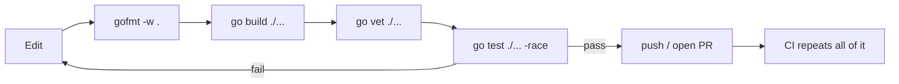

# Toolchain & workflow

## Why Does This Matter?

The toolchain is the fastest way to feel Go's philosophy. There is no
build-system zoo: one command compiles, one tests, one formats. Engineers
coming from Maven, pip, webpack, or CMake routinely underestimate how much
this changes daily work — dependency management, formatting, and testing
stop being topics of conversation.

## Mental Model

Everything is driven through one entry point, `go <verb>`. The verbs map to
what you are doing, not to a tool you configured:

```text
writing   → go run, go vet, gofmt
releasing → go build, go install, cross-compilation
depending → go mod (tidy, download, verify)
probing   → go env, go version, go doc, go list
quality   → go test, -race, -cover, -bench; pprof
```

Two facts explain most of the design:

1. **The build is hermetic-ish by default.** Inputs are your source plus
   module versions pinned in `go.mod`/`go.sum`. No system state creeps in.
2. **Formatting is not a setting.** `gofmt` has no config. Twenty years of
   "where do the braces go" debates ended by decree; reviews discuss code
   instead.

## The verbs you use daily

### go run — write/run loop

```bash
go run ./examples/hello     # compile + run, binary discarded
```

Use for the inner loop: edit, run, observe. It compiles to a temp
directory, so startup includes compile time; it is not a "script mode."

### go build — produce artifacts

```bash
go build ./...              # compile everything, cache results, no output for main packages? no:
                            # main packages produce binaries in cwd
go build -o bin/api ./cmd/api
```

Builds are cached aggressively. A second `go build ./...` after touching
one file recompiles only that package and its dependents — this is why CI
caches barely matter for Go.

### Cross-compilation — the free party trick

```bash
GOOS=linux GOARCH=arm64 go build -o bin/api-linux-arm64 ./cmd/api
```

No sysroot setup, no CI matrix. Container images are usually built with
`CGO_ENABLED=0` for a fully static binary.

### go install — put a tool in your PATH

```bash
go install golang.org/x/vuln/cmd/govulncheck@latest
```

Installs binaries from modules into `$GOBIN` (default `go env GOPATH`/bin).
Version-pinned tool installs (`@v1.2.3`) are how teams keep tooling
reproducible.

### go env — know your machine

```bash
go env GOPATH GOROOT GOBIN GOMODCACHE CGO_ENABLED
go env -w GOMODCACHE=/somewhere   # persist a setting
```

`GOPATH` is no longer your workspace — it is a cache and bin area. Your
code can live anywhere; the module boundary (go.mod) is what matters.

### go version / go doc — quick truth

```bash
go version                      # toolchain version
go doc net/http.Client          # docs without leaving the terminal
go doc -all sync.WaitGroup      # everything on a symbol
```

### go vet — the built-in reviewer

```bash
go vet ./...
```

Catches printf-format mistakes, lock copies, unreachable code, loop-capture
issues (pre-1.22 patterns), and more. Run it in CI always; run it before
you push, always.

## The daily loop



## Common Mistakes

- **Treating `go run` as deployment.** It discards the binary; use
  `go build` for anything that survives.
- **Ignoring `go vet` output** because tests pass. Vet finds classes of
  bugs tests miss (format strings, copying locks).
- **Not committing `go.sum`.** It pins dependency content; without it
  builds are not reproducible.
- **Building with CGO by default in containers.** If you do not need C
  interop, `CGO_ENABLED=0` gives static binaries and smaller images.
- **Fighting gofmt.** There is nothing to win; the config-less formatter is
  the point.

## Idiomatic Go

A repository that experienced Go engineers open and immediately trust has:

- a single `go.mod` at the root (or a `go.work` for multi-module repos);
- `go vet`, `gofmt`, and `go test ./... -race` in CI from day one;
- tool versions pinned in CI (`actions/setup-go` with a go.mod version, or
  `go install tool@version`);
- no Makefile theater: a few commands in the README beat 300 lines of make.

## Performance Considerations

- The build cache is content-addressed; do not disable it in CI "for
  cleanliness."
- `-trimpath` and `-ldflags="-s -w"` reduce binary size when it matters
  (distribution, not debugging).
- `GOAMD64=v3` (or similar) can enable newer instruction sets when your
  deployment fleet allows it.

## Testing Strategy

The toolchain is itself tested by CI in this handbook's
[.github/workflows/ci.yml](../.github/workflows/ci.yml): formatting, vet,
build, tests with race detection. Treat "CI is green" as part of the
definition of done, not an afterthought.

## Interview Questions

1. *What does `go mod tidy` do besides adding imports?* — Prunes unused
   requirements, adds missing ones, and (Go 1.27+) consolidates duplicate
   require blocks.
2. *How does Go make builds fast?* — Strict dependencies, content-addressed
   build cache, parallel compilation by package, no template metaprogramming.
3. *Why is gofmt config-less?* — It removes the debate; uniform formatting
   is a team-scale feature, not a personal preference.

## Practice Exercises

1. Cross-compile this handbook's hello example for linux/arm64 and inspect
   with `file`.
2. Break an import (use it wrong) and read the compiler error end to end.
   Go errors are terse; learning to read them pays forever.
3. Run `go doc -all sync.Once` and find one behavior you did not know.

## Further Reading

- [Command documentation](https://go.dev/doc/cmd) — every go verb, official
- [Module reference](https://go.dev/ref/mod)
- [Cross-compiling with Go](https://go.dev/blog/ports) — official ports post
