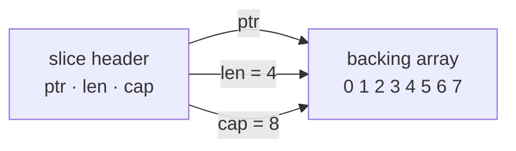

# Arrays & slices

## Why Does This Matter?

Slices are the most used data structure in Go and the source of more
interview questions and production bugs than any other type. The reason:
a slice is not an array. It is a small header that points at an array,
and almost every surprising Go behavior you will hear about ("append
overwrote my data", "my subslice holds 50MB alive") comes from two pieces
of code sharing one backing array.

## Mental Model

An **array** is a fixed-size block of values. Its length is part of its
type: `[3]int` and `[4]int` are different, incompatible types.

A **slice** is a view onto an array, described by a three-word header:



- `len`: elements the slice exposes
- `cap`: elements available before the backing array must be replaced
- `ptr`: where the view starts

Assignment copies the header, never the elements. Two slices with the
same `ptr` see the same memory: that is the entire story of slice
aliasing.

## Arrays: when you actually use them

Direct array use is rarer than beginners assume. Legitimate homes:

- Fixed-size cryptographic digests: `[32]byte` (sha256 output)
- Low-level buffers where the size is part of a protocol
- Embedding fixed data inside a struct for cache locality

```go
var sum [256]byte          // a protocol table, size fixed by spec
hash := [32]byte{0x1f}     // [32]byte, not []byte: different types
```

Arrays are **values**: assigning or passing one copies all of it. That
is correct semantics for `[32]byte` and a silent performance bug for
`[1000000]float64`. When you want shared, growable data, you want a
slice.

## The slice header in code

```go
s := make([]int, 3, 8)     // len 3, cap 8
t := s[1:3]                // len 2, cap 7: shares s's backing array
u := s[:0]                 // len 0, cap 8: window closed, same array
```

The full slice expression `s[low:high:max]` additionally caps capacity,
which is how you fence a view from `append`:

```go
t := s[1:3:3]              // cap is now 2: append(t, x) must reallocate
```

## Growth: what append actually does

`append` grows the backing array when `len == cap`. The strategy since
[Go 1.18](https://go.dev/doc/go1.18): roughly double while small, then
transition to about 1.25x above 256 elements. The exact curve is an
implementation detail and is not contractual: never depend on it, only
on its shape (amortized O(1) appends).

```go
s := []int{}
prev := cap(s)
for i := 0; i < 4096; i++ {
    s = append(s, i)
    if cap(s) != prev {
        fmt.Println(len(s), cap(s)) // growth steps, not a contract
        prev = cap(s)
    }
}
```

Two rules follow:

1. **Always assign the result.** `append(s, x)` may return a new header;
   discarding it loses everything past the old `len`.
2. **Pre-size when you know the size.** `make([]T, 0, n)` avoids a
   cascade of reallocations and copies.

## Aliasing: the bug factory

```go
a := []int{1, 2, 3, 4, 5}
b := a[:3]
b = append(b, 99)
fmt.Println(a)             // [1 2 3 99 5]: append overwrote a[3]
```

`b` had spare capacity, so `append` wrote into the shared array. The
version without surprises:

```go
b := append(a[:3:3], 99)   // three-index slice: append must reallocate
fmt.Println(a)             // [1 2 3 4 5]: untouched
```

The same mechanism powers idioms that are *supposed* to alias:

```go
s = s[:0]                  // reuse backing array, reset length
head, tail := s[:2], s[2:] // zero-copy split
```

Decide deliberately, per line, whether sharing is the intent.

## The leak: a small view pins a large array

```go
hdr := readHeader(buf)     // buf is 50MB
keep := buf[:64]           // len 64, cap 50MB: 50MB now unreachable-but-alive
```

The garbage collector sees the backing array referenced, so it stays.
Two fixes, each with different tradeoffs:

```go
keep := append([]byte(nil), buf[:64]...)  // copy: extra allocation
keep := buf[:64:64]                       // full slice expr: fence, no copy
```

Note the full slice expression only helps when nothing else aliases the
same region; the copy is the universally safe form.

## Common Mistakes

- Forgetting to assign `append`'s result (the compiler catches direct
  discards, but `append` inside another call's arguments hides it).
- Comparing slices with `==`: illegal; compare with
  `slices.Equal`, or compare element-wise (see the `slices` package,
  introduced in Go 1.21).
- Assuming `s == nil` means "empty": an empty slice and a nil slice both
  have `len 0`; they differ only in `s == nil` and JSON output
  (`[]` vs `null`). Prefer nil checks on `len` for emptiness.
- Growing slices passed to many goroutines: any concurrent
  `append` that reallocates is a data race.
- `slices.Delete` then continuing to use the tail: since
  [Go 1.22](https://go.dev/doc/go1.22) the removed range is zeroed, but
  `len` still shrinks by your bookkeeping, not the backing array's.

## Idiomatic Go

```go
// Set membership without an import.
set := map[string]struct{}{"go": {}, "rust": {}}
if _, ok := set[lang]; ok { /* ... */ }

// Filter in place, then one reslice.
kept := s[:0]
for _, v := range s {
    if keep(v) {
        kept = append(kept, v)
    }
}
s = kept

// Prefer the slices package (Go 1.21+) over hand-rolled loops.
slices.Sort(s)
i, found := slices.BinarySearch(sorted, x)
```

## Performance Considerations

| Operation | Cost | Note |
|---|---|---|
| `s[i]` | O(1) | bounds-checked; the check is cheap and usually hoisted |
| `append` at cap | amortized O(1) | occasional O(n) copy |
| `copy(dst, src)` | O(min) | single memmove, very fast |
| slicing `s[a:b]` | O(1) | no copy: this is the aliasing trap |
| passing a slice | O(1) | header only, 24 bytes on 64-bit |

Pre-sizing `make([]T, 0, n)` for known `n` routinely saves measurable
allocation churn; see [19-performance](../19-performance/01-measure-first.md).

## Concurrency Considerations

A slice header is not atomic. Concurrent reads of *distinct elements*
are fine; concurrent `append` is a data race even when the result "looks
fine" in testing. Give each goroutine its own slice and merge, or
protect with a mutex. This is covered with worker-pool examples in
[08-concurrency/05-patterns](../08-concurrency/05-patterns.md).

## Testing Strategy

Aliasing bugs are testable without timing: mutate through one slice,
assert on the other. The runnable example in
[examples/seqops](examples/) includes exactly such a test; the race
detector (`go test -race`) is the tool for concurrent append misuse.

## Interview Questions

1. *Why must you assign the result of `append`?*: It may return a new
   header pointing at a new array; the original slice never changes.
2. *What are `len` and `cap` of `s := make([]int, 3, 5)` after
   `s = s[:5]`?*: 5 and 5: reslicing within cap is free.
3. *Does `append` always copy?*: Only when capacity is exhausted; then
   it allocates a new array and copies, which is why amortized cost
   stays O(1).
4. *How do you return a subslice without keeping the parent alive?*:
   Copy into a fresh slice (or use a three-index slice when safe).
5. *nil slice vs empty slice*: same `len`/`cap` (0), differ in `== nil`
   and encoding; both work with `append` and `range`.

## Practice Exercises

1. Write `Chunk(s []T, size int) [][]T` that returns non-overlapping
   chunks sharing the backing array, then a variant that does not.
2. Implement `Compact` (dedupe adjacent duplicates) in place using the
   `s[:0]` idiom, and compare with `slices.Compact` (Go 1.21+).
3. Reproduce the `append` overwrite from the aliasing section, then fix
   it with a three-index slice; assert both behaviors in a test.

## Further Reading

- [Go Slices: usage and internals](https://go.dev/blog/slices-intro)
- [Arrays, slices (and strings): The mechanics of 'append'](https://go.dev/blog/slices)
- [`slices` package (Go 1.21+)](https://pkg.go.dev/slices)
