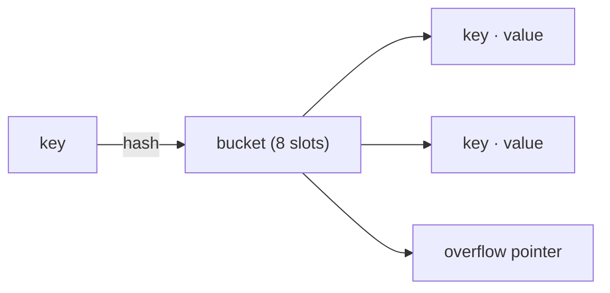

# Maps

## Why Does This Matter?

The map is Go's Swiss-army associative store, and its behavior differs
from Python dicts, Java HashMaps, and C++ maps in ways that bite
engineers moving between them: random iteration order, no reordering
during range, a two-value "comma ok" read, and a deliberate design where
map elements are not addressable. Knowing *why* Go maps behave this way
turns each quirk from a surprise into a design signal.

## Mental Model

A Go map is a hash table with one extraordinary guarantee: **iteration
order is randomized on purpose**, every single run. The runtime did this
so that no program can accidentally depend on insertion order. If your
code is order-sensitive, the map is telling you to sort keys explicitly.



Buckets hold 8 key/value pairs each; lookups hash the key, find the
bucket, then scan its slots (tophash acceleration, then key equality).
Internals live in [23-go-internals](../23-go-internals/README.md); the
behavioral surface is what matters here.

## Syntax: the four operations you must know cold

```go
m := map[string]int{"a": 1}        // literal
m = make(map[string]int, 64)       // hint: pre-size like slices
m["b"] = 2                         // insert/update

v := m["a"]                        // read: zero value if absent
v, ok := m["a"]                    // comma-ok: ok is false when absent

delete(m, "b")                     // absent key is a no-op, not an error

for k, v := range m {              // random order, stable per range
    _ = k
    _ = v
}
```

Deleting during iteration is safe: entries deleted during the loop may
or may not be visited, but the program cannot crash or loop forever.
Inserting during iteration is legal but the new entry *may or may not*
be produced: never rely on it.

## Keys: what can be a map key

Any **comparable** type: booleans, numerics, strings, pointers,
channels, arrays of comparable types, structs whose fields are all
comparable. Not keys: slices, maps, functions (all compare via
reference-like semantics).

The struct-as-composite-key pattern shows up everywhere in real
services:

```go
type coord struct{ Lat, Lon float64 }
cache := map[coord]string{}

// Stringer-style composite keys, one allocation:
key := fmt.Sprintf("%s/%s", tenant, resource)
```

Prefer the struct when fields are fixed and typed; the string is easier
to log but invites delimiter collisions and parsing.

## Values: addressability and the two-value rule

Map elements are not addressable: you cannot do `&m["k"]` or
`m["k"].Field = v` when the value is a struct. The map may rehash and
move elements during growth, so the runtime refuses to hand out interior
pointers that would dangle.

The two workarounds, both idiomatic:

```go
// Read, modify, write back.
c := m["k"]        // copy out
c.Count++
m["k"] = c         // write back

// Store pointers instead.
m := map[string]*Counter{}
m["k"] = &Counter{}
m["k"].Count++     // fine: the pointer is the value
```

The pointer form trades a copy on every access for one allocation per
entry. For big structs with hot paths, measure: see
[19-performance/02](../19-performance/02-memory-and-allocations.md).

## Zero value: the read-only nil map

A nil map reads fine and writes panic:

```go
var m map[string]int
_ = m["k"]         // 0, no error: reads see the zero value
_, ok := m["k"]    // ok is false
m["k"] = 1         // panic: assignment to entry in nil map
```

This is deliberate: a nil map is a valid read-only empty map, useful as
a zero-value field. It means every map you intend to mutate needs an
explicit `make`, and it makes "does this function return a usable map?"
a design question rather than a runtime accident.

## Common Mistakes

- **Using a nil map for writes** after a failed lookup, a JSON decode
  into a nil field, or a function that forgot `make`.
- **Assuming iteration order** for tests, serialization, or pagination:
  random per range, so sort keys (`slices.Sorted(maps.Keys(m))`,
  Go 1.21+) when order matters.
- **Copying a struct that embeds a map**: the copy shares the map.
  Maps (like slices) are reference-ish headers; "copy" does not mean
  "deep copy".
- **`map[string]any` for domain data**: you lose type safety for
  flexibility you rarely need; typed structs catch field renames at
  compile time.
- **Mutation during range** of the same key: inserting during range is
  nondeterministic; restructure instead.

## Idiomatic Go

```go
// Counting without a nil-check dance.
if m == nil {
    m = make(map[string]int)
}
m[k]++

// Set semantics; struct{} is zero-size.
present := map[string]struct{}{}
if _, ok := present[user]; ok { /* ... */ }

// Grouping.
byStatus := map[string][]Event{}
byStatus[e.Status] = append(byStatus[e.Status], e)
```

## Performance Considerations

- Lookups and inserts are O(1) average; worst case degrades with hash
  collisions (Go uses a per-process hash seed to resist collision
  attacks, added in Go 1.6 era hardening).
- Pre-size with `make(map[K]V, n)` when `n` is known: avoids multiple
  rehash-and-copy growth phases, exactly like slices.
- Map access is slower than slice indexing by an order of magnitude on
  benchmarks; use a slice when keys are dense small ints.
- `sync.Map` exists for two specific shapes (append-only caches, or
  disjoint key sets per goroutine); for everything else a mutex-guarded
  map is faster and clearer. Full treatment with benchmark numbers:
  [08-concurrency/04-sync-primitives](../08-concurrency/04-sync-primitives.md).

## Concurrency Considerations

Concurrent reads are fine. Any write concurrent with any other read or
write is a **fatal runtime error** (`concurrent map writes`), not a
recoverable panic: the runtime detects it and tears the process down.
Options in order of preference:

1. Restructure so one goroutine owns the map (worker pools,
   [08-concurrency/05](../08-concurrency/05-patterns.md)).
2. `sync.Mutex` or `sync.RWMutex` around it.
3. `sync.Map` only for the two niche shapes above.

## Security Considerations

- Hash-flooding resistance is built in, but unbounded map growth from
  user-controlled keys is still a DoS vector: cap size, evict, or use a
  bounded cache.
- Never store unhashed credentials or secrets as map keys in logs; keys
  of maps printed with `%v` leak verbatim.

## Testing Strategy

Deterministic tests need sorted iteration:

```go
keys := slices.Sorted(maps.Keys(m))
for _, k := range keys {
    // assert on m[k] in a stable order
}
```

For nil-map and missing-key paths, assert the comma-ok bool explicitly:
that is the contract your callers depend on.

## Interview Questions

1. *Why is map iteration order random?*: Deliberately randomized to
   prevent accidental order dependence; guaranteed unordered by the
   spec.
2. *Why can't you take `&m["k"]`?*: Growth may relocate entries;
   interior pointers would break, so the language refuses.
3. *What is a valid map key?*: Any comparable type; struct keys are the
   composite-key workhorse.
4. *What happens on a nil map?*: Reads return zero values, writes
   panic; the design makes nil maps safe as empty read-only values.
5. *How would you implement a thread-safe cache?*: Mutex-guarded map by
   default; `sync.Map` only for append-heavy/disjoint-shard shapes, and
   say why.

## Practice Exercises

1. Implement a `MultiSet` (bag) with `Add`, `Count`, and `Top(n)`; sort
   in `Top` for deterministic output and test it.
2. Write `GroupBy[T, K]` using generics; decide whether the returned
   map may be nil when input is empty and document the choice.
3. Benchmark a `map[string]int` with and without a size hint for one
   million inserts; write down the ratio in your notes.

## Further Reading

- [Go maps in action](https://go.dev/blog/maps)
- [`maps` package (Go 1.21+)](https://pkg.go.dev/maps)
- [Spec: map types](https://go.dev/ref/spec#Map_types)
