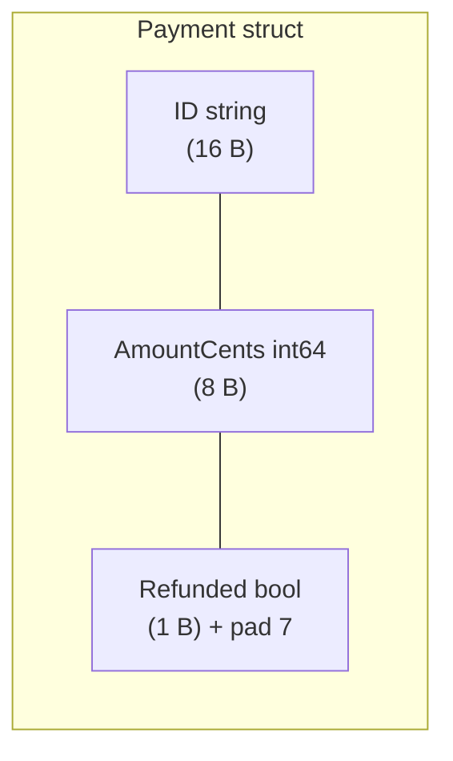

# Structs

## Why Does This Matter?

Structs are Go's record type: the shape of nearly all domain data. They
replace classes with something sharper: a fixed memory layout, explicit
zero value, field-by-field comparability, and tags that bridge to JSON,
databases, and validation. Because Go has no inheritance, the struct
plus composition carries all modeling weight; using it well is using Go
well.

## Mental Model

A struct is a fixed-size block of fields laid out in declaration order.
Two structs with the same field names, types, and order (tags matter
too, see below) are the *same type* to the compiler, even without a
name in common. That structural identity is why decoding JSON into a
locally-defined struct works.



Field order affects size: the compiler pads to align each field, so
grouping same-size fields together reduces wasted bytes. Order by
descending size in memory-sensitive structs; let gofmt and code review
keep it readable elsewhere. The layout is an implementation detail:
never serialize raw struct bytes across machines.

## Zero value: design it, do not fight it

Every struct can be used without a constructor; its zero value must
therefore be *valid or clearly inert*. Types that design for this get
free usability:

```go
type Buffer struct {
    data []byte      // nil slice: ready for append
    mu   sync.Mutex  // zero mutex: ready to lock
}
var b Buffer         // usable immediately: no NewBuffer required
```

Types that cannot (a map field you will write to, a channel field,
an unexported required field) are signaling: provide a constructor and
document that the zero value is not usable.

## Tags: metadata with a contract

Tags are string literals read by reflection at runtime. The compiler
checks only their syntax, never their contents: a typo like
`json:"naem"` compiles and silently misroutes fields forever.

```go
type User struct {
    ID    string `json:"id"`
    Email string `json:"email,omitempty"`
    Age   int    `json:"-"`
}
```

Conventions worth keeping:

- Always name JSON tags explicitly (`json:"id"`): the default field
  name is exported-Go-spelling, which leaks Go style into your API.
- One space between tag options: `json:"a,omitempty"` is fine,
  `json:"a, omitempty"` is silently wrong (an option named " omitempty"
  does nothing).
- Field alignment tools (`fieldalignment` in vet's suite,
  `go vet -fieldalignment`) flag padding waste; use as a pointer, not a
  law.

## Comparability: == and its limits

A struct is comparable if all fields are comparable. Two subtleties
matter in production:

1. Structs containing slices, maps, or functions are **not
   comparable**; `==` fails at compile time, which is a feature.
2. Comparable structs make excellent map keys and dedup tokens, but
   fields with semantic slop (floats, timestamps) poison equality:
   prefer comparing an explicit identity subset (`ID`, version) over
   whole-value equality.

Pointer-vs-value equality is a recurring interview trap: `==` on two
pointers compares addresses, not contents.

## Embedded fields: composition, not inheritance

```go
type Reader struct{ io.Reader }   // anonymous field: type name is the field name

r := Reader{Reader: strings.NewReader("hi")}
r.Read(p)                          // promoted: r.Read works directly
r.Reader.Read(p)                   // explicit, same thing
```

Embedding promotes methods and fields; it does not create polymorphism,
and the embedded type's methods do not "override" (outer methods shadow
only by name). When the outer type has a `Read`, the inner one is still
reachable via `r.Reader.Read`: unlike inheritance, nothing is replaced.
The design rules belong with interfaces, in
[04-functions-methods-interfaces](../04-functions-methods-interfaces/README.md).

## Common Mistakes

- **Constructors that half-initialize**: if `NewX` exists, it must
  leave `X` fully valid; otherwise callers who see `NewX` assume it.
- **`omitempty` on structs**: has no effect (structs are never "empty"
  to encoding/json), producing surprise `{}` fields in payloads.
- **Copy confusion**: `c := bigStruct` copies all fields, including
  slice/map headers and mutexes. Copying a struct with a `sync.Mutex`
  copies a locked mutex: `go vet` catches this as "passes lock by
  value".
- **Exported fields on types with invariants**: if `Account.Balance`
  must never go negative, do not export `Balance`; export methods that
  maintain the invariant.
- **Tag typos** (`json:"naem"`, `,omitempty` misspellings): untestable
  by the compiler; covered by round-trip tests below.

## Idiomatic Go

```go
// Functional options when construction grows; zero value first.
type Server struct {
    addr    string
    timeout time.Duration // zero = sensible default
}
func NewServer(addr string, opts ...Option) *Server { /* ... */ }

// Comparing by identity, not whole value.
func (p Payment) SameAs(o Payment) bool { return p.ID == o.ID }
```

## Performance Considerations

- Structs are values: assignment and parameter passing copy. Small
  structs (a few words) are cheaper to copy than to heap-allocate;
  escape analysis (see [09-memory-runtime](../09-memory-runtime/README.md))
  usually keeps them on the stack.
- Padding: field order can change struct size; measure with
  `unsafe.Sizeof` when it matters, and remember it is architecture
  dependent.
- Returning large structs by value costs; return pointers when the
  struct is big or mutation is intended (receiver rules continue in
  [05-pointers-and-receivers](05-pointers-and-receivers.md)).

## Concurrency Considerations

A struct shared across goroutines is safe only if its fields are, field
by field: immutable-by-convention fields are fine; mutable ones need
synchronization. Do not rely on struct copies for isolation: slices and
maps inside a copy still alias the original. The ledger example in
[25-fintech-with-go](../25-fintech-with-go/README.md) demonstrates the
defensive-copy discipline this demands.

## Security Considerations

- Never tag secrets with `json:"-"` alone and call it done: logs and
  `Debugf("%+v")` still print fields. Redact at the logging boundary
  (see [20-observability](../20-observability/README.md)).
- Unexported fields are package-private, not secret: any code in the
  package (and `unsafe`) can read them.

## Testing Strategy

Round-trip tests are the tag-safety net: encode to JSON, decode into a
fresh struct, and compare against the original with a deliberate
equality function (not `==`, which fails on slice fields). The
`examples/domain` package in this section shows the pattern with an
invariant-checking type.

## Interview Questions

1. *When is `==` legal on a struct, and what does it compare?*: When
   all fields are comparable; compares field-by-field (deep for
   arrays, shallow for interface fields).
2. *Why is the zero value a design commitment?*: Types are usable
   without constructors; zero must be valid or clearly inert.
3. *How does embedding differ from inheritance?*: Promotion by name,
   no polymorphism, no virtual dispatch; the embedded value is still
   reachable explicitly.
4. *Why can copying a struct be a bug?*: It copies lock values (vet
   flags it) and aliases slice/map backing storage.
5. *What does `json:"-"` do, and what does it not do?*: Excludes from
   JSON; does nothing for logs, errors, or reflection elsewhere.

## Practice Exercises

1. Define a `Money` struct designed for zero-value safety; write a test
   that the zero value round-trips through JSON exactly as you intend.
2. Reorder the fields of a 48-byte struct to shrink it; print
   `unsafe.Sizeof` before and after and explain the padding.
3. Write `Equal(a, b Payment) bool` that compares identity only, then
   a test proving `==` panics to compile-time errors on the slice
   field version.

## Further Reading

- [Spec: Struct types](https://go.dev/ref/spec#Struct_types)
- [JSON and struct tags](https://pkg.go.dev/encoding/json#Marshal)
- [The empty struct](https://dave.cheney.net/2014/03/25/the-empty-struct-g0-wastes-zero-bytes) (Dave Cheney)
