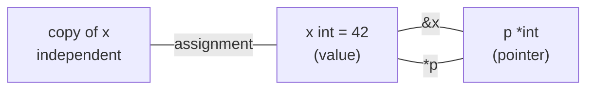

# Pointers & receivers

## Why Does This Matter?

Go's pointer rules are simple; the *semantics* rules are where
engineering judgment lives. Every method and every function signature
makes a choice: does this API operate on a copy (value semantics) or on
shared state (pointer semantics)? Go makes you choose explicitly, and
choosing deliberately: per type, not per call site: is what separates
clean codebases from ones where mutation appears out of nowhere.

## Mental Model

A pointer is a value that names a memory location. `*T` is "pointer to
T"; `&x` takes the address; `*p` dereferences. The zero value of any
pointer is `nil`, and dereferencing `nil` panics: that is Go's null
pointer crash, kept honest by being explicit and recoverable.



The design question hiding inside every API:

- **Value semantics**: copies are the interface. Safe to share, safe to
  reason about, costs a copy.
- **Pointer semantics**: sharing is the interface. Zero copy, but
  aliasing means mutation is visible to everyone holding the pointer.

Neither is "faster by default": measure (see
[19-performance](../19-performance/01-measure-first.md)), and note that
escapes can make pointers *more* expensive (allocation + GC pressure).

## The receiver decision rule

Go does not force this per method; idiomatic Go forces it **per type**:
all methods on one type use the same receiver form, so the method set
is consistent. The decision table:

| Situation | Receiver | Why |
|---|---|---|
| Method must mutate | pointer | copies would be lost |
| Struct contains mutex/sync state | pointer | copying a lock is a bug (vet flags it) |
| Large struct (> ~4 words) | pointer | avoid copying |
| Small, pure value type (Money, Point) | value | copy is cheap; immutability is clearer |
| Map/chan/func fields | value OK | they are already reference-ish headers |
| Type needs all interface methods | pointer | method set rules (below) |

The method-set rule that surprises everyone:

> The method set of `T` (value type) contains value-receiver methods
> only. The method set of `*T` contains both value- and
> pointer-receiver methods.

Consequence: a value stored in an interface cannot reach its
pointer-receiver methods. `var s fmt.Stringer = MyStruct{}` fails to
compile if `String` has a pointer receiver. This is not an accident: if
the method mutates through the pointer, the interface holds a copy, so
the mutation would vanish. Go refuses to hide that.

```go
type Counter struct{ n int }
func (c *Counter) Inc()      { c.n++ }
func (c Counter) Value() int { return c.n }

c := Counter{}
c.Inc()              // legal: c is addressable; Go rewrites to (&c).Inc
var _ = c.Value()    // legal

p := &Counter{}
p.Inc()              // legal

i := interface{}(c)  // method set of Counter: Value only
_, ok := i.(interface{ Inc() }) // false: Inc is not in T's method set
```

## nil pointers: crash honestly, or guard deliberately

```go
func (u *User) Name() string {
    if u == nil {
        return "unknown"   // deliberate: document it
    }
    return u.name
}
```

Methods on nil receivers are legal and occasionally excellent (empty
trees, zero-value options), but they are a contract decision, not a
default. A nil-check-and-panic is the better default: silent nil
tolerance hides upstream bugs.

## Pointers to locals: escape analysis in 60 seconds

```go
func New() *Widget { w := Widget{}; return &w } // w escapes to heap
func Sum(n int) int { t := n * 2; return t }    // stack, no allocation
```

Returning a pointer to a local is completely safe (Go moves the value
to the heap; this is not C). The cost model differs: heap allocation
and GC tracking vs stack bump. `go build -gcflags="-m"` shows the
compiler's decisions; the full treatment is
[09-memory-runtime](../09-memory-runtime/README.md).

## Common Mistakes

- **Mixing receiver forms on one type** (some value, some pointer):
  method sets become incoherent, and interface satisfaction gets
  confusing. Pick per type.
- **Loop variable capture with `&`** pre-Go 1.22: all closures shared
  one variable. [Go 1.22](https://go.dev/doc/go1.22) made loop variables
  per-iteration; on older toolchains take a local copy inside the body.
- **Storing pointers to map elements** indirectly: you cannot
  `&m[k]`; copy out, or store pointers in the map (see
  [02-maps](02-maps.md)).
- **Returning pointers to struct copies from methods**: a value
  receiver cannot mutate the original, so `func (t T) P() *T`
  returning `&t` returns a copy: rarely what the caller wanted.
- **`&MyStruct{}` spam for tiny types**: escape analysis may heap
  allocate it on every call; value returns often compile to zero
  allocations.

## Idiomatic Go

```go
// Constructors return pointers for shared/mutable types...
func NewPool(n int) *Pool { return &Pool{workers: n} }

// ...and values for immutable value types.
func NewMoney(cents int64, cur string) Money { return Money{cents, cur} }

// Receivers named short and consistently; p not this.
func (p *Pool) Add(w Worker) { p.workers++ }
```

## Performance Considerations

- Pointers are 8 bytes on 64-bit regardless of pointee size; passing
  `*BigStruct` beats copying `BigStruct` in arguments.
- Every pointer handed to an interface value may force allocation if
  the value escapes; small value types avoid it.
- Pointer-heavy linked structures (linked lists, trees of pointers)
  are cache-hostile; slices of structs often win. Measure with pprof
  (see [19-performance/03](../19-performance/03-concurrency-performance.md)).

## Concurrency Considerations

Sharing a pointer is sharing mutable state: ownership must be explicit.
The channel-ownership rules in
[08-concurrency/01](../08-concurrency/01-goroutines-and-channels.md)
apply directly: pass pointer ownership through channels, or protect with
locks. `go test -race` is non-negotiable for pointer-sharing code.

## Security Considerations

- Pointers handed to cgo or written to buffers escape Go's memory
  safety; validate sizes and lifetimes at the boundary.
- `unsafe.Pointer` conversions can silently break invariants Go
  guarantees; treat them like hand-rolled assembly: last resort, fully
  commented.

## Testing Strategy

Mutation-vs-copy semantics are directly testable: call the method,
assert on the original. For value receivers assert the original is
unchanged; for pointer receivers assert it changed. Keep receiver-form
choices covered by an interface-satisfaction compile check
(`var _ Iface = T{}`) in your tests; the examples in [examples/domain](examples/)
demonstrate both.

## Interview Questions

1. *What is in the method set of `T` vs `*T`?*: `T`: value-receiver
   methods; `*T`: both. This is why value-typed interfaces cannot call
   mutating methods.
2. *When does Go allocate a pointer-to-local on the heap?*: When it
   escapes (returned, stored, captured); escape analysis decides at
   compile time.
3. *Value vs pointer receiver: how do you choose?*: Per type: mutation,
   locks, or size force pointers; small immutable value types take
   value receivers.
4. *Is `nil` dereference recoverable?*: The panic is recoverable with
   recover, but code should check nil at boundaries instead of relying
   on panics for control flow.
5. *Why can a method be called on an addressable value with a pointer
   receiver?*: Go auto-addresses: `c.Inc()` on addressable `c` means
   `(&c).Inc()`; non-addressable values (map elements, literals) cannot.

## Practice Exercises

1. Implement `Stack` twice, once with value receivers (return new
   stacks) and once with pointer receivers; write both test suites and
   note which API you prefer and why.
2. Write a function that leaks a closure capturing a loop variable
   pre-1.22 style, then fix it; run both with `go vet` and `-race`.
3. Use `go build -gcflags="-m"` on a small program and classify each
   reported escape as necessary or avoidable.

## Further Reading

- [FAQ: should I use value or pointer receivers?](https://go.dev/doc/faq#methods_on_values_or_pointers)
- [Spec: Method sets](https://go.dev/ref/spec#Method_sets)
- [Escape analysis primer](https://go.dev/doc/gc-guide) (section on
  allocation costs, GC guide)
