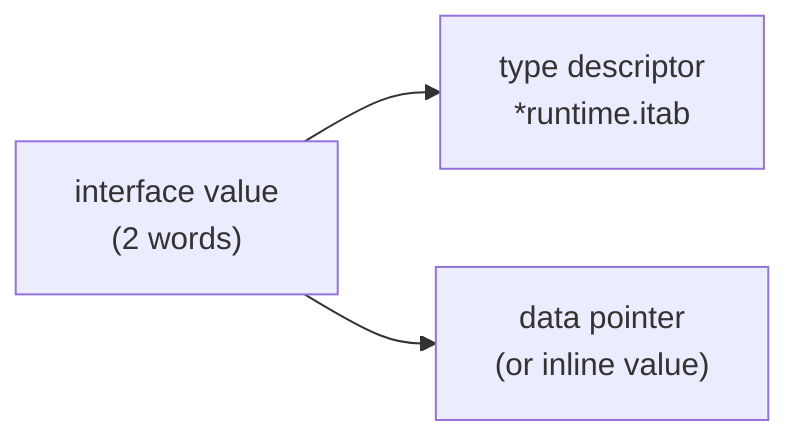

# Interfaces & embedding

## Why Does This Matter?

Interfaces are how Go decouples code without inheritance: small,
implicit, and satisfied by any type with the right methods. Engineers
coming from Java or C# expect interface hierarchies; Go's answer is the
opposite: one-method interfaces (`io.Reader`, `fmt.Stringer`, `error`)
that you define *where you consume them*. Combined with embedding, they
give you composition without a class hierarchy.

This chapter covers the language mechanics. The design philosophy
(define interfaces at the consumer, keep them small, dependency
inversion with BAD/BETTER/IDIOMATIC examples) lives in
[04-functions-methods-interfaces](../04-functions-methods-interfaces/README.md).

## Mental Model

An interface value is two words: **(type descriptor, value pointer)**.



Every type that has the required methods implements the interface:
no declaration, no registration. Satisfaction is checked at compile
time for assignments, at runtime for type assertions.

Two consequences fall straight out of this representation:

1. Assigning to an interface may box the value (allocation) unless the
   compiler can keep it inline; small scalar values often stay inline.
2. `nil` interface vs interface holding a nil pointer are **different
   states** with different behavior: the interview favorite.

## Implicit satisfaction: what it changes

```go
type Speaker interface{ Speak() string }

type Dog struct{}
func (Dog) Speak() string { return "woof" }
// Dog implements Speaker. No "implements" keyword, no import of the
// interface's package. Dog cannot even see Speaker's package.
```

This inverts the usual dependency: producers never import consumers'
abstractions. It also means a type can satisfy an interface defined
*after* it was written, which is why the standard library never breaks
you by adding methods.

The cost is discoverability: nothing lists "who implements Speaker".
Grepping for the method name is the workflow (or `gopls`'s "implementations").

## The nil interface trap, precisely

```go
type Failer interface{ Fail() error }

type Op struct{ err error }
func (o *Op) Fail() error { return o.err }

func do() Failer {
    var o *Op = nil      // typed nil
    return o             // interface now holds (type *Op, value nil)
}

f := do()
fmt.Println(f == nil)    // false: the type word is non-nil
f.Fail()                 // runs: the method sees o == nil inside
```

The interface is `(type=*Op, value=nil)`, and `== nil` on an interface
compares **both words**. Returning concrete types (never typed nils)
from functions that produce interfaces is the standing fix; the FAQ
covers more variants.

## Embedding: interfaces composing interfaces

```go
type ReadWriter interface {
    Reader
    Writer
}
// exactly: io.ReadWriter = io.Reader + io.Writer
```

Interface embedding is set union. Struct embedding of concrete types
promotes methods, which is how a struct can satisfy an interface by
embedding something that already does:

```go
type CountingReader struct {
    io.Reader              // promoted: CountingReader satisfies io.Reader
    N int64
}
func (r *CountingReader) Read(p []byte) (int, error) {
    n, err := r.Reader.Read(p)
    r.N += int64(n)
    return n, err
}
```

This is the decorator pattern in five lines: wrap, promote, override
one method. Note the field name is the embedded type's name (`r.Reader`),
and the outer method shadows the promoted one by name.

## Type assertions and switches

```go
// Single assertion, comma-ok form: no panic when wrong.
w, ok := v.(io.Writer)
if !ok { /* handle absence */ }

// Panic form: use when wrong-ness is a programmer error.
w := v.(io.Writer)

// Switch: the multi-shape extractor.
switch t := v.(type) {
case nil:                    // interface itself is nil
case *Op:                    // concrete type
case io.Writer:              // interface case: v satisfied by t
default:
}
```

Assert in the comma-ok form at system boundaries; the panic form is for
invariants you would otherwise comment. Prefer extracting to the
narrowest interface you actually need (`v.(io.Writer)`, not
`v.(*File)`): assertions on concrete types weld you to implementations.

## When interfaces hurt

- **Interfaces with one implementation "for later"**: speculative
  abstraction; write the concrete type, extract the interface when the
  second implementation exists (consumer side).
- **Interface hierarchies**: nesting interfaces to model taxonomy is
  Java thinking; flatten.
- **Passing `any` and asserting inside business logic**: you have
  re-invented dynamic typing; type parameters or concrete types are
  usually right. Generics comparison:
  [07-generics](../07-generics/README.md).

## Common Mistakes

- **Returning typed nils** where an interface is expected (see the
  trap above; also [05-errors](../05-errors/README.md) for the error
  variant).
- **Defining interfaces next to implementations** instead of
  consumers: couples packages needlessly.
- **Asserting concrete types in library code**: breaks third-party
  implementations; assert interfaces.
- **Copying interface values across goroutines** and assuming the
  concrete value inside is immutable: the guarantee belongs to the
  concrete type, not the interface.
- **Empty interfaces as map values** in domain code: `map[string]any`
  for real entities defers type errors to runtime.

## Idiomatic Go

```go
// Accept interfaces, return concrete types.
func Decode(r io.Reader) (*Config, error) { /* ... */ }

// tiny, consumer-defined interfaces
type Storer interface {
    Get(ctx context.Context, id string) (*Order, error)
}

// guard clause with comma-ok at the boundary
fetcher, ok := svc.(Fetcher)
if !ok {
    return errors.New("service does not support fetching")
}
```

## Performance Considerations

- Interface calls are dynamic dispatch: one extra indirection versus
  direct calls. In hot loops (millions of calls), it can show in
  profiles; concrete types or generics recover the speed.
- Boxing: `var i interface{} = x` may allocate if `x` does not fit
  inline; slices and maps inside interfaces always store the header,
  not the data.
- The escape analysis interplay: passing a value as an interface often
  forces it to the heap; see [09-memory-runtime](../09-memory-runtime/README.md).

## Concurrency Considerations

Interfaces themselves are immutable values; safety depends entirely on
the concrete type inside. A `Reader` shared between goroutines is safe
only if the concrete reader is. Document thread-safety on concrete
types, and let interfaces stay silent on the subject.

## Security Considerations

- Type assertions on data from outside (JSON-decoded `any`, protobuf
  `Any`) are an attack surface: validate the concrete type and shape
  before use.
- Do not expose interfaces that accept arbitrary `any` and `switch`
  on it for authorization decisions; explicit typed paths are auditable.

## Testing Strategy

Interfaces are where test doubles live. A consumer-side interface with
two methods is trivially faked inline in the test file; no mock library
required (patterns in [10-testing/02](../10-testing/02-doubles-and-httptest.md)).
Compile-time satisfaction checks (`var _ Storer = (*Fake)(nil)`) keep
fakes honest as the interface evolves.

## Interview Questions

1. *What is inside an interface value?*: A type descriptor and a value
   word: two machine words; equality compares both.
2. *Why does an interface holding a nil pointer not equal nil?*: The
   type word is set; `== nil` compares both words. Return concrete
   types to avoid it.
3. *How does implicit satisfaction change package dependencies?*: The
   implementer never imports the interface's package; consumers define
   what they need.
4. *When are generics better than interfaces?*: When you need value
   shapes and performance without boxing (containers, algorithms);
   interfaces are for behavior. Full comparison:
   [07-generics](../07-generics/README.md).
5. *What does interface embedding give you over listing methods?*:
   Set union, symmetry with the standard library's own composition
   (io.ReadWriter), and the ability to build consumers from the exact
   method set they need.

## Practice Exercises

1. Write a `TeeReader` decorator using embedding (like
   `io.TeeReader`), then test it without a real file.
2. Reproduce the typed-nil interface trap in a scratch module; print
   the interface's two words using reflection; then fix the API.
3. Take a function accepting `*os.File` and narrow it to
   `io.Reader`/`io.Writer` as appropriate; count how many test doubles
   you no longer need.

## Further Reading

- [Spec: Interface types](https://go.dev/ref/spec#Interface_types)
- [The Laws of Reflection](https://go.dev/blog/laws-of-reflection)
  (interface internals)
- [Research: Go interfaces](https://research.swtch.com/interfaces)
  (Russ Cox)
