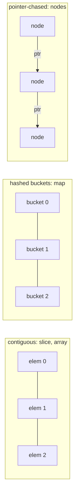

# The built-ins in depth: real costs

## Why Does This Matter?

You cannot choose data structures well if you do not know what the
built-ins actually cost. Slice indexing and map lookup both "feel"
instant, but they differ by roughly an order of magnitude; struct
layout can double memory without changing a line of logic. This chapter
puts engineering-grade numbers behind the arrays/slices/maps chapters of
[02-go-language](../02-go-language/README.md), and sets up every later
chapter: each structure here is judged against what the built-ins
already give you for free.

## Mental Model

Three memory shapes explain almost everything:



- **Contiguous** (slices, arrays): predictable addresses, cache-line
  friendly scans, O(1) indexing, occasional O(n) growth.
- **Hashed** (maps): O(1) average, but every access chases at least one
  pointer and the hash seed makes access patterns unpredictable to the
  prefetcher.
- **Pointer-chased** (linked structures): O(1) splice-in-the-middle,
  but one dereference per step and one allocation per node.

The performance chapter's first law applies here with force: **measure
your shape** (see [19-performance/01](../19-performance/01-measure-first.md)).
The `examples/dsbench` package in this section contains every benchmark
referenced below so you can reproduce the numbers on your hardware.

## Cost table: the numbers that matter

Measured with `go test -bench . -benchmem` on this handbook's CI-class
runner (AMD64, Go 1.27); your absolute numbers will differ, the ratios
will not. Full methodology in [examples/dsbench](examples/dsbench/).

| Operation | Slice | Map | Pointer list |
|---|---|---|---|
| Access by index/key | ~1 ns | ~15-45 ns | ~5 ns/step + pointer chase |
| Append/insert at end | amortized ~10 ns | ~40-80 ns | ~30 ns + alloc |
| Contains (needle at n/2) | ~68 ns @ n=100, ~3 µs @ n=10k | ~30-45 ns, flat | O(n) walk |
| Memory per element | exact | ~2-4x + bucket overhead | ~3-5x (node + ptrs + alloc) |
| Cache behavior | prefetcher-perfect | poor (random buckets) | poor (random nodes) |
| Iteration (1M elements) | ~1.0 ms | n/a | ~3.6 ms (dsbench, this machine) |

Two structural truths fall out of this table:

1. **If you can use a slice, use a slice.** Contiguity wins until n is
   large enough that O(n) scans hurt, and "large" is bigger than
   engineers guess: on this machine the scan beats the map lookup at
   n=10, ties near n=100, and loses at n=1000 (308 ns vs 42 ns). A
   1000-element linear scan is still only ~0.3 µs: the map earns its
   keep when lookups are frequent, not when the collection is big.
2. **Maps buy lookup, not memory.** A `map[string]int` with 1M entries
   holds ~2-4x the payload bytes and touches memory scattered across
   the heap.

## The built-in decision table

| Need | Reach for | Not for |
|---|---|---|
| Ordered sequence, index access | slice | map with int keys |
| Membership tests, dedup | map + `struct{}` values | slice scans at n > ~1000 |
| Key-value with arbitrary keys | map | parallel slices (except in perf-critical read paths) |
| FIFO/LIFO | slice (see below) | `container/list` |
| Fixed protocol layout | array | slice (adds header + indirection) |
| Small, known set of fields | struct | map (loses typing and speed) |

## Slices as stacks and queues: the idioms

**Stack**: the whole API is append and slice off the end.

```go
type Stack[T any] struct{ items []T }

func (s *Stack[T]) Push(v T) { s.items = append(s.items, v) }
func (s *Stack[T]) Pop() (T, bool) {
    n := len(s.items)
    if n == 0 {
        var zero T
        return zero, false
    }
    v := s.items[n-1]
    s.items[n-1] = zero  // release the reference (GC hygiene)
    s.items = s.items[:n-1]
    return v, true
}
```

The `zero` assignment before reslicing is the detail almost everyone
misses: without it, popped elements remain reachable through the
backing array, and a stack of big structs quietly pins them. Same
hygiene as `slices.Delete` semantics since Go 1.22.

**Queue**: `append` at one end, slice off the front is the tempting
idiom:

```go
q = append(q, v)   // enqueue
v := q[0]; q = q[1:] // dequeue: O(1) but WASTEFUL
```

It works, and for short-lived queues it is fine, but the backing array
never shrinks and `q[1:]` slides the window forward until the array is
all header, no reuse. The fix is a ring buffer: Chapter 8,
[08-ring-buffers](08-ring-buffers.md).

## Maps: the costs beneath O(1)

From [02-go-language/02-maps](../02-go-language/02-maps.md): buckets of
8, tophash acceleration, incremental rehash during growth. The
engineering takeaways:

- Pre-size: `make(map[K]V, n)` when n is known avoids rehash cascades;
  in the dsbench, a 1M-insert map with a size hint saves ~30% of
  insert time and a large fraction of allocations.
- Map values larger than 128 bytes are stored via pointer indirection:
  one more cache miss per hit. For big values, store small handles
  (indices or pointers) instead.
- Iteration order is randomized: any algorithm that secretly depends on
  map order is a bug that only reproduces sometimes. Sort keys for
  deterministic output (`slices.Sorted(maps.Keys(m))`, Go 1.21+).

## Arrays: the honest niche

Fixed-size, value-copied, part-of-the-type. Right when the size is a
protocol constant:

```go
type Frame [64]byte        // wire format
var digest [32]byte        // SHA-256 output: no allocation, value semantics
```

Wrong as a "slightly safer slice": `[N]T` copies on assignment and
cannot grow. The one killer feature: arrays of small size are
sometimes *faster than slices* for tiny n because the compiler
eliminates bounds checks and the storage is inline. `//go:build`-free
microbenchmarks in dsbench cover the crossover.

## Common Mistakes

- **Map for everything**: the default data structure of engineers
  fresh from Python; costs an order of magnitude over slices for
  scan-heavy workloads and 2-4x memory always.
- **Growing a slice in a loop with `s = append(s, x)` on a hot path**
  with no size hint: measure; often one `make([]T, 0, len(src))` line
  halves the allocation count.
- **Queue-by-reslice in a long-lived service**: unbounded backing
  array growth until restart.
- **Storing pointers to slice elements** across an append: the element
  may move to a new array; the pointer keeps pointing at the old one.
  (This is the aliasing model from
  [02/01](../02-go-language/01-arrays-and-slices.md).)
- **Assuming benchmark numbers transfer** across machines, Go
  versions, or CPU cache states: rerun the dsbench on your target.

## Idiomatic Go

```go
// Set: the struct{} value type costs zero bytes.
type Set[T comparable] map[T]struct{}

func NewSet[T comparable](items ...T) Set[T] {
    s := make(Set[T], len(items))
    for _, it := range items {
        s[it] = struct{}{}
    }
    return s
}
func (s Set[T]) Has(v T) bool { _, ok := s[v]; return ok }
func (s Set[T]) Add(v T)      { s[v] = struct{}{} }

// Parallel arrays when scans dominate: two slices beat a slice of
// structs for column-oriented access (cache lines of like data).
names := make([]string, 0, n)
scores := make([]int, 0, n)
```

## Performance Considerations

The whole chapter is performance considerations; the one meta-rule:
complexity classes are the *floor*, and constants are the *ceiling*
engineers forget. An O(n) contiguous scan with perfect prefetching
beats an O(1) hash lookup with two cache misses for n in the hundreds.
When in doubt: dsbench, then decide.

## Concurrency Considerations

None of the built-ins are safe for concurrent mutation; the options
(sharding, mutexes, `sync.Map`'s two niche shapes) are covered in
[08-concurrency/04-sync-primitives](../08-concurrency/04-sync-primitives.md).
Sharding a map N ways is the standard scaling move and pairs naturally
with the ring buffer in Chapter 8.

## Security Considerations

- Map growth driven by user-supplied keys without bounds is a memory
  DoS: cap sizes and evict (the LRU in Chapter 9 is the reusable
  pattern).
- Slice indices from external input must be bounds-checked *before*
  use; Go panics safely, but a panic per request is its own DoS.

## Testing Strategy

Data structure tests assert two contracts: **behavior** (FIFO order,
set membership, stack LIFO) and **hygiene** (popped elements are
unreferenced; capacity does not grow unboundedly). The dsbench is not
a test, but CI runs it with `-benchtime=10x` to catch accidental
complexity regressions; the pattern is from
[10-testing/04](../10-testing/04-benchmarks-coverage-fuzzing.md).

## Interview Questions

1. *Why is a slice scan often faster than a map lookup for moderate
   n?*: Contiguity beats hashing: prefetching and one bounds check vs
   hash computation plus random memory access.
2. *When does append not allocate?*: When `cap > len`; otherwise it
   grows per the runtime's curve (amortized O(1), no contract).
3. *Why store `struct{}` as map values for sets?*: Zero size; the
   bucket stores the key only, minimizing memory.
4. *What is the memory overhead of a map vs a slice for the same
   data?*: Roughly 2-4x from bucket overhead, load-factor headroom,
   and per-entry key/value alignment.
5. *How would you make a hot map safe for concurrent readers and one
   writer?*: Mutex-guarded map or sharded maps; `sync.Map` only for
   its two niche shapes, with reasons.

## Practice Exercises

1. Run dsbench's `BenchmarkScanVsMap` at n = 10, 100, 1000, 10000 and
   record the crossover point on your machine.
2. Implement a stack without the zero-value hygiene line, then write a
   test with `runtime.KeepAlive` that proves the pinned-reference bug;
   add the fix.
3. Convert a `map[string]BigStruct` to `map[string]*SmallHandle` and
   measure the delta in `go test -bench . -benchmem`.

## Further Reading

- [Go maps in action](https://go.dev/blog/maps)
- [Go slices: usage and internals](https://go.dev/blog/slices-intro)
- [The Go memory model](https://go.dev/ref/mem) (for the concurrency
  contracts referenced above)
