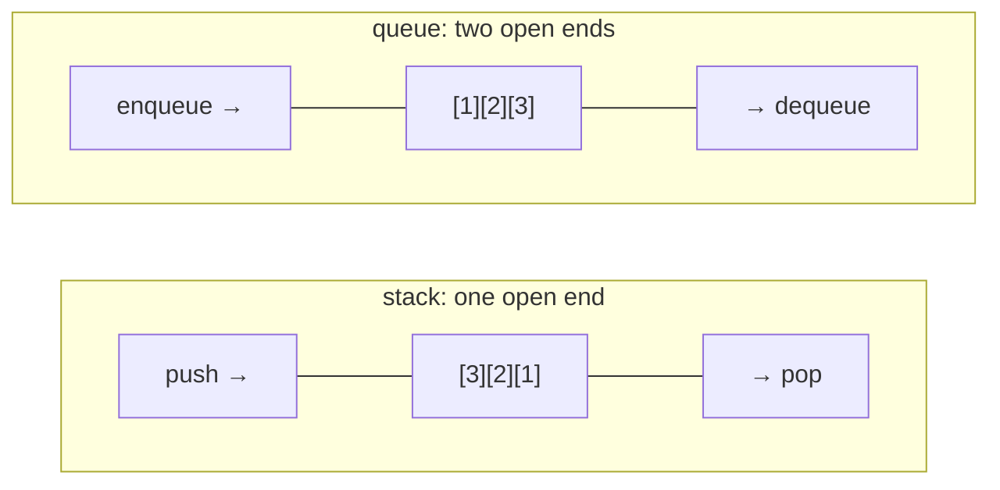

# Stacks & queues

## Why Does This Matter?

Stacks and queues are the two workhorse disciplines of ordering, and Go
gives them to you without ceremony: a slice is a stack; a ring buffer
is a queue; `container/list` exists for the rare doubly-linked case.
The engineering questions are not "how do I build one" but "which
discipline does my problem actually have" (undo/DFS vs scheduling/BFS)
and "what happens at the boundaries" (empty, full, contended, bursting).

## Mental Model

**LIFO vs FIFO** is a scheduling philosophy, not just an ordering:

- Stack (LIFO): depth-first exploration, undo, call stacks, parser
  state, backtracking. Most-recent work first.
- Queue (FIFO): fairness, buffering, rate smoothing, breadth-first
  traversal, work distribution. Oldest work first.



## Stack: the slice idiom is complete

From [01-builtins-in-depth](01-builtins-in-depth.md): append to push,
reslice to pop, zero the slot to release references. That is a
production-grade stack; `container/stack` does not exist because the
idiom needs no abstraction.

Popping a `[]func()` job stack must nil the slot, or the closure stays
reachable. Popping a `[]byte` stack can skip it: `byte` holds no
references (the hygiene rule: nil slots only for pointer-ful types).

## Queue: the slice trap and the fix

The reslice-queue from Chapter 1 is the trap: `q = q[1:]` walks the
window forward forever while the backing array stays big. Three real
fixes, in order of increasing machinery:

**1. Reset when empty** (fine for bursty-then-drained queues):

```go
if len(q) == 0 {
    q = q[:0]         // reuse the array from the start
}
```

**2. Head index** (amortized O(1), array never slides):

```go
type SliceQueue[T any] struct {
    items []T
    head  int           // items[head:] is the live region
}

func (q *SliceQueue[T]) Enqueue(v T) { q.items = append(q.items, v) }

func (q *SliceQueue[T]) Dequeue() (T, bool) {
    var zero T
    if q.head >= len(q.items) {
        q.items = q.items[:0]   // fully drained: rewind and reuse
        q.head = 0
        return zero, false
    }
    v := q.items[q.head]
    q.items[q.head] = zero
    q.head++
    return v, true
}
```

**3. Ring buffer** (true fixed memory): Chapter 8,
[08-ring-buffers](08-ring-buffers.md), where the full implementation
with overwrite-vs-block policies lives.

## Deque: both ends at once

When you need push/pop at both ends (sliding windows, work stealing),
a ring buffer with head and tail indexes is again the answer; the
stdlib has none. A slice with `slices.Insert` at 0 is O(n) per op and
compounds; never on a hot path.

## Choosing: the decision table

| Situation | Use | Why |
|---|---|---|
| Parser, DFS, undo | slice stack | trivial, cache-perfect |
| Request buffering, fair scheduling | SliceQueue or ring | bounded memory |
| Fixed-capacity telemetry samples | ring with overwrite | drops oldest by design |
| Concurrent work distribution | channels first (see below) | the runtime ships one |
| Random removal mid-queue | index swap-delete on slice | O(1), order not preserved |
| Stable removal mid-queue | rebuild via filter | O(n), accept it |

The last row deserves emphasis: removing from the middle of a queue is
usually a design smell. If you are doing it often, you want a priority
queue (Chapter 4) or a different data model.

## The Go-shaped answer for concurrent queues

Before hand-rolling a concurrent queue: **channels are queues** with a
memory-model guarantee, runtime scheduling, and `select` integration.
The standard progression in real services:

1. One producer, one consumer: `chan T` (buffered to the burst size).
2. Many producers, many consumers: buffered channel + worker pool
   ([08-concurrency/05-patterns](../08-concurrency/05-patterns.md)).
3. Backpressure requirements: sized channel IS the backpressure.
4. Custom drop/overwrite policies or inspection needs: now reach for
   a mutex-guarded ring buffer.

Hand-rolled concurrent queues (lock-free or otherwise) are a famous
source of subtle bugs; the tradeoffs are in
[08-concurrency/04-sync-primitives](../08-concurrency/04-sync-primitives.md).

## Common Mistakes

- **The unbounded slice queue** (`q = q[1:]` in a service that runs
  for months): backing array grows without limit; memory graph goes
  up and to the right.
- **Forgetting the empty check**: pop/dequeue on empty must return a
  zero + false, not panic. Callers rely on the comma-ok contract (the
  same one as maps, [02/02](../02-go-language/02-maps.md)).
- **`container/list` for a queue**: it is a doubly-linked list; every
  element is a separate allocation, and you inherit `Element` wrapper
  noise. Chapter 5 explains when it is actually right (rarely).
- **Blocking enqueue on a bounded queue with no policy**: decide and
  document: block, drop-oldest, drop-newest, or return an error.
  Silent unbounded growth is the production killer.
- **Popping big values by copy** on a hot loop: for large T, pop into
  a pointer or restructure; measure with the dsbench.

## Idiomatic Go

```go
// The BFS queue: slice + head index; textbook but correct.
queue := []Node{start}
for head := 0; head < len(queue); head++ {
    for _, next := range queue[head].Edges() {
        if !visited[next] {
            visited[next] = true
            queue = append(queue, next)
        }
    }
}   // note: queue keeps growing; for huge graphs use head-index rewind

// The call-stack discipline: defer-based unwind.
stack = append(stack, frame)
defer func() { stack = stack[:len(stack)-1] }()
```

## Performance Considerations

- Slice stack: amortized O(1) push/pop, best cache behavior of any
  option; the crossover vs a linked stack is not close, slices win
  until n is enormous.
- SliceQueue with head index: amortized O(1) both ends, memory grows
  to the high-water mark then reuses: for bursty traffic this is the
  sweet spot between simplicity and the ring buffer.
- Ring buffer: strict O(1), zero allocation after warmup, fixed
  memory; the cost is fixed capacity and the policy machinery.
- Benchmark all three shapes on your payload size: the dsbench
  includes `BenchmarkQueueShapes` for exactly this.

## Concurrency Considerations

The single-owner rule from
[08-concurrency/01](../08-concurrency/01-goroutines-and-channels.md)
applies to queues doubly: who closes, who enqueues, who dequeues must
have one answer. A mutex-guarded SliceQueue is a fine shared queue at
moderate contention; above that, shard by key or use channels and let
the runtime schedule.

## Security Considerations

- Any queue fed by external input needs a capacity policy: bounded
  ring, drop-oldest, or rejection. Unbounded queue = unbounded memory
  = trivially triggerable DoS.
- Queues that carry sensitive payloads (tokens, PII) must zero slots
  on dequeue if the memory may be inspected (the hygiene rule has a
  security face here).

## Testing Strategy

Boundary tests are the whole game: empty dequeues, full enqueues (with
every policy), wrap-around at the ring seam, interleaved
enqueue/dequeue sequences replayed deterministically. Generate random
op sequences, replay them against two implementations (simple and
optimized), assert equal observable behavior: the "differential
testing" pattern from
[10-testing/03](../10-testing/03-integration-and-e2e.md).

## Interview Questions

1. *Why is `q = q[1:]` a leak?*: The window slides but the backing
   array never shrinks or reuses its front; memory grows with total
   enqueue count, not live count.
2. *Slice stack vs linked stack: when would the linked one win?*:
   Essentially never for pure LIFO; only when you need O(1) splice of
   interior nodes or stable element addresses.
3. *How do you bound a queue's memory?*: Fixed-capacity ring with an
   explicit overflow policy (block/drop-oldest/drop-newest/error).
4. *Channels vs a hand-rolled concurrent queue?*: Channels first:
   memory-model guarantees, runtime scheduling, select integration;
   hand-roll only for policies channels lack.
5. *Design a rate-limited job queue: what structure under it?*: Sized
   channel for backpressure plus a ring or SliceQueue for the drop
   policy; discuss overflow semantics explicitly.

## Practice Exercises

1. Add `Len`, `Peek`, and `Drain` to SliceQueue, with tests for
   drain-then-reuse (the rewind path).
2. Implement a fixed-size ring with drop-oldest policy; test that the
   oldest element is always the first dropped, including across the
   wrap seam.
3. Differential-test your ring against SliceQueue with random op
   sequences; run it with `-race` and shuffled order.

## Further Reading

- [Go slices: usage and internals](https://go.dev/blog/slices-intro)
- [container/list](https://pkg.go.dev/container/list) (read the source;
  it is short)
- [Pipeline patterns](https://go.dev/blog/pipelines) (channels as
  queues in practice)
