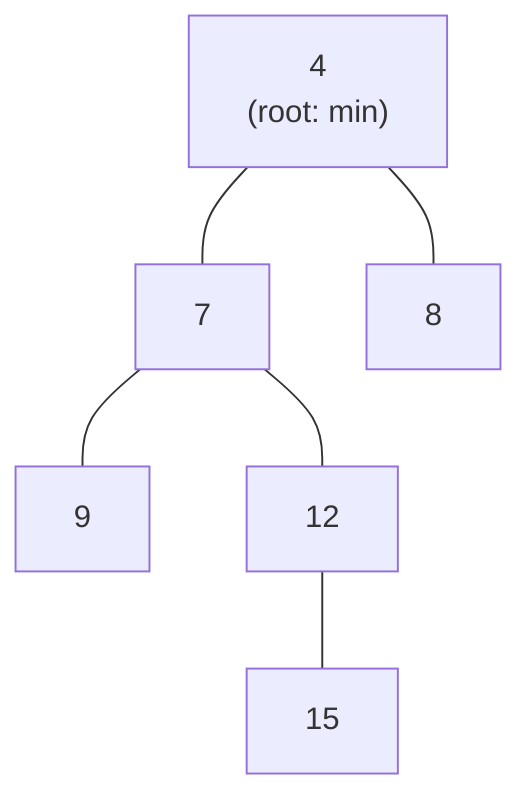

# Heaps & priority queues

## Why Does This Matter?

Any system that must act "next on the most urgent thing" needs a
priority queue: job schedulers, rate-limit token buckets, timers,
Dijkstra, top-k streams. Go ships `container/heap`, an interface-based
skeleton you adapt to your element type, plus generics-era alternatives
worth knowing. The trap is not implementing the heap; it is choosing
policies (ties, priorities that change, removal of arbitrary elements)
that the textbook slides omit and production demands.

## Mental Model

A binary heap is a complete binary tree packed into a slice: element at
`i` has children at `2i+1` and `2i+2`. The heap invariant (min-heap:
every parent <= children) is maintained by sift-up/sift-down, giving
O(log n) push/pop and O(1) peek.



The property that makes heaps the right answer for schedulers: the
minimum is always at index 0, and fixing a violated invariant costs
one path from root to leaf (O(log n)), not a full sort (O(n log n)).

## container/heap: the canonical shape

`container/heap` predates generics; you implement the `Interface`
(push/pop/len/less/swap) and the package provides the sift logic. The
awkward part is `heap.Pop` returns `any` and delegates storage to your
type:

```go
type Job struct {
    ID       string
    Priority int
    Enqueued time.Time
}

type JobQueue []*Job

func (q JobQueue) Len() int { return len(q) }
func (q JobQueue) Less(i, j int) bool {
    if q[i].Priority != q[j].Priority {
        return q[i].Priority > q[j].Priority   // max-heap on priority
    }
    return q[i].Enqueued.Before(q[j].Enqueued) // FIFO among equals
}
func (q JobQueue) Swap(i, j int)      { q[i], q[j] = q[j], q[i]; q[i].Idx, q[j].Idx = i, j }
func (q *JobQueue) Push(x any)        { job := x.(*Job); job.Idx = len(*q); *q = append(*q, job) }
func (q *JobQueue) Pop() any {
    old := *q
    n := len(old)
    job := old[n-1]
    old[n-1] = nil          // hygiene: release the reference
    job.Idx = -1
    *q = old[:n-1]
    return job
}
```

Usage, with the two production-grade moves:

```go
q := &JobQueue{}
heap.Init(q)
heap.Push(q, &Job{ID: "a", Priority: 5, Enqueued: time.Now()})

top := heap.Pop(q).(*Job)   // O(log n): the usual path

// Priority changed after enqueue: fix in place, O(log n).
top.Priority = 10
heap.Fix(q, top.Idx)        // requires the Idx bookkeeping in Swap

// Remove an arbitrary element, O(log n).
heap.Remove(q, victim.Idx)
```

The `Idx` field is the piece tutorials skip. Without it,
`heap.Fix`/`heap.Remove` cannot find the element's position after the
heap shuffled, and changing a priority degenerates into "remove
everything, rebuild". The `Swap` above maintains it; forget it and you
get silent wrong-order bugs that only appear under load.

## The generics-era alternative

With generics you can own the heap and drop the `any` casts and the
interface method-value overhead:

```go
type Heap[T any] struct {
    data []T
    less func(a, b T) bool
}

func New[T any](less func(a, b T) bool) *Heap[T] {
    return &Heap[T]{less: less}
}

func (h *Heap[T]) Push(v T) {
    h.data = append(h.data, v)
    siftUp(h.data, h.less, len(h.data)-1)
}

func (h *Heap[T]) Pop() (T, bool) {
    var zero T
    if len(h.data) == 0 { return zero, false }
    top := h.data[0]
    last := len(h.data) - 1
    h.data[0] = h.data[last]
    h.data[last] = zero           // hygiene
    h.data = h.data[:last]
    if last > 0 { siftDown(h.data, h.less, 0) }
    return top, true
}
```

`siftUp`/`siftDown` are ~15 lines each; the full implementation is in
[examples/heap](examples/heap/) with tests including the Fix and
arbitrary-remove paths. Choose `container/heap` when interop or
familiarity wins; choose a generic heap when type safety at the call
sites matters more.

## The policy decisions that make it production

| Decision | Options | Guidance |
|---|---|---|
| Ties | FIFO by insertion time, LIFO, arbitrary | always make it deterministic; arbitrary ties make tests flaky and debugging hell |
| Priority changes | `heap.Fix` with Idx bookkeeping | document who is allowed to change priorities and who must not |
| Arbitrary removal | Idx + `heap.Remove`, or tombstones | tombstones (mark dead, skip on pop) are simpler in GC-land; measure |
| Duplicate priorities flooding | cap per-priority depth | prevents one priority class from starving others |
| Persist across restart | rebuild from durable log | heaps are in-memory state; the durable queue is a separate problem (see 17/18 messaging) |

**Starvation** is the policy bug that matters: a max-priority firehose
can starve everything below it forever. The standard fix is aging
(bump effective priority with wait time) or weighted round-robin above
the heap. If your scheduler can starve, it will, in the worst possible
incident.

## Where priority queues show up in real Go services

- **Timer wheels and deadline scheduling**: connection timeouts,
  TTL caches; often a heap keyed by deadline, or `time.Timer` when the
  stdlib suffices.
- **Rate limiting with weights**: token buckets per tenant in a heap
  keyed by next-refill (full treatment:
  [24-system-design](../24-system-design/README.md) rate limiter).
- **Top-k streaming**: heap of size k over a firehose; O(n log k)
  instead of O(n log n) sort. The k-most-expensive-request dashboard
  is the canonical example.
- **Dijkstra / A\***: the open set; graph chapter covers the full
  implementation ([07-graphs](07-graphs.md)).

## Common Mistakes

- **Forgetting heap.Init** after building a slice directly (append
  outside Push): the invariant never held.
- **Missing the Idx bookkeeping** while still calling Fix/Remove:
  silent wrong-element operations.
- **Comparing pointers instead of values in Less** (or vice versa) and
  getting "correct-looking" order that drifts under churn.
- **Pop-and-continue on error**: a popped job that fails processing is
  usually re-pushed with backoff; dropping it silently loses work (the
  retry taxonomy is [05-errors](../05-errors/README.md)).
- **Ignoring the hygiene nil-out**: heap slots keep popped elements
  reachable; big elements leak until the heap drains.
- **Using a heap for "sorted iteration"**: repeated Pop is O(n log n)
  with poor locality; if you need all elements sorted once, just sort
  a copy.

## Idiomatic Go

```go
// Top-k over a stream, the interview classic, production-real.
// less(a, b) means "a ranks above b" (a is better).
func TopK[T any](in <-chan T, k int, less func(a, b T) bool) []T {
    // Bounded heap of the k best. Its root must be the WORST keeper,
    // so the heap orders by the INVERSE of less: swap the arguments.
    // (Negating with !less(a, b) is the classic bug: it makes equal
    // elements "less" in both directions, which is not a strict
    // order and corrupts the sift.)
    h := New(func(a, b T) bool { return less(b, a) })
    for v := range in {
        if h.Len() < k {
            h.Push(v)
        } else if top, _ := h.Peek(); less(v, top) {
            h.Pop()                     // evict the worst keeper
            h.Push(v)
        }
    }
    out := make([]T, 0, h.Len())
    for h.Len() > 0 {
        v, _ := h.Pop()
        out = append(out, v)
    }
    // Pops yield worst-first (the root is the weakest keeper);
    // reverse for best-first output.
    slices.Reverse(out) // slices package, Go 1.21+
    return out
}
```

Two subtleties the tests in [examples/heap](examples/heap/) caught in
this handbook's own first draft: the negation bug above, and the
missing reverse (popping a bounded min-heap gives worst-first, not
best-first). Note also the `Peek` guard: pop-then-push unconditionally
churns the heap when the incoming value does not qualify.

## Performance Considerations

- Push/pop: O(log n) with excellent constants; the slice backing means
  cache behavior is decent, though the tree access pattern scatters as
  n grows.
- Bulk build: heapify (sift-down from the middle) is O(n), not
  O(n log n); build once, then operate.
- Fixed-size heaps (top-k) are O(log k) per item and fit in cache when
  k is small: they scream.
- If priorities are a small dense integer range, a bucket queue
  (array of FIFO queues indexed by priority) is O(1) push/pop and
  dominates a heap; the tradeoff is bounded priority range. Timer
  wheels exploit exactly this.

## Concurrency Considerations

`container/heap` and the generic heap are not safe for concurrent use.
The production shapes: (1) one goroutine owns the heap and receives
commands over a channel (the ownership rule from
[08-concurrency/01](../08-concurrency/01-goroutines-and-channels.md));
(2) mutex-guarded for moderate contention; (3) sharded heaps for
throughput, with the cross-shard fairness caveat. The scheduler in
[08-concurrency/05-patterns](../08-concurrency/05-patterns.md)
demonstrates shape (1) end to end.

## Security Considerations

- Priorities derived from user input are an amplification vector: a
  client that marks everything "critical" defeats the scheduler. Clamp
  and validate at the boundary; consider per-tenant quotas.
- Unbounded heap growth from untrusted inputs needs a cap and an
  eviction policy (drop-oldest is usually right); pair with the LRU
  pattern in [09-lru-cache](09-lru-cache.md).

## Testing Strategy

Property tests earn their keep here: after any sequence of push/pop/fix
operations, assert the invariant (each parent <= children) by walking
the slice. Differential-test against a sorted-slice reference for small
n. The examples/heap test suite includes invariant checking after
random op sequences, plus the Fix/Remove bookkeeping cases.

## Interview Questions

1. *Heap insert and extract: complexity and why?*: O(log n): one
   root-to-leaf (or leaf-to-root) path fixed by sift operations.
2. *How do you support O(log n) priority updates?*: Store the index in
   the element, maintain it in Swap, call heap.Fix; without Idx you
   cannot find the element.
3. *Design a scheduler that cannot starve low-priority jobs?*: Aging
   or weighted round-robin above the heap; discuss the fairness metric.
4. *Top-k of a billion items with k = 100: what do you do?*: Min-heap
   of size k, O(n log k) time, O(k) memory; mention the bucket/bounded
   alternative.
5. *When is a heap the wrong structure for "next task"?*: When
   priorities are dense small integers (bucket queue), when ordering is
   strictly FIFO (plain queue), or when durability is required (the
   heap is in-memory; you need a log).

## Practice Exercises

1. Finish the generic Heap: implement `Fix(i int)` and `Remove(i int)`
   with index bookkeeping, and property-test the invariant after
   random op sequences.
2. Implement the bucket queue for priorities 0-99; benchmark against
   the binary heap for 1M pushes/pops and report the ratio.
3. Build TopK on the examples/heap package; feed it a synthetic
   request stream and verify the top-k set against a full sort.

## Further Reading

- [container/heap](https://pkg.go.dev/container/heap) (read the
  example; it is the Idx pattern)
- [Introduction to Algorithms, heaps chapter](https://mitpress.mit.edu/9780262046305/introduction-to-algorithms/)
  (the canonical reference)
- [Timer wheels](https://www.researchgate.net/publication/2684227_Hashed_and_hierarchical_timing_wheels)
  (Varghese & Lauck; the bounded-priority alternative)
