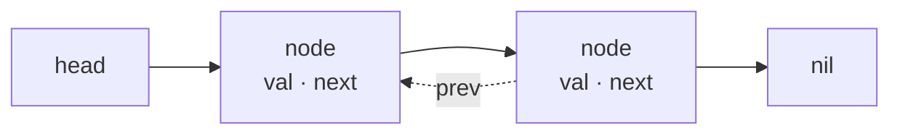

# Linked lists

## Why Does This Matter?

The linked list is the most-taught data structure and the least-used in
production Go. That gap is the lesson: Go's slice gives you amortized
O(1) end-insertion with contiguous memory, and the O(1) middle-splice
advantage of lists only pays when you can already locate the node
without a scan. Knowing when pointer-chasing genuinely wins (and when
it is a habit imported from other languages) is real engineering
judgment, and it transfers to every pointer-based structure in this
section.

## Mental Model



Each node is a separate heap allocation holding a value plus one or two
pointers. The consequences, all downstream of that fact:

- **Splice is O(1)**: once you hold a node, insert/remove at that point
  rewrites two pointers, no shifting.
- **Find is O(n) with the worst cache behavior** of any structure here:
  every step is a potential cache miss.
- **Memory is 3-5x the payload** (value + pointers + allocator
  overhead) and scattered across the heap.

A slice does everything except the splice: O(1) end ops, O(n) middle
insertion (memmove, which is fast), perfect locality.

## container/list: what the stdlib offers

`container/list` is a circular, doubly-linked list with sentinel root:

```go
l := list.New()          // *list.List of list.Element
e1 := l.PushBack("a")
l.PushFront("z")
l.Remove(e1)             // O(1), given the element
for e := l.Front(); e != nil; e = e.Next() {
    v := e.Value         // any: type assertion to recover your type
}
```

Honest assessment, three real costs:

1. **`Value any`**: every read is a type assertion; generics came too
   late for the API. You lose compile-time type safety for zero
   benefit.
2. **Element wrapper**: `PushBack` allocates an `Element` per call,
   separate from your value.
3. **Interface friction**: the idioms that make slices pleasant
   (`slices` package, range loops, JSON) do not apply.

When it is right: LRU-style promotion where you already hold the
element (exactly Chapter 9's implementation), and object pools where
nodes are recycled long-term. Almost everything else has a
slice-shaped answer.

## The splice advantage, concretely

The one scenario lists genuinely win: **holding references to nodes**
and reordering them constantly. The LRU cache (Chapter 9) is the
canonical case: a map from key to *element, promotion is
`l.MoveToFront(e)`, eviction is `l.Remove(l.Back())`. No scan ever
happens because the map hands you the node. That combination (map +
list) is the production pattern; a list alone rarely justifies itself.

The second scenario: **stable element identity** across mutations. If
you must hold a reference to "that item" while other items are inserted
and removed, and slices would invalidate indices (append can move the
backing array; remember
[02/01](../02-go-language/01-arrays-and-slices.md)), nodes stay put.

And the anti-scenario, worth internalizing: iteration-heavy workloads
(timeline scans, event streams, most caches) are exactly where lists
lose. A linked list of 10M nodes walks 10M cache misses; a slice of
10M values walks 10M sequential reads the prefetcher already staged.

## The slice-shaped alternatives

Most "I need a linked list" moments resolve to one of these:

| Need | List habit | Slice-shaped answer |
|---|---|---|
| Insert in middle, order matters | list | `slices.Insert` (O(n) memmove; fast until n is big) |
| Remove in middle by identity | list | swap-delete if order is free; index map + tombstone if not |
| Frequent reordering | list | sort on demand; or index map + list (LRU) |
| Queue/stack | list | slice idioms (Chapter 3) |
| Stable references | list | index map (`map[Key]int`) maintained on mutation |

The index-map trick deserves a callout: it gives slices stable-ish
identity at the cost of maintenance on every mutation. It is the same
bookkeeping burden as heap `Idx` (Chapter 4): decide explicitly, then
test the bookkeeping.

## Hand-rolling: when you must

Domain pointer structures (trees, graphs, lock-free-ish queues) start
as hand-rolled linked nodes. The hygiene rules that keep them sane:

```go
type node[T any] struct {
    val  T
    next *node[T]
}

func (l *List[T]) Remove(pred func(T) bool) bool {
    // Track prev while walking: the classic pattern.
    var prev *node[T]
    for cur := l.head; cur != nil; cur = cur.next {
        if pred(cur.val) {
            if prev == nil { l.head = cur.next } else { prev.next = cur.next }
            cur.next = nil   // hygiene: do not leave the node linked
            return true
        }
        prev = cur
    }
    return false
}
```

- Nil the pointers you sever; a node left half-linked is a leak and a
  correctness bug at once.
- Draw the four cases (empty, head, middle, tail) before writing; each
  is a test.
- Any concurrent mutation needs a lock or ownership discipline;
  "temporary" unsynchronized access is how data races are born (the
  race detector is the arbiter, [08-concurrency/07-pitfalls](../08-concurrency/07-pitfalls.md)).

## Common Mistakes

- **Reaching for `container/list` by default** (especially when
  arriving from Java's `LinkedList` habit): pays allocation + `any`
  + locality taxes for benefits the workload never uses.
- **Range-with-removal on a list**: `e = e.Next()` after `l.Remove(e)`
  is a use-after-remove; capture `Next` before removing.
- **Iterating a slice while inserting** (the mirror bug): append can
  reallocate mid-loop; iterate by index over the original length, or
  queue inserts for after the loop.
- **Assuming O(1) middle-insert**: only with the node in hand; finding
  it is O(n) unless a map (or index) stands next to the list.
- **Building a list to sort it**: `slices.Sort` on the slice is simpler
  and faster; merge-sort-on-list is a competitive-programming reflex.

## Idiomatic Go

```go
// Promotion-heavy membership: map + list, the LRU core.
type LRU[K comparable, V any] struct {
    cap  int
    ll   *list.List              // back = oldest
    item map[K]*list.Element
}
func (c *LRU[K, V]) touch(e *list.Element) { c.ll.MoveToFront(e) }

// Order-preserving dedup: no list needed (Chapter 2's ordered set).
seen := map[string]struct{}{}
out := make([]string, 0, len(in))
for _, s := range in {
    if _, ok := seen[s]; !ok { seen[s] = struct{}{}; out = append(out, s) }
}
```

## Performance Considerations

- End-append: slice amortized O(1) at ~10ns; list O(1) at ~30ns+ per
  node with allocation. dsbench has `BenchmarkListVsSlice` with both.
- Iteration: measured on this machine at 1M elements, the slice walk
  is ~1.0 ms and the pointer-chased list walk is ~3.6 ms: a 3.5x gap
  from locality alone (dsbench `IterateList` vs `IterateSlice`), and
  the gap widens when nodes are scattered across the heap by churn.
- GC pressure: every node is a tracked pointer object; a slice of 1M
  values is one object, a list of 1M nodes is 1M objects. In
  allocation-heavy profiles, list-shaped structures show up as GC work
  (see [19-performance/02](../19-performance/02-memory-and-allocations.md)).
- If you need list semantics at scale, consider chunked lists (slices
  of slices) for a locality/insertion compromise, and measure.

## Concurrency Considerations

`container/list` is not concurrent-safe. Mutex-guard it or give it one
owner goroutine. The tempting "lock-free linked list" is a research
problem in disguise (hazard pointers, ABA); production Go reaches for
channels, mutexes, or the `sync` chapter's structures instead
([08-concurrency/04](../08-concurrency/04-sync-primitives.md)).

## Security Considerations

- Linked structures with user-controlled depth (chain traversal,
  nested lists) are stack-exhaustion DoS vectors if walked
  recursively; walk iteratively.
- `Value any` means assertion failures on untrusted data surface at
  runtime: validate at ingress before insertion.

## Testing Strategy

Pointer surgery bugs cluster at the four structural cases (empty, head,
middle, tail): write them as a table. For hand-rolled lists, add an
invariant checker (walk and count; compare against `len`) after every
mutation in tests, the same property-testing shape as heaps (Chapter
4).

## Interview Questions

1. *When does a linked list beat a slice in Go?*: When you hold node
   references and reorder constantly (LRU), or need stable identity
   across mutations; not for iteration-heavy or end-only workloads.
2. *Why is container/list's API considered dated?*: `Value any`
   (assertions at read), separate Element allocations, no generic
   integration.
3. *How do you get O(1) removal from the middle of a slice?*: Swap-delete
   if order is free; otherwise index map + compaction. Neither is
   truly O(1) and stable; say the tradeoff out loud.
4. *Reverse a linked list in place?*: Three-pointer walk; the
   follow-up is always the four-case edge coverage.
5. *Detect a cycle?*: Floyd's tortoise and hare, or a visited set at
   O(n) memory; discuss the tradeoff.

## Practice Exercises

1. Implement a generic doubly-linked list with `PushFront`,
   `PushBack`, `Remove(e)`, and an invariant checker; differential-test
   against `container/list` with random op sequences.
2. Build LRU two ways (list-backed and slice-backed with index map);
   benchmark get-heavy and mixed workloads; report where each wins.
3. Implement merge-sort on a hand-rolled list, then benchmark against
   `slices.Sort` on the equivalent slice; explain the gap in one
   paragraph.

## Further Reading

- [container/list source](https://go.dev/src/container/list/list.go)
  (short, readable, sentinel-based)
- [Latency numbers every programmer should know](https://github.com/sirupsen/logrus/issues/159) (cache
  misses vs sequential reads, the locality argument)
- [Bjarne Stroustrup: "You shouldn't use linked lists"](https://www.youtube.com/watch?v=YQsK4MtsELU)
  (the cache-locality argument, language-agnostic)
