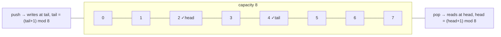

# Ring buffers

## Why Does This Matter?

A ring buffer is the answer to a question services ask constantly: how
do I keep the *last N* things without ever growing? Telemetry samples,
log tails, sliding windows, retry dedup, audio frames, the
last-requests-per-client security view. Slices grow and shift; ring
buffers are born full-capacity, reuse every byte forever, and give O(1)
at both ends with zero allocation after warmup.

## Mental Model

A fixed array plus two indices that wrap:



- `head`: next element to read
- `tail`: next slot to write
- `count`: live elements (one of the three state encodings, below)

Push and pop are index arithmetic and one bounds check. The wrap
(`mod cap`) is the entire trick: the array never moves, never grows,
never compacts.

## The state-encoding decision

Before implementation, choose how you know "empty" from "full" (both
would otherwise be `head == tail`):

| Encoding | Cost | Pick when |
|---|---|---|
| `count` field | one int | default: clearest |
| leave one slot empty | wasted slot | you want lock-free-er reads |
| head/tail as monotonically increasing ints (mask or mod) | wide ints | hot paths; indices never collide |

The handbook default is `count`; it reads correctly the first time and
the performance delta is negligible outside instrumentation-grade
loops.

## The implementation

```go
// Ring is a fixed-capacity FIFO. Not safe for concurrent use; wrap it
// with a mutex or give it one owner (see concurrency notes).
type Ring[T any] struct {
    items []T
    head  int   // next to pop
    count int   // live elements
}

func NewRing[T any](capacity int) *Ring[T] {
    if capacity < 1 { capacity = 1 }
    return &Ring[T]{items: make([]T, capacity)}
}

func (r *Ring[T]) Len() int      { return r.count }
func (r *Ring[T]) Cap() int      { return len(r.items) }// Push appends v. Returns the evicted element if the ring was full
// (drop-oldest policy) and whether an eviction happened.
func (r *Ring[T]) Push(v T) (evicted T, didEvict bool) {
	// Evict BEFORE writing: when the ring is full, tail == head, so
	// writing first would clobber the oldest element and return it as
	// the new value. The wrap seam is where ring bugs live.
	if r.count == len(r.items) {
		evicted = r.items[r.head]     // read the oldest first
		var zero T
			r.items[r.head] = zero   // hygiene: release the reference
		r.head = (r.head + 1) % len(r.items)
		r.count--
		didEvict = true
	}
	tail := (r.head + r.count) % len(r.items)
	r.items[tail] = v
	r.count++
	return evicted, didEvict
}

func (r *Ring[T]) Pop() (T, bool) {
    var zero T
    if r.count == 0 { return zero, false }
    v := r.items[r.head]
    r.items[r.head] = zero
    r.head = (r.head + 1) % len(r.items)
    r.count--
    return v, true
}

func zero[T any]() T { var z T; return z }
```

Two implementation notes worth internalizing:

- **Eviction order matters**: when the ring is full, `tail == head`, so
  writing the new value before reading the victim clobbers the oldest
  element and returns the wrong one. Evict (read, zero, advance head),
  *then* write. The example's tests catch exactly this bug if you
  reorder the lines.
- **Hygiene on overwrite and pop**: big structs in the slots must not
  stay reachable after eviction, the same rule as stack pops (Chapter
  3).
- **Eviction IS the policy**: the return signature makes drop-oldest
  explicit and observable (callers can count evictions as a metric;
  see observability notes below).

The full version with `Peek`, `Drain`, and a `Block`-policy variant is
in [examples/ring](examples/ring/) with wrap-seam tests.

## The policy table: what happens at full

| Policy | Behavior | Use when |
|---|---|---|
| Drop-oldest (overwrite) | newest wins | telemetry, metrics, log tails: freshness is the point |
| Drop-newest (reject) | push returns false | audit trails: losing data must be loud |
| Block | push waits | producer must not lose data and consumer is guaranteed |
| Grow (degenerate) | becomes a slice | almost never: you have reinvented the memory leak |

The block policy is where the channel comparison comes back: a
capacity-limited channel *is* a blocking ring with a memory-model
guarantee and `select`-able timeouts. The runtime's channels are
implemented as ring buffers internally; reach for yours when you need
inspection (Len, Peek, metrics) or a drop policy channels lack.

## The classic uses in real services

- **Sliding-window metrics**: p99 over the last 10k requests; ring of
  latencies, rebuild quantiles on scrape (or a t-digest for exact-ish
  quantiles; see [20-observability](../20-observability/README.md)).
- **Connection-per-client rate tracking**: per-IP ring of timestamps,
  count-below-window check; bounded memory per abusive client, which
  is the whole game in rate limiting
  ([24-system-design](../24-system-design/README.md)).
- **Retry dedup**: last-N seen IDs so replayed deliveries are cheap to
  spot (full dedup needs a map + TTL; the ring bounds it).
- **Streaming I/O**: audio/video frames, line readers; the ring
  decouples producer and consumer rates with a hard memory ceiling.

## Common Mistakes

- **`head == tail` as the full test** without choosing a state
  encoding: empty and full become indistinguishable.
- **Unmasked power-of-two arithmetic done with `%`** in a hot loop:
  `i & (cap-1)` is a real constant-factor win when capacity is
  padded to a power of two; measure before complicating.
- **Returning slices into the ring's storage** (`Peek` handing out
  `r.items[head:tail]`): the wrap makes contiguous views wrong; copy,
  or expose only element-wise access.
- **Ignoring eviction accounting**: silently dropped samples look like
  system health; export an `evicted_total` counter or the metric lies
  ([20-observability](../20-observability/README.md)).
- **Sizing to the average burst** instead of the p99.9 burst: rings
  are cheap; undersized ones silently drop your incident evidence.
- **Observation-mutates-state APIs**: a `Seen(key)` that both records
  and reports makes callers' assertions and metrics distort the very
  window they inspect. Split record from query (`Seen` vs `Contains`):
  the example's first draft had the combined version and its own test
  suite caught the distortion. This trap generalizes to every
  stateful structure in this section.

## Idiomatic Go

```go
// Last-N dedup: ring of keys + map for O(1) membership.
type RecentKeys struct {
    ring *Ring[string]
    seen map[string]struct{}
}
func (r *RecentKeys) Seen(k string) bool {
    if _, ok := r.seen[k]; ok { return true }
    if old, evicted := r.ring.Push(k); evicted {
        delete(r.seen, old)
    }
    r.seen[k] = struct{}{}
    return false
}
```

This map-plus-ring shape is the bounded-memory workhorse: the ring
bounds it, the map indexes it, eviction cleans it. Two contract
decisions to make deliberately:

- **Hits do not refresh the window.** The ring is the recency record;
  the map is membership only. Refreshing on hit needs O(1)
  middle-removal, which a ring cannot do: that requirement upgrades
  you to an LRU (next chapter). The example's tests pin this behavior
  because the count-based variant (increment on hit) leaves phantom
  map entries that eviction can never clean: a bug the property test
  caught during this handbook's own build.
- **Duplicate pushes are possible**: pushing k twice occupies two
  slots and the map cleans only when both evict. If you need strict
  single-slot semantics, check-and-skip in the caller.

## Performance Considerations

- Push/pop: strict O(1), zero allocations after construction,
  prefetcher-friendly if slots hold values rather than pointers (the
  value-vs-pointer layout rule from Chapter 1).
- Contention: a mutex-guarded ring falls over under high
  producer/consumer counts before channels do; channels are
  battle-tuned for exactly that contention shape.
- Overflow of the epoch/counter variants: int64 head/tail with mask
  arithmetic only wraps after 2^63 ops; use them for hot paths.

## Concurrency Considerations

The plain ring is single-owner. The three concurrent shapes:

1. **Mutex-guarded**: fine to moderate contention; add `Len()` for
   metrics while you are there.
2. **One reader, one writer (SPSC)**: the classic lock-free case;
   correct implementation needs atomic acquire/release ordering and
   careful padding to avoid false sharing. Do it only with the race
   detector and a real benchmark in hand; the subtle-bug rate is
   famous.
3. **Channels**: the runtime's ring, with blocking semantics built in.
   Default choice under contention.

## Security Considerations

- Rings of user-identifying data (IPs, tokens) must zero on eviction
  if memory inspection is a threat model item; the hygiene rule is a
  compliance requirement here.
- Per-client rings must be capped AND evicted: an attacker rotating
  identities must not accumulate unbounded per-identity state (the
  overall bound is the LRU's job, next chapter).

## Testing Strategy

The wrap seam is where bugs live: tests must cross it repeatedly
(push/pop past capacity many times), with capacity 1 (degenerate), 2,
and non-power-of-two. Property test: after any op sequence,
`Len() <= Cap()`, FIFO order holds for non-evicted elements, and
evicted elements are exactly the oldest. Differential-test against a
slice-backed reference queue. All of these are in
[examples/ring](examples/ring/).

## Interview Questions

1. *How do you distinguish full from empty in a ring?*: Count field,
   sacrificed slot, or monotonic head/tail; discuss the tradeoffs.
2. *Why is a ring O(1) with zero allocation?*: Fixed array + modular
   index arithmetic; nothing moves, nothing grows.
3. *Implement a rate limiter on a ring: what do you store?*: Request
   timestamps per client; count-above-window test; discuss per-key
   memory bounding.
4. *When would you use a ring instead of a channel?*: When you need
   inspection, drop-oldest policy, or zero-allocation single-owner
   buffering; channels win on contention and memory-model guarantees.
5. *How do you make a ring safe for concurrent producers and
   consumers?*: Mutex, SPSC atomics (with the caveats), or switch to
   channels; name the bug classes you avoid.

## Practice Exercises

1. Implement the monotonic-index variant (`head++` forever, mask with
   `cap-1`); prove with a test that it survives index wraparound at
   2^63 using synthetic head/tail injection.
2. Build the `RecentKeys` structure; property-test that `seen` and the
   ring agree after random op sequences (the bookkeeping bug is the
   lesson).
3. Add a `Snapshot()` that returns a consistent copy under a mutex;
   test that concurrent pushers cannot observe torn state.

## Further Reading

- [Classic SPSC ring buffer](https://www.snellman.net/blog/archive/2016-02-01-ring-buffers/)
  (the monotonic-index encoding)
- [Kafka's design: log = ring of segments](https://kafka.apache.org/documentation/#design)
  (bounded-retention thinking at scale; the handbook's
  [18-kafka-with-go](../18-kafka-with-go/README.md) covers the client
  side)
- [False sharing](https://go.dev/ref/mem#atomicity) and padding notes
  in the memory model
