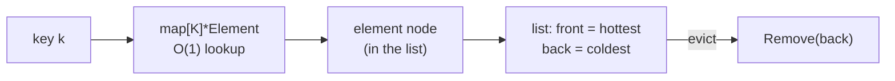

# LRU cache

## Why Does This Matter?

The LRU cache is the data-structure interview's greatest hit, but the
reason it matters here is production: bounded memory is the difference
between a cache and a slow leak. Databases, HTTP clients, DNS
resolvers, token verifiers, and every rate limiter in
[24-system-design](../24-system-design/README.md) lean on the same
shape: map for O(1) lookup, list for recency order, a hard cap for
memory, and a policy for the victims.

## Mental Model

Two structures, one contract:



- **Get**: map finds the element, list promotes it to front. Both O(1).
- **Put**: upsert + promote; if over capacity, remove the back. O(1).
- The list exists *because the map hands you the node*: the splice
  advantage from [05-linked-lists](05-linked-lists.md) finally pays.

## The implementation

```go
import (
    "container/list"
    "sync"
)

type entry[K comparable, V any] struct {
    key   K
    value V
}

type LRU[K comparable, V any] struct {
    cap  int
    ll   *list.List                // front = most recent
    item map[K]*list.Element
    mu   sync.Mutex                // fine to guard here; see notes
    onEvict func(K, V)
}

func NewLRU[K comparable, V any](cap int) *LRU[K, V] {
    if cap < 1 { cap = 1 }
    return &LRU[K, V]{
        cap:  cap,
        ll:   list.New(),
        item: make(map[K]*list.Element, cap),
    }
}

func (c *LRU[K, V]) Get(key K) (V, bool) {
    c.mu.Lock()
    defer c.mu.Unlock()
    if e, ok := c.item[key]; ok {
        c.ll.MoveToFront(e)
        return e.Value.(*entry[K, V]).value, true
    }
    var zero V
    return zero, false
}

func (c *LRU[K, V]) Put(key K, value V) {
    c.mu.Lock()
    defer c.mu.Unlock()
    if e, ok := c.item[key]; ok {
        c.ll.MoveToFront(e)
        e.Value.(*entry[K, V]).value = value
        return
    }
    e := c.ll.PushFront(&entry[K, V]{key, value})
    c.item[key] = e
    if c.ll.Len() > c.cap {
        oldest := c.ll.Back()
        if oldest != nil {
            ent := oldest.Value.(*entry[K, V])
            c.ll.Remove(oldest)
            delete(c.item, ent.key)
            if c.onEvict != nil {
                c.onEvict(ent.key, ent.value)
            }
        }
    }
}

func (c *LRU[K, V]) Len() int {
    c.mu.Lock()
    defer c.mu.Unlock()
    return c.ll.Len()
}
```

The full version with `Peek` (no promotion), `Remove`, metrics hooks,
and the property tests lives in [examples/lru](examples/lru/).

Why `container/list` after Chapter 5's skepticism: this is the exact
workload where it wins. The map already holds the `*Element`, so
there is no find-scan; `MoveToFront` and `Remove` are O(1) pointer
splices. The `any`-typed `Value` is the cost, absorbed once behind the
generic `*entry` wrapper.

## The decisions the interview skips

**TTL or no TTL?** Pure LRU evicts by recency only; a hot-but-stale
key lives forever. Production caches almost always add expiry: either
background sweeping (a goroutine walking the list or a secondary
expiry heap, Chapter 4) or lazy check-on-read with a stored deadline.
Lazy is simpler; background is required when memory must be reclaimed
even without reads (session data under attack by key-space growth).

**Size by items or by bytes?** `cap` items is the interview answer; a
cache of variable-size values needs a byte budget and eviction-until-
under-budget, or one 10MB value evicts ninety 1KB ones invisibly.

**Locking granularity.** The mutex above is correct and contends at
high QPS. The scaling ladder:

1. Single mutex (the code above): fine to tens of thousands of ops/s.
2. Shard by key hash: N independent LRU shards, `key % N`; contention
   divides, memory still bounded per shard. The standard move, same
   shape as map sharding in
   [08-concurrency/04-sync-primitives](../08-concurrency/04-sync-primitives.md).
3. Lock-free approximations (sampled LRU, CLOCK): what big caches
   (Redis approximations, Caffeine-style) use; in Go, reach for these
   only with a profile proving lock contention
   ([19-performance/03](../19-performance/03-concurrency-performance.md)).

**Is LRU even the right policy?** LRU ignores frequency: a
once-per-second scan evicts your real hotset. LFU, W-TinyLFU, and
2-queue variants fix frequency-blindness at the cost of complexity.
Start with LRU; upgrade when the hit-ratio metric (below) says so, not
before.

## Where it shows up in this handbook

- **Bounded memory everywhere**: the risk-engine windows in
  [25-fintech-with-go/04](../25-fintech-with-go/04-risk-and-compliance.md)
  use the same cap-and-evict shape.
- **Read-through caching**: LRU in front of a database, with
  invalidation discipline from
  [13-databases](../13-databases/README.md).
- **Connection/token caches**: LRU of parsed credentials or pool
  handles, where eviction on memory pressure is correctness.
- **singleflight pairing**: LRU + `singleflight` (deduplicating
  concurrent fills) is the standard cache-stampede defense; the
  pattern is benchmarked in
  [19-performance/03](../19-performance/03-concurrency-performance.md).

## Common Mistakes

- **Unbounded "cache"**: a map with eviction only "when we remember".
  The cap must be structural, not aspirational.
- **Evicting without a callback/metric**: you cannot debug hit ratios
  you do not count. Track `hits`, `misses`, `evictions` from day one
  ([20-observability](../20-observability/README.md)).
- **Promoting on `Peek`**: a monitoring path that promotes changes
  cache behavior; keep peek non-mutating.
- **Holding the lock during value construction**: a slow `fill` inside
  `Put` serializes the cache; fill outside the lock, insert after.
  (Cache stampede defense: singleflight.)
- **Copy semantics on Get**: returning `V` by value is fine; returning
  a pointer to the stored value lets callers mutate the cache's
  state. Decide and document (the aliasing rules from
  [02/01](../02-go-language/01-arrays-and-slices.md)).
- **Not bounding key space**: LRU bounds *entries*; if keys are
  attacker-chosen and values tiny, the map's per-entry overhead is
  still the DoS floor. Pair with per-client rate limits.

## Idiomatic Go

```go
// Read-through with singleflight, the production shell.
var g singleflight.Group

func (s *Service) GetUser(ctx context.Context, id string) (*User, error) {
    if u, ok := s.cache.Get(id); ok {
        return u, nil
    }
    v, err, _ := g.Do("user:"+id, func() (any, error) {
        u, err := s.db.User(ctx, id)     // fill OUTSIDE the cache lock
        if err != nil { return nil, err }
        s.cache.Put(id, u)
        return u, nil
    })
    if err != nil { return nil, err }
    return v.(*User), nil
}
```

## Performance Considerations

- All ops O(1); the constants are two map lookups (entry + list node
  indirection) and pointer splices: tens of nanoseconds.
- Value copies on Get can dominate for large V; store pointers and
  accept shared-mutability discipline, or copy and pay (measure with
  the dsbench).
- Sharding costs memory (N maps) and complicates global TTL sweeps;
  do it for contention, not for fun.
- `container/list` nodes are individually allocated: for
  millions of entries, a slab-allocated or index-based layout (slice
  of entries + free list, indices instead of pointers) cuts GC work
  dramatically; the index-map trick from Chapter 5.

## Concurrency Considerations

The implementation guards with a mutex and is safe for sharing.
Alternatives and their sharp edges:

- **sync.Map**: wrong tool (its niche shapes do not include LRU
  eviction; see [02/02](../02-go-language/02-maps.md)).
- **Sharded locks**: the scaling answer; shard count a power of two,
  hash well, document that global operations (total Len, full sweep)
  are now O(shards) coordination.
- **Two-tier (per-goroutine + shared)**: real caches do this;
  complexity only after contention is measured.

## Security Considerations

- Cache keys from user input are a poisoning vector: cache the
  *authorized* view, not the raw query; authorize before fill
  ([21-security](../21-security/README.md)).
- Sensitive values (tokens, PII) in a cache extend their lifetime
  beyond the request: bound TTL, zero on evict (the hygiene rule),
  and exclude from debug dumps.
- Eviction callbacks run under the cache lock in the code above:
  make them fast and non-blocking, or collect victims and evict
  outside the lock.

## Testing Strategy

The property set: capacity never exceeded, Get of an evicted key
misses, Get/Put promote, Peek does not, eviction callback fires
exactly once per victim with the right pair. Run random op sequences
against a reference implementation (map + explicit order list) for
small n; the examples/lru suite includes exactly this differential
test. Concurrency tests: run `Get`/`Put` storms under `-race`, then
assert capacity and no double-eviction.

## Interview Questions

1. *Design an LRU with O(1) ops: what holds what?*: Map from key to
   list element; list ordered by recency; evict from the back. Then
   the follow-ups: TTL, byte budget, sharding.
2. *How do you add TTL to an LRU?*: Expiry per entry (lazy on read)
   plus a background sweeper for unaccessed-but-expired entries; or a
   secondary min-heap keyed by deadline (Chapter 4).
3. *Your cache hit ratio is 40% and the DB is melting: what do you
   measure next?*: Eviction rate and key-space size vs cap, scan vs
   frequency distribution (LRU vs LFU fit), stampede behavior
   (singleflight), and whether reads promote (Peek misuse).
4. *Why does the map store *list.Element instead of the value?*: So
   promotion and eviction are O(1) pointer splices; the value rides
   inside the element.
5. *Make it safe for 100k concurrent readers: options?*: Shard with
   power-of-two count, or two-tier; discuss per-shard metrics and the
   cost to global sweeps.

## Practice Exercises

1. Extend the LRU with per-entry TTL and a background sweeper; test
   that memory is reclaimed even with zero reads (the sweeper's
   raison d'être).
2. Implement a byte-budget variant (`Put` evicts until `usedBytes <=
   budget`); test the single-huge-value case explicitly.
3. Shard the LRU eight ways; benchmark single-key hot, uniform, and
   skewed workloads, and report where sharding wins and loses.

## Further Reading

- [container/list](https://pkg.go.dev/container/list) (the splices
  this chapter leans on)
- [golang.org/x/sync/singleflight](https://pkg.go.dev/golang.org/x/sync/singleflight)
  (stampede defense)
- [W-TinyLFU](https://arxiv.org/abs/1512.00727) (the frequency-aware
  successor, when hit ratios demand it)
