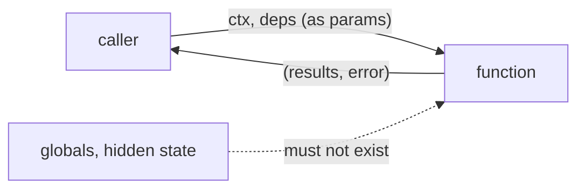

# Functions: signatures as contracts

## Why Does This Matter?

A function signature is the smallest, most load-bearing contract in Go.
Every dependency seam, every test double, every concurrent handoff
flows through one. Engineers who treat signatures as plumbing write
APIs that need rewrites; engineers who treat them as contracts build
systems where the compiler enforces the architecture. This chapter
sharpens what
[02-go-language/07-closures-functions](../02-go-language/07-closures-functions.md)
introduced: here the question is not "how do function types work" but
"what does this signature promise, and to whom?"

## Mental Model

A signature answers four questions at once:

```go
func Fetch(ctx context.Context, id string) (*Order, error)
//      ^whose request?   ^what input?  ^what output? ^how do I fail?
```

1. **Dependencies in**: everything the function needs is a parameter.
   Nothing global, nothing implicit. If it reads config from a global,
   the signature lies.
2. **Results out**: return what the caller must handle. An `error` is
   part of the contract, not an afterthought.
3. **Failure mode**: errors, not panics, for anything the caller could
   reasonably handle ([05-errors](../05-errors/README.md)).
4. **Cancellation**: a `context.Context` as the first parameter means
   the contract includes "I will stop when asked" (see
   [08-concurrency/03-context](../08-concurrency/03-context.md)).



The discipline: **if the signature does not show it, the caller cannot
control it**. Hidden inputs (globals, singletons, environment reads
deep in the call tree) are the root cause of untestable code, and every
later chapter in this section is a technique for surfacing them.

## The three dependency styles, compared

The same `Fetcher` dependency, three signature styles:

```go
// 1. Concrete dependency: simplest, least flexible.
func Handle(f *FileFetcher, id string) (*Order, error)

// 2. Consumer-side interface: the Go default for seams you need.
type Fetcher interface {
    Fetch(ctx context.Context, id string) (*Order, error)
}
func Handle(f Fetcher, id string) (*Order, error)

// 3. Function type: a one-method interface's lighter cousin.
type FetchFunc func(ctx context.Context, id string) (*Order, error)
func Handle(f FetchFunc, id string) (*Order, error)
```

| Style | Use when | Cost |
|---|---|---|
| Concrete type | the dependency will never vary, or is stdlib-stable | zero; no seam for tests that need one |
| Interface | multiple implementations exist or tests need doubles | one type declaration; dynamic dispatch |
| Function type | the seam is a single operation (transform, predicate, callback) | no dispatch; closures carry state |

The rule that keeps this honest: **start concrete, extract the seam
when a second implementation or a test double genuinely appears**, not
before. Interfaces built on speculation are the overengineering tell
(see [06-interfaces-and-embedding](../02-go-language/06-interfaces-and-embedding.md)
for the mechanics; this chapter is about the decision).

## Function types as mini-contracts

One-method interfaces and function types are interchangeable at the
seam; choose by ergonomics:

```go
// Predicate as a named function type: composes, no ceremony.
type Filter[T any] func(T) bool

func Where[T any](in []T, f Filter[T]) []T {
    out := make([]T, 0, len(in))
    for _, v := range in {
        if f(v) { out = append(out, v) }
    }
    return out
}

// Composition reads like the logic it is.
active := Where(users, func(u User) bool { return u.Active })
admins := Where(active, func(u User) bool { return u.Admin })
```

The stdlib's stable shape is the one-method interface
(`io.Reader`), because methods read better when the value crosses many
layers and may gain behavior. Function types shine at single-layer
seams: middleware, comparators, retry policies.

## Closures at the seam

Closures are how state gets into a contract without a struct:

```go
func RetryPolicy(max int, base time.Duration) func(attempt int) time.Duration {
    return func(attempt int) time.Duration {
        if attempt >= max { return 0 }          // give up signal
        return base << attempt                  // exponential backoff
    }
}
```

The capture semantics (by reference, variables outliving the frame)
are in [02/07](../02-go-language/07-closures-functions.md). The design
note here: a closure's captured state is invisible in its type. Two
`func(attempt int) time.Duration` values may behave completely
differently. For anything with meaningful state or options, a small
struct with a method is more honest; closures are for glue.

## Common Mistakes

- **Boolean parameters that change behavior**
  (`func Process(urgent bool)`): call sites read as
  `Process(true)`; nobody knows what true means. Two functions
  (`Process`, `ProcessUrgent`) or an options struct say what they do.
- **Context not first, or absent**: `Fetch(id string, ctx
  context.Context)` breaks the convention every reader (and every
  linter) expects; a function that does I/O without a context cannot
  be cancelled or given a deadline.
- **Returning a concrete type, accepting a concrete type**: the
  "accept interfaces, return structs" rule exists so producers stay
  free and consumers stay specific. Accepting `*os.File` when you read
  only via `io.Reader` welds the caller to a file.
- **Option explosions as booleans** instead of functional options:
  `NewServer(addr, true, false, 30*time.Second, nil)`: positional
  option blindness. Functional options are Chapter 5.
- **Signatures that swallow errors**: `func Save(f) (bool)` loses the
  failure reason; the caller can branch but cannot report or retry
  intelligently.

## Idiomatic Go

```go
// The shape the stdlib converges on, over and over.
func (s *Service) GetUser(ctx context.Context, id string) (*User, error)

// Dependencies as fields, injected once at construction (Ch. 5):
type Service struct {
    users UserStore          // consumer-side interface
    log   *slog.Logger
}
```

## Performance Considerations

- Signatures with interface parameters may cause boxing allocations of
  the concrete values passed in (the two-word header plus escape);
  hot paths that cannot afford it take concrete types or generics
  ([07-generics](../07-generics/README.md)).
- Function values and interface calls are both indirect calls: same
  cost class, nanoseconds; design first, measure before contorting
  ([19-performance/01](../19-performance/01-measure-first.md)).
- Copy costs are part of the contract: passing a large struct by value
  copies it; know your sizes (see
  [02/05-pointers-and-receivers](../02-go-language/05-pointers-and-receivers.md)).

## Concurrency Considerations

- A signature that takes a `chan` parameter declares ownership
  expectations implicitly; document who closes. The ownership rules
  are [08-concurrency/01](../08-concurrency/01-goroutines-and-channels.md).
- Functions returning goroutine-spawned work without a way to await
  or cancel it are leak factories; prefer `ctx` in, results out, or
  an explicit `Stop`.
- Closures crossing goroutines capture shared state by reference:
  the race detector, not discipline, is the final arbiter.

## Security Considerations

- Signatures taking raw `string` secrets spread secrets further than
  needed; accept a narrow type or a provider interface
  ([21-security](../21-security/README.md)).
- Callbacks and function-typed parameters are an execution path:
  validate inputs inside the boundary, exactly as for public methods.

## Testing Strategy

A good signature is testable by construction: dependencies in as
parameters means doubles in as parameters. If a function needs a mock
framework to test, the signature is the suspect (Chapter 5 shows the
seam patterns; [10-testing/02](../10-testing/02-doubles-and-httptest.md)
shows the doubles). The runnable example for this chapter,
[examples/di](examples/di/), demonstrates a consumer-side interface
with inline fakes needing no library.

## Interview Questions

1. *What makes a signature a good contract?*: All dependencies visible
   as parameters, failure as a value, cancellation via context;
   nothing hidden.
2. *Interface parameter vs concrete parameter vs function type: how do
   you choose?*: Concrete until variation or testing demands a seam;
   function types for single-operation glue; interfaces for
   multi-method behavior crossing layers.
3. *Why accept interfaces and return concrete types?*: Consumers
   narrow what they need; producers keep freedom to change; callers
   always have full behavior available.
4. *What is wrong with `Process(urgent bool)`?*: Unreadable call
   sites, boolean blindness; prefer distinct functions or options.
5. *How do closures at a seam risk maintainability?*: Captured state
   is invisible in the type; prefer small structs when behavior and
   state matter, closures for stateless glue.

## Practice Exercises

1. Take a function that reads a package-level config global; rewrite
   the dependency into the signature, and count what the tests stop
   needing.
2. Implement `Map`, `Filter`, `Reduce` with a named generic function
   type; then implement the same as one-method interfaces; write one
   paragraph on which you would ship.
3. Find every bool parameter in a codebase you know; convert two to
   named functions and evaluate readability at the call sites.

## Further Reading

- [Effective Go: functions](https://go.dev/doc/effective_go#functions)
- [Spec: function types](https://go.dev/ref/spec#Function_types)
- [Go Code Review Comments: interfaces](https://go.dev/wiki/CodeReviewComments#interfaces)
