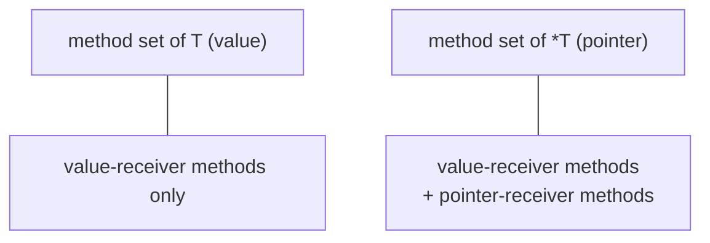

# Methods & method sets

## Why Does This Matter?

Methods are where a type's behavior lives, and method sets are the rule
that decides what satisfies which interface: the single most common
compile-error puzzle in Go ("my type has the method, why doesn't it
satisfy the interface?"). The mechanics are in
[02-go-language/05-pointers-and-receivers](../02-go-language/05-pointers-and-receivers.md);
this chapter turns them into engineering rules: how to pick receivers
per type, how promotion through embedding composes behavior, and the
method-value/method-expression distinction that explains a family of
subtle bugs.

## Mental Model

A method is a function with a receiver: a hidden first parameter. These
two are nearly the same thing:

```go
func (s Server) Addr() string      { return s.addr }   // method
func ServerAddr(s Server) string   { return s.addr }   // equivalent function
```

The method set of a type is the set of methods visible through that
type:



- `T`'s method set: methods with **value receivers**.
- `*T`'s method set: methods with **value or pointer receivers**.

Interface satisfaction checks the method set of the type you store.
That single sentence explains every "why doesn't it compile" case:

```go
type Counter struct{ n int }
func (c *Counter) Inc()         { c.n++ }    // pointer receiver: *T only
func (c Counter) Value() int    { return c.n }

var i interface{ Inc() } = Counter{}  // COMPILE ERROR: Inc is in *T's set
var j interface{ Inc() } = &Counter{} // OK: *T has Inc

c := Counter{}
c.Inc()               // OK: c is addressable; sugar for (&c).Inc()
m := map[string]Counter{}
m["k"].Inc()          // COMPILE ERROR: map values are not addressable
```

The map case is the practical one: **interface satisfaction and method
calls both need an addressable receiver for pointer methods**, and map
elements, string-indexed expressions, and function returns are not
addressable.

## The receiver decision, restated as a rule

From [02/05](../02-go-language/05-pointers-and-receivers.md), the
decision table condensed to one rule: **choose the receiver form per
type, not per method.** If any method must mutate, hold a lock, or the
struct is large: all methods take `*T`. If the type is a small value
type (`Money`, `Point`, `time.Duration`-style): all methods take `T`.

Why consistency wins:

- Mixed receivers split the method set in half, and callers guessing
  which form an interface needs become compiler-error archaeology.
- Copying a struct with a mutex by value is a deadlock bug
  (`go vet` catches "passes lock by value"); pointer receivers make it
  structurally impossible.
- Value receivers on a mutating type silently no-op: the method
  mutates a copy. The bug compiles, tests with a fresh value pass,
  and the mutation vanishes in production flows.

## Promotion: embedding as method composition

An embedded field's methods join the outer type's method set:

```go
type Logger struct{ *slog.Logger }     // embed the pointer
type Auditing struct {
    Logger                             // promoted: Auditing has Info/Error/...
    audit *AuditLog
}

a := Auditing{Logger: Logger{Logger: slog.Default()}}
a.Info("starting")                     // promoted call
a.Logger.Info("explicit, same")        // identical target
```

Promotion composes behavior without inheritance's coupling:

- The outer type *has* the inner type's methods; it does not *override*
  them (shadowing by name is compile-time selection, not virtual
  dispatch). Both remain callable.
- Method sets compose transitively: if `A` embeds `B` and `B` embeds
  `C`, `A`'s method set includes both. An interface satisfied by `C`
  is satisfied by `A` too.
- Embedded interfaces work the same way: `struct { io.Reader;
  io.Writer }` satisfies `io.ReadWriter` and delegates by default,
  which is the decorator pattern from
  [02/06](../02-go-language/06-interfaces-and-embedding.md).

The embedding decision rule: **embed when the outer type "is a"
thing-that-has-those-methods and delegation is the default you want**;
use a named field when callers should route explicitly.

## Method values vs method expressions

A subtle but real pair:

```go
// Method VALUE: binds to a receiver; a closure.
inc := c.Inc        // func(); receiver is &c, called later
inc()               // mutates c

// Method EXPRESSION: the receiver becomes the first argument.
inc2 := (*Counter).Inc   // func(*Counter)
inc2(&c)                 // same mutation, receiver explicit
```

The method value captures the receiver **at binding time**. Two traps
follow:

1. **Loop-variable receivers pre-Go 1.22**: `handlers = append(handlers,
   s.Serve)` captured one shared `s` for all iterations. Go 1.22 made
   loop variables per-iteration; older toolchains need an explicit
   copy.
2. **Bind to the value, not the pointer**: `v := c.Value` binds a
   snapshot of `c`; later `c.n = 99` does not affect `v()`. Pointer
   method values bind the address and see mutations. Decide which you
   mean.

## Common Mistakes

- **Mixed receiver forms on one type**: half the method set on `T`,
  half on `*T`; interface satisfaction becomes shape-dependent. Pick
  per type.
- **Value receiver on a mutating method**: compiles, no-ops in
  production. The classic: a `Save()` with a value receiver on a
  struct containing a DB handle.
- **Pointer methods on non-addressable values**: map elements and
  function results; extract to a variable first, or use value
  receivers.
- **Embedding for "inheritance" then expecting polymorphism**: there
  is no dynamic dispatch to the "most derived" method; a promoted
  method calls the *inner* type's implementation, always.
- **Embedding a mutex** when callers should not be able to lock the
  whole type from outside: embed unexported (`mu sync.Mutex`) so the
  lock is an implementation detail.
- **Method values in long-lived callbacks** capturing large structs:
  the whole receiver escapes to the heap and lives as long as the
  callback ([02/07](../02-go-language/07-closures-functions.md)).

## Idiomatic Go

```go
// Constructors return the type callers should hold; methods follow
// the one-receiver-form rule.
func NewServer(addr string, log *slog.Logger) *Server {
    return &Server{addr: addr, log: log}
}
func (s *Server) Start(ctx context.Context) error { /* ... */ }
func (s *Server) Addr() string                    { return s.addr }

// Small value types: value receivers throughout, safe to copy.
func (m Money) Add(o Money) (Money, error) { /* ... */ }
```

The stdlib calibration points: `time.Time` is all value receivers
(copyable, comparable, immutable by convention); `*bytes.Buffer` is
all pointer receivers (mutable, contains slice state). Both are
consistent within the type: that is the lesson.

## Performance Considerations

- Value-receiver methods copy the receiver on every call: fine for
  small types, real cost for big structs in hot paths.
- Pointer-receiver methods may force the value to the heap if it
  escapes (stored in an interface, captured by a method value); the
  escape analysis output (`-gcflags=-m`) shows it.
- Method values allocate a closure; in tight loops bind once outside
  the loop, or use a method expression with an explicit receiver.

## Concurrency Considerations

- A pointer receiver implies shared state implies synchronization
  questions: any method on `*T` that touches mutable fields needs the
  locking story ([08-concurrency/04](../08-concurrency/04-sync-primitives.md)).
- Value receivers are concurrency-friendly only if the fields they
  touch are copy-safe: slices and maps in a struct still alias
  ([02/01](../02-go-language/01-arrays-and-slices.md)).
- The `go vet` copylocks check is non-negotiable in CI; a copied mutex
  is a correctness bug that survives tests.

## Security Considerations

- Methods are API surface: exported methods on exported types are the
  attack surface of your library. Keep invariants enforced through
  methods, unexported fields that hold raw state
  ([21-security](../21-security/README.md)).
- Method values passed as callbacks into framework code execute with
  your receiver's privileges: validate inputs at the boundary, not in
  the receiver's trust zone.

## Testing Strategy

Receiver-form bugs are testable: for each method, test that mutation
methods actually mutate the original (pointer) or that pure methods
leave the original untouched (value). Interface-satisfaction
regression checks (`var _ json.Marshaler = T{}`) in test files catch
method-set drift the day it happens. The
[examples/di](examples/di/) package demonstrates satisfaction checks
and inline doubles.

## Interview Questions

1. *What is in T's method set vs *T's, and why does it exist?*: T:
   value-receiver methods; *T: both. The rule exists so interface
   values never hide a copy mutation.
2. *Why does `m["k"].Inc()` fail for pointer methods?*: Map elements
   are not addressable; Go cannot auto-take the address.
3. *When do you embed vs use a named field?*: Embed when delegation is
   the default and the outer type is-a user of those methods; name it
   when callers should route explicitly.
4. *Method value vs method expression?*: Value binds a receiver
   (closure, captured at binding time); expression takes the receiver
   as first argument.
5. *Why is mixing receiver forms on one type a bug factory?*: The
   method set splits; interface satisfaction becomes form-dependent
   and callers cannot predict which type satisfies what.

## Practice Exercises

1. Take a struct with mixed receivers; unify them per the decision
   rule, and list which interface satisfactions changed.
2. Write a method value into a loop on a pre-1.22 codepath (use
   GOTOOLCHAIN to run an old version if available); observe the
   capture bug, then fix it two ways.
3. Build a decorator by embedding an interface (CountingWriter); test
   that promoted and overridden methods route where you expect.

## Further Reading

- [Spec: method sets](https://go.dev/ref/spec#Method_sets)
- [Go FAQ: methods on values or pointers](https://go.dev/doc/faq#methods_on_values_or_pointers)
- [Effective Go: methods](https://go.dev/doc/effective_go#methods)
