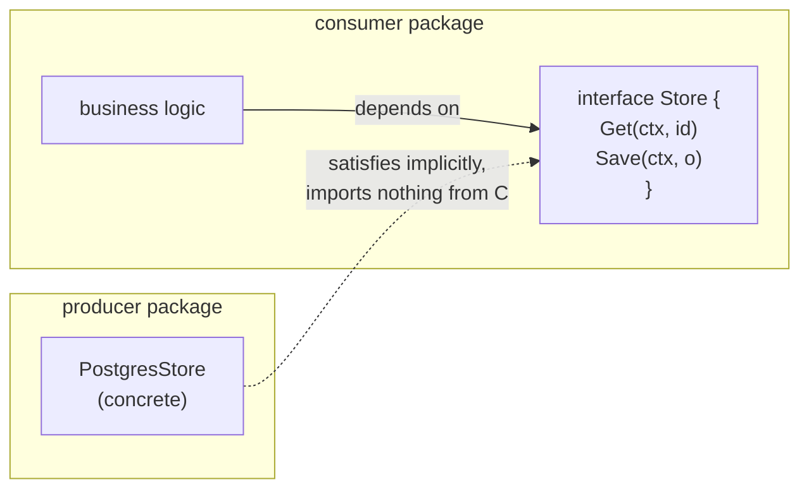

# Interfaces: the philosophy

## Why Does This Matter?

Go's interface design is its most opinionated choice: implicit
satisfaction, tiny interfaces, consumer-side definition. Engineers
arriving from Java or C# bring interface habits that actively fight
the language (interface-per-class, hierarchical taxonomies,
producer-side declaration). This chapter is the mental reset: what the
philosophy buys, what it costs, and the decision rules that keep
interfaces from metastasizing into the indirection soup Go was
designed to prevent.

The mechanics (two-word values, nil traps, embedding) live in
[02-go-language/06-interfaces-and-embedding](../02-go-language/06-interfaces-and-embedding.md);
method sets in [02 of this section](02-methods-and-method-sets.md).
This chapter is about *where interfaces go and why*.

## Mental Model



The dependency arrow is the point: **the interface lives with its
consumer, the implementation never imports it.** Three consequences:

1. **Producers stay ignorant**: a type can satisfy an interface written
   after it, in a package it has never heard of. The stdlib's
   `io.Reader` works across the ecosystem because no one had to
   register with it.
2. **Interfaces stay small**: since each consumer defines only what it
   uses, no consumer is forced to depend on methods it never calls
   (the interface-segregation principle, arrived at by construction).
3. **Refactoring direction reverses**: you write concrete code first,
   then extract the interface at the point a seam is needed. The
   "design with UML, then implement" flow is inverted.

## The standard-library calibration

Every load-bearing interface in the stdlib has one or two methods:

| Interface | Methods | What it decouples |
|---|---|---|
| `io.Reader` | 1 | anything readable from anything |
| `io.Writer` | 1 | anything writable to anything |
| `fmt.Stringer` | 1 | how values render |
| `sort.Interface` | 3 | sorting from containers |
| `http.Handler` | 1 | HTTP frameworks from business logic |
| `error` | 1 | every failure in the ecosystem |

The pattern is not an accident of minimalism: each interface marks one
*capability*, so capabilities compose (`io.ReadWriter` = reader +
writer) and implementations combine across packages that share
nothing. Interfaces with five-plus methods bundle capabilities into
monoliths that only one implementation satisfies: an interface in
name only.

## The decision rules

**Define at the consumer.** The package that *uses* the behavior owns
the abstraction. Symptom of violation: an interface in a "types" or
"interfaces" package with implementations importing it.

**One to three methods.** If a consumer needs eight methods from a
dependency, that is a design smell: either the consumer does too much,
or the dependency should be split.

**Extract on second use, not on speculation.** The sequence in real
codebases: concrete type → concrete type is annoying to test or
duplicate appears → extract the interface where the *consumer* sits →
the producer changes nothing (implicit satisfaction means the existing
type already implements it).

**Accept interfaces, return concrete types.** Accepting keeps callers
flexible; returning concrete keeps callers powerful (they see every
method, not just the interface's). Returning interfaces from
constructors is the Java-flavored mistake: it hides behavior, invites
typed-nil traps, and adds a type nobody needed.

**No interface with exactly one production implementation "for
flexibility".** The flexibility is imaginary: changing the
implementation still means changing code; the interface just made the
code worse. (A single implementation plus a test double is two: that
is real.)

## Composition over configuration

Small interfaces compose; big ones configure:

```go
// Small pieces, composed at the consumer:
type Reader interface { Read(p []byte) (int, error) }
type Writer interface { Write(p []byte) (int, error) }
type Closer interface { Close() error }

// The consumer needs exactly what it needs, no more:
type ReadWriteCloser interface {
    Reader
    Writer
    Closer
}
```

This is how `io` stays coherent across two decades of code: `gzip`
writes to anything `Writer`, `bufio` wraps anything `Reader`, `http`
bodies are `ReadCloser`. The alternative (a `Stream` interface with
ten methods and flags for which are supported) is the framework trap
this section's design clinic (Chapter 4) dissects.

## When generics replace interfaces

Since Go 1.18, some former interface jobs belong to type parameters:

| Need | Reach for | Why |
|---|---|---|
| Behavior varies (Read, Draw, Handle) | interface | dynamic dispatch over implementations |
| Shape varies, behavior same (containers, algorithms) | generics | no boxing, compile-time type checking |
| Values compared/ordered (`cmp.Ordered`) | generics | interfaces cannot express operators |
| Heterogeneous collections | interface (`any`) | genuine dynamic typing, usually at boundaries |

The full comparison with examples is
[07-generics](../07-generics/README.md). The one-line heuristic:
**interfaces for what a value *does*, generics for what a value
*is***. The pre-generics habit of `sort.Interface`-style shims for
every element type is now a code smell, not idiom.

## Common Mistakes

- **Producer-side interfaces** mirroring each concrete type: the Java
  reflex; couples packages and multiplies types with no decoupling
  gained.
- **IT-style naming** (`IStore`, `StoreImpl`): Go convention is
  `Store` for the interface, whatever you like for implementations
  (`PostgresStore`, `MemStore`); the `I` prefix is noise.
- **Interfaces defined "for later"** with one implementation and no
  double: speculative abstraction; delete it until the seam is real.
- **Giant interfaces** so tests need ten-method mocks: the mock is
  telling you the seam is wrong; split by capability until doubles are
  trivial (see [10-testing/02](../10-testing/02-doubles-and-httptest.md)).
- **Type switches on interfaces in business logic**: re-inventing
  dynamic dispatch by hand; either the interface needs a method, or
  the boundary needs generics, or the switch belongs at ingress.
- **Exporting interfaces a library's users must implement** when a
  function type would do: one-method contracts read better as
  `func` ([01 of this section](01-functions-as-contracts.md)).

## Idiomatic Go

```go
// The consumer, in package orders:
type Store interface {
    Get(ctx context.Context, id string) (*Order, error)
    Save(ctx context.Context, o *Order) error
}

// The producer, in package postgres: imports nothing from orders.
func (s *DB) Get(ctx context.Context, id string) (*Order, error) { /* ... */ }
func (s *DB) Save(ctx context.Context, o *Order) error           { /* ... */ }

// Wiring, in main:
svc := orders.New(postgres.New(pool))
```

The worked example with tests is [examples/di](examples/di/); the
three-tier design clinic applying these rules is
[04-design-clinic](04-design-clinic.md).

## Performance Considerations

- Interface calls are an indirection and may box values: negligible at
  API boundaries, visible in tight inner loops. Generics or concrete
  types recover it; measure first
  ([19-performance/01](../19-performance/01-measure-first.md)).
- Huge structs passed as interface values escape to the heap; pass
  pointers consciously and know what that means for aliasing
  ([02/05](../02-go-language/05-pointers-and-receivers.md)).

## Concurrency Considerations

Interfaces say nothing about thread-safety; that is the concrete
type's contract. When a capability interface (`io.Reader`) is shared
across goroutines, check the implementation's documentation: bytes
buffers are not safe, files are not safe, wrapped channels are. The
ownership discipline is [08-concurrency/01](../08-concurrency/01-goroutines-and-channels.md).

## Security Considerations

- Security-relevant seams (authenticators, authorizers) benefit
  doubly from tiny consumer-side interfaces: the audit surface is
  exactly the capability set, nothing more.
- Type assertions on values from outside (JSON, protobuf Any) are
  trust boundaries: validate the concrete type before use
  ([21-security](../21-security/README.md)).

## Testing Strategy

The philosophy pays its rent in tests: a two-method consumer-side
interface is faked in three lines inline, no framework. If doubles in
a package require a mock generator, the interfaces are too big or in
the wrong place. Compile-time satisfaction checks
(`var _ Store = (*FakeStore)(nil)`) keep fakes honest; the pattern is
[10-testing/02](../10-testing/02-doubles-and-httptest.md).

## Interview Questions

1. *Why are interfaces satisfied implicitly, and what does it change?*:
   Producers never import consumers; types satisfy interfaces written
   after them; the ecosystem composes without central registration.
2. *Where should an interface live, and why?*: With the consumer: the
   interface expresses what the consumer needs, keeping producers
   ignorant and interfaces minimal.
3. *When is a big interface justified?*: Almost never; usually the
   consumer is doing too much or the capability should split. The
   exceptions are genuine capability bundles the ecosystem shares.
4. *Interfaces or generics: how do you decide today?*: Behavior that
   varies: interface. Shape that varies with shared behavior: generics.
   Say the boxing/dispatch tradeoff out loud.
5. *A teammate proposes an interface for every struct "for
   testability": your response?*: Testability comes from seams at
   dependencies, not from mirroring concrete types; propose
   consumer-side extraction where doubles are actually needed.

## Practice Exercises

1. Take a package with producer-side interfaces; move them to
   consumers and delete methods no consumer calls; count the type
   reduction.
2. Split a five-method interface into capability interfaces at two
   different consumers; verify both compile against the same concrete
   type.
3. Rewrite a `sort.Interface` implementation using `slices.SortFunc`
   with generics; compare line counts and allocation counts.

## Further Reading

- [Go Proverbs: The bigger the interface, the weaker the abstraction](https://go-proverbs.github.io/)
  (Rob Pike)
- [CodeReviewComments: interfaces](https://go.dev/wiki/CodeReviewComments#interfaces)
- [Accept interfaces, return structs](https://medium.com/@cep21/accept-interfaces-return-struct-in-go-d4cab29fd50a)
  (community axiom, with nuance)
