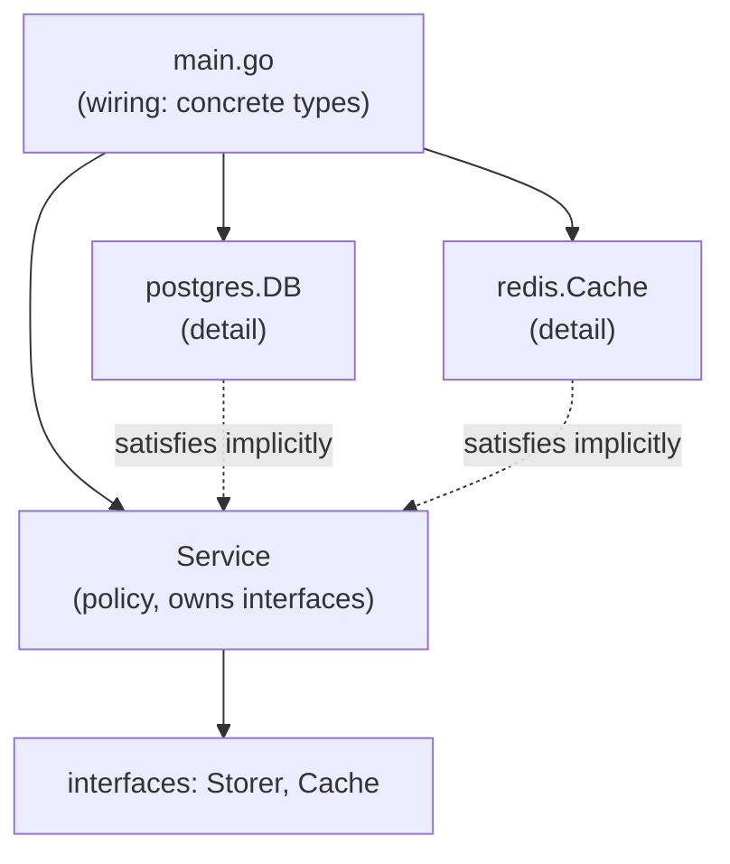

# Dependency inversion in Go

## Why Does This Matter?

Dependency inversion is the pattern that makes Go services testable
and swappable, and Go reaches it without the frameworks other
ecosystems consider mandatory: no DI container, no reflection-driven
wiring, no annotations. The Go answer is structural: small
consumer-side interfaces (Chapter 3), explicit construction, and two
lightweight techniques: injection through constructors and functional
options. This chapter shows both, and where each stops scaling.

## Mental Model

Inversion has two halves, and Go does both structurally:

1. **High-level policy does not depend on low-level detail**: the
   service defines the `Storer` it needs; Postgres satisfies it
   without the service importing the driver package.
2. **Abstractions do not depend on details**: the interface is owned
   by the consumer, so it changes when *policy* changes, never because
   a storage vendor did.



The diamond of dependencies terminates in **one place: `main`**. Every
package above `main` takes what it needs as parameters; `main` knows
every concrete type. That is the entire container. The payoff is not
aesthetic: `go build ./...` compiles the architecture, and the wiring
is readable in one file instead of discoverable through annotations.

## Constructor injection: the default

```go
// package orders: policy. Knows nothing about postgres.
type Storer interface {
    Save(ctx context.Context, o *Order) error
}

type Service struct {
    store Storer
    log   *slog.Logger
}

func NewService(store Storer, log *slog.Logger) *Service {
    return &Service{store: store, log: log}
}

// package postgres: detail. Satisfies orders.Storer implicitly.
func (db *DB) Save(ctx context.Context, o *Order) error { /* ... */ }

// main: the only place concrete types meet.
func run(ctx context.Context) error {
    db := postgres.New(os.Getenv("DATABASE_URL"))
    svc := orders.NewService(db, slog.Default())
    _ = svc
    return nil
}
```

Rules that keep injection sane as services grow:

- **Dependencies are fields; parameters are per-call state.** A
  request ID is not a field; a database handle is. Confusing the two
  produces both races (shared request state) and spaghetti (per-call
  DB handles).
- **Constructors take the minimum viable set.** Everything else is an
  option (below) or a sensible default inside the constructor.
- **No package-level singletons for dependencies.** They hide the
  edge of the diamond, reintroduce globals, and make tests serialize.
  (`slog.Default()` is the sanctioned exception-shaped tool; even it
  should be injected in anything non-trivial.)

## Functional options: when construction grows

Positional constructors decay:

```go
// The decay: unreadable, order-bound, zero-value ambiguity.
NewClient(addr, 30*time.Second, true, false, nil, nil)
```

Functional options scale without that decay:

```go
type Option func(*Client)

func WithTimeout(d time.Duration) Option {
    return func(c *Client) { c.timeout = d }
}
func WithLogger(l *slog.Logger) Option {
    return func(c *Client) { c.log = l }
}

func NewClient(addr string, opts ...Option) *Client {
    c := &Client{
        addr:    addr,
        timeout: 10 * time.Second,        // documented defaults
        log:     slog.Default(),
    }
    for _, o := range opts {
        o(c)
    }
    return c
}

// Call sites read as intent:
cl := NewClient("api.example.com:443",
    WithTimeout(2*time.Second),
    WithLogger(logger),
)
```

The properties that made this the ecosystem standard (grpc-go, every
major library):

- **Defaults live in the constructor**, visible and documented;
  zero-value ambiguity dies.
- **Options are backward compatible**: adding one is a non-breaking
  change; positional parameters are not.
- **Options are values**: libraries can export option *sets*
  (`DefaultDialOptions()`, `WithInsecure()`), compose them, and test
  them.
- **Validation can happen in the constructor** after applying options,
  so an invalid combination fails fast at construction, not at first
  use.

The cost: options are verbose to define (one function per option) and
hide validation order if misused. The rule: **two to three required
parameters stay positional; the tail of optional knobs becomes
options.** A constructor with eight options and zero required
parameters is a configuration object looking for a struct:

```go
// Beyond ~5 options or repeated across constructors: group them.
type Config struct {
    Timeout time.Duration
    Retries int
    TLS     *tls.Config
}
func NewClient(addr string, cfg Config) *Client
```

## Wiring packages: the scale path

Real services with dozens of dependencies keep `main` readable with
one more structural step: an internal `wire.go`-style package (hand
written, or google/wire if code generation is acceptable) whose only
job is building the object graph:

```go
// package wire: imports everything concrete; nothing imports wire.
func Build(ctx context.Context, cfg Config) (*app.Server, func(), error) {
    pool, err := pgxpool.New(ctx, cfg.DatabaseURL)
    if err != nil { return nil, nil, err }
    db := postgres.New(pool)
    cache := redis.New(cfg.RedisAddr)
    notifier := mailgun.New(cfg.MailgunKey)
    svc := orders.NewService(orders.WithStore(db), orders.WithCache(cache))
    notify := notifications.NewService(notifier)
    srv := app.New(svc, notify)
    return srv, func() { pool.Close(); cache.Close() }, nil
}
```

Note what is absent: reflection, runtime resolution, string-keyed
lookups. The graph is type-checked at compile time; failures are
constructor errors, not panics at three in the morning. google/wire
generates exactly this shape; hand-rolling it is 30 lines and has no
build step, which is why most Go teams hand-roll it.

## The anti-patterns, named

- **Service locator** (`deps.Get("store")`): string-keyed runtime
  resolution; the type checker is defeated, failures move to runtime.
- **Global containers** (`wire.Build` as an init-time side effect, or
  a package-level `Deps` struct everyone imports): invisible edges,
  test pollution, init-order surprises.
- **Interfaces for the container's sake**: DI frameworks need
  interfaces to inject; Go does not, so do not add interfaces the
  container logic would have wanted. The interface criteria stay:
  consumer-side, small, two users.
- **Field injection** via reflection (`inject:"..."` tags): defeats
  every guarantee Go just gave you.

## Common Mistakes

- **Options applied after validation**, or defaults that silently
  override explicit zeros: apply options, then validate; document
  zero-value semantics per field.
- **Options that capture and mutate shared state**: an `Option` is a
  closure over the client under construction; keep it pure.
- **Interfaces introduced because "main needs to swap it"** when main
  already can: main holds concrete types; swapping is a one-line
  change there.
- **Request-scoped state as injected fields**: a per-request logger
  with trace ID belongs in `ctx` (via `slog.Logger.With`) or
  parameters, not in the service struct
  ([20-observability](../20-observability/README.md)).
- **The god constructor**: `NewApp(cfg)` returning a graph of forty
  objects. Split by capability; the wiring package composes the
  pieces.

## Idiomatic Go

The stdlib's calibration points:

- `http.Server{Addr: "...", Handler: mux}`: struct-literal options for
  a config-shaped surface.
- `grpc.NewClient(addr, grpc.WithTransportCredentials(...))`:
  functional options for a large optional surface.
- `time.NewTimer(d)`: positional, small, no ceremony.

Same ecosystem, three construction shapes, each fitting its surface
size. Choose by the same fit, not by fashion.

## Performance Considerations

- Injection adds one indirection (interface call) per dependency use:
  noise next to the I/O dependencies wrap.
- Options run once at construction: zero hot-path cost.
- The real perf trap is the opposite of over-injection: **hidden
  global initialization** that constructs connections at package init
  time, serializing startup and hiding latency. Build in `main`, see
  the cost ([22-production-go](../22-production-go/README.md)).

## Concurrency Considerations

- A fully constructed object should be immutable-by-convention: fields
  set once in the constructor, no setters. Mutation after handoff is
  a race invitation ([08-concurrency/04](../08-concurrency/04-sync-primitives.md)).
- `Option` closures run during construction, single-threaded by
  convention: keep them pure so that convention holds even if someone
  parallelizes wiring.
- Dependencies used by concurrent request handlers must be safe for
  concurrent use or document it; injection makes the dependency edge
  visible, which is where that review happens.

## Security Considerations

- Secrets flow through constructors as narrow types or provider
  interfaces, never package globals: the injection edge is where
  secret provenance is auditable ([21-security](../21-security/README.md)).
- Options that accept arbitrary `func()` hooks (transport dialers,
  credential loaders) are code-execution edges: validate or type-
  narrow them.

## Testing Strategy

The tests write themselves, which is the point: construct the service
with fakes ([examples/di](examples/di/) shows the full suite), or for
integration, with real infra gated behind build tags
([10-testing/03](../10-testing/03-integration-and-e2e.md)). If a test
needs `t.Setenv` to reach a dependency, the dependency is hiding from
its constructor.

## Interview Questions

1. *How does Go do dependency injection without a framework?*:
   Constructor injection plus consumer-side interfaces; wiring lives
   in main or a wiring package; the type checker verifies the graph.
2. *When do functional options beat a config struct?*: Small optional
   tail on an otherwise positional constructor, backward-compatible
   growth across versions; a config struct once options multiply or
   are shared across constructors.
3. *What is wrong with a service locator?*: String-keyed runtime
   resolution defeats the type checker and moves failures to runtime;
   dependencies become invisible.
4. *Why keep request-scoped values out of injected fields?*: Fields
   are shared across concurrent requests: races and bleed-through;
   request state lives in ctx or parameters.
5. *Design review: a constructor takes nine booleans and a logger.
   Your refactor?*: Required parameters positional, optional knobs as
   options; beyond ~5 options or shared across constructors, a Config
   struct; validate after applying.

## Practice Exercises

1. Convert a positional constructor with four optional parameters to
   functional options; keep the old signature as a thin wrapper and
   verify zero call-site changes break.
2. Build the wiring package for a two-service app (API + worker)
   sharing one pool; make the returned cleanup function close
   everything exactly once, and test it.
3. Deliberately implement a service-locator version of the clinic's
   UserService; write its tests; write one paragraph on what broke.

## Further Reading

- [Functional options for friendly APIs](https://dave.cheney.net/2014/10/17/functional-options-for-friendly-apis)
  (Dave Cheney)
- [google/wire](https://github.com/google/wire) (code-generated wiring;
  read the rationale even if you hand-roll)
- [Self-referential designs: the Service Locator pattern](https://martinfowler.com/articles/injection.html)
  (Fowler's original framing; the "why not" applies directly)
