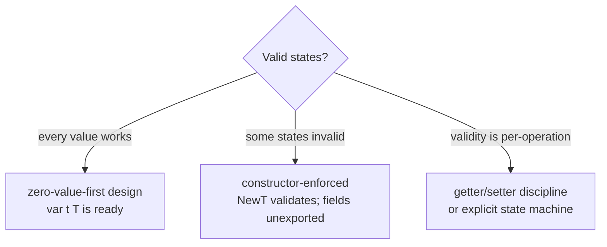

# Constructors & invariants

## Why Does This Matter?

Go has no constructors and no finalizers that help you: what it has is
a convention (`NewX`) and a design decision (the zero value). Between
them lives the most important correctness idea in this section: **a
type is safe to use when invalid states cannot be constructed**, and
the moment that enforcement happens is a design choice you make
consciously. The zero-value philosophy started in
[01-go-fundamentals/05-zero-values](../01-go-fundamentals/05-zero-values.md);
struct mechanics are in
[02-go-language/04-structs](../02-go-language/04-structs.md). This
chapter is the constructor decision framework.

## Mental Model

Every type answers one question: **which states are valid, and who
enforces them?**



Three enforcement strategies, in order of preference:

1. **Zero value is valid**: design the type so `var t T` works. No
   constructor needed; the compiler enforces everything.
2. **Constructor enforces**: `NewX` validates and either returns a
   valid `X` or an error. Fields unexported so the guarantee holds.
3. **Methods maintain**: for types where state changes over time
   (connection pools), exported methods are the only mutation path,
   and each preserves the invariant.

Anything else (exported fields plus "please validate first", setters
that half-work) is where bugs are born.

## Zero-value-first: the stdlib's signature moves

```go
var b bytes.Buffer          // ready: no NewBuffer
var m sync.Mutex            // ready: no NewMutex
var wg sync.WaitGroup       // ready
ctx, cancel := context.WithCancel(parent)   // constructor: cancel is the point
```

`bytes.Buffer` is the masterpiece: a nil map, nil slice, and zero
count compose into a fully working buffer. When your type composes
stdlib types whose zero values work, yours often does too:

```go
type Deduplicator struct {
    seen map[string]struct{}   // nil map reads fine
    mu   sync.Mutex
}
func (d *Deduplicator) Seen(k string) bool {
    d.mu.Lock(); defer d.mu.Unlock()
    if _, ok := d.seen[k]; ok { return true }
    if d.seen == nil { d.seen = make(map[string]struct{}) }  // lazy init
    d.seen[k] = struct{}{}
    return false
}
```

Note the honest cost: lazy initialization puts an `if nil` in every
method and a mutable invariant in every maintainer's head. **Lazy init
is a tax; pay it only when the zero value's ergonomics are worth it**
(in `Deduplicator`'s case: being usable as a struct field without a
constructor call is the whole point).

## Constructor-enforced: NewX as a gate

```go
type Account struct {
    id      string
    balance int64          // cents; negative is a domain error
    opened  time.Time
}

var ErrInvalidEmail = errors.New("invalid email")

func NewAccount(id string, balanceCents int64) (*Account, error) {
    if id == "" {
        return nil, errors.New("account: empty id")
    }
    if balanceCents < 0 {
        return nil, fmt.Errorf("account %s: negative opening balance %d", id, balanceCents)
    }
    return &Account{id: id, balance: balanceCents, opened: time.Now()}, nil
}

func (a *Account) Withdraw(cents int64) error {
    if cents <= 0 { return errors.New("withdraw: amount must be positive") }
    if a.balance < cents { return ErrInsufficientFunds }
    a.balance -= cents
    return nil
}
```

The rules that make the gate hold:

- **Fields unexported**: exported fields are an open door; the
  invariant is a comment, not a guarantee. (Package-internal code can
  still bypass; that is the accepted scope of trust.)
- **The constructor never returns a zero value with an error** (the
  typed-nil trap: `return nil, err` for `*T`, and the error path never
  returns a non-nil typed nil: see
  [02/06](../02-go-language/06-interfaces-and-embedding.md)).
- **Every mutation path preserves the invariant**: `Withdraw` checks;
  nothing else touches `balance`. One writer-shape per invariant.
- **Constructors validate in domain terms**: "balance is cents and
  non-negative" is a domain rule; "email matches RFC 5322" is
  validation of *input*, and both belong before the struct exists.

## Parsing constructors: the must/parse/New trio

For types constructed from untrusted input, the stdlib pattern is
three functions with distinct contracts:

```go
// Parse: input may be bad; error is a normal outcome.
func ParseDuration(s string) (Duration, error)

// New: parameters are from trusted code; panic on programmer error is
// acceptable (reserved for invariants, never for user input).
func NewOrder(...) *Order

// Must: compile-time-ish constants; panics. Use only in var/const scope.
var re = regexp.MustCompile(`^[a-z]+$`)
```

The discipline: `Must*` functions are for values that would panic in
production code paths only if the programmer made a mistake (a bad
regex literal); using them on user input converts a 400 into a 500
with a stack trace.

## Copy constructors and defensive boundaries

Value receivers copy; that is free safety. Types that hold
reference-shaped state (slices, maps, pointers) leak aliasing through
every getter:

```go
// Leaky: caller mutates the cache's internal slice through the getter.
func (u *User) Tags() []string { return u.tags }

// Copied: the caller owns what it receives. Cost: an allocation.
func (u *User) Tags() []string {
    out := make([]string, len(u.tags))
    copy(out, u.tags)
    return out
}
```

Decide per type and **document the choice**: "returned slices are
copies" or "returned slices alias; do not mutate". The fintech ledger
in [25-fintech-with-go](../25-fintech-with-go/README.md) demonstrates
the defensive-copy discipline where money is involved; the cost
analysis is [19-performance/02](../19-performance/02-memory-and-allocations.md).

## Common Mistakes

- **Exported fields + a NewX that validates**: the validation is
  decorative; `Account{Balance: -1}` bypasses it. Unexported fields
  are what make the constructor a gate.
- **Setters that reintroduce invalid states**: `SetName("")` after a
  validated constructor undoes the gate. Either every mutator
  validates, or none exists.
- **Zero value that is a footgun**: a map field you must `make` but
  nothing tells you (the panic-on-write nil map from
  [02/02](../02-go-language/02-maps.md)); either lazy-init, document
  loudly, or provide the constructor.
- **`Must*` on input-shaped data**: converts user errors into panics;
  the Must family is for compile-time constants only.
- **Constructors with side effects** (opening connections in New):
  construction and acquisition have different lifetimes and error
  semantics; separate `NewX` (validate, wire) from `Connect` (I/O) so
  failures are attributable.
- **Returning unexported types** from constructors: the caller cannot
  declare a variable of it usefully; if the type is an implementation
  detail, return an interface it satisfies or export the type.

## Idiomatic Go

```go
// The stdlib calibration: construction shape matches the surface.
var b strings.Builder            // zero value ready
t := time.NewTimer(d)            // small, positional
h := http.Header{}               // zero value ready
cl := &http.Client{Timeout: d}   // struct literal for config types

// Domain type: constructor gate + method-maintained invariants.
u, err := user.New(email, now)   // errors are domain errors
```

The convention detail: `NewX` when the package name would stutter
(`user.NewUser` is `user.New`), `NewX` inside the type's package when
the package is generic (`token.New`). Either way, one constructor per
dominant construction path; multiple paths are a design smell.

## Performance Considerations

- Value copies on construction are cheap for small types; the
  zero-value-first design often avoids constructors entirely and the
  allocation with them.
- Lazy init trades an `if` per operation for zero constructor cost;
  measure in hot paths ([19-performance/01](../19-performance/01-measure-first.md)).
- Defensive copies allocate; do them at trust boundaries, not in
  getters called a million times (or return read-only views: an
  iterator or `iter.Seq`, Go 1.23+).

## Concurrency Considerations

- A constructor that hands out a pointer makes the object shared the
  moment it escapes: either construct fully before publishing
  (immutable-by-convention), or document the locking story on every
  method ([08-concurrency/04](../08-concurrency/04-sync-primitives.md)).
- Lazy initialization under concurrency needs `sync.Once` (Go 1.21+
  has `sync.OnceFunc`/`sync.OnceValue` for the one-shot shape):
  a naive `if nil { make }` is a data race.

## Security Considerations

- Constructors are the trust boundary for input: every field that
  crosses from user to domain validates there, once, in one place
  ([21-security](../21-security/README.md)).
- Types holding secrets should zero on `Close`/`Reset` and document
  that copies escape the guarantee; the constructor decides the
  shape of that lifetime.

## Testing Strategy

Invariant tests are cheap and decisive: attempt every invalid state
through every construction path (constructor, zero value, each
mutator) and assert it is rejected or impossible. Table-driven,
exhaustive for small input spaces; the pattern is
[10-testing/01](../10-testing/01-fundamentals.md). The
[examples/di](examples/di/) package includes the validation table for
its domain type.

## Interview Questions

1. *When is a constructor unnecessary in Go?*: When the zero value is
   valid by design; composition of zero-ready stdlib types usually
   gets you there.
2. *How do you make an invariant actually hold?*: Unexported fields +
   validating constructor + every mutation through invariant-
   preserving methods; exported fields make it a comment.
3. *Parse vs New vs Must: when does each apply?*: Parse: untrusted
   input, error is normal. New: trusted parameters. Must: compile-time
   constants, panic on programmer error only.
4. *Why is `Must` wrong for user input?*: Converts a handleable error
   into a panic: a 400 becomes a 500 with a stack trace.
5. *Design a Money type that cannot hold mismatched currencies after
   arithmetic: what enforces it?*: Constructor validates currency
   codes; arithmetic methods return errors on mismatch; zero value
   either valid (both fields zero) or guarded by a `Zero()` check:
   walk the choice.

## Practice Exercises

1. Take a struct with exported fields and an `Init` method; convert to
   a constructor gate; list every call site that compiled before but
   should not have.
2. Write the zero-value-ready `Counter` with lazy map init; then make
   it concurrent-safe with `sync.Once`; race-test both.
3. Design `Money` per the interview question; property-test that no
   sequence of operations produces a currency-mismatched value.

## Further Reading

- [Effective Go: allocation with new/make](https://go.dev/doc/effective_go#allocation_new)
- [The zero value of Go](https://www.ardanlabs.com/blog/2013/07/understanding-nil-interface-and-nil.html)
  (interface-nil nuance in the same spirit)
- [CodeReviewComments: Must functions](https://go.dev/wiki/CodeReviewComments#mustfunc)
