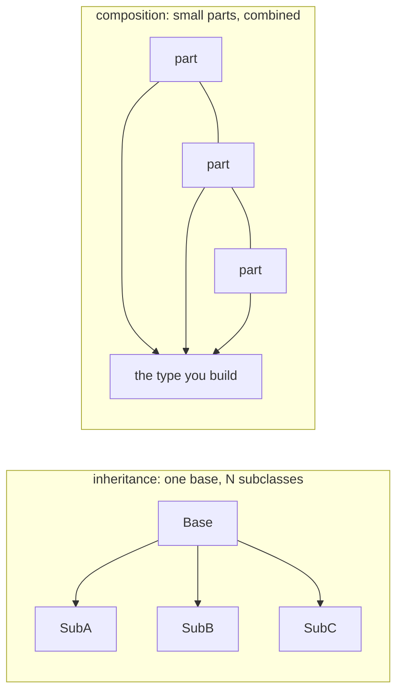

# Composition over inheritance

## Why Does This Matter?

Go made an unusual bet: it shipped without inheritance and without a
standard way to fake it. Fifteen years in, the bet looks good: the
codebases that thrived in Go are the ones that stopped modeling
taxonomies and started modeling capabilities. This closing chapter of
the section explains what inheritance was for, what Go offers
instead, and the four composition patterns that replace every
legitimate use case.

## Mental Model

Inheritance promised three things; Go delivers each a different way:

| Inheritance promised | Go's answer | Where |
|---|---|---|
| Code reuse | embedding + promotion, or plain functions | this chapter |
| Polymorphism | interfaces (implicit, structural) | [03](03-interfaces-philosophy.md) |
| Framework hooks | function-typed parameters, options | [05](05-dependency-inversion.md) |



The deep reason inheritance fails at scale is the **fragile base
class problem**: a subclass depends on its parent's *implementation*
(change the base, break the leaf), and the parent depends on its
children's *assumptions* (documented-but-unenforceable call orders
between overridable methods). Go's composition breaks both
dependencies: parts have no knowledge of what embeds them, and the
composite calls parts only through their public surface.

## Pattern 1: Embedding for delegation

The legitimate embedding use: the outer type *is a* user of the inner
type's capability and wants to expose it wholesale:

```go
type AuthedConn struct {
    net.Conn              // promoted: AuthedConn is a net.Conn
    user   *User
}
// Read/Write/Close all work through the embedded conn; add auth
// behavior alongside without re-declaring the interface.
```

The rules from
[02-methods-and-method-sets](02-methods-and-method-sets.md) apply:
promoted methods do not dispatch virtually, the inner value stays
reachable, and shadowing is compile-time selection. Embed when
delegation is the default; name the field when callers should choose.

## Pattern 2: Interface embedding for capability sets

```go
type ReadWriter interface {
    Reader
    Writer
}
```

How `io.ReadWriter`, `io.ReadWriteCloser`, and the whole stdlib
surface compose: capability bundles assembled from one-method parts.
The consumer-side philosophy
([03](03-interfaces-philosophy.md)) decides *which* bundle; this
pattern assembles it. Note what this replaces: the abstract-base-class
hierarchy that in other languages expresses "can read and write" as a
chain of subclassing.

## Pattern 3: Decorators (wrapping)

The most productive replacement for "override a method to add
behavior":

```go
// Log every Read without touching the original type.
type LoggingReader struct {
    r io.Reader
    log *slog.Logger
}

func (lr *LoggingReader) Read(p []byte) (int, error) {
    n, err := lr.r.Read(p)
    lr.log.Debug("read", "bytes", n, "err", err)
    return n, err
}

// Compose freely, runtime-configurable:
r := &LoggingReader{r: bufio.NewReader(f), log: log}
```

Decorators compose where inheritance forks: you can stack
`LoggingReader`, `RateLimitReader`, `MetricsReader` in any order at
runtime, because each depends only on the interface, not on a base
class. The stdlib does this constantly (`io.TeeReader`,
`io.LimitReader`, `bufio`), and the pattern is the middleware shape
from [12-http-networking](../12-http-networking/README.md).

## Pattern 4: Function composition over template methods

The template-method pattern (base class defines the skeleton, children
override steps) maps to *taking the varying step as a function
value*:

```go
// The inheritance version: base class with an overridable hook.
// The Go version: the hook is a parameter.

func ProcessBatch[T any](
    items []T,
    transform func(T) (T, error),      // the "overridable step"
) ([]T, error) {
    out := make([]T, 0, len(items))
    for _, it := range items {
        t, err := transform(it)
        if err != nil { return nil, err }
        out = append(out, t)
    }
    return out, nil
}
```

The hook is explicit in the signature, trivially testable, and
composes with other functions. When the hook needs state, it becomes a
small interface ([01](01-functions-as-contracts.md) has the choice
table); the shape stays the same.

## Why Go dropped inheritance: the honest ledger

What the designers said, and what the ecosystem found:

- **Inheritance couples compile-time structure to runtime behavior**
  (virtual dispatch chains that span packages and versions). Go's
  dispatch is either static (embedding) or explicitly dynamic
  (interfaces): both are visible in the source.
- **Deep hierarchies resist change**: the taxonomy is an early design
  bet that later requirements always break ("is a square a rectangle?"
  arrives for real).
- **Most "inheritance" was really capability sharing**, which
  interfaces plus small structs express with less machinery.
- The costs Go accepted: occasional delegation boilerplate, no
  protected visibility (unexported is package-wide, not class-wide),
  and the loss of framework-style "hooks" as a first-class concept.
  The ecosystem replaced hooks with function parameters and options,
  which proved more flexible anyway.

## Common Mistakes

- **Embedding to "get inheritance"**: embedding a base struct and
  re-declaring its methods to "override": no dispatch, surprising
  copies of state, and the embedded type's internal calls still hit
  its own methods.
- **Deep embedding chains** (A embeds B embeds C embeds D): the
  promoted-method surface becomes undebuggable; keep chains shallow
  (one level of capability delegation).
- **Embedding concrete types for behavior you must configure**: embed
  the *interface* (`io.Reader`) when you need to swap the
  implementation; embedding the concrete struct welds it.
- **Decorators that break contracts**: a wrapping `Closer` must close
  the wrapped value exactly once; double-close bugs come from
  decorators that half-own the wrapped resource.
- **Prefer-embedding reflex for state sharing**: two types that both
  need the same *state* want the same instance passed in, not two
  copies of it; share by pointer explicitly or restructure.

## Idiomatic Go

```go
// The stdlib's composition showcase: http middleware is decorators
// all the way down.
func WithTimeout(d time.Duration, next http.Handler) http.Handler {
    return http.HandlerFunc(func(w http.ResponseWriter, r *http.Request) {
        ctx, cancel := context.WithTimeout(r.Context(), d)
        defer cancel()
        next.ServeHTTP(w, r.WithContext(ctx))
    })
}

// Stack them; order is explicit and visible:
h := WithTimeout(5*time.Second, WithLogging(log, mux))
```

Full treatment of the HTTP shape is
[12-http-networking](../12-http-networking/README.md); the underlying
mechanics are this chapter's Pattern 3.

## Performance Considerations

- Embedding is zero-cost: promoted calls are direct calls, no
  indirection, fields inline in the outer struct (cache-friendly).
- Interface-based decorators add one dispatch per layer per call:
  invisible at I/O boundaries, measurable in hot loops. For per-byte
  processing, fuse layers or go concrete
  ([19-performance/03](../19-performance/03-concurrency-performance.md)).
- Function parameters (Pattern 4) may inline; the compiler often
  eliminates the indirection entirely when the function is obvious at
  the call site.

## Concurrency Considerations

- Embedding shares the inner type's concurrency story: an embedded
  mutex protects only what its methods protect; promoted calls do not
  magically lock the outer state.
- Decorators wrap resources: establish single ownership of the
  wrapped value (who closes it) or you get double-close and
  use-after-close ([08-concurrency/01](../08-concurrency/01-goroutines-and-channels.md)).

## Security Considerations

- Decorators are the right place for security policy (auth, rate
  limits) precisely because they wrap rather than inherit: the policy
  composes, is visible in the stack, and cannot be bypassed by
  subclassing ([21-security](../21-security/README.md)).
- Promoted methods leak the inner type's full surface onto the outer
  type: an embedded `*sql.DB` exposes `Exec` to anyone with the outer
  value. Embed narrowly (interfaces), not broadly (concrete).

## Testing Strategy

Composition tests focus on wiring: decorator stacks apply in the
declared order, promoted methods route to the embedded value, hooks
fire with the right arguments. The
[examples/di](examples/di/) package shows seam-level tests; the
decorator pattern pairs with the fake-based approach from
[10-testing/02](../10-testing/02-doubles-and-httptest.md).

## Interview Questions

1. *Why did Go omit inheritance?*: The fragile base-class problem and
   coupling of static structure to dynamic behavior; capability
   sharing (interfaces) plus composition covers the real use cases
   without the coupling.
2. *How do you implement "override" semantics in Go?*: You do not:
   extract the varying step as a function parameter, or wrap with a
   decorator; both are explicit and testable.
3. *Embed a concrete type or an interface: when?*: Concrete for
   delegation-by-default of a stable dependency; interface when the
   implementation must be swappable or testable.
4. *What does the fragile base class problem cost in practice?*: Base
   changes break subclasses invisibly; hook call-order contracts are
   unenforceable; hierarchies resist the second refactoring.
5. *Design an auth decorator for http.Handler that composes with
   rate-limiting: what do you guarantee about order?*: Auth outermost
   (reject before spending rate-limit budget) or the reverse, with
   the tradeoff stated; composition makes the order explicit, which
   is the point.

## Practice Exercises

1. Take a small class hierarchy you know (or invent Shape/Circle);
   rebuild it with interfaces plus composition; note where the
   "is-a" question disappeared.
2. Write three composable Reader decorators and test that all six
   orderings produce correct behavior for a known input.
3. Convert a template-method design (base class + two hooks) into
   function parameters; compare the test setup for both.

## Further Reading

- [Composition over inheritance](https://en.wikipedia.org/wiki/Composition_over_inheritance)
  (the principle, predating Go)
- [Effective Go: embedding](https://go.dev/doc/effective_go#embedding)
- [The Go package ecosystem's composition patterns](https://go.dev/blog/io)
  (io.Reader/Writer as the proof)
