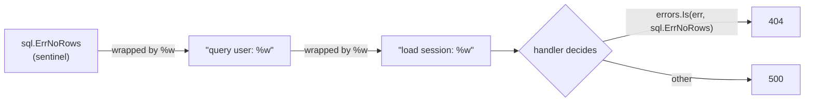

# Errors are values

## Why Does This Matter?

In Go, a failure is not an event that interrupts your program: it is a
value your function returns, right beside the result. This single choice
means every call site acknowledges failure, every signature documents it,
and no failure is invisible. It also means error handling is a *design*
activity: you shape what your errors look like, what they preserve, and
what callers can decide from them.

## Mental Model

The entire error system is one tiny interface:

```go
type error interface {
	Error() string
}
```

Everything else: `fmt.Errorf`, wrapping, `errors.Is`, `errors.As`: is
convention built on top. An error is:

1. **A value**: returned, passed, stored, compared.
2. **A message for humans**: `Error() string`.
3. **Optionally, a structured type**, so callers can inspect it without
   parsing text.

The chain: `fmt.Errorf("...: %w", err)` wraps errors into a linked list.
`errors.Is` walks the list comparing identity (`==` or an `Is` method);
`errors.As` walks it looking for a type to extract.



## How It Works

### Creating errors

```go
errors.New("quota exceeded")             // static message
fmt.Errorf("connect %s: %w", host, err)  // formatted + wrapped
fmt.Errorf("connect %s: %v", host, err)  // formatted, NOT wrapped (identity lost)
```

The `%w` verb is the whole difference: `%w` records the underlying error;
`%v` only records its text. Wrap when callers may need to *inspect* the
cause; use `%v` when the text is enough and you do not want to promise a
dependency relationship forever.

### Inspecting errors

```go
// identity: is this THE sentinel error (or a wrap of it)?
if errors.Is(err, ErrNotFound) { ... }

// type: is this error OF this type? give me one.
var domainErr *DomainError
if errors.As(err, &domainErr) {
	fmt.Println(domainErr.Code)
}
```

Common misuse: `err == ErrNotFound` only checks the surface; one wrap
away it fails. Use `errors.Is`. Similarly `err.(*DomainError)` panics on
mismatch and ignores wrapping; use `errors.As`.

## Basic Example

```go
// examples/errorslib/errors.go
package errorslib

import (
	"errors"
	"fmt"
)

// ErrNotFound is returned when a lookup finds nothing. Sentinel errors
// are part of your API contract: once published, they are forever.
var ErrNotFound = errors.New("not found")

// NotFound wraps ErrNotFound with lookup context.
func NotFound(what string) error {
	return fmt.Errorf("%s: %w", what, ErrNotFound)
}

// Load demonstrates the inspect-at-caller pattern.
func Load(id string) (string, error) {
	return "", NotFound("user " + id)
}

// IsNotFound inspects the wrapped chain.
func IsNotFound(err error) bool {
	return errors.Is(err, ErrNotFound)
}
```

Caller side:

```go
v, err := Load("42")
if err != nil {
	if errorslib.IsNotFound(err) {
		// render 404, maybe create
	} else {
		// render 500, log details
	}
}
```

## Real-World Example: typed errors with fields

```go
// examples/errorslib/domain.go
package errorslib

// DomainError carries structured fields callers can act on.
type DomainError struct {
	Op      string // failing operation, e.g. "withdraw"
	Reason  string // human-readable cause
	Code    Code   // machine-readable classification
	wrapped error  // optional cause, for Is/As chains
}

// Code classifies errors for callers that switch on behavior.
type Code int

const (
	CodeUnknown Code = iota
	CodeNotFound
	CodeInvalid
	CodeConflict
	CodeUnavailable // transient: safe to retry
)

func (e *DomainError) Error() string {
	if e.wrapped != nil {
		return fmt.Sprintf("%s: %s: %v", e.Op, e.Reason, e.wrapped)
	}
	return e.Op + ": " + e.Reason
}

// Unwrap makes the chain work with errors.Is/As.
func (e *DomainError) Unwrap() error { return e.wrapped }

// Wrap builds a DomainError over a cause.
func Wrap(op string, code Code, reason string, cause error) *DomainError {
	return &DomainError{Op: op, Reason: reason, Code: code, wrapped: cause}
}
```

Two methods make this type first-class: `Error()` (it is an error) and
`Unwrap()` (it joins chains). Everything `errors.Is/As` does relies on
those two.

## Production Example: retryability

```go
// examples/errorslib/retryable.go
package errorslib

import "net"

// Retryable classifies whether retrying may plausibly succeed.
// Wrong classification is expensive: retrying a 400 corrupts metrics
// and doubles load; not retrying a timeout turns blips into outages.
func Retryable(err error) bool {
	var de *DomainError
	if errors.As(err, &de) {
		return de.Code == CodeUnavailable
	}
	var nerr net.Error
	if errors.As(err, &nerr) {
		return nerr.Timeout() // network timeouts: retry with backoff
	}
	return false
}
```

## Common Mistakes

- **`err == sentinel` instead of `errors.Is`**: breaks through one wrap.
- **String matching** (`strings.Contains(err.Error(), "not found")`),
  brittle, untranslatable, untestable.
- **Wrapping with `%w` unconditionally**: every `%w` promises "you may
  inspect my cause." If the cause is a client secret-laden error, you
  just exposed it; if it is a driver-specific type, you froze a
  dependency into your API. Use `%v` when inspection is not part of the
  contract.
- **New error types without `Unwrap`**: invisible to Is/As.
- **`errors.New` in a loop with a formatted message**: you wanted
  `fmt.Errorf`.
- **Returning `nil` pointer of a custom error type**: the classic
  typed-nil trap: `return (*DomainError)(nil)` as `error` is non-nil.
  Return literal `nil`.

## Idiomatic Go

```go
// error handling reads like prose: check, add context, pass up
data, err := os.ReadFile(path)
if err != nil {
	return fmt.Errorf("read config %s: %w", path, err)
}
```

- Add context at each layer that knows something new ("read config",
  "load session"), never repeat what lower layers said.
- Return early; the error path is not a second codebase.
- Lowercase error strings, no trailing punctuation, so wrapped chains
  read as sentences.

## Performance Considerations

- Error construction allocates. In per-item loops where errors are
  *expected* (not exceptional), a bool or `ok` return avoids allocation,
  that is why `map` lookups return `(v, ok)`.
- `errors.Is/As` walk the chain at inspection time: cheap, but do not
  unwrap in a hot loop to then ignore the result.
- String formatting of an error happens in `Error()`: avoid eager
  formatting of huge payloads; keep fields structured.

## Concurrency Considerations

Errors returned to multiple goroutines must be immutable after creation;
a mutable error struct shared by goroutines is a data race. When merging
errors from workers, `errors.Join(errs...)` builds a tree `errors.Is`
walks correctly: see the pitfalls chapter of
[08-concurrency](../08-concurrency/) for the worker-pool version.

## Security Considerations

- `Error() string` ends up in logs and responses. Strip secrets, tokens,
  and PII at layer boundaries: internal errors carry detail; the HTTP
  layer maps them to safe public messages (next chapter).
- Wrapped external errors can carry surprising detail (driver URLs,
  internal hostnames). Decide deliberately what crosses the boundary.

## Testing Strategy

Test error contracts the way you test return values:

```go
func TestNotFound_WrapsSentinel(t *testing.T) {
	err := NotFound("user 42")
	if !errors.Is(err, ErrNotFound) {
		t.Fatalf("NotFound() should wrap ErrNotFound, got %v", err)
	}
	if !strings.Contains(err.Error(), "user 42") {
		t.Errorf("error text should mention the id, got %q", err.Error())
	}
}
```

## Interview Questions

1. *What is the difference between `%w` and `%v` in Errorf?*: Wrapping
   (inspectable chain) vs text-only formatting.
2. *When do you choose a sentinel vs a custom error type?*: Sentinel:
   one condition, stable forever (`io.EOF`). Type: multiple fields or
   behavior attached; both can coexist via Unwrap.
3. *How does errors.As differ from a type assertion?*: As walks the
   wrapped chain and doesn't panic; assertions check only the surface.
4. *How would you merge errors from parallel workers?*: errors.Join or
   a slice collected under mutex; Is/As traverse joined trees.

## Practice Exercises

1. Extend `errorslib` with `CodeConflict` and a `Conflict()` constructor;
   add a test proving `Retryable` returns false for it.
2. Break a test by changing `%w` to `%v` in `NotFound`: watch
   `errors.Is` fail; write down when you would legitimately choose `%v`.
3. Write `func Multi(errs ...error) error` that returns nil for all-nil
   input and is `errors.Is`-transparent; compare with `errors.Join`.

## Further Reading

- [Error handling and Go](https://go.dev/blog/error-handling-and-go): official blog
- [Working with Errors in Go 1.13](https://go.dev/blog/go1.13-errors): wrapping/Is/As rationale
- [Go blog: errors are values](https://go.dev/blog/errors-are-values): Rob Pike's framing
