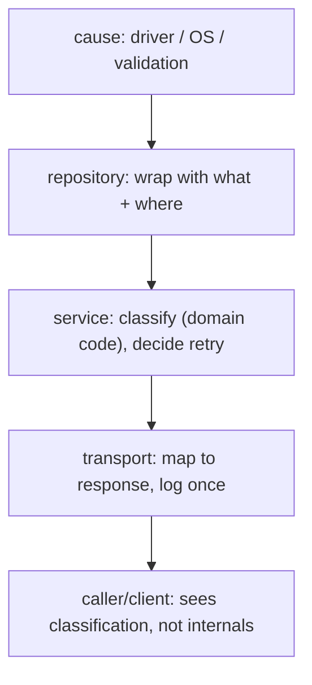

# Error design in production

## Why Does This Matter?

Chapter 1 covered mechanics. This chapter covers judgment: how errors
flow through a real service — where they are created, enriched, classified,
logged, and finally mapped to responses. The difference between a junior
and senior error design is invisible in demos and obvious in incidents.

## Mental Model

Treat errors as a pipeline with ownership at each stage:



Rules that make the pipeline work:

1. **Create close to the cause.** The layer with context classifies.
2. **Wrap, don't rebuild.** Adding context preserves identity;
   re-creating errors destroys it.
3. **Log once, at the top.** Every layer logging the same error
   multiplies noise and destroys the one-incident-one-log-line goal.
4. **Map at the boundary.** HTTP/gRPC layers translate; domain layers
   never import transport types.

## Domain vs validation vs infrastructure

Three families, three lifecycles:

| Family | Example | Created by | Retryable? | Logged at? |
|---|---|---|---|---|
| Validation | "amount must be > 0" | input boundary | never (fix input) | warn, no stack |
| Domain | "insufficient funds" | business rules | never (state) | info/debug |
| Infrastructure | "dial tcp: i/o timeout" | drivers, network | often, with backoff | error, with stack |

Mixing families is the root cause of both 500-on-bad-input (validation
mapped to "internal") and 400-on-dependency-failure (infra mapped to
"client"). Classify at creation; map by class.

## Validation errors — batch, don't bail

```go
// Collect all violations; users fix ten fields in one round trip.
func validateTransfer(req TransferRequest) error {
	var errs []error
	if req.Amount <= 0 {
		errs = append(errs, errors.New("amount must be positive"))
	}
	if req.Currency == "" {
		errs = append(errs, errors.New("currency is required"))
	}
	if len(req.Reference) > 64 {
		errs = append(errs, errors.New("reference must be at most 64 characters"))
	}
	return errors.Join(errs...) // nil if empty; prints each on its own line
}
```

`errors.Join` (Go 1.20+) is the batch primitive: `errors.Is/As` walk all
branches, so one joined error still answers "is this a validation error?"

## HTTP error mapping — the contract layer

```go
// examples/service/http.go
package main

import (
	"errors"
	"net/http"

	"github.com/TharunKumarReddyPolu/Go-Handbook-for-Software-Engineers/05-errors/examples/errorslib"
)

// writeError maps classified domain errors to responses. This function is
// the ONLY place translation happens; handlers stay dumb.
func writeError(w http.ResponseWriter, err error) {
	var de *errorslib.DomainError
	switch {
	case errors.As(err, &de) && de.Code == errorslib.CodeNotFound:
		http.Error(w, "resource not found", http.StatusNotFound)
	case errors.As(err, &de) && de.Code == errorslib.CodeInvalid:
		http.Error(w, de.Reason, http.StatusBadRequest)
	case errors.As(err, &de) && de.Code == errorslib.CodeConflict:
		http.Error(w, "conflicting state", http.StatusConflict)
	case errorslib.Retryable(err):
		// 503 + Retry-After: the client may succeed later. Do not leak
		// the underlying timeout text to the outside world.
		w.Header().Set("Retry-After", "1")
		http.Error(w, "temporarily unavailable", http.StatusServiceUnavailable)
	default:
		// Unknown = our fault. Generic body, full detail in the log.
		http.Error(w, "internal error", http.StatusInternalServerError)
	}
}
```

Design decisions embedded here, each defensible in review:

- **Clients see classification, not text.** The timeout's hostname never
  crosses the wire.
- **Retry-After only for genuinely retryable classes** — see below.
- **Unknown defaults to 500** — treat unexpected errors as server faults,
  not client's problem.

## Retryable vs non-retryable — decision table

| Signal | Retry? | Why |
|---|---|---|
| Network timeout, connection reset | yes, backoff + jitter | likely transient |
| HTTP 429 / 503 with Retry-After | yes, honor the header | server asked you to |
| HTTP 400, 404, 409 | no | deterministic outcome |
| Context deadline exceeded | rarely — decide *why* | your budget spent |
| ErrNoRows / not-found | no | state, not failure |
| Anything unknown | no, alert | retrying bugs doubles their cost |

The cardinal sin is retrying without classification: it converts a
10-second blip into a 10-minute self-inflicted outage. Retry policy
belongs with the *caller* that knows the operation's idempotency — see
[16-distributed-systems](../16-distributed-systems/) and
[25-fintech-with-go](../25-fintech-with-go/) for the full treatment.

## Logging errors — once, structured, decision-ready

```go
// slog (stdlib, Go 1.21+) — structured fields beat string interpolation
logger.Error("payment failed",
	"err", err,                       // the full chain, formatted
	"idempotency_key", req.Key,       // decision-relevant fields
	"amount_minor", req.AmountMinor,
	"attempt", attempt,
)
```

Rules:

- **Log once** at the top of the request/job; lower layers add context to
  the error instead.
- **`"err", err`** logs the wrapped chain's text. Log stack traces only
  for unexpected (panic-level) failures — expected failures with stacks
  drown real signals.
- **Never log-and-return.** `log.Println(err); return err` is how an
  incident gets three copies of the same line.
- **Include decision fields** (ids, amounts, attempts) so the on-call can
  act without rerunning the request.

## Production Example — a service boundary in full

```go
// examples/service/main.go
package main

import (
	"log/slog"
	"net/http"
	"os"

	"github.com/TharunKumarReddyPolu/Go-Handbook-for-Software-Engineers/05-errors/examples/errorslib"
)

func main() {
	logger := slog.New(slog.NewJSONHandler(os.Stdout, nil))
	svc := &PaymentService{logger: logger}

	mux := http.NewServeMux()
	mux.HandleFunc("POST /payments", func(w http.ResponseWriter, r *http.Request) {
		req, err := decodePayment(r)
		if err != nil {
			// Validation family: client's fault. No stack, warn level.
			logger.WarnContext(r.Context(), "invalid payment request", "err", err)
			writeError(w, err)
			return
		}

		err = svc.Process(r.Context(), req)
		if err != nil {
			// Service already classified; we log once with request fields.
			logger.ErrorContext(r.Context(), "payment failed",
				"err", err, "key", req.IdempotencyKey)
			writeError(w, err)
			return
		}
		w.WriteHeader(http.StatusCreated)
	})

	_ = http.ListenAndServe(":8080", mux) // demo only; see 14-backend-development
}

// PaymentService demonstrates the service layer's contract: it returns
// classified errors; HTTP mapping stays outside.
type PaymentService struct {
	logger *slog.Logger
}

func (s *PaymentService) Process(ctx context.Context, req PaymentRequest) error {
	if req.AmountMinor <= 0 {
		return errorslib.Wrap("validate", errorslib.CodeInvalid,
			"amount must be positive", nil)
	}
	// In production this calls a repository; the error would arrive
	// wrapped with classification. Here we simulate an outage path:
	return errorslib.Wrap("authorize", errorslib.CodeUnavailable,
		"authorizer did not respond", context.DeadlineExceeded)
}
```

(The `PaymentService`/request types referenced above are completed in
`examples/service/` — the point of this excerpt is the *boundary
discipline*, not the wiring.)

## Common Mistakes

- **`fmt.Errorf("payment failed")`** — context-free errors force
  archaeology. Say what failed, with what key, at which attempt.
- **`if err != nil { log.Fatal(err) }` in libraries** — libraries return;
  only `main` decides the process dies.
- **Error text as API.** Another team parses your message string; you can
  never change a typo again. Expose codes/types instead.
- **500 for everything.** Validation, conflicts, and outages all collapse
  into "our fault," clients retry wrongly, dashboards lie.
- **Swallowing with `err = nil`** after a failed optional step — at least
  log the swallowed error with a reason field.
- **Panic in request paths** for user errors (see
  [01 §7 defer/panic/recover](../01-go-fundamentals/07-defer-panic-recover.md)).

## Idiomatic Go

- One error path style per codebase (pick wrapping early, document it).
- Constructors like `NewNotFound(op string, cause error)` beat ad-hoc
  struct literals scattered around.
- Error variables named `ErrX`; error *types* named `XError`.

## Performance Considerations

- Expected-path errors in hot loops: prefer `(T, bool)` or a preallocated
  error, see chapter 1.
- Logging is not free: structured logging with fields allocates. At high
  RPS, log at boundaries, not per item, and sample repetitive failures.
- `errors.Is/As` are cheap; join trees stay shallow in practice.

## Concurrency Considerations

- Errors collected across goroutines: `errors.Join` or slice+mutex;
  never append to a shared slice without synchronization.
- An error value passed through a channel should be immutable after
  creation — treat it as a message, not shared state.

## Security Considerations

- Map-to-boundary is a security control: internal hostnames, SQL
  fragments, and stack traces must not reach clients.
- Rate-limit or sample 4xx logs separately from 5xx; attackers probe via
  4xx storms, and noisy validation logs hide real errors.
- Idempotency keys are credentials-adjacent: log them, but never with
  full request bodies.

## Testing Strategy

- Table-driven tests per mapping: inject each domain code, assert status
  code + safe body.
- Contract test: every error a service returns must satisfy exactly one
  mapping branch — an unclassified error is a bug; test that default
  branch is hit only by truly unknown errors.
- Retry policy tests: freeze a clock, feed timeout errors, assert
  backoff sequence. See [10-testing](../10-testing/) for the patterns.

## Interview Questions

1. *Walk me through what happens between "Postgres is down" and the
   client's response.* — The pipeline diagram; grading on log-once,
   classification, boundary mapping, no internal leakage.
2. *Why not log errors at every layer?* — Multiplication of noise, no
   single source of truth for an incident; context belongs in the error,
   logs at the top.
3. *Design the error model for a payments API.* — Families, codes,
   idempotency interaction, retry classification, audit trail; the
   [25-fintech-with-go](../25-fintech-with-go/) answer deepens this.

## Practice Exercises

1. Add `CodeConflict` handling to `writeError` with `409` and an
   `Idempotency-Key` header echo; test it with httptest.
2. Write `Policy` — a retry helper that takes `Retryable(err)` and a
   backoff func, and returns the final error; unit test with a fake
   clock.
3. Refactor a real function of yours: every `log.Println(err)` removed,
   context added to errors instead. Measure the diff in log lines during
   a failure scenario.

## Further Reading

- [Go wiki: Errors](https://go.dev/wiki/Errors) — community norms
- [log/slog package docs](https://pkg.go.dev/log/slog) — structured logging
- [Dave Cheney: Don't just check errors, handle them gracefully](https://dave.cheney.net/2016/04/27/dont-just-check-errors-handle-them-gracefully) — the classic essay on error design
