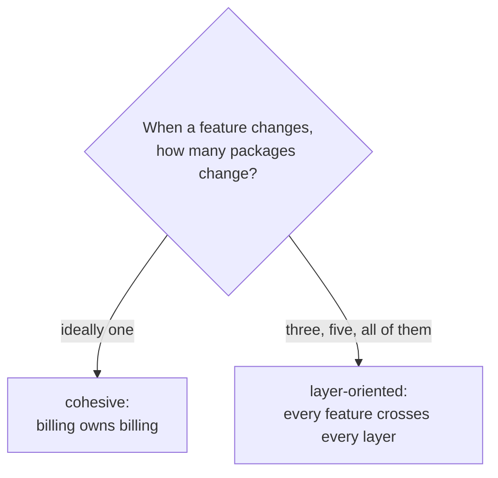

# Package design

## Why Does This Matter?

Packages are Go's unit of reuse, compilation, and visibility, and the
only unit that fails *loudly* when misdesigned: import cycles at build
time, name collisions at the call site, and "where does this live?"
forever after. Framework-first ecosystems organize by layer
(controllers/, services/, models/); Go organizes by **what things
are** (user, billing, auth), and the difference decides whether a
codebase ages or accretes.

The basics (module roots, import paths, main packages) are in
[01-go-fundamentals/03](../01-go-fundamentals/03-program-structure.md).
This chapter is the design layer: how to cut a codebase into packages
that keep their shape as it grows.

## Mental Model

A package is a promise: a coherent set of types and functions that
change together. Every design question reduces to cohesion:



**Group by domain, not by kind.** `billing/invoice` and
`billing/payment` (both know invoices and payments) beats
`models/`, `services/`, `utils/` (three packages that all know
everything and own nothing).

## Naming: the rules that do the work

**Package names are lowercase, short, singular, no underscores.**
`user`, `billing`, `time` (stdlib). The name is the namespace every
importer types forever:

```go
// The name does half the API's work:
user.New(...)           // reads as "new user"
billing.Invoice(...)    // reads as "billing invoice"

// Stutters to avoid (the package name repeats the type):
user.UserService        // call site: user.UserService
billing.BillingClient   // billing.BillingClient
```

Calibration: `strings.Builder` (not `strings.StringBuilder`),
`bytes.Buffer`, `time.Duration`. The package name is the adjective;
the type is the noun.

**Avoid**: `util`, `common`, `misc`, `helpers` (cohesion-free dumping
grounds), `base` (inheritance thinking), `models` (kind, not domain).
If you cannot say what a package is *for* in one sentence, it is not
one package.

**The stutter test** for exported identifiers: write the full call
site including the package name, then read it aloud. What reads well
in the file reads badly at 200 call sites.

## The internal/ mechanism: visibility with teeth

`internal/` is compiler-enforced privacy for other modules and other
trees:

```
mycompany/billing/
├── invoice.go          // public API of billing
├── payment.go
└── internal/
    ├── money/          // only billing (and below) may import
    └── ledger/
```

Any code outside `mycompany/billing` importing `billing/internal/...`
fails to compile. This is how you ship an SDK with a public surface
and a private implementation: everything under `internal/` is
structurally unpollutable by downstream code. Within one module, the
rule scopes to the directory tree: `a/internal/x` is importable by
`a/...` and its children only.

The design use: **your module's public API is whatever is not under
internal/**, and everything else is refactoring freedom. Every type
not under internal/ is a compatibility promise (see
[06](06-semantic-versioning.md)); keep that surface small on purpose.

## API surface minimization

The Go community rule: **export the minimum; grow only with need.**
Every exported identifier is:

- documented (godoc renders it),
- supported across versions ([06](06-semantic-versioning.md)),
- a testing obligation,
- a name someone else cannot use.

The working set of practices:

```go
// Expose behavior, not structure: the caller cannot misuse this.
func (l *Ledger) Post(p Posting) error

// Over exposing the struct and hoping:
type Ledger struct { Entries []Posting }   // anyone mutates it now
```

- **Prefer functions over exported types** when the type is just a
  carrier: `ParseEmail(s string) (Email, error)` hides whether Email
  is a struct, string, or type alias; changing it later is free.
- **Interfaces stay at the consumer** ([04/03](../04-functions-methods-interfaces/03-interfaces-philosophy.md)):
  a package exporting interfaces nobody consumes yet is exporting
  speculative surface.
- **`//go:linkname`, unsafe, and internal forks** are last resorts
  with comments explaining the exit criteria; they block upgrades.

## Import discipline

```go
import (
    "context"
    "fmt"

    "mycompany/billing"
    "mycompany/billing/internal/ledger"
)
```

- **No import cycles**: design consequence, not just a rule. If two
  packages need each other, a third package owns the shared concept.
  The cycle is the symptom; the missing type is the disease.
- **Layered dependencies point one way**: domain packages depend on
  stdlib; services depend on domain; main depends on everything. A
  domain package importing a service is the smell that precedes the
  cycle.
- **Group imports**: stdlib, then external, then internal. `goimports`
  enforces; consistency makes review mechanical.
- **Dot and blank imports** (`import . "..."`, `_ "image/png"`): the
  blank form is legitimate (driver registration, side-effect init) and
  worth a comment; the dot form is a code smell outside tests.

## Package shape: the vertical slice

A cohesive package reads top-to-bottom:

```
billing/
├── invoice.go        // types + constructors + core methods
├── invoice_test.go   // same package: white-box tests
├── payment.go
├── errors.go         // the package's error vocabulary (05-errors)
└── doc.go            // package doc for godoc when it needs a home
```

Test placement has three modes, each with a use:

| Placement | Sees | Use for |
|---|---|---|
| `package billing` | everything | white-box: internals, invariant tests |
| `package billing_test` | exported only | black-box API contract tests |
| both in one dir | as above | the default for real packages |

The `_test` external form is also how you verify your package is
usable *through its public surface alone*, which is the only surface
consumers have.

## Common Mistakes

- **Layer-first trees** (`handlers/`, `services/`, `repos/` at the
  root): every feature is scattered; changes cross packages; names
  collide within layers.
- **`util` packages** that accrete: split by what the functions are
  *for*; a util package that survives scrutiny usually turns out to
  be two real packages.
- **Exporting for tests**: exporting a field or method "so the test
  can reach it" makes the test part of your public API. Use
  same-package tests or `export_test.go` (export-for-test shims that
  ship nowhere).
- **God packages** (`pkg/` with forty files): the import graph hides
  the design; split by domain until each package has one sentence of
  purpose.
- **Import cycles worked around with reflection or interfaces-for-
  cycles**: the interface hides the cycle but keeps the design
  failure; move the shared concept out instead.
- **`main` packages importing each other**: main is a leaf; shared
  code belongs in a library package.

## Idiomatic Go

The stdlib's tree is the pattern at scale: `net/http` (a domain),
`net/url` (a sub-domain), `encoding/json` (a domain), `crypto/internal/...`
(private machinery under the compiler-enforced mechanism). Nothing is
organized by "the structs live here, the functions live there."

## Performance Considerations

- Package granularity affects link time and binary size marginally;
  do not split packages for performance, split for design. Measure
  build times before "optimizing" the tree.
- Exported symbols inhibit some compiler optimizations (they are part
  of the ABI); unexported symbols can be devirtualized more
  aggressively. Another quiet vote for small API surface.

## Concurrency Considerations

- Package-level variables are shared state by default; the safe
  package owns its sync discipline and documents it (the ownership
  rules are [08-concurrency/01](../08-concurrency/01-goroutines-and-channels.md)).
- `init()` functions run at import time in dependency order: init that
  opens connections or starts goroutines makes imports have side
  effects and startup unmeasurable. Initialize in main
  ([05-dependency-inversion](../04-functions-methods-interfaces/05-dependency-inversion.md)).

## Security Considerations

- `internal/` is a security boundary for API surface, not for secrets:
  anything in the binary is inspectable. Secrets stay out of packages
  entirely ([21-security](../21-security/README.md)).
- Package docs should state trust boundaries explicitly ("Parse
  validates; New assumes trusted input"): ambiguity at boundaries is
  how injection bugs survive review.

## Testing Strategy

Package design is testable by trying to test it: if a package's
public API cannot be exercised without reaching into internals, the
surface is wrong. The external `_test` package is the enforcement
mechanism; coverage per package flags the ones that are all wiring
and no behavior.

## Interview Questions

1. *How do you decide package boundaries?*: Cohesion: things that
   change together live together; domain over layer; one-sentence
   purpose.
2. *What does internal/ guarantee and to whom?*: Compiler-enforced:
   only the tree rooted at internal/'s parent may import it; the
   module's public API is everything else.
3. *A teammate adds pkg/util; your response?*: Ask what the functions
   are for; usually two real packages. If truly generic, one package
   per concept (stringsx, timeutil) with a documented reason.
4. *Why do import cycles happen and how do you fix the design?*: Two
   packages sharing a concept neither owns; extract the concept into
   a third package or interface at the consumer.
5. *How do you shrink a public API that already shipped?*: Internal-
   ize under a new major version path ([06](06-semantic-versioning.md)),
   deprecate with clear migration notes, remove in the next major.

## Practice Exercises

1. Take a layer-first tree (or sketch one); reorganize two features
   into domain packages; count the files a typical change now touches.
2. Build a package with an internal/ subtree; verify the compiler
   rejects an outside import, then move the concept public on purpose.
3. Write the same package twice: once with stuttered names, once
   calibrated; read five call sites of each aloud.

## Further Reading

- [Organizing a Go module](https://go.dev/doc/modules/layout)
- [Go Code Review Comments: package names](https://go.dev/wiki/CodeReviewComments#package-names)
- [Effective Go: package names](https://go.dev/doc/effective_go#package-names)
