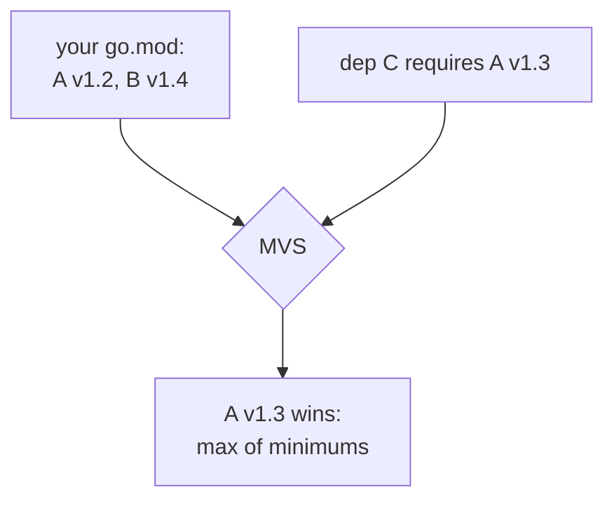

# Go modules in production

## Why Does This Matter?

The module system is the piece of Go that most directly replaces the
build tooling of other ecosystems (Maven, npm, pip) and it does so
with fewer moving parts, but "fewer" is not "none": version selection
rules, the checksum database, replace directives, and private-module
auth all have failure modes that surface in production CI and vendor
reviews. This chapter covers the mechanics you need to run a real
module: not the happy-path tutorial, the operational model.

The basics of `go.mod` structure are in
[01-go-fundamentals/03](../01-go-fundamentals/03-program-structure.md);
this chapter assumes them.

## Mental Model

Three files and a selection algorithm:

| File | Role | Committed? |
|---|---|---|
| `go.mod` | module path, Go version, direct requires | yes, always |
| `go.sum` | content hashes of every module version in the graph | yes, always |
| `vendor/` (optional) | a copy of all dependency source | your call (see [04](04-dependency-hygiene.md)) |

**Minimal Version Selection (MVS)** is the algorithm: the build uses,
for every module, the *maximum* of the minimum versions required by
everything in the graph. It sounds trivial; the property it buys is
not: **everyone building your module at a given go.mod gets the same
versions** (reproducible selection, unlike npm's or pip's resolver
families), and upgrades are monotone (adding a dependency never
downgrades another).



## The go directive and toolchain management

The `go` line in go.mod is a contract: "this code requires at least
this language/runtime." Since Go 1.21, the toolchain honors it
actively: a go.mod saying `go 1.27` makes older toolchains fetch a
newer one automatically (toolchain directives), and `GOTOOLCHAIN=local`
pins CI to exactly what is installed. The production rules:

- Set the go directive to the *minimum* version your code needs, not
  the one you have; raising it is a compatibility decision for every
  downstream user ([06](06-semantic-versioning.md)).
- Pin CI with `GOTOOLCHAIN=local` plus an explicit setup-go version:
  silent toolchain downloads in CI are a reproducibility leak (see
  [05](05-reproducible-builds.md)).

## Daily operations

```bash
go mod tidy          # reconcile requires with actual imports; prune unused
go get pkg@v1.8.0    # add/upgrade one dependency deliberately
go get -u ./...      # upgrade everything: do this on a branch, run tests
go list -m all       # the actual selected versions (MVS output)
go mod why -m pkg    # why is this in my graph? (trace the import path)
go mod graph | grep pkg   # full dependency graph edges
```

The operational habits:

- **`go mod tidy` on every dependency change**, in the same commit:
  CI fails on drift (`go mod tidy -diff` makes it a checkable no-op).
- **`go mod why -m` before upgrading anything load-bearing**: knowing
  *who* pulls a transitive dependency tells you what breaks when its
  floor rises.
- **Upgrades are events**: one branch per meaningful upgrade, full
  test run, note in the PR. Silent `-u` sweeps are how runtime
  behavior changes sneak in (see [04](04-dependency-hygiene.md)).

## replace: local overrides with a scope

`replace` redirects a module's source to another path:

```go
module github.com/myco/billing

go 1.27

require github.com/myco/ledger v1.2.0

replace github.com/myco/ledger => ../ledger       // local dev
replace github.com/myco/ledger => github.com/myco/ledger-fork v1.2.1-fix // fork
```

Two production disciplines:

1. **Never commit a local-path replace to main**: it breaks everyone
   else's build the moment the relative path is wrong. If you need
   it, that is what go.work is for (below).
2. **A fork replace is a debt entry**: name it, date it, and track
   the upstream PR that lets you delete it.

## Workspaces: multi-module development without editing go.mod

`go.work` (Go 1.18+) is the developer-side overlay that makes local
modules resolve without touching any go.mod:

```go
go 1.27

use (
    ./billing
    ./ledger
)
```

```bash
go work init ./billing ./ledger
go work use ./payments        # add another
go build ./...                # builds across all use'd modules
```

The division of labor: **go.work is for you (uncommitted, local);
replace-in-go.mod is for the module (committed, contractual)**. CI
should never see a go.work; developers should never hand-edit a
replace for local work.

## Private modules: auth and the GOPROXY chain

Corporate modules do not live in the public proxy. The knobs:

```bash
# .netrc or ~/.gitconfig provide credentials; env var declares the zone:
GOPRIVATE=mycompany.github.com/*
GONOSUMDB=mycompany.github.com/*   # same effect via older spelling
GOFLAGS=-mod=mod
```

- `GOPRIVATE` exempts matching paths from the public proxy and the
  checksum database (your private code never leaves the network).
- For enterprise-grade control, run an **Athens-style internal
  proxy**: all `go get` traffic flows through your infrastructure,
  public dependencies are cached, builds stop depending on
  upstream availability.
- `GOPROXY=direct` (per-path via pipes: `GOPROXY=proxy.golang.org,direct`)
  controls fallback order; the comma list is read left to right.

The failure modes this prevents: builds breaking when a public repo
vanishes or re-tags, credentials leaking through proxy logs, and
checksum mismatches on private modules.

## Common Mistakes

- **Committing `go.sum` selectively** or ignoring its conflicts:
  go.sum is part of the dependency contract; resolve conflicts by
  re-running `go mod tidy`, never by hand-deleting lines.
- **`go get -u ./...` on main**: upgrades everything transitively in
  one unverifiable step; do it on a branch with tests.
- **Vague requires** (`@latest` in go.mod, after tidy resolves it):
  the require line should always carry a real version; @latest is a
  command argument, not a module state.
- **Misreading MVS**: a require line in *your* go.mod is your
  *minimum*, not the build's version; the graph decides. `go list -m
  all` shows the truth.
- **Retracting without replacing**: `retract` marks a broken version
  in your own module's history; pair it with a fixed release or
  downstreams upgrade into the void.

## Idiomatic Go

```bash
# The weekly hygiene loop, scripted in CI:
go mod tidy -diff                     # no drift
go list -m -u all | grep '\['        # available upgrades, reviewed not auto-applied
govulncheck ./...                     # reachable vulnerabilities only (see 21-security)
```

The module files are code review surface: require changes and go.sum
deltas deserve the same scrutiny as source changes, because they are
source changes (transitively).

## Performance Considerations

- Module graph size drives build time; each require is compile work.
  The pruning rules (go.mod graphs since 1.17 record transitive
  requirements per-package) keep this tractable; `go mod graph | wc -l`
  tells you where you stand.
- The proxy caches zips and sums: cold CI machines pay network cost
  once per version. An internal proxy (above) or a warm module cache
  in CI (`actions/setup-go` does this) removes it from the hot path.

## Concurrency Considerations

None directly: modules are build-time. The operational parallel
holds, though: two engineers upgrading the same dependency concurrently
produce go.mod conflicts that must be resolved by re-tidy, not by
merging both version bumps (that is how accidental downgrades happen).

## Security Considerations

- The checksum database (`sum.golang.org`) plus go.sum means a
  compromised proxy cannot serve different bytes to different people
  for the same version: one of the ecosystem's strongest supply-chain
  defenses. Do not bypass it for private code without understanding
  what you lose ([21-security](../21-security/README.md)).
- `GONOSUMCHECK`-era flags and `GOFLAGS=-insecure` are footguns;
  audit CI for them quarterly.
- govulncheck's reachable-vulnerability analysis is the upgrade
  prioritizer: see [21-security](../21-security/README.md) and the CI
  wiring in [04](04-dependency-hygiene.md).

## Testing Strategy

Module hygiene is CI-testable: `go mod tidy -diff` (clean),
`go list -m all` snapshots (diff-reviewed), and the vulnerability
scan on a schedule. The handbook's own CI does exactly this; the
workflows are [.github/workflows/ci.yml](../.github/workflows/ci.yml)
and [security.yml](../.github/workflows/security.yml).

## Interview Questions

1. *Explain MVS and one property it buys.*: Max-of-minimums selection;
   reproducible builds from a given go.mod and monotone upgrades.
2. *go.sum: what is in it, and why is it not a lock file?*: Content
   hashes for graph modules; MVS is the lock, go.sum is the integrity
   layer against tampering.
3. *replace vs go.work: which when?*: replace is committed and
   contractual (forks, permanent redirects); go.work is local
   developer ergonomics for multi-module trees.
4. *How do private modules avoid the public proxy and sumdb?*:
   GOPRIVATE path patterns; credentials via netrc/git; optional
   internal proxy for enterprise caching.
5. *A transitive dependency is broken at a version MVS selects: your
   options?*: require a newer fixed version explicitly (raise the
   floor), replace with a fork temporarily, or upstream the fix; name
   the debt either way.

## Practice Exercises

1. Add a dependency that requires a newer version of something you
   already use; run `go list -m all` and explain which line changed
   and why.
2. Set up a two-module workspace with go.work; then reproduce the
   same local resolution with a replace and compare what each
   mechanism leaves in git.
3. Break a go.sum line deliberately; read the exact failure; fix with
   `go mod tidy` and write down what the checksum database said.

## Further Reading

- [Go Modules Reference](https://go.dev/ref/mod) (the authoritative
  MVS and go.mod spec)
- [Module proxy protocol](https://go.dev/ref/mod#module-proxy)
- [Toolchain management, Go 1.21+](https://go.dev/doc/toolchain)
