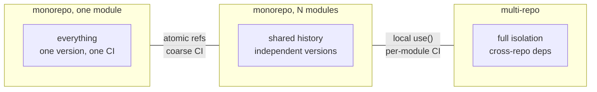

# Multi-module repositories

## Why Does This Matter?

Once a Go codebase passes a handful of services, the repository
strategy stops being a preference and becomes an operating decision:
where code lives determines review flow, CI blast radius, dependency
discipline, and who can refactor what. Go supports the full spectrum
(single module → multi-module monorepo → multi-repo), but each point
on it has distinct failure modes that are expensive to walk back. This
chapter maps the terrain with decision criteria, not doctrine.

## Mental Model

The trade is **atomicity vs isolation**:



As you move right: changes get more isolated, cross-cutting
refactors get harder. As you move left: refactors stay atomic, but
every commit runs against everything.

## The three layouts, honestly

**1. Single module (start here, stay as long as it works).**
One `go.mod` at the root; packages under `internal/` enforce
boundaries. This is most services, most companies, for years. The
failure threshold is not file count; it is when *unrelated* teams'
CI needs start fighting (build minutes, release cadence) or when a
shared library must version independently of the services.

**2. Multi-module monorepo.** Many `go.mod` files in one repository;
`go.work` stitches local development; CI triggers per changed module.
The real costs: dependency edges between sibling modules need version
discipline (or replaces), and tooling must understand the workspace.

**3. Multi-repo.** Each service/library its own repo. Strong
isolation, clean ownership; the costs are cross-repo refactors
(pray-and-merge or API indirection), shared CI logic duplicated, and
every "update the shared library everywhere" becoming a campaign.

The decision table:

| Need | Favors |
|---|---|
| Atomic cross-service refactors | single module / monorepo |
| Independent release cadences | multi-module / multi-repo |
| Small CI blast radius | multi-module / multi-repo |
| Simplest possible tooling | single module |
| External consumers of a shared library | its own module (any repo) |

## The multi-module monorepo, done concretely

```
company/
├── go.work               # local dev only; never committed
├── .github/workflows/    # path-filtered CI
├── libs/
│   └── ledger/           # go.mod: github.com/company/libs/ledger
├── services/
│   ├── billing/          # go.mod: github.com/company/services/billing
│   └── gateway/          # go.mod: github.com/company/services/gateway
└── tools/
    └── migrator/         # go.mod
```

**The sibling-dependency decision.** `services/billing` importing
`libs/ledger` resolves three ways:

1. **Via the published version** (`require libs/ledger v1.4.0`):
   production-true; requires actually pushing/tagging lib versions.
   The cost of purity: every lib change is release + bump + PR per
   consumer.
2. **Via go.work locally** (`use ./libs/ledger`): development sees
   uncommitted lib code; CI still tests against published versions.
   The standard monorepo compromise.
3. **Via replace to a relative path**: committed; makes CI build the
   local code together. Acceptable *within* a monorepo (all paths
   exist for every builder), wrong across repos.

Most mature monorepos run 1 + 2: publish for truth, workspaces for
speed. Some accept 3 to keep the monorepo's promise of atomicity;
document which you chose, because downstream tooling ( Dependabot,
Renovate) behaves differently per choice.

**CI with path filters.** The monorepo's CI cost is controlled by
building only what changed:

```yaml
jobs:
  detect:
    runs-on: ubuntu-latest
    outputs:
      modules: ${{ steps.filter.outputs.changes }}
    steps:
      - uses: dorny/paths-filter@v3
        id: filter
        with:
          filters: |
            billing:  ['services/billing/**']
            gateway:  ['services/gateway/**']
            ledger:   ['libs/ledger/**']
  build:
    needs: detect
    strategy:
      matrix:
        module: ${{ fromJSON(needs.detect.outputs.modules) }}
    steps:
      - run: go build ./... && go test ./...
        working-directory: ${{ matrix.module == 'ledger' && 'libs/ledger' || format('services/{0}', matrix.module) }}
```

The subtlety path filters miss: a change to `libs/ledger` must also
build its dependents. Either the filter graph encodes dependencies
(manageable at small scale) or CI runs dependents-of-changed too
(what the module graph can compute: `go list -m` per module).

## Versioning siblings

Two live options, pick per repo and stick to it:

- **Independent semver per module**: the clean model. Tag
  `libs/ledger/v1.4.0`; consumers bump deliberately. Cost: ceremony
  per change; benefit: consumers pin truth. Note the v2+ path rule
  applies per-module ([06](06-semantic-versioning.md)): a v2 sibling
  module path ends in `/v2`.
- **Pseudo-versions against main**: consumers require commit hashes;
  no tagging ceremony, but versions become meaningless strings and
  rollbacks are archaeology. Rarely worth it outside throwaway
  tooling.

## Common Mistakes

- **Committed go.work files**: developer-local state leaking into CI
  (where the `use`d paths may not exist) and into teammates' setups.
  go.work and go.work.sum go in .gitignore; `go.work.sum` may be
  committed in teams that share workspace tooling, but the file
  itself never.
- **One module per service *plus* a root go.mod**: ambiguity about
  which go.mod governs a directory; the root module should either not
  exist or own only root-level tools.
- **Cross-repo atomicity fantasies**: multi-repo plus "we always
  merge these PRs together" is not atomicity; it is hope with extra
  steps. If atomicity is required, that code belongs in one repo.
- **Forgetting the module path rule for v2+ siblings**: a major
  version bump of `libs/ledger` changes its import path; a monorepo
  that upgrades all consumers in one commit can ignore it, external
  consumers cannot.
- **Path filters without the dependency graph**: `libs/ledger` broke,
  `services/billing` CI never ran. Encode dependent relationships or
  fall back to build-all on lib changes.

## Idiomatic Go

The Go project itself is the single-module-at-scale proof (one repo,
one module, everything). Google's and Red Hat's monorepos show
multi-module at scale; the stdlib's `golang.org/x/...` family shows
multi-repo with loose coupling (each x/ repo is its own module with
its own cadence). Three real data points, three different answers:
the layout follows the ownership and release model, never fashion.

## Performance Considerations

- Build caching works per module cleanly; multi-module CI with warm
  caches (`setup-go`'s module cache, GOCACHE in actions/cache) is the
  difference between 40s and 8m pipelines.
- `go.work` adds a resolution step to every command; in huge
  workspaces, scope `use` to what you actually touch.
- Binary size and build time follow the import graph, not the module
  layout: splitting modules does not shrink binaries that import the
  same code.

## Concurrency Considerations

The team-level version: two release trains from one module need
branch discipline (and the module graph makes cherry-picks honest);
independent modules give each train its own main. Choose explicitly
during layout, not mid-incident.

## Security Considerations

- Per-module govulncheck scoping in CI: services scan their reachable
  vulnerabilities independently; a vulnerable lib version flags
  exactly the dependents that use it (see
  [04](04-dependency-hygiene.md)).
- Multi-repo access control is a real isolation win (least privilege
  per repo); monorepos compensate with CODEOWNERS plus branch
  protection, which is softer but workable.

## Testing Strategy

- Per-module test runs in CI (matrix above), full-graph runs on main
  merges: the balance that keeps feedback fast without lying about
  integration.
- The `examples/` note: this handbook itself is a single module with
  many example packages; `go test ./...` covers everything, which is
  the single-module superpower.

## Interview Questions

1. *When does a single module stop being enough?*: When unrelated
   teams' release cadences or CI needs conflict, or a shared library
   needs independent versioning; not at a file count.
2. *How do sibling modules resolve in a monorepo, and what does each
   cost?*: Published versions (truth, ceremony), go.work (speed,
   dev-only), committed replace (atomic, monorepo-only); most teams
   run published + workspaces.
3. *What breaks first in path-filtered monorepo CI?*: Dependency
   edges: a lib change must trigger dependents; encode the graph or
   build-all on lib paths.
4. *Why is go.work never committed?*: It is machine-local state; CI
   and teammates have different trees, and committed workspaces mask
   which go.mod is authoritative.
5. *Multi-repo atomicity: what is the honest answer?*: You do not get
   it; you get release choreography. If atomicity is required,
   co-locate the code.

## Practice Exercises

1. Split a toy single-module service into two modules; add go.work;
   break the lib deliberately and observe what CI (or a local build)
   catches and when.
2. Write the paths-filter workflow that correctly triggers dependents
   (hint: `go list -f '{{.Dir}}' -deps ./...` per module) and prove it
   on a lib-only change.
3. Tag a sibling lib v1.1.0, bump one consumer via the published
   version, leave the other on workspace resolution; document the
   difference in review comments.

## Further Reading

- [Go modules reference: workspaces](https://go.dev/ref/mod#workspaces)
- [Creating a multi-module workspace](https://go.dev/doc/tutorial/workspaces)
- [GOTOOLCHAIN and workspace compatibility](https://go.dev/doc/toolchain)
