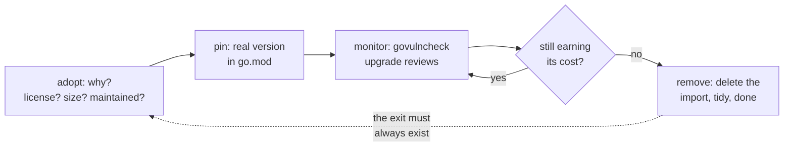

# Dependency hygiene

## Why Does This Matter?

Every dependency is someone else's code running inside your process,
under your license, on your security budget. Go's toolchain makes
adding dependencies effortless, which moves the entire engineering
burden to *discipline*: knowing what you run, why it is there, how it
is patched, and who can change it. Supply-chain incidents (typosquat
packages, hijacked maintainers, malicious PRs) are not edge cases
anymore; they are the standard threat model. This chapter is the
operating discipline.

The mechanics (go.mod, go.sum, MVS) are in
[02](02-modules-in-production.md); this chapter is the policy layer.

## Mental Model

Dependencies have a lifecycle, and hygiene is running it:



The one question that keeps the graph healthy: **can we still leave?**
A dependency you cannot remove (deep entanglement, no abstraction
seam) is a dependency you will be defending at 3 a.m. eventually.

## Adoption review: the five questions

Before `go get`, answer in the PR description:

1. **Why does this exist here?** What does it save over 50 lines of
   owned code? (Small, stable, single-purpose utilities are often
   cheaper to own than to track: the "little copying is better than a
   little dependency" proverb is a real cost calculation.)
2. **Who maintains it?** Release cadence, issue responsiveness, bus
   factor, whether the domain moves (crypto, TLS: high; file path
   utils: low).
3. **What does it bring?** Its own dependency tree matters as much as
   the library: `go mod graph` after a trial `go get`.
4. **What is the license, and is it compatible?** MIT/Apache/BSD
   integrate; GPL family requires legal awareness; no license means
   no.
5. **What is the exit?** How do you replace it if it goes bad? The
   abstraction seam ([04/01](../04-functions-methods-interfaces/01-functions-as-contracts.md))
   exists to make this answer honest.

## Vendoring: the tradeoffs, decided

`go mod vendor` copies all dependency source into `vendor/`. The
build then uses the copy (`-mod=vendor` is automatic when vendor/
exists). The honest ledger:

| | Vendor | No vendor |
|---|---|---|
| Builds work offline/air-gapped | yes | needs proxy/cache |
| Review every dep change in-PR | yes (big diffs) | via go.sum only |
| Repo size, CI checkout time | large | small |
| Drift risk between vendor and go.mod | a real bug class | none |
| stdlib-only or few deps | trivial | trivial |

Modern consensus: **don't vendor by default**; the module proxy and
go.sum already give you integrity and availability, and an internal
proxy serves air-gapped needs better than committed copies. Vendor
when: true air-gapping (no proxy access at all), extreme audit
requirements, or a dependency set small enough that the diff review
is real. If you vendor, CI must enforce `go mod vendor` freshness
(vendor → build → `git diff --exit-code vendor/`), because a stale
vendor tree is a silent fork of your dependencies.

## govulncheck: reachable beats present

The tool that makes vulnerability scanning actionable: `govulncheck`
analyzes the call graph and reports only vulnerabilities your code
can actually reach, ranked by evidence:

```bash
govulncheck ./...                  # source analysis: reachable vulns
govulncheck -mode=binary app       # binary analysis: what shipped
govulncheck -show verbose ./...    # full trace of the call path
```

The distinction is the whole point: a CVE in a dependency's logging
submodule is noise if you never call it; a reachable one in your TLS
path is an incident in progress. The CI wiring (weekly, on the
handbook's own [.github/workflows/security.yml](../.github/workflows/security.yml))
follows three rules:

- Scan on a schedule, not only on PRs: the database changes daily;
  your code does not.
- Fail on reachable findings; annotate informational ones.
- Pair every alert with the fix decision: upgrade (normal), replace
  (when upgrade is unavailable), or accepted-risk with an expiry date
  (sometimes honest, never silent).

## Upgrade policy

- **Security fixes**: as fast as CI can verify; the PR is the audit.
- **Patch/minor cadence**: monthly-ish batch, one branch, full tests;
  small deltas stay reviewable.
- **Major versions**: adoption reviews (semver majors are separate
  module paths in Go: see [06](06-semantic-versioning.md)); plan the
  migration, do not drift into it.
- **Never `go get -u ./...` blind**: it pulls majors too (since Go
  1.20 semantics, `-u` does not cross major versions, but it does
  churn minors transitively). Prefer explicit targets: `go get
  github.com/x/y@v1.9.3`.

The review checklist for any dependency-bump PR: version delta in
`go list -m all`, changelog scanned for behavior changes, new
transitive deps justified, tests green including `-race`, and (for
infra-adjacent deps) a deploy canary noted.

## The dependency budget

A useful team norm: a **target for direct dependencies per module**
(ten-ish for a service, more for a framework) and a hard look at any
addition that crosses it. The budget is not purity; it is a forcing
function for the adoption review, and a periodic removal ritual:
every quarter, run `go mod why -m` on each require and delete the ones
whose answer is a shrug. Dead dependencies are the entropy you can
actually fight.

## Common Mistakes

- **Vendoring "for reproducibility"** that nobody re-vendors: the
  module system already makes selection reproducible (MVS +
  go.sum); vendor adds a second source of truth that will drift.
- **Ignoring go.sum conflicts** by regenerating blindly in CI: the
  conflict is information (two teams upgraded differently); resolve
  deliberately.
- **`replace` archaeology**: forks and local paths accumulating in
  go.mod with no owner and no exit date. Each one is a TODO with
  production blast radius.
- **Scanning for presence, not reachability** (or scanning nothing):
  an unread CVE feed is not a security program.
- **Framework adoption as a dependency decision**: a web framework is
  not a library, it is a bet on someone else's architecture. The
  adoption review's "what is the exit" question is existential there
  ([12-http-networking](../12-http-networking/README.md) covers the
  stdlib-first stance).
- **License review only at adoption**: licenses change (rare but
  real); the quarterly audit re-checks.

## Idiomatic Go

```bash
# The hygiene loop as CI jobs (the handbook's own setup):
go mod tidy -diff          # drift check on every PR
govulncheck ./...          # scheduled weekly + on-demand
go list -m -u all          # upgrade candidates, human-reviewed
```

And the culture norm that does more than any tool: **dependency
changes are reviewed like code, because they are code** (someone
else's, executing in your blast radius).

## Performance Considerations

- Dependency count is compile time and binary size: each require is
  packages to type-check and link. The dependency budget has a build
  speed dividend.
- Indirection through "dependency injection frameworks" or reflection
  heavy libraries costs runtime as well as graph weight; the Go
  default (explicit construction, small interfaces) is also the fast
  path ([04/05](../04-functions-methods-interfaces/05-dependency-inversion.md)).

## Concurrency Considerations

A dependency's concurrency contract becomes yours when you call it
from concurrent handlers: goroutine-safety claims in its docs are
part of your correctness case. The adoption review includes "how does
it behave under -race in our workload": run your tests with the real
candidate, not just its own suite.

## Security Considerations

The chapter is mostly security; the residual notes:

- Typosquatting is beaten by copy-from-README-muscle-memory review:
  paste import paths exactly, and let go.sum plus review catch the
  rest ([21-security](../21-security/README.md)).
- `install go install ...@version` for tools, never `@latest` in CI
  scripts: pin tool versions like code.
- Post-compromise planning: go.sum + sumdb means tampering is
  detectable; internal proxies make it impossible for your fleet.
  Know which one you run.

## Testing Strategy

Hygiene is testable: drift checks, vulnerability schedules, and
upgrade branches with full suites are the mechanical layer. The
judgment layer is the adoption review and the quarterly audit; make
both checklist-driven and recorded, so the decision survives the
people who made it.

## Interview Questions

1. *What does go.sum protect against that MVS alone does not?*:
   Content tampering: MVS picks versions, go.sum verifies the bytes
   against the checksum database.
2. *When is vendoring the right call today?*: Air-gapped builds,
   extreme audit requirements, or tiny dep sets with real diff
   review; never as a reproducibility substitute.
3. *Why is govulncheck's reachability analysis the difference that
   matters?*: It ranks actual exposure over theoretical presence,
   turning CVE noise into a prioritized fix queue.
4. *Your dependency's maintainer went silent six months ago: what
   now?*: Risk-assess by domain volatility, confirm exit cost, plan
   the fork-or-replace decision before it is urgent.
5. *How do you make an unremovable dependency removable?*: Extract a
   consumer-side seam ([04/03](../04-functions-methods-interfaces/03-interfaces-philosophy.md))
   around the used surface, migrate call sites to it, then the
   dependency sits behind one interface.

## Practice Exercises

1. Run `go mod why -m` on every require of a real module; write down
   the ones you cannot justify; remove one.
2. Introduce a deliberate vendoring drift (edit vendor/, do not
   re-vendor); add the CI check that catches it.
3. Take a CVE from a dependency you use; run govulncheck and determine
   reachability; write the three-line incident note either way.

## Further Reading

- [govulncheck documentation](https://go.dev/blog/govulncheck)
- [Go modules reference: checksum database](https://go.dev/ref/mod#checksum-database)
- [OpenSSF Scorecard](https://securityscorecards.dev/) (what to ask of
  projects you depend on)
