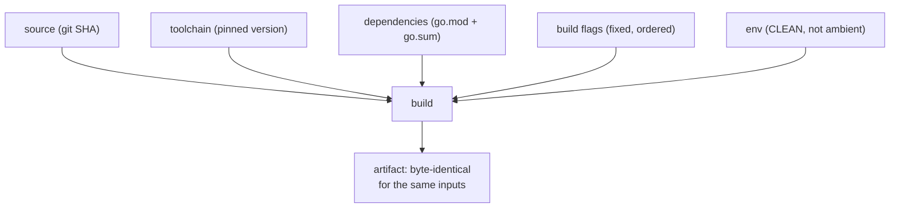

# Reproducible builds

## Why Does This Matter?

"Reproducible" has a precise meaning here: the same source plus the
same toolchain produces byte-identical artifacts, every time, on any
machine. Go gets closer to this than most ecosystems by design, but
getting there in production is a checklist, not a default: paths leak
into binaries, toolchains drift, and provenance is only provable if
you built for it. The payoff is concrete: verified releases, build
cache hits across machines, tamper evidence, and the ability to answer
"exactly what is running in production?" with a hash instead of a
shrug.

## Mental Model

Every build input must be pinned:



Anything not pinned becomes an invisible input: Go version patches,
`CGO_ENABLED` defaults, host paths, ambient env. The work is
eliminating the invisible.

## The verification loop

Prove it before you promise it:

```bash
# Machine A
go build -trimpath -o app ./cmd/app && sha256sum app

# Machine B (same source, same toolchain)
go build -trimpath -o app ./cmd/app && sha256sum app

# Identical hashes: reproducible. Different: find the input (below).
```

If the hashes differ, the usual suspects, in order:

1. **Different Go versions** (patch releases can change output):
   pin (next section).
2. **Embedded paths**: fix with `-trimpath`; check with
   `go version -m app`.
3. **CGO**: `CGO_ENABLED=0` for pure-Go builds; with cgo, the C
   toolchain is part of your input (pin the container).
4. **Build flags/order**: `-ldflags` with timestamps (`-X
   main.buildTime=$(date)`), `-gcflags` variations, VCS stamping
   differences: control or remove them.

## Pinned toolchains

Go 1.21+ made this first-class:

```go
// go.mod: the language floor...
go 1.27

// ...and optionally the exact toolchain for this module:
toolchain go1.27.1
```

```bash
# CI: make the toolchain non-negotiable.
GOTOOLCHAIN=local go build ./...   # fails rather than downloading
```

The policy split: the **go directive** is your compatibility floor
(raising it is a user-facing decision), while the **toolchain
directive** (or CI's `GOTOOLCHAIN=local` + explicit setup) pins what
you build with. Release builds should use one pinned toolchain
everywhere; a `golang:1.27.1` container image is the simplest honest
pin. Tools (`go install tool@v1.2.3`) get the same treatment: pinned
versions, never `@latest` in scripts.

## -trimpath and the path problem

By default, binaries embed absolute source paths (stack traces,
panics, DWARF) that vary per machine: the classic reproducibility
breaker and an information leak about your build hosts.

```bash
go build -trimpath -o app ./cmd/app
```

`-trimpath` rewrites file paths to module-relative form
(`github.com/myco/app/cmd/server/main.go`), making output
machine-independent. Also set the modern trio when you care about
the full picture:

- `-buildvcs=true` (default in git repos): stamps the commit and
  dirty-state into the binary; `go version -m` reads it back.
- `-mod=readonly` (default since Go 1.16): builds fail on go.mod
  drift rather than silently fixing it.
- `-pgo=auto` when using profile-guided optimization: the profile
  file becomes a build input; pin it like source
  ([19-performance/04](../19-performance/04-compiler-and-pgo.md)).

## Build provenance

Once builds are reproducible, provenance is cheap and strong:

- **`go version -m app`**: what module versions and flags built this
  binary; the first tool to run on any "what is deployed?" question.
- **VCS stamping**: `-buildvcs` records commit + dirty state; pair
  with a release tag and you can prove an artifact corresponds to a
  commit.
- **SLSA-style provenance**: for the full supply-chain ladder,
  generate attestations at build time (GitHub's artifact attestations
  do this for Actions builds) and verify at deploy: the reproducible
  build is what makes "rebuild and compare" a valid verification.
- **Signed, hashed release notes**: the sha256 of every artifact, in
  the release, from the reproducible pipeline: downstream verifiers
  recompute, not trust.

## Container builds

Multi-stage Dockerfiles are the standard delivery for Go binaries;
the reproducibility checklist carries over:

```dockerfile
FROM golang:1.27.1 AS build       # pinned toolchain, digest-pinned in prod
WORKDIR /src
COPY go.mod go.sum ./
RUN go mod download               # cached layer: deps before source
COPY . .
RUN CGO_ENABLED=0 go build -trimpath -o /app ./cmd/app

FROM gcr.io/distroless/static-debian12
COPY --from=build /app /app
ENTRYPOINT ["/app"]
```

Notes that matter: `CGO_ENABLED=0` + distroless/static for pure Go
(no libc surface, tiny image, no package drift); `go mod download`
before `COPY . .` for layer caching; a digest-pinned base image for
the strongest pin (`golang:1.27.1@sha256:...`).

## Common Mistakes

- **Stamping timestamps into binaries via -ldflags** and then
  wondering why builds differ: if the timestamp matters, put it in
  the release metadata, not the artifact; if the artifact must embed
  it, it cannot be reproducible by definition. Choose deliberately.
- **Ambient cgo**: one machine with gcc, one without: different
  binaries, mysteriously. Set `CGO_ENABLED` explicitly everywhere.
- **Relying on `latest` anything** (base images, tool installs,
  action versions): all drift, all unpinning.
- **Verifying nothing**: reproducibility you have not tested is a
  hypothesis. The two-machine hash comparison is ten minutes and
  settles it.
- **Ignoring dirty working trees**: `-buildvcs` stamps dirty state;
  release builds from dirty trees are the classic "works in CI,
  differs locally" source.

## Idiomatic Go

The Go project itself publishes reproducible release binaries and
documents the process; `goreleaser` and similar tools encode the
checklist (pinned toolchain, trimpath, CGO off, hashes in release
notes) so the pipeline is declarative rather than tribal. Adopt one
or transcribe it: either way, the checklist above is the spec.

## Performance Considerations

- Reproducible inputs make **build caches shareable**: identical
  inputs hit the same cache keys across machines and CI runners, which
  is where the speed benefit lives for real teams
  (`GOCACHE` + `GOFLAGS=-mod=readonly` + pinned inputs).
- `-trimpath` has negligible build cost; `-pgo` changes performance
  characteristics and adds the profile as an input: worth it, pinned
  ([19-performance/04](../19-performance/04-compiler-and-pgo.md)).

## Concurrency Considerations

None at build time; the runtime parallel is that a reproducible
artifact makes incident response tractable: the binary's embedded
module versions (`go version -m`) are the ground truth for "which
dependency versions were running", which is exactly the question
vulnerability triage asks first ([22-production-go](../22-production-go/README.md)).

## Security Considerations

- Reproducibility is a supply-chain control: independent rebuilds
  verify a release was not tampered with between CI and registry.
- `-trimpath` also removes build-host path leakage (usernames,
  directory structures) from shipped binaries: a small but real
  information-disclosure fix ([21-security](../21-security/README.md)).
- Provenance attestations without reproducible builds are weaker
  claims; the combination is the strong one.

## Testing Strategy

- CI job: build twice (different paths, same inputs) and diff hashes;
  the canary that keeps the property true as the build evolves.
- Release job: publish sha256 of every artifact; downstream deploy
  verifies before running.
- `go version -m` output captured per release: the dependency truth
  archive.

## Interview Questions

1. *What breaks Go build reproducibility, and what fixes each?*:
   Toolchain drift (pin), embedded paths (-trimpath), cgo ambient
   toolchain (CGO_ENABLED=0 or pinned container), stamping inputs
   (control them).
2. *go directive vs toolchain directive: what does each pin?*: Floor
   compatibility vs exact build toolchain; CI enforces with
   GOTOOLCHAIN=local.
3. *How do you answer "what versions are running in production"?*:
   `go version -m` on the artifact, or VCS stamping back to the
   release that built it.
4. *Why is CGO_ENABLED=0 the default posture for pure-Go services?*:
   Static binaries, no libc surface, reproducible without pinning a C
   toolchain; the cgo escape hatch stays deliberate.
5. *Design the release pipeline's provenance story end to end.*:
   Pinned inputs, reproducible build, attestation at build, hashes in
   the release, verification at deploy; each step exists to be
   independently checkable.

## Practice Exercises

1. Make two machines (or two containers) produce identical hashes for
   this handbook's largest example; document every input you had to
   pin.
2. Add `-buildvcs` + `go version -m` to a release script; verify the
   output identifies a dirty tree and explain why that matters.
3. Convert a Dockerfile to the pinned, cached, distroless shape; time
   cold and warm builds before/after the layer reordering.

## Further Reading

- [Reproducible builds in Go](https://go.dev/blog/rebuild) (the
  project's own verification effort)
- [Go toolchain directives](https://go.dev/doc/toolchain)
- [SLSA build levels](https://slsa.dev/spec/v1.0/levels) (the
  provenance ladder this chapter's tail end points at)
