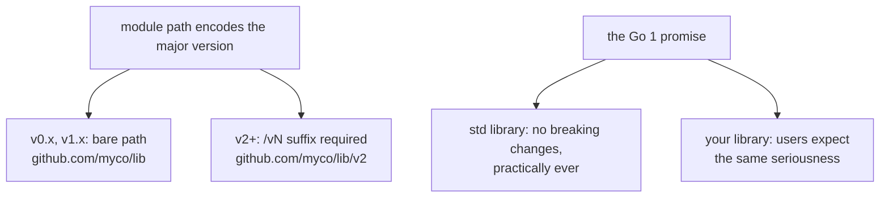

# Semantic versioning for Go libraries

## Why Does This Matter?

Versioning is the contract between a library and everyone who depends
on it, and Go encodes it more strictly than any other mainstream
ecosystem: major versions live in the *import path*, and the standard
library itself makes a compatibility promise that shapes what users
expect from your module. Get the mechanics wrong and v2 breaks every
import silently in CI; get the philosophy wrong and you either
freeze your API in fear or churn your users. This chapter is the
publisher's manual.

The consumer's view (selection, upgrades) is in
[02](02-modules-in-production.md); this is the producer's side.

## Mental Model

Semver says: **MAJOR breaks, MINOR adds, PATCH fixes.** Go adds two
structural twists:



1. **Major versions are different modules.** `github.com/myco/lib` and
   `github.com/myco/lib/v2` can coexist in one build; a v2 import is
   a *different package* from v1, not an upgrade of it.
2. **v0 and v1 share the bare path.** `v0.x` signals instability with
   no ceremony; the jump to `v1.0.0` is your stability promise, made
   with the same import path.

## The v2+ transition, step by step

When breaking changes are real, the release recipe:

```bash
# 1. Change the module path (the only code change required):
#    go.mod: module github.com/myco/lib/v2
# 2. Tag:
git tag v2.0.0 && git push origin v2.0.0
```

That is the whole mechanism: the `/v2` suffix in the module path is
what the toolchain dispatches on. The consequences that trip teams:

- **Internal imports must update**: every `myco/lib/pkg` import inside
  your own module becomes `myco/lib/v2/pkg`. Mechanical, but a real
  diff; do it in the same commit as the go.mod change.
- **v1 keeps living**: bugfixes for v1 users mean maintaining two
  branches; budget for it or sunset explicitly (deprecation policy
  below).
- **Consumers migrate deliberately**: a v2 dependency does not
  silently replace v1; both can be in one build during a staggered
  migration, which is the point.
- **v0/v1 to v2 is the *only* path-suffix jump**: there is no /v3
  special case beyond the same rule (suffix always equals the major).

## What counts as breaking (the list that saves you)

For a v1 module, these require a major version:

- Removing or renaming an exported identifier (functions, types,
  methods, fields).
- Changing a function signature, including adding a parameter.
- Changing an interface's method set (adding a method breaks every
  implementer: the reason stdlib interfaces grow via new side
  interfaces instead).
- Changing the *type* of an exported field, constant, or variable.
- Tightening what a function accepts (narrowing parameter types is
  impossible; narrowing accepted *values*, e.g. new validation, is
  behaviorally breaking even though it compiles).
- Changing panic behavior or error semantics that callers branch on
  (sentinel identity, error types: see [05-errors](../05-errors/README.md)).
- Removing support for older Go versions in the go directive (a
  compatibility decision, discussed below).

These are safe in minor/patch:

- Adding a function, method, type, or field (methods on exported
  structs: see the caveat below).
- Adding a method to a *concrete* type you own.
- Bug fixes, performance work, new packages.
- Widening accepted inputs *if* documented behavior is preserved.

The subtle one: **adding a method to a struct embeds a hazard**: if
users embed your struct in theirs and you later add a method whose
name collides with theirs, their type's surface changes. The stdlib
avoids exported-struct embedding in public APIs for this reason;
composition at the consumer's hand, not the producer's.

## The Go 1 promise and user expectations

Since Go 1 (2012), the standard library has kept code written against
Go 1 compiling: no breaking changes, only additions. `rsc.io`'s
compatibility manifesto extended it: **Go 1 and v1 modules should
follow "code that compiles keeps working."** Practical consequences
for library authors:

- Your v1 users reasonably expect never to *have* to migrate. Breaking
  changes are opt-in via a new major path, not a scheduled EOL.
- Deprecation is communication, not removal: `// Deprecated: use X`
  moves callsites gradually; removal happens only in a major.
- Behavior changes that compile are still breaking in spirit
  (error identity, panics, defaults): the semver letter is a floor,
  not the whole contract.

## Deprecation, done as a process

```go
// LegacyHash computes MD5 digests.
//
// Deprecated: MD5 is not collision-resistant; use SecureHash
// (SHA-256 based) for new code. LegacyHash will remain functional
// through v1; it is removed in v2.
func LegacyHash(s string) string
```

The working policy:

1. Mark with `// Deprecated:` (godoc, staticcheck, and gopls surface
   it).
2. Announce with a migration note (release notes link).
3. Keep it working for the entire major version; fixes allowed,
   features not.
4. Remove only at the next major, with the vN+1 migration guide
   covering it.

## Publishing hygiene

- **Tag format is `vX.Y.Z`, annotated, on the module root commit**
  (subdirectory modules: `libs/ledger/v1.4.0` style tags).
- **v0 is honest**: pre-1.0 churn is normal and expected; do not
  promise stability you are not ready to keep, and do not camp in v0
  forever to dodge the promise either (users read perpetual v0 as
  "never stable").
- **CHANGELOG per release**, matching semver categories: Added /
  Changed / Deprecated / Removed / Fixed. The release notes are the
  migration manual's index.
- **Retract broken releases** rather than deleting tags (tags are
  cached forever by proxies): `retract` in go.mod tells MVS to skip
  them ([02](02-modules-in-production.md)).

## Common Mistakes

- **v2 module path forgotten**: tag v2.0.0 with a bare module path
  and the toolchain refuses (or worse, older tooling muddles
  through); the suffix is not optional.
- **"Just adding a parameter"** to a function: signature change =
  breaking = major. Options structs and functional options exist
  exactly to keep growth non-breaking
  ([04/05](../04-functions-methods-interfaces/05-dependency-inversion.md)).
- **Adding a method to an interface**: breaks every external
  implementer. Grow interfaces by declaring a new composed interface
  (`type ReaderV2 interface { Reader; NewMethod() }`) and accepting
  that at new call sites.
- **Sentinel error renames** (`ErrNotFound` → `ErrMissing`): callers
  branch with `errors.Is`; identity is API. Fix text freely, identity
  never.
- **Internal packages imported by external users** because they were
  public once: if it must stay importable, it must stay supported;
  if it was a mistake, the major version is the exit.
- **Skipping v1 entirely** (v0 → v2): legal but surprising; the jump
  reads as "v1 was skipped for a reason," which invites a migration
  audit nobody has time for.

## Idiomatic Go

The stdlib's own evolution is the masterclass: `context` (extracted
from x/net, then promoted), `slices`/`maps` (generics-era additions
that left old patterns untouched), `net/http`'s growth by additive
APIs (`http.ServeMux` pattern matching, Go 1.22) rather than changes.
Nothing was ever taken away; that is the promise, kept for 14 years,
and the reason "just use the stdlib" ages well
([12-http-networking](../12-http-networking/README.md)).

## Performance Considerations

Version mechanics have no runtime cost; the performance-relevant
policy note is that **major-version coexistence** (v1 and v2 both
linked) doubles the types that cross a boundary: migrate decisively
rather than letting both majors live in one binary indefinitely.

## Concurrency Considerations

Concurrency contracts are API: changing a function from synchronous
to goroutine-spawning (or vice versa) is breaking even though
signatures match. Document goroutine-safety per exported type at v1
and treat changes to that documentation as semver-relevant.

## Security Considerations

- Security fixes ship as patch releases on all maintained majors:
  the release discipline from
  [04-dependency-hygiene](04-dependency-hygiene.md) assumes your
  provider does this; be that provider.
- Breaking API changes are occasionally the *fix* (removing an
  insecure default); when policy demands it, prefer a minor that
  changes the default with an opt-out, then remove the old path at
  the next major: two safe steps instead of one painful one.

## Testing Strategy

- **API-diff CI**: tools (apidiff) comparing exported surface
  against the last release catch accidental breakage before the tag,
  turning "whoops, minor" into a pre-merge conversation.
- Tests in the external `_test` package (black-box, exported only)
  double as a compatibility suite: if v1.0's test file passes against
  v1.N, the promise held ([01-package-design](01-package-design.md)).

## Interview Questions

1. *Why do Go major versions change the import path?*: Coexistence:
   v1 and v2 are different modules so a build can contain both during
   migration; no global namespace collision.
2. *Is adding a method to an exported struct breaking?*: Compile-wise
  no; ecosystem-wise risky (embedding collisions), which is why
  stdlib APIs avoid exported-struct embedding.
3. *How do you grow an interface without breaking implementers?*: New
  composed interface, accept it at new call sites; never add methods
  to the existing one.
4. *What does the Go 1 promise imply for a v1 library's users?*: Code
  that compiles keeps working: breakage only by explicit migration to
  a new major path.
5. *Design the deprecation of a function whose replacement changes
  behavior slightly.*: Deprecated marking + release notes + both
  paths through the major + migration guide; behavior deltas are
  opt-in, not silent.

## Practice Exercises

1. Take a small library; perform a real v1 → v2 (rename an exported
   function); fix every internal import and write the migration note
   a user would need.
2. Use apidiff (or a diff of godoc output) between two releases of a
   real dependency; classify each delta as safe/unsafe and check the
   semver claim.
3. Write the deprecation of a sentinel error's *usage* (not identity)
   in a way that satisfies both the compat promise and the security
   need driving it.

## Further Reading

- [Go modules: v2+](https://go.dev/doc/modules/major-version)
- [The Go 1 compatibility promise](https://go.dev/doc/go1compat)
- [What's the difference: rsc's compat manifesto](https://research.swtch.com/vgo-import)
  and [Gopls relnotes-style API policy](https://go.dev/wiki/Modules#semantic-import-versioning)
