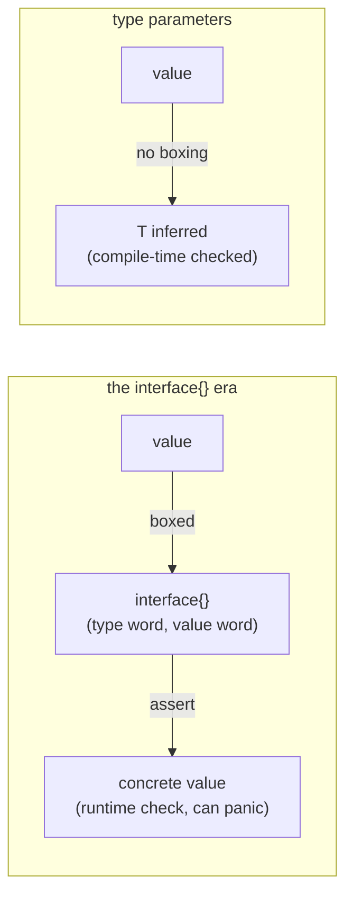

# Why generics exist

## Why Does This Matter?

For its first thirteen years, Go had no generics, and the workarounds
defined an entire style of writing (and avoiding) code: `interface{}`
bags, code generation, copy-paste per type. Understanding what those
workarounds cost is the only way to understand when to reach for type
parameters now: not as a feature to enjoy, but as a precise fix for
specific costs that you should recognize before paying them again.

## Mental Model

The old tool, `interface{}` (now `any`), traded type safety for
generality:



Four costs, all paid in the `interface{}` era, all eliminated by type
parameters. Each has a code shape you will recognize:

### Cost 1: erasure at the boundary

```go
// The old shape: everything enters and leaves as interface{}.
func MaxKeys(m map[string]any) any { ... }     // caller asserts back out
v := cfg["timeout"].(time.Duration)             // runtime check, can panic
```

The type information is stripped on the way in and re-verified on the
way out, at runtime, by hand, at every boundary. Every `.(T)` is a
potential panic and a maintenance promise ("this key is a Duration,
trust me").

### Cost 2: code duplication to recover safety

```go
// The old shape: real safety required per-type copies.
func MaxInts(xs []int) int
func MaxFloats(xs []float64) float64
func MaxStrings(xs []string) string
```

Three implementations, three test suites, three places for one to
drift. (The stdlib lived this: `sort.Ints`, `sort.Float64s`,
`sort.Strings` before `slices.Sort`.)

### Cost 3: code generation

```go
//go:generate genny -in=queue.go -out=queue_int.go gen "T=int"
//go:generate genny -in=queue.go -out=queue_string.go gen "T=string"
```

Whole ecosystems (genny, go-joe, sqlboiler's output) existed to
mechanically copy-paste code per type at build time. The costs:
slower builds, worse errors (generated line numbers), an extra
concept every contributor must know, and `go generate` steps that
silently rot.

### Cost 4: boxing and allocation

```go
// The old shape: every element pays an interface value.
var s Stack                     // s.push(x) boxes x: allocates (usually)
```

Storing values through interfaces usually forces them to the heap
(the two-word header plus escape analysis consequences from
[02/06](../02-go-language/06-interfaces-and-embedding.md)). Numeric
workloads paid double: the allocation AND the GC pressure.

## What type parameters actually fixed

```go
// One implementation, full safety, no boxing:
func Max[T cmp.Ordered](xs []T) T { ... }      // cmp.Ordered: Go 1.21
v := Max([]time.Duration{...})                  // T = time.Duration, inferred
```

- **No erasure**: `T` is a real type at compile time; the compiler
  checks every use.
- **No duplication**: one body, instantiated for the types you use.
- **No generation**: no tool, no build step, no generated line
  numbers.
- **No boxing** (usually): values stay concrete; the compiler can
  even devirtualize. The performance model is
  [03 of this section](03-generic-data-structures.md).

## What generics deliberately did NOT change

The design refused several things, and knowing the refusals is
knowing the philosophy:

- **No specialization-by-behavior**: constraints describe *types*
  (what operations a type supports), not *capabilities* (what a value
  does). Behavior remains interfaces' job: the heuristic in
  [02](02-type-parameters-and-constraints.md).
- **No operator overloading**: `+` in a constraint means "supports +
  for its type", never "user-defined plus".
- **No methods on generic instantiations** before Go 1.27 (see
  [06](06-version-notes.md)): the workaround shapes matter.
- **Compile-time, not templates**: there is no SFINAE, no
  metaprogramming; the compiler type-checks once against the
  constraint, not per instantiation.

## The pre-generics idioms that still stand

Not everything the `interface{}` era produced was a workaround to
delete. These remain correct *today*:

- **`any` at true dynamic boundaries**: encoding, printing, schemaless
  data (`map[string]any` from JSON). The boundary is genuinely
  dynamic; the cost is honest there.
- **Interfaces for behavior**: `io.Reader` was never a generics
  problem ([04/03](../04-functions-methods-interfaces/03-interfaces-philosophy.md)).
- **Concrete types first**: most functions are about one type; the
  generics question starts only when the second type arrives (the
  standing rule of this section).

## Common Mistakes

- **Reading history as license**: "generics exist, so convert our
  interfaces" is the misfire; interfaces and type parameters solve
  different problems ([02](02-type-parameters-and-constraints.md)).
- **Erasure nostalgia in new code**: writing `map[string]any` for
  known shapes because "the JSON library does it" pays the old costs
  on new ground; typed structs decode the same wire format with
  compile-time checking.
- **Generated-code archaeology treated as architecture**: legacy
  `*_gen.go` files still in the tree should be on a migration path to
  the one generic body, not defended as a pattern.
- **Measuring the old costs onto the new tool**: boxing was the
  interface{} cost; type parameters usually eliminate it, but a
  generic function taking `any` is the same old erasure with new
  syntax.

## Idiomatic Go

```go
// The pre/post pair that shows the era change in one glance:
// pre-1.21:                        // Go 1.21+:
func contains(ss []string, s string) bool   // slices.Contains(ss, s)
func SortStrings(xs []string)               // slices.Sort(xs)
func copyMap(m map[string]int) map[string]int // maps.Clone(m)
```

The stdlib's `slices` and `maps` packages (Go 1.21+) are the
reference implementations of the post-era: read them like documentation
of the intended style ([04](04-generic-apis.md)).

## Performance Considerations

- The headline: generic containers over value types avoid per-element
  boxing that interface-based ones paid. The dsbench measured
  map/slice costs ([03-data-structures/01](../03-data-structures/01-builtins-in-depth.md));
  the generic-vs-interface container deltas are in
  [03 of this section](03-generic-data-structures.md).
- The compiler implements generics via GC shape stenciling
  (dict-based): most instantiations share code with same-shape types;
  the cost model is in [03](03-generic-data-structures.md) and it is
  almost always irrelevant outside tight loops.

## Concurrency Considerations

Type parameters say nothing about thread-safety; a generic container
is exactly as safe as its concrete sibling. The trap to re-earn:
`sync.Map`-style generic wrappers still need the concurrency story
([08-concurrency/04](../08-concurrency/04-sync-primitives.md));
generics do not add one.

## Security Considerations

Type safety at boundaries is a security property: `map[string]any`
decoded from user input defers type confusion to runtime; typed
structs move the check to compile time. The validation strategy is
unchanged (validate at ingress, [21-security](../21-security/README.md)),
but generics shrink the surface where "trust the type" can betray you.

## Testing Strategy

Generic functions concentrate logic that used to be duplicated: one
test suite now covers every instantiation. Table-driven tests over
multiple type instantiations (the pattern in
[examples/genlib](examples/genlib/)) replace the per-type suites; the
property tests apply unchanged.

## Interview Questions

1. *Name the four costs of the interface{} era and the fix for each.*:
   Erasure (compile-time T), duplication (one body), code generation
   (no tool), boxing (concrete instantiation).
2. *When is interface{} / any still the right choice?*: Genuine
  dynamic boundaries: encoding, schemaless data, printing.
3. *Why didn't Go adopt C++-style templates?*: Compile-time
   instantiation per type bloats binaries and error messages; Go
   type-checks against constraints once (GC shape stenciling), a
   deliberate middle path.
4. *What did the Go team refuse to add with generics, and why does it
   matter?*: Operator overloading and behavior-specialization: keeps
   constraints about types, keeps `+` honest, keeps behavior in
   interfaces.
5. *Your codebase has per-type copies of a function; what is the
   migration order?*: Identify the operation's constraint needs
   (cmp.Ordered? comparable? custom?), write the generic, keep the
   concrete wrappers if call sites benefit, delete the rest.

## Practice Exercises

1. Find three `.(T)` assertions in a codebase you know; rewrite the
   flow with generics or typed structs; note which of the four costs
   each was paying.
2. Delete one `*_gen.go`-style duplication in favor of a generic
   function; compare test suites before/after.
3. Benchmark an interface{}-based stack against a generic one for
   int and string payloads; explain the delta via the boxing model.

## Further Reading

- [An Introduction to Generics](https://go.dev/blog/intro-generics)
  (the design rationale)
- [When to use generics](https://go.dev/blog/when-generics) (the
  official stance this section operationalizes)
- [cmp package](https://pkg.go.dev/cmp) (Ordered, Compare)
