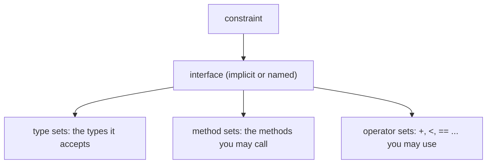

# Type parameters & constraints

## Why Does This Matter?

Constraints are the load-bearing half of generics: they are the
compiler's entire knowledge of what `T` can do, the API reader's
documentation of what the function needs, and the difference between
a reusable abstraction and a type-theory trap. The syntax takes an
afternoon; the design skill (choosing the *narrowest constraint that
expresses the real need*) is the interview- and review-level
competence this chapter builds.

## Mental Model

A type parameter is a placeholder with a contract; the constraint is
the contract:

```go
func Sum[V Number](xs []V) V { ... }
//        ^~~~~~~~^
//        name: V   contract: Number (a defined constraint)
```

Everything the body does with `V` must be justified by the
constraint; everything the caller can pass is licensed by it. The
constraint is both a compile check and a published promise.



## The built-in constraints, memorized

```go
any           // every type; use it, not interface{} (alias, Go 1.18+)
comparable    // supports == and != (exactly: map keys, dedup, Contains)
cmp.Ordered   // supports < <= > >= (ints, floats, strings): Go 1.21
```

- `comparable` is deliberately exact: it is the constraint for "can be
  a map key or compared with ==". Note what it *excludes*: interfaces
  (whose dynamic values may not be comparable) are not comparable
  even though concrete comparable types satisfy their interfaces.
- `cmp.Ordered` is the workhorse for sorting/min/max: it is defined
  with `~`-typed unions (below), so named types like `time.Duration`
  (defined as `int64`) qualify, not just the bare builtin types.
- `any` in a type parameter position is not a license: the body can
  do almost nothing with a bare `any` value. If your constraint is
  `any`, ask whether the function should be generic at all.

## Constraint syntax: the three shapes

```go
// 1. A plain interface constraint (methods only).
type Storer[T any] interface {
    Get(ctx context.Context, key string) (T, error)
}

// 2. A type-set constraint (union of types).
type Number interface {
    ~int | ~int64 | ~float64
}

// 3. Combined: type sets + methods.
type Serializable interface {
    ~string | []byte
    Marshal() ([]byte, error)
}
```

The tilde (`~int`) is the detail that separates working constraints
from annoying ones: `~int` accepts *any type whose underlying type is
int* (`type Celsius int` qualifies), while bare `int` accepts only
the literal builtin. Almost every union you write wants tildes.

Union elements must be "term" types: you cannot union an interface
with a type parameter, and you cannot mix type unions with arbitrary
operators (`~int | ~string` compiles but `+` on it does not: no
operator exists for both; that is the compiler keeping you honest).

## The operator problem and the two workarounds

Constraints license operators only when *all* union members support
them:

```go
// Compiles: + exists for all members.
func Sum[V ~int | ~float64](xs []V) V { ... }

// Does NOT compile: no + for the union as a whole.
func Concat[V ~string | ~[]byte](xs []V) V { ... }
// workaround: separate functions, or convert through []byte honestly.
```

The other classic: comparing for order needs `cmp.Ordered`, but
*"compare" as a method* needs a function parameter:

```go
// Constraint-based (builtin ordering):
func Max[T cmp.Ordered](a, b T) T

// Function-based (caller defines the order): often better API.
func MaxBy[T any](a, b T, less func(T, T) bool) T
```

The design lesson: when the ordering is domain-specific (Money by
amount, Tasks by priority), a `less func` parameter or a small
interface beats inventing a constraint. Constraints shine for
builtin-operator needs; functions parameterize everything else.

## Inference: what you rarely write

Type inference handles most call sites; you write brackets when it
cannot:

```go
Max([]int{3, 1, 2})             // T = int, inferred
Max[int]([]int{3, 1, 2})        // explicit: needed only in edge cases

// The cases that need explicit type arguments:
s := slices.Clip[[]int](nil)    // untyped nil: no type to infer from
f(Foo[int])                     // generic *type* passed as a value arg
```

Inference also flows through constraints: a parameter typed `V`
somewhere in the signature usually lets every other `V` infer. When
inference fails, the honest fixes are: name the type argument once,
or restructure the signature so at least one parameter carries the
type concretely (the "anchoring" rule: every type parameter should
appear in a regular parameter position, not only inside another
generic's arguments).

## The zero value inside generics

```go
func First[T any](xs []T) (T, bool) {
    if len(xs) == 0 {
        var zero T              // the canonical zero-value pattern
        return zero, false
    }
    return xs[0], true
}
```

There is no `nil` for a generic `T` (it might be an int); `var zero T`
is the idiom. The FAQ-grade follow-up: `*T` where `T any` is not the
same as `T` where `T ~*U`; pointer-shaped constraints have their own
syntax and their own traps (nil-ability in constraints:
`interface{ ~*int | ~*string }` works, but then `zero` is one of
those pointers, fine; a bare `T any` with `return nil` does not
compile).

## Common Mistakes

- **Bare types in unions without `~`**: `int | int64` rejects
  `type UserID int`, which is exactly the type the caller has. Use
  tildes by default.
- **Constraints doing behavior's job**: an interface constraint with
  five methods is an interface; if it describes what values *do*
  (Read, Draw), it belongs at the consumer as a plain interface
  ([04/03](../04-functions-methods-interfaces/03-interfaces-philosophy.md)),
  not as a constraint.
- **`any` as a constraint for "I will assert inside"**: erasure with
  new syntax ([01](01-why-generics-exist.md)); the body should need
  nothing beyond `any`'s powers, or the constraint should say what it
  needs.
- **Union of interfaces that overlaps itself** (`interface{ int } |
  interface{ ~int }`): redundant and a readability tax; flatten
  unions, name them, reuse them.
- **Recursive constraints** (a constraint referencing its own type
  parameter): sometimes legitimate (linked types) but usually a sign
  the design wants an interface method instead; Go 1.27's generic
  methods ([06](06-version-notes.md)) retire several of these hacks.
- **Forgetting comparable's exactness**: putting a `comparable`
  constraint on a parameter you also want to use as a map key is
  fine; putting it on something you want to *sort* silently misses
  that comparable does not include `<`.

## Idiomatic Go

```go
// The stdlib's calibration points, worth memorizing:
func Contains[S ~[]E, E comparable](s S, v E) bool    // slices
func Keys[M ~map[K]V, K comparable, V any](m M) []K   // maps-style
func Max[T cmp.Ordered](x, y T) T                     // cmp-era min/max

// The style: constrain the container's underlying type (~[]E),
// keep the element constraint minimal (comparable), let inference
// carry the call sites.
```

Read `slices` and `maps` source: two packages, a few hundred lines,
the whole style guide ([04](04-generic-apis.md) dissects them).

## Performance Considerations

- Constraints do not cost at runtime: type checking is compile-time;
  the runtime model is GC shape stenciling
  ([03](03-generic-data-structures.md)).
- `~`-typed constraints keep values concrete; a constraint that
  forces callers to convert to interface shapes re-introduces boxing.
  Prefer underlying-type unions.

## Concurrency Considerations

A generic parameter's concurrency obligations belong to the value,
not the abstraction: a `chan T` parameter carries the channel rules
([08-concurrency/01](../08-concurrency/01-goroutines-and-channels.md))
with T along for the ride; a generic cache still needs its own
locking story. Nothing new, nothing forgiven.

## Security Considerations

Constraints narrow what code can do with data: they are a small,
compile-time-enforced input validation. The residual risk is
unchanged (user input arrives as bytes/strings and needs real
validation at ingress, [21-security](../21-security/README.md)); do
not mistake type parameters for a sanitization layer.

## Testing Strategy

Generic functions earn their tests via instantiation tables: one
table covering int, string, and a named-~type case catches
constraint mistakes (bare-vs-tilde especially) that a single-type
test cannot. The [examples/genlib](examples/genlib/) suite is built
exactly this way; fuzzing applies to the concrete instantiations
([10-testing/04](../10-testing/04-benchmarks-coverage-fuzzing.md)).

## Interview Questions

1. *What does `comparable` guarantee, exactly?*: == and != support;
   the exact contract for map keys and equality; excludes interfaces
   and anything uncomparable.
2. *Why does `~int` exist and when do you need it?*: Named types with
   underlying int must satisfy operator constraints; tilde matches
   underlying types, bare types match only themselves.
3. *Constraint vs interface: how do you choose?*: What the value *is*
   (supports these operators, has these underlying types):
   constraint. What the value *does* (behavior): interface.
4. *When does inference fail, and what are the two fixes?*: No
   concrete anchor (nil literals, generic types as arguments); fix by
   explicit type arguments or restructuring so a parameter carries
   the type.
5. *Write the signature of a generic Map over any slice with any
   transform; what are the constraints?*: `func Map[S ~[]E, E, R any](s
   S, f func(E) R) []R`: elements and results both `any` (no
   operators needed), container `~[]E`.

## Practice Exercises

1. Write `Sum`, `Min`, `Max` over `~int | ~float64`; then try to make
   `type Salary int` pass with bare `int` (it will not); fix with
   tilde.
2. Implement `GroupBy[S ~[]E, E any, K comparable](s S, key func(E) K)
   map[K]S`; write the instantiation table (int/string/named types).
3. Convert an interface-with-five-methods "constraint" back to a
   consumer-side interface; write one paragraph on which shape the
   caller prefers and why.

## Further Reading

- [Type parameters proposal](https://go.googlesource.com/proposal/+/refs/heads/master/design/43651-type-parameters.md)
  (the design document; readable)
- [Type Parameters Tutorial](https://go.dev/doc/tutorial/generics)
- [Constraints draft: type sets](https://go.googlesource.com/proposal/+/refs/heads/master/design/43651-type-parameters.md#type-sets)
