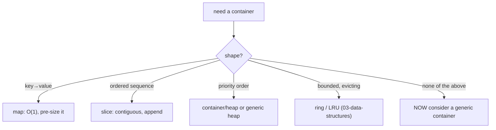

# Generic data structures

## Why Does This Matter?

Reusable containers were the poster child for generics, and the
poster child is also the trap: a hand-rolled generic container is a
maintenance liability competing against built-ins that are
exceptionally good. This chapter covers how to write the containers
that genuinely earn type parameters (the ones the built-ins cannot
express), when the built-ins still win, and the runtime model
(GC shape stenciling) that explains the performance numbers.

## Mental Model

The built-ins already cover three quarters of the container needs:



The section's standing rule applies at full force here: the generic
container earns its existence only when the built-ins genuinely do
not fit ([03-data-structures](../03-data-structures/README.md) is the
catalog of what does fit). What remains: typed views over unsafe or
interface-based infrastructure, multi-type abstractions, and the
concurrency-shaped containers.

## Case study: a generic heap, end to end

From [03-data-structures/04](../03-data-structures/04-heaps-priority-queues.md):
`container/heap` predates generics and pays the `any` tax at every
op. The generic version deletes the casts and keeps the algorithm;
the real implementation lives in
[03-data-structures/examples/heap](../03-data-structures/examples/heap/).
The design points worth reading out of it:

- **The comparator is a parameter** (`less func(a, b T) bool`), not a
  constraint: operator-based ordering (`cmp.Ordered`) only fits
  builtin-ordered types, and priority queues almost always order by
  domain logic. The `less`-as-parameter choice is
  [02](02-type-parameters-and-constraints.md)'s rule applied.
- **The zero value works**: `Heap[T]{}` with a nil less is not usable,
  so the constructor is required; that is a deliberate refusal of
  zero-value design ([04/06](../04-functions-methods-interfaces/06-constructors-and-invariants.md))
  in favor of an invariant (no nil-comparator panics).
- **Index bookkeeping stays in the element** when Fix/Remove are
  needed: generics do not remove that responsibility.

## Case study: typed views over untyped storage

The niche where generics shine hardest: memory you cannot express
with built-ins:

```go
// Slab-allocated pool with typed handles: no pointers, no GC scan.
type Slab[T any] struct {
    items   []T
    free    []int32
}
type Handle int32   // index, not pointer: stable across appends?

// No: appends reallocate. Real slabs use fixed capacity or chunked
// pages; the generic part is the handle→T mapping, which the
// built-ins cannot express because []T indexed by a newtype Handle
// loses the type identity.
```

The pattern family: **newtype-indexed storage** (Handle/EID/slot
designs in game engines and high-throughput systems), where the type
parameter keeps `Handle[User]` and `Handle[Order]` distinct so a
misuse is a compile error. `[]T` with a bare `int32` index cannot say
that. This is generics doing type-safety work, not convenience work.

## Case study: the sync-shaped wrappers

Generic mutex-guarded structures compress a real duplication tax:

```go
type SyncMap[K comparable, V any] struct {
    mu sync.RWMutex
    m  map[K]V
}

func (s *SyncMap[K, V]) Get(k K) (V, bool) {
    s.mu.RLock(); defer s.mu.RUnlock()
    v, ok := s.m[k]
    return v, ok
}
func (s *SyncMap[K, V]) Put(k K, v V) {
    s.mu.Lock(); defer s.mu.Unlock()
    s.m[k] = v
}
```

Before generics, every service hand-wrote this per payload type or
used `interface{}` maps with assertions at the call sites. The
caveats stand from
[08-concurrency/04](../08-concurrency/04-sync-primitives.md): the
wrapper is only as safe as its discipline (do not leak references to
internal state through getters of reference types), and `sync.Map`
remains its own specialized tool, not something to reimplement
generically.

## The performance model: GC shape stenciling

How the compiler implements generics, and why you mostly should not
care:

- Every instantiation type maps to a **GC shape** (essentially its
  memory layout class). Same shape: shared generated code + a
  dictionary of type-specific operations. Different shape: separate
  code.
- Practical consequences:
  - `int64` and `float64` are different shapes (both scalar,
    different GC behavior): separate instantiations.
  - All pointer types share one shape (`*A` and `*B`): one body,
    dictionary lookups on the rare operations.
- Cost deltas are nanoseconds and almost never the bottleneck; the
  boxing elimination (vs interface-based containers) is the real
  win. The measured stack comparison is
  [01](01-why-generics-exist.md)'s exercise; the meta-rule is
  [19-performance/01](../19-performance/01-measure-first.md).

## When the built-ins still win: the honest list

| Need | Built-in | Generic alternative | Verdict |
|---|---|---|---|
| Key→value | `map[K]V` (natively generic!) | custom tree map | built-in, overwhelmingly |
| Ordered seq | `[]T` + `slices` | linked list | built-in |
| Set | `map[T]struct{}` | custom Set type | built-in for one-offs; generic Set for reuse ([03-data-structures/02](../03-data-structures/02-sets.md)) |
| FIFO/LIFO | slice idioms | deque lib | built-in |
| Priority | heap (generic ok) | sorted slice | either; generic heap removes the `any` tax |
| Bounded window | ring (hand-written) | none better | hand-written is the shape |

Note the quiet fact in row one: **Go's built-in maps and slices are
already generic**; they are the proof the language wanted this all
along. Your generic container competes against them, and mostly
loses: enter the ring only for shapes they cannot express.

## Common Mistakes

- **The generic Linked List, Redis-driven development edition**:
  writing `LinkedList[T]` because it is now possible; the locality
  argument from [03-data-structures/05](../03-data-structures/05-linked-lists.md)
  did not change with the syntax.
- **Generic wrappers that leak references**: `SyncMap[K, V].Get`
  returning a `V` that is itself a map/slice shares internal state;
  the wrapper's safety promise was shallow. Generic or not, aliasing
  rules rule ([02/01](../02-go-language/01-arrays-and-slices.md)).
- **Over-parameterizing**: three type parameters where two suffice;
  each adds inference surface and call-site noise. The design smell
  test: if a type parameter appears only in one parameter's position
  and is never constrained, it may be `any` with no bracket at all.
- **Forgetting capacity**: a generic container wrapping a slice
  should accept pre-size hints the way built-ins do (`NewRing[T]` with a capacity,
  `make([]T, 0, n)`): the allocation-avoidance habits from
  [03-data-structures/01](../03-data-structures/01-builtins-in-depth.md)
  transfer exactly.
- **Reimplementing `slices`/`maps` poorly**: before writing
  `Contains`, `Clone`, `Sort`, `Equal`: check the stdlib packages
  first ([04](04-generic-apis.md) catalogs them).

## Idiomatic Go

```go
// The stack: small, zero-value-first, the whole generic-container
// textbook in nine lines (03-data-structures/03 for the detail).
type Stack[T any] struct{ items []T }

func (s *Stack[T]) Push(v T) { s.items = append(s.items, v) }
func (s *Stack[T]) Pop() (T, bool) {
    n := len(s.items)
    if n == 0 {
        var zero T
        return zero, false
    }
    v := s.items[n-1]
    var zero T
    s.items[n-1] = zero
    s.items = s.items[:n-1]
    return v, true
}
```

The calibration: this replaces nothing in the built-ins (a bare
slice is the stack) but earns its keep when a named type clarifies
call sites or when the struct grows methods beyond push/pop.

## Performance Considerations

- The measured deltas: generic value-type containers avoid the
  per-element heap churn of interface-based ones; against concrete
  per-type copies they are equivalent (same shape, same code).
- Stenciling dictionary lookups show up only in microbenchmarks of
  tight generic loops over scalar types; the fix is the same as any
  micro-optimization: measure, then specialize the hot path if
  profiles insist ([19-performance/01](../19-performance/01-measure-first.md)).
- Generic containers that store `[]T` contiguously keep the
  built-ins' cache behavior; pointer-heavy generic structures inherit
  the pointer-heavy costs. The shape of the data still rules.

## Concurrency Considerations

A generic container's concurrency contract must be stated by you, not
inherited: `Stack[T]` is not safe for concurrent use; `SyncMap[K,V]`
is, because of the mutex, not because of generics. Document per
type. The patterns (ownership vs locking vs sharding) are
[08-concurrency/04](../08-concurrency/04-sync-primitives.md).

## Security Considerations

- Type safety at container boundaries is the security win: a
  `Handle[T]`-indexed design makes cross-type confusion a compile
  error instead of a runtime bug class.
- Generic containers holding sensitive data still zero on eviction
  if that is the threat model: `var zero T; s.items[i] = zero` works
  generically ([03-data-structures/08](../03-data-structures/08-ring-buffers.md)).

## Testing Strategy

Generic containers are tested through instantiation tables: every
structural test runs for two or three element types (a scalar, a
string, a struct), which catches the `var zero T` and constraint
mistakes single-type suites miss. Property tests (invariant
preservation under random ops) apply unchanged from
[03-data-structures](../03-data-structures/README.md) chapters; the
[examples/genlib](examples/genlib/) suite demonstrates the pattern.

## Interview Questions

1. *When does a generic container beat the built-ins?*: Shapes the
   built-ins cannot express: typed handles over untyped storage,
   sync-shaped wrappers, priority queues without any-casts. Not: the
   seventy-fifth linked list.
2. *Explain GC shape stenciling in one minute.*: Instantiations share
   generated code per memory-layout class via a dictionary of
   type-specific ops; cost is nanoseconds, the real win vs
   interfaces is no boxing.
3. *Why is the heap's comparator a function, not a constraint?*:
   Priority ordering is domain logic; `cmp.Ordered` only covers
   builtin order; functions parameterize what constraints cannot.
4. *How do you make a generic container's zero value usable?*: Only
   if every field's zero state is valid (nil slice + lazy map);
   otherwise require the constructor and say so.
5. *What does `SyncMap[K, V]` guarantee?*: Only what you enforce:
   the mutex guards the map, not the values; reference-type values
   alias through getters unless copied.

## Practice Exercises

1. Build `Deque[T]` (both ends) over a ring; instantiate with int and
   a struct; property-test both instantiations.
2. Write the `Handle[T]` slab with chunked pages; prove that
   `Handle[User]` and `Handle[Order]` cannot mix (make the compile
   error your test).
3. Benchmark `Stack[int]` against `Stack[any]`-style interface
   storage for 1M pushes; explain the delta via boxing and stenciling.

## Further Reading

- [slices package source](https://go.dev/src/slices/slices.go) (the
  style reference)
- [GC shape stenciling](https://go.googlesource.com/proposal/+/refs/heads/master/design/generics-implementation-dictionaries.md)
  (the implementation note)
- [container/heap](https://pkg.go.dev/container/heap) (the pre-generic
  original; compare against the generic heap)
