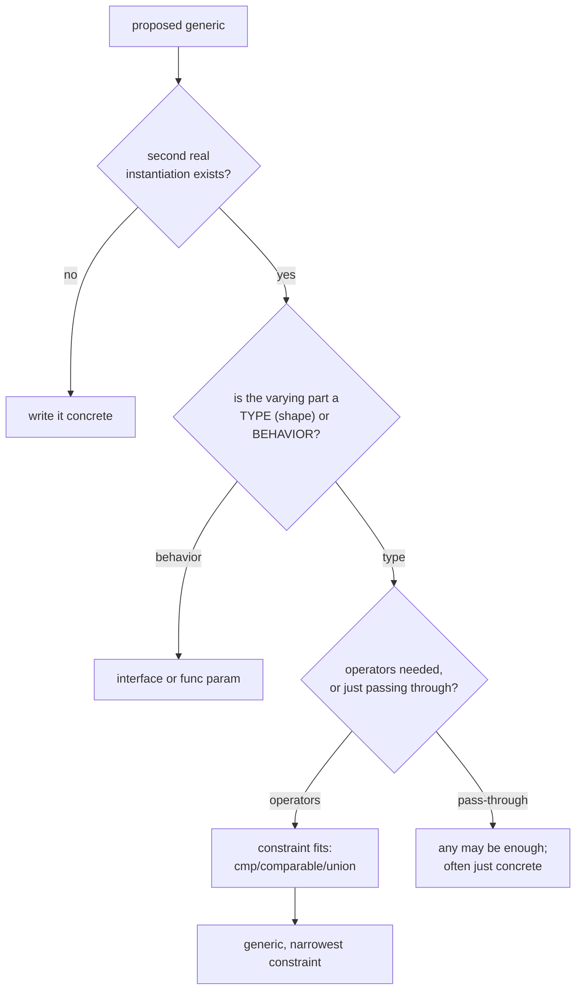

# When generics hurt

## Why Does This Matter?

Generics were added to Go because specific costs demanded a fix; they
were designed to stay boring the rest of the time. The failure mode
of a new tool is that it gets used where it shines *and* everywhere
else: the "second use" rule this section has applied since its first
chapter exists precisely because the failure mode is common, reviewable,
and preventable. This chapter is the anti-pattern gallery: each entry
is real code that compiles, passes tests, and makes the codebase
worse.

## Mental Model

The decision, as a review flowchart:



The two gates that filter out most misfires: **the second use gate**
(real instantiations that exist today, not hypothetical ones) and
**the type-vs-behavior gate** (generics parameterize shapes;
interfaces parameterize behavior).

## The anti-pattern gallery

### 1. The speculative abstraction

```go
// Written "for flexibility" with exactly one caller:
func Transform[In, Out any](items []In, fn func(In) Out) []Out
// called once, as Transform(users, userToDTO)
```

This is `for _, x := range items { out = append(out, fn(x)) }` with a
bracket tax. The second instantiation never arrives; the signature is
now part of the API surface ([06-packages-modules/06](../06-packages-modules/06-semantic-versioning.md))
for nothing. Write the loop. Extract when the second use walks in.

### 2. The generic type switch (erasure in costume)

```go
func Process[T any](v T) {
    switch x := any(v).(type) {      // the tell: any() conversion
    case User: ...
    case Order: ...
    default: panic("unsupported")
    }
}
```

The constraint says `any`; the body says "User or Order, else panic".
The type parameter bought nothing: this is the interface{} era's
runtime assertion with extra syntax ([01](01-why-generics-exist.md)).
Fixes, in order of honesty: separate functions per type; an
interface if the cases share behavior; generics if the cases share
*shape* (they do not here).

### 3. The five-parameter mystery

```go
func Sync[K comparable, V any, R any, C ~map[K]V, O ~func(V) R](
    src C, opt O) map[K]R
```

Every type parameter must earn its bracket. Here `C` is always
`map[K]V` (drop the constraint to the concrete map), `O` is a plain
function type (no bracket needed at all), and the whole thing reads
as `func Sync[K comparable, V any](src map[K]V, fn func(V) R) map[K]R`
after a breath. The smell test: **could a reader write a call site
from memory?** If the answer needs the definition open, the signature
is wrong.

### 4. Constraints that are just interfaces

```go
type ReadCloser2 interface {       // "a generic constraint!"
    Read(p []byte) (int, error)
    Close() error
}
func Pump[T ReadCloser2](r T) error
```

`io.ReadCloser` already exists; `Pump(r io.ReadCloser)` is the same
function with better docs and ecosystem interop. Method-only
constraints add nothing over interfaces except brackets: use
constraints when operators or underlying types are involved
([02](02-type-parameters-and-constraints.md)'s dividing line).

### 5. The generic god package

`genutils`, `gollections`, `fp`: packages of Map/Filter/Reduce/
Curry/Memoize recreating a functional language inside Go. The idioms
this handbook has taught (plain loops, small helpers, the stdlib's
slices/maps) beat functional-style composition in readability for
typical Go teams; the honest test is whether the package's users
write *clearer* call sites than they would with loops. Usually they
write the same loops, now with imports.

### 6. Generic state: caching per instantiation

```go
var cache = map[string]any{}

func Memoize[T any](key string, f func() T) T {
    if v, ok := cache[key]; ok { return v.(T) }   // erasure + assertion
    ...
}
```

Per-instantiation behavior smuggled through a global: two calls with
the same key and different T collide at runtime. State belongs in
instantiated types (`type Memo[T any] struct { ... }`) with a real
concurrency story ([03](03-generic-data-structures.md)).

### 7. The migration that forgot the readers

Mechanical conversions (`func Max(xs []int)` → `func Max[T
cmp.Ordered](xs []T)`) applied to every function with two call sites
of the same type: the signature got longer, every reader pays, and
no instantiation beyond the original one ever happens. The conversion
question is always "what do the *new* instantiations save", never
"can I".

## The readability tiebreakers

When a case is genuinely borderline, decide by:

- **Call-site reading**: `slices.Sort(users)` vs
  `sortUsers(users)`: the stdlib form wins because the brackets say
  "type-checked for you" and the name stays clean.
- **Error message quality**: a constraint violation at a call site
  should name the failing type plainly; deeply nested constraints
  produce error Gooblygook. Flatten, name, reuse
  ([02](02-type-parameters-and-constraints.md)).
- **Documentation load**: a generic API needs an example per tricky
  signature. If you cannot afford the examples, you cannot afford
  the API.
- **The junior-engineer test**: can a strong junior extend this
  correctly without a walkthrough? Generics that only seniors can
  touch are a team-speed bug.

## Common Mistakes

- **Bracket FOMO**: the belief that post-1.18 code "should" use
  generics somewhere. The stdlib itself added them in exactly two
  new packages and one builtin; that is the calibration.
- **Reviewing generics on compile-ability**: it compiles; the
  question was never compile-ability. The questions are the two
  gates above plus readability.
- **Rewriting working interfaces**: the pre-1.18 `io.Reader`-style
  seams were never broken; converting them to constraints usually
  loses ecosystem interop and buys nothing.
- **Forgetting `~` then blaming generics**: `int | int64` rejecting
  named types reads as "generics are awkward"; it is a constraint
  typo ([02](02-type-parameters-and-constraints.md)).

## Idiomatic Go

The standing calibration points, one more time: the stdlib grew
`slices`, `maps`, `cmp`, `min`/`max`, `clear`; the runtime grew
iterators (Go 1.23's `iter.Seq`, rangefunc) and generic methods
(Go 1.27). Everything else stayed concrete. The standard library's
own restraint *is* the style guide: when the team that wanted
generics enough to design them uses them this sparingly, the
baseline is set.

## Performance Considerations

The performance argument for generics (no boxing, no assertions) is
real but bounded: it applies to hot paths over value types. It does
not apply to one-call-site helpers, API boundaries, or anywhere
profiles do not point. The measure-first rule
([19-performance/01](../19-performance/01-measure-first.md)) applies
to the *introduction* of generics exactly as to any optimization.

## Concurrency Considerations

Generic concurrency helpers (sync wrappers, worker pools with
payload types) are legitimate and reviewed in
[03](03-generic-data-structures.md); the hurt-case is the generic
helper that hides state in package-level maps (gallery item 6): the
race is now per-instantiation and invisible to casual review. Run
`-race` across instantiations, not one.

## Security Considerations

The erasure-in-costume anti-pattern (item 2) is also the security
one: a type switch on `any` at a boundary re-opens the type-confusion
class generics closed. Boundaries should receive typed values with
validation ([21-security](../21-security/README.md)), not `any`
payloads with runtime dispatch.

## Testing Strategy

The testing cost of generics is low (instantiate the tests), but the
*review* cost is real: each additional type parameter multiplies the
instantiation table. A practical cap: if a helper needs more than
three instantiations to be tested honestly, that is a signal the
constraint (or the helper) is too broad.

## Interview Questions

1. *State the two gates every generic proposal must pass.*: A second
   real instantiation exists; the varying part is a type (shape), not
   behavior.
2. *Diagnose: a generic function whose body starts with
   `switch any(v).(type)`.*: Erasure in costume: the constraint lied;
   the real API is per-type functions or an interface.
3. *When is `any` as a constraint correct?*: When the body treats the
   value as opaque (store, pass through, count): Retry's result type,
   container elements. When the body needs to *do* something, the
   constraint must say what.
4. *How do you review a proposed generic API?*: Call-site readability,
   narrowest constraint, anchoring, example docs, second-use proof,
   and the concrete-first counterfactual.
5. *What is the stdlib's own generics usage tell you?*: Restraint:
   two packages plus builtins; everything else stayed concrete. That
   ratio is the intended diet, not the ceiling.

## Practice Exercises

1. Find or write a generic with one call site; convert to concrete;
   review the diff as if you were its maintainer in a year.
2. Take the five-parameter mystery and reduce it; write the error
   message each version produces for a wrong call and compare.
3. Rewrite the generic type switch three ways (functions, interface,
   generics-with-real-constraint); pick one and defend it in review
   comments.

## Further Reading

- [When to use generics](https://go.dev/blog/when-generics)
- [Go Proverbs](https://go-proverbs.github.io/) (Clear is better than
  clever, the tiebreaker of last resort)
- [slices/maps source](https://go.dev/src/slices/slices.go) (restraint
  as documentation)
