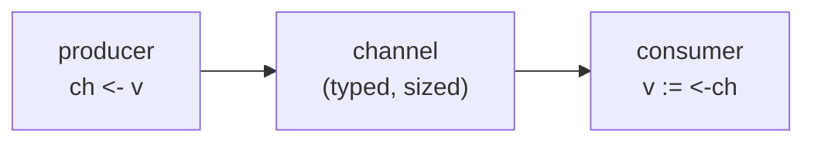
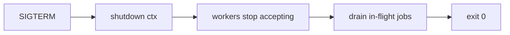

# Goroutines & channels

## Why Does This Matter?

Threads made concurrency something you rationed; goroutines make it
something you design with. When starting a task costs ~2KB and
microseconds, the abstractions change: you spawn per-connection handlers,
per-request work, per-message processing — and then you need a way for
those goroutines to *talk*. Channels are that way: typed conduits with
memory-model guarantees, not queues glued onto threads.

## Mental Model

A goroutine is a function running independently, scheduled by the Go
runtime onto OS threads (M:N scheduling — details in
[06-concurrency-vs-parallelism](06-concurrency-vs-parallelism.md)).

A channel is a typed pipe with two rules that make it safe:

1. A send happens-before the corresponding receive completes — values
   crossing a channel are fully visible to the receiver.
2. Channel operations synchronize: they are memory barriers, not just
   data transfer.



Unbuffered channels are *rendezvous*: send blocks until someone receives.
Buffered channels decouple the two up to capacity, then backpressure
kicks in.

## Channel ownership — the rule that prevents most bugs

One goroutine (the owner):

- instantiates the channel,
- writes to it,
- closes it,
- and passes it to others as receive-only.

Receivers never close, never write. With this discipline, "who closes
this channel?" — the most common channel question — has exactly one
answer by construction.

Directional types enforce it at compile time:

```go
func produce() <-chan int {   // returns receive-only view
	ch := make(chan int)
	go func() {
		defer close(ch)       // owner closes
		for i := 0; i < 5; i++ {
			ch <- i
		}
	}()
	return ch
}

func consume(in <-chan int) { // can only receive — misuse cannot compile
	for v := range in {
		fmt.Println(v)
	}
}
```

## Basic Example

```go
// examples/01-toy/main.go — stage 1: producer/consumer
package main

import (
	"fmt"
)

func main() {
	jobs := make(chan int) // unbuffered: rendezvous per job

	go func() {
		defer close(jobs) // owner produces and closes
		for i := 1; i <= 3; i++ {
			jobs <- i
		}
	}()

	for j := range jobs { // consumer: receive-only by position
		fmt.Println("processed", j)
	}
}
```

## Buffered vs unbuffered

| Property | Unbuffered | Buffered |
|---|---|---|
| Send returns when | receiver takes the value | value fits in buffer |
| Synchronization | every op is a meeting point | only when full/empty |
| Backpressure | absolute | after capacity |
| Use when | handshake, guarantee of receipt | decoupling bursts, worker handoff |

The default is unbuffered; add capacity when you can *say why* the number
is right ("4 workers × 1 in-flight job each" beats "looks fine at 100").

## Real-World Example — the results channel with WaitGroup

Two channels, two owners, one collector:

```go
// examples/02-workerpool/main.go (excerpt)
results := make(chan Result, len(inputs)) // buffered: workers never block

var wg sync.WaitGroup
for _, in := range inputs {
	wg.Add(1)
	go func(in string) {
		defer wg.Done()
		results <- Process(in) // never blocks: buffer sized to work count
	}(in)
}

wg.Wait()     // all sends done...
close(results) // ...so closing is safe: no one will send again

for r := range results { /* collect */ }
```

The subtle ordering — `wg.Wait()` *before* `close` — is the exact
sequence that prevents "send on closed channel" panics. The owner closes
only after every possible sender is provably finished.

## Production Example — stage 5 teaser

The full progression lives in `examples/05-jobprocessor`: bounded job
queue, N workers, context cancellation, per-job retries with backoff,
and a graceful drain on SIGTERM. Its shape:



## Common Mistakes

- **Closing from the receiver side** — the sender panics on the next
  send. Ownership solves this by construction.
- **Closing twice** — also panics. If multiple goroutines might
  "trigger" close, use `sync.Once` or restructure with a signal channel.
- **Sending on a closed channel** — panic. Closed channels are safe to
  *receive* from (drains, then yields zero values), never to send on.
- **Leaking the range loop**: `for range ch` never ends if nobody closes
  the channel — see [07-pitfalls](07-pitfalls.md).
- **Copy-pasting the wrong capacity**: a buffered channel sized to
  "infinity" hides backpressure until memory dies.

## Idiomatic Go

- Channels for *transfer of ownership* and signaling; mutexes for
  *protecting state in place* (see [04-sync-primitives](04-sync-primitives.md)).
- `chan struct{}` for pure signals — no payload, nothing to misuse.
- Return `<-chan T` from producers; accept `<-chan T` in consumers.
- "Don't communicate by sharing memory; share memory by communicating" —
  prefer designs where data has one owner at a time.

## Performance Considerations

- Channel operations cost ~100ns under contention — cheap, not free. A
  hot loop passing each item through a channel may lose to a mutex
  protecting a plain slice; benchmark (see [19-performance](../19-performance/)).
- Buffer size trades latency for throughput and memory; measure with
  realistic bursts.
- `chan struct{}` is the zero-cost signal.

## Concurrency Considerations

Everything in this chapter *is* concurrency; the three interactions to
watch: close semantics (panic on double close/send-after-close), the
happens-before guarantee (values sent are visible to receivers — no
additional locking needed for the payload), and nil channels (every
operation blocks forever — a feature for disabling select cases, a
footgun everywhere else).

## Security Considerations

Channels carry whatever you send.Sending sensitive payloads (tokens, PII)
through broadly-shared channels extends their lifetime and copy surface;
prefer passing identifiers and fetching secrets at point of use (see
[21-security](../21-security/)).

## Testing Strategy

Concurrency tests must be deterministic. Techniques: sized channels to
synchronize steps, `time.Sleep`-free assertions, and the `-race` flag on
every run. The examples' tests demonstrate: each stage's test asserts
*ordering* and *completion*, not timing.

## Interview Questions

1. *What happens when you send on a closed channel? Receive? Close
   twice?* — panic / drains then zero values / panic.
2. *How do you know when it's safe to close a channel?* — When no sender
   can send again: ownership discipline, or WaitGroup-then-close.
3. *Unbuffered vs buffered — pick one for a job queue and justify.* —
   Unbuffered when the consumer must not race ahead (backpressure by
   design); buffered when bursts are expected and capacity is computed
   from worker count.
4. *What does `close` actually do?* — Marks the channel done: receivers
   drain remaining values then get zero values immediately; it is a
   broadcast, usable for signaling completion.

## Practice Exercises

1. Modify stage 1 so the consumer is also a producer (echo server); keep
   single ownership by adding a dedicated closer goroutine.
2. Write a function `Merge(cs ...<-chan T) <-chan T` (fan-in) that closes
   its output when all inputs close, with no leaks — then test it with
   the race detector.
3. Deliberately create a "send on closed channel" panic in a scratch
   file; read the stack trace top to bottom.

## Further Reading

- [Go Memory Model](https://go.dev/ref/mem) — the happens-before guarantees
- [Go Concurrency Patterns](https://go.dev/talks/2012/concurrency.slide) — Rob Pike's talk that frames the model
- [Pipeline and cancellation](https://go.dev/blog/pipelines) — the canonical stages tutorial
