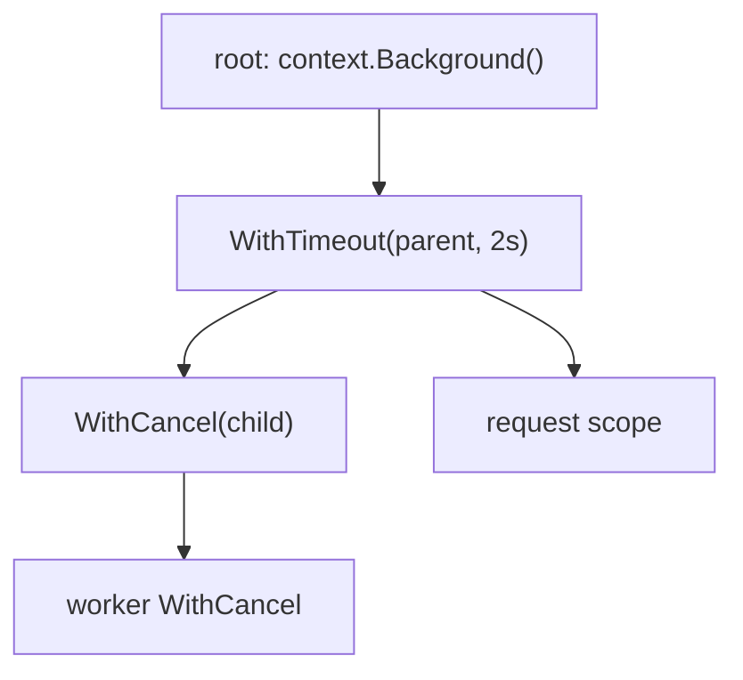

# Context

## Why Does This Matter?

Before context (Go 1.7), cancellation was a mess of done-channels with
incompatible shapes, and deadlines were a per-library invention. Context
standardized one thing every layer of every service needs: *the ability
to say "stop waiting, it's over" and have every layer hear it.* It is the
connective tissue of production Go: you will find it in every signature
from HTTP handlers to database drivers.

## Mental Model

`context.Context` is an immutable, tree-structured cancellation token:



- A context carries: cancellation signal, deadline, and (rarely)
  request-scoped values.
- Children derive from parents; canceling a parent cancels all
  descendants. There is no way to *un*-cancel.
- `Done() <-chan struct{}` closes when canceled: it's a broadcast all
  descendants can await.
- `Err()` says why: `Canceled` or `DeadlineExceeded`.

Rules that make it work across a codebase:

1. First parameter, conventionally named `ctx`.
2. Pass it through every call that can block.
3. Never store it in structs (config-like structs excepted, and even
   then: don't).
4. It is not for optional function parameters: that's what values are.

## How It Works

```go
// Construction: from Background (roots) or TODO (placeholder),
// then With* wrappers.
ctx, cancel := context.WithTimeout(ctx, 2*time.Second)
defer cancel() // ALWAYS: releases the child's timer/resources even on success
```

`defer cancel()` even when the context expires naturally: the context
keeps its timer and parent link alive until cancel runs. Forgetting it
is a slow leak in long-lived processes: subtler than a goroutine leak
but the same species.

Checking for cancellation in compute loops (the only case where context
doesn't flow automatically):

```go
for i, item := range items {
	if i%128 == 0 {
		if err := ctx.Err(); err != nil {
			return err // cooperative checkpoint
		}
	}
	process(item)
}
```

Blocking operations take ctx natively (`db.QueryContext`, `req.WithContext`);
your own channels need explicit multiplexing:

```go
select {
case ch <- item:
case <-ctx.Done():
	return ctx.Err()
}
```

## Basic Example: deadline through layers

```go
func (s *Store) GetUser(ctx context.Context, id string) (User, error) {
	ctx, cancel := context.WithTimeout(ctx, 300*time.Millisecond)
	defer cancel()
	return s.repo.User(ctx, id) // repo passes it to the driver
}
```

If the driver honors context (all `database/sql` drivers must), the query
is abandoned at 300ms, and `ctx.Err()` returns
`context.DeadlineExceeded`, which the caller classifies per the error
chapter's rules.

## Real-World Example: per-request budget split

A handler with a total budget shared across two calls, then a critical
section protected by its own smaller deadline:

```go
func HandlePayment(ctx context.Context, req Request) error {
	ctx, cancel := context.WithTimeout(ctx, 800*time.Millisecond)
	defer cancel()

	if err := s.risk.Check(ctx, req); err != nil { // shares the 800ms
		return err
	}
	authCtx, authCancel := context.WithTimeout(ctx, 200*time.Millisecond)
	defer authCancel() // auth must answer fast even if the budget is large
	return s.authorize(authCtx, req)
}
```

Note the asymmetry: the parent budget bounds the *whole* operation; the
child bounds *this call* tighter. Deadlines only shrink down the tree.

## Production Example: shutdown coordination

```go
func main() {
	ctx, stop := signal.NotifyContext(context.Background(), os.Interrupt, syscall.SIGTERM)
	defer stop()

	srv := &http.Server{Addr: ":8080", Handler: routes()}
	go func() { _ = srv.ListenAndServe() }()

	<-ctx.Done() // SIGTERM/SIGINT received

	shutdownCtx, cancel := context.WithTimeout(context.Background(), 10*time.Second)
	defer cancel()
	if err := srv.Shutdown(shutdownCtx); err != nil {
		log.Printf("graceful shutdown failed: %v", err)
	}
}
```

The two-context pattern matters: the shutdown context derives from
`Background`, *not* the signal context: the signal already fired; a new
budget is needed for the drain. Full treatment in
[22-production-go](../22-production-go/).

### Context values: the narrow, honest use

```go
type ctxKey int

const requestIDKey ctxKey = iota

func WithRequestID(ctx context.Context, id string) context.Context {
	return context.WithValue(ctx, requestIDKey, id)
}

func RequestID(ctx context.Context) string {
	id, _ := ctx.Value(requestIDKey).(string)
	return id
}
```

Legitimate: correlation IDs, auth principals, tracing spans: values
that are genuinely *request-scoped metadata* consumed by middleware and
infrastructure, not by business logic. Anti-pattern: passing options or
domain data ("current user's settings") through context: that hides
dependencies. Use unexported key types (shown above) to prevent
collisions.

## Common Mistakes

- **Storing ctx in a struct field**: now every method's lifetime is
  ambiguous; pass it explicitly.
- **Forgetting `defer cancel()`**: timer + parent-link leak.
- **Deriving request-scoped contexts in background goroutines** after
  the request ended: the context is already canceled; the goroutine
  dies instantly. For work that outlives the request, detach
  deliberately: `context.WithoutCancel(ctx)` (Go 1.21+) keeps values,
  drops cancellation, and document why that's safe.
- **`context.Background()` in handlers** instead of using the request's
  context (`r.Context()`): the request's cancellation, deadline, and
  values are lost.
- **Swallowing `ctx.Err()`** and returning something else: callers
  check `errors.Is(err, context.DeadlineExceeded)` to make retry
  decisions; preserve it (wrap with `%w`).
- **Using context for optional arguments**: invisible signatures.

## Idiomatic Go

```go
// The signature: ctx first, then inputs, then options.
func (s *Service) Transfer(ctx context.Context, from, to AccountID, minor int64) error

// The check-and-act for your own blocking work.
select {
case <-s.done:
	return ErrStopped
case <-ctx.Done():
	return ctx.Err()
case r := <-s.results:
	return s.handle(r)
}
```

## Performance Considerations

- `context.WithValue` allocates a wrapper per call: fine at request
  rate, avoid in hot inner loops.
- Deadline contexts allocate a timer each; reusing a single derived
  context for a batch of calls beats per-call deadlines when policy
  allows.
- `ctx.Done()` returns the same channel each call; caching it in a local
  variable inside hot select loops is both faster and clearer.

## Concurrency Considerations

- Context is safe for concurrent use: that's the point: one tree,
  many watchers.
- `Done()` closing is a broadcast: N goroutines can all select on the
  same channel and all wake.
- A canceled parent never un-cancels; if you need a "cancelable
  region" inside a canceled tree, you need a detached context
  (`WithoutCancel`) and a very good comment.

## Security Considerations

- Auth principals in context values must be set at the authentication
  boundary only; reading them from untrusted inputs elsewhere is an
  escalation vector.
- Values ride along on every wrapped context: including ones you log or
  serialize. Keep secrets out (see [21-security](../21-security/)).
- Context timeouts are your anti-slow-loris and anti-deadlock budget;
  absence of deadlines is a resource-exhaustion risk, not a feature.

## Testing Strategy

- `context.WithTimeout(ctx, 50*time.Millisecond)` in tests to verify
  deadline behavior deterministically.
- Test that cancellation *propagates*: cancel the parent, assert the
  child's `Done()` closes.
- In service tests, cancel the context mid-flight and assert clean error
  propagation (the errors section's examples do exactly this).

## Interview Questions

1. *Why is ctx the first parameter?*: Convention enables tooling,
   reviews, and pipeline linting; uniformity is the feature.
2. *What happens if you don't call cancel?*: The context's resources
   (timer, parent-child link) live until expiry: a leak in
   long-running processes.
3. *How do you pass a value that outlives a request's cancellation?*,
   `context.WithoutCancel` (Go 1.21+), keeping values but dropping the
   cancellation link; discuss when that's appropriate (audit writes) vs
   dangerous (retrying unsafe work).
4. *Design a request flow with a total budget and a tighter budget on
   the risk check.*: The per-request budget example; grades on
   deadline-shrink semantics.

## Practice Exercises

1. Add context propagation to a codebase function that doesn't accept
   it (scan/loop + select around the blocking op). Assert with a test
   that canceling the context returns before completion.
2. Build a middleware that injects a request ID and a logger into the
   context; extract both in a handler. Use unexported key types.
3. Write a test proving `defer cancel()` matters: run 10k
   `WithTimeout`+cancel in a loop vs 10k without; observe goroutine/timer
   counts with runtime metrics.

## Further Reading

- [Go Concurrency Patterns: Context](https://go.dev/blog/context): official blog
- [context package docs](https://pkg.go.dev/context): read the package comment fully; it's the spec
- [Go 1.21: WithoutCancel etc.](https://go.dev/doc/go1.21): the detach helpers
