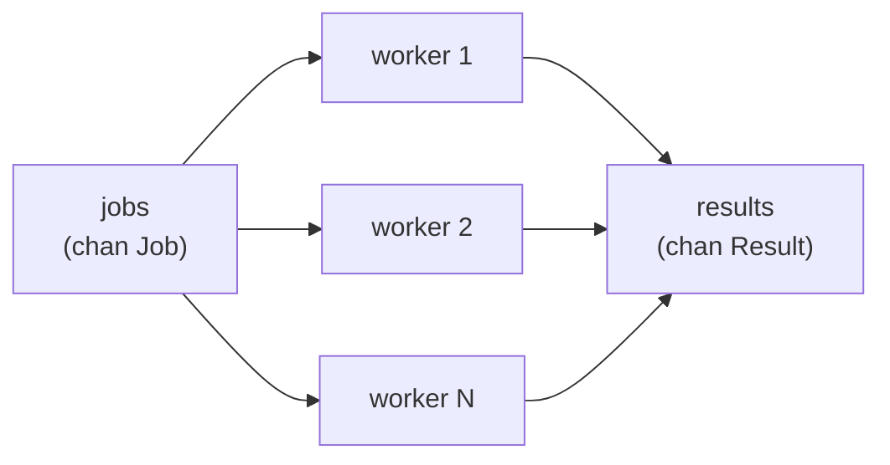

# Patterns

## Why Does This Matter?

Goroutines and channels are nouns and verbs; patterns are sentences. The
five shapes in this chapter: worker pool, pipeline, fan-out/fan-in,
semaphore, rate limiter: cover the overwhelming majority of production
concurrency. Everything here has a runnable, tested counterpart in
`examples/`, scaled from toy to production job processor.

## Worker pool: bounded parallelism

**Problem:** 100k jobs, 8-CPU machine. Unbounded spawning: 100k
goroutines, memory pressure, and a scheduler thrash. The pool: N
workers, one queue, deterministic memory.



```go
func Pool(ctx context.Context, workers int, jobs <-chan Job, results chan<- Result) {
	var wg sync.WaitGroup
	wg.Go(func() {}) // placeholder; see loop below
	wg = sync.WaitGroup{}

	for i := 0; i < workers; i++ {
		wg.Add(1)
		go func(id int) {
			defer wg.Done()
			for {
				select {
				case job, ok := <-jobs:
					if !ok {
						return // queue closed and drained
					}
					results <- process(ctx, job)
				case <-ctx.Done():
					return // cancellation beats backlog
				}
			}
		}(i)
	}
	go func() {
		wg.Wait()
		close(results) // last senders done: safe close (owner = pool)
	}()
}
```

Two decisions embedded: the select-with-ctx (workers leave promptly
instead of draining a huge queue on cancel) and the closer goroutine
(the pool owns `results` and closes it exactly when sends are provably
done).

## Pipeline: stages with backpressure

Each stage: receive, transform, send. Unbuffered (or small) channels
between stages make the *slowest stage* throttle the whole line: that's
backpressure by construction:

```go
func Generate(ctx context.Context, n int) <-chan int {
	out := make(chan int)
	go func() {
		defer close(out)
		for i := 0; i < n; i++ {
			select {
			case out <- i:
			case <-ctx.Done():
				return
			}
		}
	}()
	return out
}

func Square(ctx context.Context, in <-chan int) <-chan int {
	out := make(chan int)
	go func() {
		defer close(out)
		for v := range in {
			select {
			case out <- v * v:
			case <-ctx.Done():
				return
			}
		}
	}()
	return out
}

// compose: for v := range Square(ctx, Generate(ctx, 10)) { ... }
```

The pattern's contract: **every stage closes its output when its input
closes or ctx cancels.** Break the contract and you leak.

## Fan-out / fan-in: parallelize one stage

When a pipeline stage is the bottleneck, replicate it (fan-out) and
merge (fan-in):

```go
// Fan-out: N independent Squares reading one input.
outs := make([]<-chan int, workers)
for i := range outs {
	outs[i] = Square(ctx, in)
}

// Fan-in: one output channel closing when all inputs close.
func FanIn(ctx context.Context, ins ...<-chan int) <-chan int {
	out := make(chan int)
	var wg sync.WaitGroup
	wg.Add(len(ins))
	for _, in := range ins {
		go func(in <-chan int) {
			defer wg.Done()
			for v := range in {
				select {
				case out <- v:
				case <-ctx.Done():
					return
				}
			}
		}(in)
	}
	go func() {
		wg.Wait()
		close(out)
	}()
	return out
}
```

`wg.Wait()` then `close(out)`: the same ownership logic as the pool,
reused.

## Semaphore: bounded access to anything

A buffered channel of tokens; acquire = send, release = receive. Use it
for anything a worker pool doesn't naturally bound: DB connections,
upstream calls, disk handles.

```go
type Semaphore chan struct{}

func New(n int) Semaphore { return make(Semaphore, n) }

func (s Semaphore) Acquire(ctx context.Context) error {
	select {
	case s <- struct{}{}: // take a token
		return nil
	case <-ctx.Done():
		return ctx.Err() // or queue with wait, your policy
	}
}

func (s Semaphore) Release() { <-s }
```

`golang.org/x/sync/semaphore` adds weighted acquisition; the shape and
the reasoning are the same.

## Rate limiting: pacing, not just bounding

`golang.org/x/sync` + `time`: a ticker-based limiter is the simplest
correct form:

```go
func RateLimited(ctx context.Context, jobs <-chan Job, rate time.Duration) {
	tick := time.NewTicker(rate)
	defer tick.Stop()
	for job := range jobs {
		select {
		case <-tick.C: // one token per tick
			process(job)
		case <-ctx.Done():
			return
		}
	}
}
```

For token-bucket semantics (bursts allowed, sustained rate bounded),
`golang.org/x/time/rate.Limiter` is the standard: `limiter.Wait(ctx)`
before each call, `limiter.Allow()` for non-blocking checks, per-host
limiters in a map with their own mutex.

## Choosing the pattern

| Situation | Pattern |
|---|---|
| Many independent units of work, bounded resources | worker pool |
| Multi-step transformation of a stream | pipeline |
| One stage too slow, work is independent | fan-out/fan-in |
| Guard a shared resource not tied to job count | semaphore |
| Must not exceed N calls/sec to an API | rate limiter |
| Merge results from many sources | fan-in |
| One of several replicas answers | select race (ch. 02) |

## Common Mistakes

- **Pool with unbuffered jobs channel + slow submitter**: submitters
  block on each handoff; size the buffer from worker count × in-flight.
- **Pipelines without ctx**: one cancel and every stage drains or dies
  ungracefully; the select-in-send-loop is non-negotiable.
- **Fan-in without the closer goroutine**: either a leak (no close) or
  a panic (close before waiters finish).
- **Rate limiter shared across all hosts**: one slow API starves
  others; scope limiters per dependency.
- **Semaphore held across panics**: `defer release()` or the token
  leaks permanently.

## Idiomatic Go

- Prefer the *standard library + x/sync* versions in production
  (`errgroup` for errors, `semaphore` for weights, `rate` for pacing);
  hand-rolled versions are for learning and special cases.
- Patterns compose: pool → pipeline → fan-in is a normal service's
  processing core.
- Every pattern here returns via channels it owns; none leaks a
  goroutine when ctx cancels. That property is the definition of done.

## Performance Considerations

- Channel-heavy pipelines serialize on the slowest stage: profile
  stages, then fan-out the slow one.
- Buffer sizing: from measured burst sizes, never folklore. Start
  unbuffered; add only with a reason.
- Goroutine startup is cheap but not free at per-item rates: pool when
  items are small (see [19-performance](../19-performance/)).

## Concurrency Considerations

- Ordering: pools and fan-out destroy ordering. If order matters, tag
  items with sequence numbers and reorder at the sink, or partition
  work so one worker owns a sequence (Kafka-style partitioning; see
  [18-kafka-with-go](../18-kafka-with-go/)).
- Cancellation must reach *every* stage; a single unreachable select is
  a leak path.
- Backpressure vs buffering vs dropping is a policy decision with
  failure-mode consequences: make it explicit, not emergent.

## Security Considerations

- Unbounded queues are memory-exhaustion vectors; bound them and shed
  load explicitly (see stage 4 example).
- Work processed from untrusted sources (webhooks, uploads) gets
  per-source limits, not just global ones.

## Testing Strategy

- Deterministic tests: fixed worker counts, buffered channels as
  barriers, `-race` always.
- Leak tests: cancel mid-flight and assert goroutine count returns to
  baseline (`runtime.NumGoroutine` before/after, or goleak).
- Load tests as benchmarks with `b.RunParallel` to expose contention
  shapes.

## Interview Questions

1. *Design a service that processes 1M uploaded images with 4GB RAM.*,
   Worker pool + streaming stages + bounded buffers; the answer's grade
   is in *bounds*, not throughput claims.
2. *How do you keep ordering while parallelizing?*: Sequence tagging +
   reorder, or partition-by-key ownership.
3. *Where does backpressure come from in Go pipelines?*: Blocking sends
   on small channels; contrast with pre-allocated buffers hiding the
   pressure until OOM.
4. *Implement a timeout on the whole pipeline without leaking stages.*,
   ctx through every stage; the grade is the select-in-send contract.

## Practice Exercises

1. Extend stage 2 (worker pool) with per-worker panic recovery and a
   metric; prove with a test that one panicking job doesn't kill the
   pool.
2. Compose Generate→Square→FanIn(4)→collect; cancel at 50% and assert
   goroutines return to baseline.
3. Wrap stage 5's processor with `rate.Limiter` per external dependency;
   benchmark before/after under a burst workload.

## Further Reading

- [Go Concurrency Patterns](https://go.dev/blog/pipelines): pipelines/fan-in/fan-out
- [Advanced Go Concurrency Patterns](https://talks.golang.org/2013/advconc.slide): Sameer Ajmani's cancellation talk
- [golang.org/x/sync](https://pkg.go.dev/golang.org/x/sync): errgroup, semaphore, singleflight
