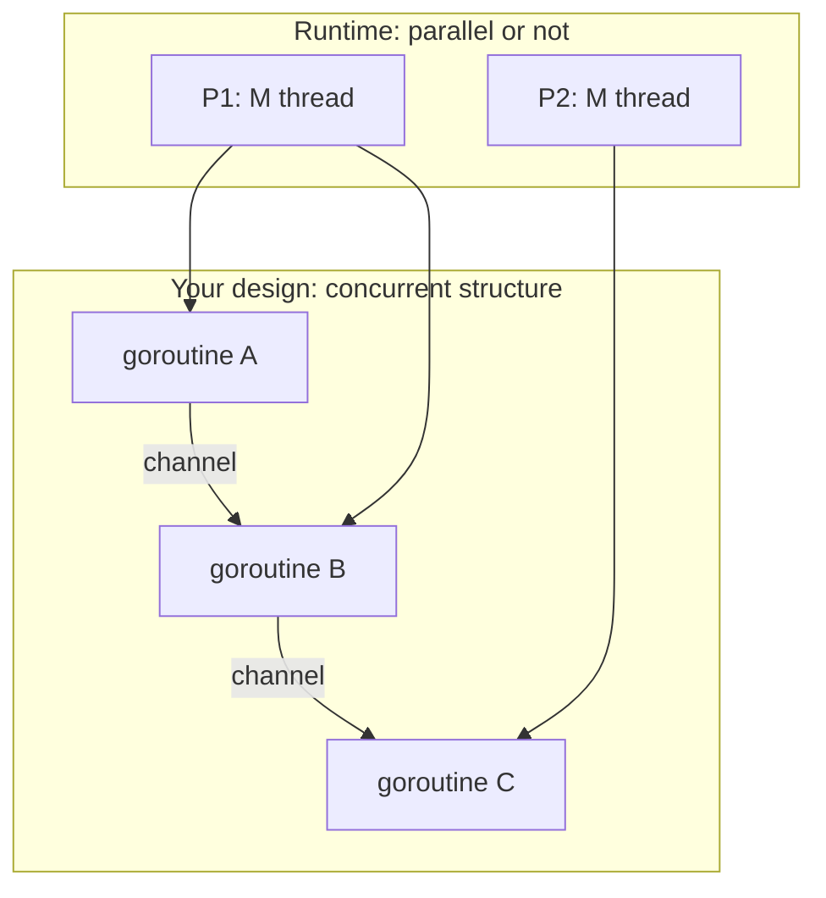

# Concurrency vs parallelism

## Why Does This Matter?

Interviewers ask this to find out whether you understand *what the Go
scheduler actually does*, and engineers who conflate the two write
programs that are concurrent but not fast, or fast but unsafe. The
distinction also explains why a single-CPU container still benefits from
goroutines, and why 100 goroutines on 4 cores is normal and good.

## Mental Model

Rob Pike's framing, still the sharpest:

> **Concurrency is about structure; parallelism is about execution.**

- **Concurrency**: designing the program as independently progressing
  components. A property of *your design*.
- **Parallelism**: many components literally executing at the same
  instant on many cores. A property of the *hardware at runtime*.

A concurrent program may run in parallel (many cores), interleaved (one
core), or serially (one component alive at a time): correctness should
not depend on which. That independence is the design prize: it makes the
program correct under any scheduler mood.



## How Go gets parallelism

The scheduler multiplexes goroutines (G) onto OS threads (M) via logical
processors (P), each holding a local run queue:

| Object | What it is | Default |
|---|---|---|
| G | goroutine: stack, PC, state | ~2-8KB stack, grows |
| M | OS thread | created on demand |
| P | scheduling slot; required to run Go code | `GOMAXPROCS` |

- `GOMAXPROCS` defaults to CPU count. In containers with CPU limits, set
  it to the *quota* (or use `runtime/automaxprocs`-style libs): a
  2-CPU-limit pod with 64-host GOMAXPROCS oversubscribes and adds
  latency (see [22-production-go](../22-production-go/)).
- Work stealing rebalances queues; syscalls and cgo hand off their P so
  other goroutines keep running.
- A goroutine blocks in a syscall → its M blocks, but the P migrates to
  another thread. Blocking in *Go code* (channel, mutex) just parks the
  G; no thread is involved. This is why blocking style is cheap in Go.

## When concurrency helps even without parallelism

- **I/O-bound work**: while goroutine A waits on the network, B runs.
  One core, huge win: this is the web-server case.
- **Structuring**: pipelines and cancellation make complex flows
  comprehensible.
- **Responsiveness**: a UI/CLI stays interactive while work proceeds.

When it doesn't: CPU-bound work on 1 core gains nothing but overhead.
Parallelism (more Ps) is what speeds that up, and then synchronization
costs matter ([04-sync-primitives](04-sync-primitives.md)).

## Basic Example: same code, two schedulings

```go
// CPU-bound: parallelism helps (up to cores)
func sumSquares(n int) int64 {
	var total atomic.Int64
	var wg sync.WaitGroup
	for i := range runtime.GOMAXPROCS(0) { // one goroutine per P
		wg.Go(func() {
			var s int64
			for j := i; j < n; j += runtime.GOMAXPROCS(0) {
				s += int64(j) * int64(j)
			}
			total.Add(s)
		})
	}
	wg.Wait()
	return total.Load()
}
```

Run with `GOMAXPROCS=1` and `GOMAXPROCS=8` and benchmark: wall time
changes (parallelism), the code doesn't (concurrency).

## Real-World Example: the I/O-bound service

A typical Go API server: one goroutine per connection (net/http does
this), each waiting mostly on DBs and upstreams. 10k concurrent
requests ≈ 10k goroutines ≈ tens of MB: where the thread-per-request
model needed thread pools and careful tuning. The scheduling insight
also explains **why a small `GOMAXPROCS` still serves high RPS**: the
goroutines are *waiting*, not running; parallelism isn't the bottleneck,
dependency latency is.

## Production Example: sizing and observing

```go
import _ "net/http/pprof" // adds /debug/pprof to the default mux

// Expose scheduler + queue metrics; watch them during incidents:
//   /debug/pprof/goroutine?debug=1 : count and stacks (leak triage)
//   runtime.NumGoroutine() as a metric over time
//   schedlatency from runtime/metrics (scheduler latency histogram)
```

Ops rules of thumb:

- Goroutine counts flat and matching concurrency of requests = healthy.
- Count growing without traffic growth = leak
  ([07-pitfalls](07-pitfalls.md)).
- High scheduler latency + few Ps = GOMAXPROCS misconfigured for the
  container.

## Common Mistakes

- **"More goroutines = faster."** Past the resource limit, it's slower:
  scheduling overhead, memory, contention. Bound concurrency (pools,
  semaphores) and *measure*.
- **Setting GOMAXPROCS by folklore** in containers; derive it from the
  CPU quota.
- **Confusing "concurrent-safe" with "parallel-fast"**: a channel-based
  design that's correct may still serialize on one channel; profile
  before praising.
- **Assuming goroutine order**: the scheduler gives no ordering
  guarantees between ready goroutines. Ever.

## Idiomatic Go

- Write the *concurrent structure* first (stages, ownership, ctx);
  let the runtime decide parallelism.
- Let `net/http` own its per-connection goroutines; don't spawn your own
  per-request duplicates.
- Treat `GOMAXPROCS(0)` as "how many CPU-bound workers": not "how many
  goroutines should I start."

## Performance Considerations

- Parallel speedup follows Amdahl: the serial fraction (locks, single
  channels, shared maps) caps it. Profile the serial parts.
- False sharing: hot counters on one cacheline serialize across cores,
  pad or shard ([04-sync-primitives](04-sync-primitives.md)).
- `GOMAXPROCS=1` is a legitimate *test* setting to surface ordering
  assumptions; never a production default for a server.

## Concurrency Considerations

This chapter *is* the concurrency context: scheduling is cooperative at
function-call boundaries and pre-emptive at loops (Go 1.14+ async
preemption), so tight CPU loops do yield, but relying on preemption
timing for correctness is a bug, not a design.

## Security Considerations

- Resource exhaustion again: concurrency *is* a resource. Authenticated
  and anonymous request paths need separate bounds (see
  [21-security](../21-security/)).
- Scheduler-visible timing side channels are exotic but real in
  multi-tenant settings; rely on process isolation for true separation.

## Testing Strategy

- Test correctness under `GOMAXPROCS=1` and `-race` (different
  interleavings): both belong in CI for concurrency-heavy packages.
- Benchmark scaling curves (1, 2, 4, 8 Ps) to see where the serial
  fraction bites.
- Deterministic interleaving tests use tiny channels as fences; never
  sleeps.

## Interview Questions

1. *Explain concurrency vs parallelism with an example that is
   concurrent but not parallel.*: Pipeline on one core; grading on
   "structure vs execution."
2. *What are G, M, P and what happens on a blocking syscall?*: The table
   above; the P hand-off is the insight interviewers want.
3. *Why does a Go server handle 10k connections on 4 cores?*: I/O wait
   is the norm; goroutines park cheaply; parallelism covers bursts.
4. *Your container has a 2-CPU limit but the host has 64 cores: what's
   wrong and what do you do?*: GOMAXPROCS mismatch; set to quota,
   observe scheduler latency.

## Practice Exercises

1. Benchmark `sumSquares` at GOMAXPROCS 1/2/4/8; plot the curve and
   identify where it flattens.
2. Write a program that is concurrent on one core but *slower* than its
   serial version; explain each source of overhead you added.
3. Set GOMAXPROCS to the CPU quota in a container you run; measure p99
   latency before/after under load.

## Further Reading

- [Concurrency is not Parallelism](https://go.dev/talks/2012/waza.slide): Rob Pike's talk
- [Scalable Go Scheduler Design Doc](https://docs.google.com/document/d/1TTj4T2JO42uD5ID9e89oa0sLKhJYD0Y_kqxDv3I3XMw): the GMP design doc
- [runtime package docs](https://pkg.go.dev/runtime): GOMAXPROCS and friends
