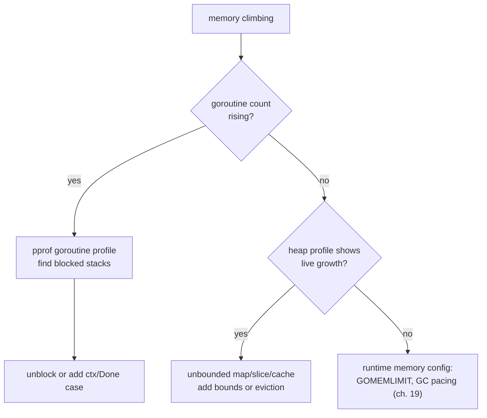

# Pitfalls

## Why Does This Matter?

Concurrency bugs are the expensive ones: rare, unreproducible, and
discovered in production by users. Every pitfall here has a detection
method and a fix — the difference between an engineer who has been burned
and one who hasn't is knowing the detection *before* the burn.

## Deadlock — everyone waits forever

**The shape:** circular waiting. Goroutine A holds lock 1, wants lock 2;
B holds lock 2, wants lock 1.

```go
// DEADLOCK: inconsistent lock ordering
func transferAtoB(a, b *Account) {
	a.mu.Lock()
	b.mu.Lock() // A: 1→2
	...
}
func transferBtoA(a, b *Account) {
	b.mu.Lock()
	a.mu.Lock() // B: 2→1  — boom, occasionally, forever
	...
}
```

**Fix — global ordering:** always acquire in a canonical order (e.g., by
account ID):

```go
func transfer(x, y *Account, minor int64) {
	first, second := x, y
	if x.id > y.id { // total order by id
		first, second = y, x
	}
	first.mu.Lock()
	defer first.mu.Unlock()
	second.mu.Lock()
	defer second.mu.Unlock()
	// do the move under both locks
}
```

**Other shapes:**

- Unbuffered channel send with no receiver (the runtime panics only when
  *all* goroutines are asleep — partial deadlocks hang silently).
- Locking a non-reentrant mutex twice in one goroutine.
- `wg.Wait()` before `wg.Add` (or Add inside the goroutine).
- select with no ready case and no default/Done.

**Detection:** the runtime's `all goroutines are asleep - deadlock!`
panic for total deadlocks; for partial ones, pprof's goroutine profile
shows thousands of stacks parked at the same line — the smoking gun.

## Data race — the undefined behavior

**The definition:** two goroutines access the same memory, at least one
write is involved, and there is no synchronization ordering the accesses.
Under the Go memory model, the result is undefined — values can tear,
reads can see stale data, and it can *work in tests for months*.

```go
// RACE: unsynchronized map access
var cache = map[string]string{} // shared

func Get(k string) string { return cache[k] }     // read
func Set(k, v string)    { cache[k] = v }         // write — concurrent map writes
                                                  // are a runtime FATAL, not just UB
```

**Fix — pick one:**

```go
// 1. Mutex
var mu sync.Mutex
mu.Lock(); defer mu.Unlock()

// 2. Ownership: only one goroutine touches the map; others send requests
//    over a channel. (Transfer beats protection for long-lived state.)

// 3. Sync primitives sized to the access pattern (ch. 04).
```

**Detection — the race detector, your CI staple:**

```bash
go test -race ./...
go build -race && ./myserver   # run a whole service under it (2-10x slower)
```

The detector instruments memory accesses and reports the two colliding
stacks:

```text
WARNING: DATA RACE
Write at 0x00c0000a4018 by goroutine 7:
  main.Set()
      /app/main.go:14 +0x3c
Previous read at 0x00c0000a4018 by goroutine 6:
  main.Get()
      /app/main.go:10 +0x4c
```

Read it as an incident report: both stacks, both allocation sites. Fix
the *cause* (missing synchronization), not the symptom (add a sleep).

**Race vs race condition:** every data race is a race condition; not
every race condition is a data race. Two goroutines both checking-then-
setting a file lock via well-synchronized memory can still be a race
condition (logical interleaving bug) — the detector won't see it;
invariants and tests must.

## Goroutine leak — the slow bleed

**The shape:** a goroutine blocked forever on something that never
arrives. Classic sources:

```go
// 1. Producer with no consumer
ch := make(chan int)
go func() { ch <- 42 }() // blocks forever if nobody receives

// 2. Receive from a channel nobody closes
<-results // worker waits forever after its caller returned

// 3. Ignoring cancellation
go func() {
	resp, err := client.Do(req) // no ctx: runs to completion even if abandoned
	...
}()
```

Leaks are silent until they aren't: memory creeps, file descriptors
exhaust, GC pauses grow. **Detection:**

```go
// In tests — the baseline pattern (use goleak in real projects):
func TestMain(m *testing.M) {
	before := runtime.NumGoroutine()
	code := m.Run()
	after := runtime.NumGoroutine()
	if after > before {
		fmt.Fprintf(os.Stderr, "leaked goroutines: %d → %d\n", before, after)
		os.Exit(1)
	}
	os.Exit(code)
}

// In production — pprof goroutine profile:
//   curl localhost:6060/debug/pprof/goroutine?debug=1
//   Look for many identical stacks = blocked at the same spot.
```

**Fix — the ownership rule:** whoever starts a goroutine must provide
its exit path. In practice: ctx on every blocking call, select around
sends/receives that might wait, close channels from the owner.

## Starvation — some goroutine never wins

**The shapes:**

- A hot mutex one goroutine hammers while others wait indefinitely
  (queue-jumping is possible in Go's mutex — it's not FIFO).
- A chatty channel case in a select starving a rare-but-critical case
  (random pick mitigates, doesn't guarantee).
- Scheduler starvation: tight loops without function calls pre-1.14 —
  fixed by async preemption, but relying on preemption timing is still
  a design smell.

**Fix:** fairness by design — round-robin queues, weighted semaphores,
or dedicating a goroutine to the critical work instead of fighting for
shared ones. Measure with mutex/block profiles:

```bash
go test -blockprofile=block.out ./...
go test -mutexprofile=mutex.out ./...
go tool pprof block.out   # where is time spent waiting, and by whom
```

## Basic Example — a bug clinic

Four bugs in six lines; find them all:

```go
func bad() {
	var wg sync.WaitGroup
	ch := make(chan int) // (1) unbuffered, no owner/closer
	for i := 0; i < 3; i++ {
		wg.Add(1)
		go func() {
			defer wg.Done()
			ch <- i // (2) pre-1.22: capture bug; (3) send may block forever
		}()
	}
	wg.Wait()
	close(ch) // (4) fine here only because wg.Wait precedes it — fragile
	for v := range ch {
		fmt.Println(v)
	}
}
```

Fixed:

```go
func good() {
	ch := make(chan int)
	var wg sync.WaitGroup
	for i := 0; i < 3; i++ {
		wg.Add(1)
		go func() {
			defer wg.Done()
			defer func() { if i == 2 { close(ch) } }() // last sender closes... still fragile!
			ch <- i
		}()
	}
	wg.Wait()
}
```

(That "fix" is deliberately still awkward — the *real* fix is ownership:
one goroutine produces and closes; workers only consume. When you need
multiple senders, collect with a WaitGroup and close after `Wait()`, as
in [05-patterns](05-patterns.md).)

## Production Example — the leak hunt

An incident runbook for "memory climbing at steady traffic":



Most "Go memory leaks" are goroutine leaks; most of the rest are
unbounded collections. Both are design bugs wearing runtime costumes.

## Common Mistakes

- **Adding sleeps to "fix" flaky concurrent tests** — hides the race,
  slows the suite, fails at 3 a.m. Use barriers/channels/-race.
- **Ignoring -race in CI because "it's slow"** — 2-10x on tests is
  cheap; a race incident is not.
- **`recover()` as a leak fix** — catching panics from a leaked
  goroutine's broken invariants; the goroutine still leaks and the
  state is corrupt.
- **Believing channels are always better than locks** — a channel where
  a mutex belongs (protecting a big map) is slower *and* murkier.

## Idiomatic Go

- Ownership first: if data has one owner at a time, races cannot exist.
- Every blocking call takes ctx; every spawned goroutine has an exit.
- `-race` on every test run, in CI, forever.
- Goroutine counts in metrics; identical-stack alerts in dashboards.

## Concurrency Considerations

Everything above composes: a leak (goroutine held) can become a
deadlock (resource never released) that looks like starvation (everyone
else queues behind it). Debug from the goroutine profile outward.

## Security Considerations

- Races on auth state (sessions, tokens cached unsynchronized) are
  security bugs, not just crashes; treat a race report in auth paths as
  P0.
- Unbounded concurrency from untrusted traffic is a DoS; bound per
  source ([21-security](../21-security/)).

## Testing Strategy

- CI: `-race -shuffle=on`, plus a GOMAXPROCS=1 job for concurrency-heavy
  packages.
- Leak detection in package TestMain (goleak) — the cheap, automated
  version of the baseline pattern above.
- Fault injection: cancel contexts mid-flight, close channels early,
  panic workers; assert cleanup, not just happy paths.

## Interview Questions

1. *Your service's memory climbs 10MB/hour at steady traffic. Walk me
   through your debugging.* — The leak-hunt flowchart; grade on
   goroutine profile before heap profile.
2. *What exactly does -race detect, and what doesn't it?* — Unsynchronized
   conflicting accesses at runtime during instrumented execution; not
   logical race conditions, not races that didn't happen this run.
3. *Write the fix for a producer/consumer where the producer outlives the
   consumer.* — ctx + Done case in producer, or owner-close with
   consumers exiting on close; the grade is "who owns the exit."
4. *Go's mutexes are not reentrant — show the deadlock and the redesign.*
   — Locked method calling another locking method; redesign with
   internal unlocked variants.

## Practice Exercises

1. Write a program with an intentional goroutine leak; detect it two
   ways: runtime.NumGoroutine in a test, and via a pprof goroutine
   profile. Fix it with ctx.
2. Reproduce the map-write fatal (concurrent map writes) — observe that
   it's a FATAL, not a race report. Then fix with a mutex and confirm
   -race silence.
3. Starvation lab: one writer goroutine + nine readers on an RWMutex;
   measure writer latency; fix by splitting state or switching to a
   dedicated owner goroutine.

## Further Reading

- [Introducing the Go Race Detector](https://go.dev/blog/race-detector) — official
- [Data Race Detector docs](https://go.dev/doc/articles/race_detector)
- [Go memory model](https://go.dev/ref/mem) — what counts as synchronization
