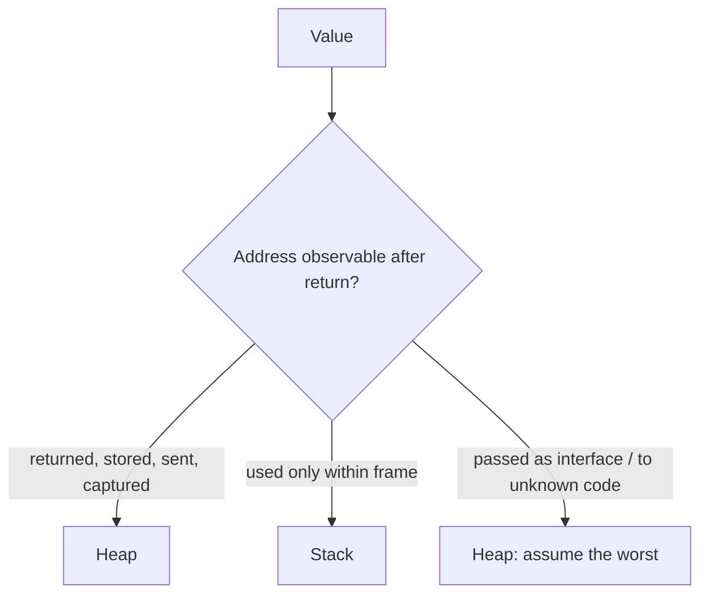

# Escape analysis

## Why Does This Matter?

Escape analysis is the compiler pass that executes the stack/heap
rule from chapter 1: it decides, per value, whether it can stay on
the frame. It is the single highest-leverage pass for service
latency because its output scales: every value that stays on the
stack is an allocation the GC never sees, for every request, forever.
The mechanical pass structure lives in [23
Section 2](../23-go-internals/02-ssa-and-optimizations.md); this chapter is
the engineering view: the rules that force escapes, how to read the
diagnostics, and the boxing costs that show up in profiles as
"interface" when the culprit is your API shape.

## Mental Model

The analysis answers one question per value: **can anything observe
this value after the frame dies?**



The pessimism is the design: one unknown callee (an interface call,
reflection, `fmt`'s variadic `...any`) forces the heap decision
because the compiler cannot see through it. Your API shapes decide
how pessimistic the compiler must be.

## How It Works

The escape rules that matter, as a review checklist:

| Pattern | Escapes? | Why |
|---|---|---|
| `return &v` | yes | outlives the frame |
| store to a global/field | yes | the global outlives everything |
| `go func() { use(&v) }` | yes | goroutine outlives the frame |
| `v` passed as `any` | yes (if address-taken) | boxed into the interface |
| `v` passed to an inlinable function using it locally | no | the proof flows through |
| `v` passed to an interface method | yes | the callee is unknown |
| `&v` used only for a method call on an addressable local | no | method calls don't force escapes |

**Boxing**: storing a non-pointer-shaped value into an interface
allocates. `var x any = 42` allocates; `var y any = &p` (p already
heap-resident or pointer-shaped) does not. This is why
`fmt.Sprintf("%d", i)` in a loop allocates while `strconv.Itoa(i)`
does not: the variadic `...any` boxes; the string API does not.

**Devirtualization** ties in here: when the compiler can prove the
concrete type behind an interface call, it inlines and the "unknown
callee" pessimism disappears. Concrete hot paths win twice: direct
calls and fewer forced escapes ([19
Section 4](../19-performance/04-compiler-and-pgo.md)'s before/after).

## Syntax / API

Reading the decisions (diagnostics from [23
Section 2](../23-go-internals/02-ssa-and-optimizations.md)'s transcripts):

```bash
go build -gcflags="-m" ./... 2>&1 | grep -E "escapes|moved"
```

The reporting levels, worth knowing: `-m` (summary), `-m -m`
(including what made it escape: look for "leaking param" lines),
and `-gcflags="-m -d=ssa/escape/debug=3"` for the full graph. The
lines to grep in review of a hot file:

```text
./hot.go:42:14: moved to heap: buf       <- the local itself
./hot.go:42:14: leaking param: b         <- param forces callers to heap
```

`leaking param` on a hot function is the flag that your *callers*
pay for the signature: the API-shape insight this chapter exists for.

## Basic Example

One signature change, two memory stories:

```go
// Leaky: the logger accepts any; every struct passed boxes and escapes.
func (s *Server) debugLog(v any) { ... }

// Tight: fields passed individually; small values never escape.
func (s *Server) debugLog(id string, n int) { ... }
```

The first shape converts every caller's value into a heap
allocation; the second keeps small values in registers. This is why
the handbook's logging guidance ([20
Section 1](../20-observability/01-structured-logging.md)) prefers typed
fields and lazy `LogValuer`s: the API shape is the allocation
policy.

## Real-World Example

`encoding/json` vs a typed client: unmarshal into `map[string]any`
allocates a tree of boxes (every scalar is an interface); unmarshal
into a typed struct allocates the struct and nothing else. Same
wire data, different escape profile by an order of magnitude ([19
Section 2](../19-performance/02-memory-and-allocations.md)'s incident
story is exactly this shape). The engineering habit: when a profile
shows `runtime.mallocgc` under a decode-heavy endpoint, ask what the
decode target shape is before reaching for `sync.Pool`.

## Production Example

**The audit** for a latency-sensitive service: take the top 5
functions from the CPU profile, run `-m`, and read the escape lines
as a list of API-design tickets:

1. `leaking param` on a hot path → tighten the signature (typed
   params, not `any`).
2. `moved to heap` on a per-request local → restructure so the
   value dies in-frame (return values, not pointers, when callers
   don't mutate).
3. Boxing in a loop → replace `any` plumbing with concrete or
   generic types ([07](../07-generics/)'s guidance).

One afternoon of this usually beats a week of micro-benchmarks,
because the wins apply to every request without making the code
faster-only-when-warm.

## Common Mistakes

| Mistake | Reality | Do instead |
|---|---|---|
| `defer` in loops "for the cleanup" | Defers are cheap since 1.14, but the captured vars often escape | Scope the defers; check `-m` |
| Wrapping errors with `%v` on structs | Boxes the struct; escapes | Wrap with `%w` on errors ([05 Section 1](../05-errors/01-errors-are-values.md)); log typed fields |
| Pre-emptively returning pointers | Forces the heap decision on every caller | Return values; let callers opt into pointers |
| One generic `any`-shaped API for "flexibility" | Every caller pays boxing | Generics with concrete instantiation ([07 Section 5](../07-generics/05-when-generics-hurt.md "when generics help and hurt")) |
| Trusting that `&v` always allocates | Method receiver `&v` on a local often does not | Read the diagnostics, not folklore |

## Idiomatic Go

- Design hot-path functions to take and return values; document
  mutation instead of enforcing it with pointers.
- Keep interfaces at architecture boundaries (stores, transports),
  not inside tight loops.
- Use generics where the type set is closed and the value is small:
  the stenciled code keeps values unboxed ([07
  Section 5](../07-generics/05-when-generics-hurt.md)).

## Performance Considerations

Escape analysis compounds with inlining ([23
Section 2](../23-go-internals/02-ssa-and-optimizations.md)): an inlined
callee's proof flows to the caller, so keeping hot helpers small
helps twice. The measurable chain: fewer escapes → fewer
allocations → less GC CPU → lower p99. `AllocsPerRun` tests turn
that chain into a regression contract on your hottest helpers.

## Concurrency Considerations

Escapes and synchronization are orthogonal (chapter 6's model
governs ordering, not placement), but they interact in review:
values passed across goroutines escape (the goroutine outlives the
frame), so fan-out code allocates per work item. That is usually
correct; per-packet paths batch instead ([08
Section 5](../08-concurrency/05-patterns.md)'s worker shapes).

## Security Considerations

Escape analysis is not a security boundary: heap vs stack changes
lifetime, not visibility (the memory model still governs races).
The relevant note: values kept on the stack are cheaper to reason
about for secret-handling (they die with the frame), but strings
and slices handed to logging/serialization still escape and copy:
minimize secret copies regardless ([23
Section 5](../23-go-internals/05-interfaces-slices-strings.md)).

## Testing Strategy

- `AllocsPerRun` on hot helpers: the example-package pattern ([23
  Section 2](../23-go-internals/02-ssa-and-optimizations.md)).
- Benchmarks before/after any signature change on a hot path; run
  benchstat, keep the numbers in the PR.
- `-m` output review for hot files as part of the performance
  portion of design review.

## Interview Questions

1. List three code shapes that force a heap escape even when the
   value never leaves the function.
2. Why does passing a struct as `any` allocate, and when does it
   not?
3. How does devirtualization interact with escape analysis?
4. Walk the audit you would run on a service whose profile shows
   GC-assist CPU.

## Practice Exercises

1. Take this section's `internals` example ([23
   Section 2](../23-go-internals/02-ssa-and-optimizations.md)) and add a
   function whose parameter `leaking param`s; fix the signature and
   show the diagnostic disappearing.
2. Benchmark `fmt.Sprintf("%d", i)` vs `strconv.Itoa(i)` in a loop;
   explain the allocation counts from boxing.
3. Find one `any`-shaped function in code you own; type it; measure
   the allocation delta with `AllocsPerRun`.

## Further Reading

- [Escape analysis in the Go compiler (design doc)](https://drive.google.com/file/d/1szA2RA3fDbAYy8ejIozZjIu1TW2lVWhh/view)
- [cmd/compile diagnostics reference](https://pkg.go.dev/cmd/compile)
- [Profiling Go Programs (blog)](https://go.dev/blog/pprof)
