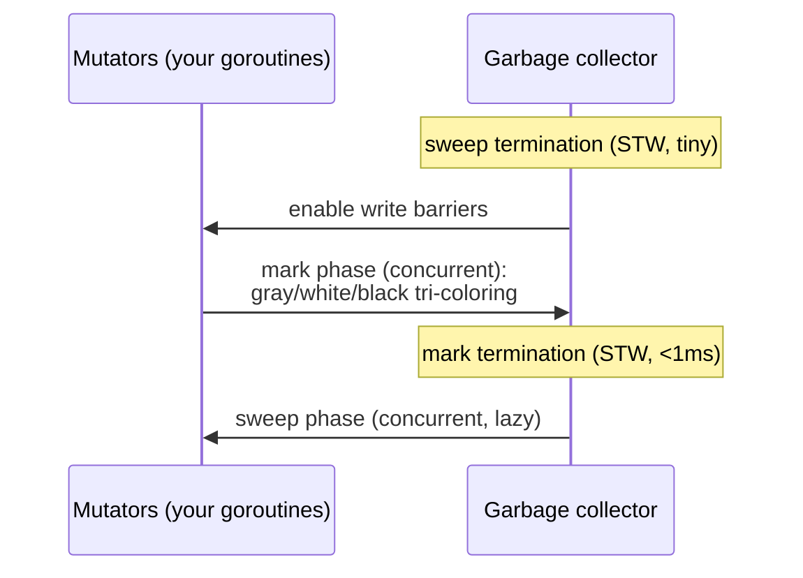

# The garbage collector

## Why Does This Matter?

Go's GC is a concurrent, tri-color mark-and-sweep collector tuned
for pause time, and its cost model is the reason allocation
discipline dominates service performance. The applied tuning
guidance lives in [19 §2](../19-performance/02-memory-and-allocations.md)
(set GOMEMLIMIT, reduce allocations) and [22
§3](../22-production-go/03-resource-limits.md) (the container
framing); this chapter is the machine itself: what the collector
actually does each cycle, where the pauses come from, why the
"assist tax" lands on allocating goroutines, and what the knobs
mechanically change.

## Mental Model

A GC cycle has three phases:



- **Mark**: starting from roots (globals, goroutine stacks), the
  collector discovers reachable objects. Tri-coloring: white =
  unreached (candidate garbage), gray = reached but unscanned,
  black = reached and fully scanned.
- **Write barriers**: while marking runs *concurrently* with your
  code, the runtime intercepts pointer writes to maintain the
  invariant "a black object may not point at a white object
  without being re-grayed". This is what makes concurrent marking
  correct while mutators run ([23 §6](../23-go-internals/06-memory-model.md)'s
  happens-before rules are what make the barriers invisible to
  your code).
- **Sweep**: freeing white objects happens lazily, interleaved
  with allocation: freed spans return to the allocator's lists as
  your program allocates.

## How It Works

**Pacing**: when does the next cycle start? The target is

```text
target heap = live heap × (1 + GOGC/100), clamped by GOMEMLIMIT
```

Default GOGC=100: start marking when the heap doubles. GOMEMLIMIT
(Go 1.19+) adds a ceiling: never let total runtime memory exceed
the limit: the GC runs more aggressively as you approach it. The
two knobs compose ([19 §2](../19-performance/02-memory-and-allocations.md)):
GOMEMLIMIT is the container knob (set ~90% of the cgroup limit);
GOGC shapes the memory/CPU tradeoff above the floor.

**The assist tax**: marking must keep pace with allocation; if
your goroutines allocate faster than the background markers scan,
allocating goroutines are drafted to help ("GC assist"). This is
the mechanism behind "allocation rate steals service CPU":
a profile showing `runtime.gcAssistAlloc` under your hot handler is
exactly this tax being collected ([19
§2](../19-performance/02-memory-and-allocations.md)'s before/after
numbers).

**Pauses**: the two STW points (sweep termination, mark
termination) are sub-millisecond and bounded by live-heap scan
coordination, not heap size. What latency spikes people attribute
to "GC pauses" is usually: assist CPU (stealing from handlers),
cache effects of marking, or OS page reclaim ([22
§3](../22-production-go/03-resource-limits.md)'s throttling
confusion is the sibling failure). Measure with
`/gc/pauses:seconds` ([20 §2](../20-observability/02-metrics.md))
before blaming the collector.

## Syntax / API

The knobs and their mechanical meaning:

```go
import "runtime/debug"

debug.SetGCPercent(100)      // the GOGC percentage (default 100)
debug.SetMemoryLimit(460 << 20) // GOMEMLIMIT, bytes; <=0 disables
debug.FreeOSMemory()         // force a cycle + return pages to the OS
```

The observation surface:

```bash
GODEBUG=gctrace=1 ./svc   # per-cycle: heap sizes, pause ns, assist %
# gc 42 @12.3s 2%: 0.12+1.4+0.09 ms clock, ... 4 MB stacks, 2 MB globals
```

The `2%` there is estimated GC CPU fraction: the number to watch in
capacity reviews ([20 §2](../20-observability/02-metrics.md)'s
runtime metrics export it continuously).

## Basic Example

Reading one gctrace line as a story:

```text
gc 57 @30.1s 3%: 0.10+2.1+0.11 ms clock, 0.8+0.4/2.3/0 ms cpu,
    45->48->22 MB, 50 MB goal, 8 P
```

Heap grew 45→48 MB live at mark end, target was 50 (GOGC math),
sweep reclaimed to 22 MB in use, GC CPU estimate 3%, pauses
sub-millisecond. Healthy. The sick shapes: goal repeatedly missed
(assist-heavy, allocation too fast), or heap pinned at the
GOMEMLIMIT ceiling (GC thrashing; add memory or cut allocations,
[22 §3](../22-production-go/03-resource-limits.md)'s OOM story).

## Real-World Example

The bulk-load pattern: importing a million records spikes live
heap 10x, the GC targets 2x that (GOGC=100), the service
approaches its GOMEMLIMIT, and the collector thrashes: cycles back
to back, assist tax maxed, latency in the floor. The mechanical
fixes, in order: pre-size containers (fewer mid-load allocations),
batch the load (bounded live set per batch), raise GOMEMLIMIT if
the box has room ([22 §3](../22-production-go/03-resource-limits.md)'s
requests/limits pairing), and only then consider temporary
GOGC adjustment. The chapter's point: each fix changes a specific
term of the pacing equation; "tune the GC" is not an action.

## Production Example

The fleet-wide memory-limit rollout ([22
§3](../22-production-go/03-resource-limits.md)'s knob table in
production): before Go 1.19, a heap growth spike crossed the
cgroup limit and the kernel OOM-killed pods; the standard
mitigation was over-provisioning. GOMEMLIMIT changed the failure
mode: the GC now degrades gracefully (more CPU, higher latency)
instead of dying. The rollout checklist: set the limit at ~90% of
the container limit, watch `/gc/pauses` and assist CPU for a
week, alert on "heap pinned at limit" (the thrash signal, [20
§4](../20-observability/04-slos-and-alerting.md)'s slow-burn
tier). Go 1.25+'s container-aware default (~90% automatic, [23
§3](../23-go-internals/03-runtime-architecture.md)) makes the
explicit knob a fallback rather than a requirement.

## Common Mistakes

| Mistake | Mechanical reality | Do instead |
|---|---|---|
| Blaming pause times for latency | Pauses are sub-ms; assist CPU and cache effects dominate | Read `/gc/pauses` and gctrace's CPU% |
| Setting GOGC low "to be safe" | Tiny targets = constant cycles = assist tax | GOMEMLIMIT as the guard; GOGC at or above default |
| Setting GOMEMLIMIT equal to the cgroup limit | Zero margin: non-heap memory (stacks, metadata) tips over | ~90% of the container limit |
| Forcing GCs on a schedule | FreeOSMemory costs a full cycle for nothing | Let pacing work; fix allocation shapes |
| Ignoring pointer density | Marking scans pointers; pointer-rich structures cost more | Slice structs, not slices of pointers, in bulk ([19 §2](../19-performance/02-memory-and-allocations.md)) |
| "GC is automatic, nothing to know" | The assist tax and pacing are service-level forces | Know the two knobs and the thrash signature |

## Idiomatic Go

- Allocation reduction is the GC tuning ([19
  §2](../19-performance/02-memory-and-allocations.md)'s playbook);
  the knobs are for capacity edges, not daily use.
- Pre-size maps/slices for bulk operations: fewer allocations
  *and* fewer growth copies.
- Keep the live set small: caches bounded ([13
  §5](../13-databases/05-caching-with-redis.md)), sessions with
  TTLs (this section's chapter 5), slices not pinning big backing
  arrays.

## Performance Considerations

The collector's throughput cost scales with (allocation rate ×
pointer density) and its memory cost with the GOGC target. The
design levers, strongest first: allocate less, allocate
pointer-lean, keep the live set small, then GOMEMLIMIT, then GOGC.
`sync.Pool` for high-churn buffers sits between "allocate less"
and design change ([19 §2](../19-performance/02-memory-and-allocations.md)'s
benchmarks; [08 §4](../08-concurrency/04-sync-primitives.md)'s
pool semantics).

## Concurrency Considerations

Write barriers are per-pointer-write CPU during marking: code that
churns pointers in hot loops pays slightly more during cycles. The
memory model makes this invisible for correctness (barriers are
runtime-internal); for performance, allocation-lean code is
barrier-lean too. GC assist is itself a scheduler-level effect:
assisting goroutines make slower progress, which is the
"latency correlates with allocation" mechanism.

## Security Considerations

Freed objects keep their bytes until overwritten: secrets in heap
memory outlive their variables ([23
§5](../23-go-internals/05-interfaces-slices-strings.md)'s string
notes; [14 §2](../14-backend-development/02-configuration-and-secrets.md)'s
redaction types reduce copies at the source). Memory dumps via
core files are a secret-disclosure path: restrict core dumps in
containers ([22 §5](../22-production-go/05-deploying-kubernetes.md)'s
hardening rows).

## Testing Strategy

- Load tests with `GODEBUG=gctrace=1` captured: assert the story
  (heap returns to baseline after burst; assist % bounded).
- Regression benchmarks with `-benchmem` ([10
  §4](../10-testing/04-benchmarks-coverage-fuzzing.md)): allocation
  count is the GC's input; pin it.
- Chaos: cap memory hard in staging ([22
  §3](../22-production-go/03-resource-limits.md)'s 64Mi exercise)
  and verify graceful degradation, not OOM.

## Interview Questions

1. Walk a GC cycle: where are the STWs, what is concurrent, what
   bounds the pauses?
2. Explain the tri-color invariant and what write barriers do
   during marking.
3. Your service's heap is pinned at GOMEMLIMIT and latency is
   degrading: what is happening and what are your options?
4. Why does allocation rate matter more than heap size for CPU
   cost?
5. What changed for containerized Go services with GOMEMLIMIT
   (1.19) and the container-aware defaults (1.25)?

## Practice Exercises

1. Run a load test with `gctrace=1`; annotate one healthy cycle
   and one assist-heavy cycle; map each field to this chapter's
   terms.
2. Double the pointer density of a benchmark's data model (structs
   → pointers); measure the GC CPU delta.
3. Set GOMEMLIMIT 20% above steady-state RSS; add load; document
   the degradation curve: latency vs cycle frequency.

## Further Reading

- [A Guide to the Go Garbage Collector](https://go.dev/doc/gc-guide)
- [Getting to Go: The Journey of Go's Garbage Collector](https://go.dev/blog/ismmkeynote)
- [GOMEMLIMIT blog post](https://go.dev/blog/gomemlimit)
