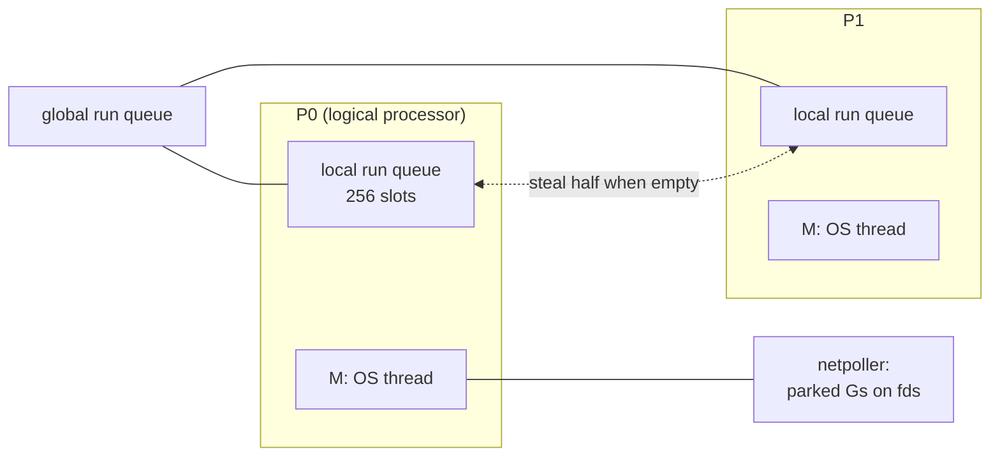

# The scheduler

## Why Does This Matter?

The scheduler is why a Go service can hold 100k concurrent
operations on 8 OS threads: goroutines park for free, Ms adapt to
blocking, Ps carry the parallelism. [08
§6](../08-concurrency/06-concurrency-vs-parallelism.md) covers the
behavioral model (GOMAXPROCS experiments, the high-RPS-on-few-Ps
result) and [23 §3](../23-go-internals/03-runtime-architecture.md)
gives the one-page architecture; this chapter is the deep dive:
stealing, preemption, syscall mechanics, the netpoller's
integration, and the runtime knobs an operator can still turn.

## Mental Model



- **G**: goroutine: stack, PC, state.
- **M**: OS thread: must hold a P to run Go code.
- **P**: scheduling context: local run queue, mcache, GC
  participation. `GOMAXPROCS` = P count.

The invariant to internalize: **blocking in Go rarely blocks a
thread.** Goroutine blocks park the G; syscall blocks hand off the
P; network blocks park in the netpoller.

## How It Works

**Run queues and stealing**: each P keeps a local FIFO with a
 LIFO bump (the most recent G runs next for cache warmth: good
 for locality, starved deliberately for fairness by the steal
 policy). When a P's queue empties it checks: its own LIFO slot →
 global queue (1/61 of ticks) → *steal half* another P's queue →
 netpoller. Stealing is why balanced fan-out happens without a
 central dispatcher.

**Syscalls**: a blocking syscall (file I/O, cgo, blocking network
 without the poller) traps the M in the kernel. The runtime hands
 the P to another (possibly new) M, so Ps keep running; the stuck
 M lingers until the syscall returns, then tries to re-acquire a P
 or parks itself. Blocking syscalls are therefore cheap for
 parallelism but *expensive in threads*: a service doing
 synchronous file I/O per request accumulates Ms ([08
 §5](../08-concurrency/05-patterns.md)'s bounded-pool rule exists
 for this).

**Preemption**: cooperative at safe points (function prologues)
 plus async signal-based preemption since Go 1.14: a G running
 >10ms without yielding gets a signal and yields at the next
 instruction boundary. Tight loops no longer starve the world;
 what still blocks "forever": cgo calls, syscalls, and
 spin-free-but-stuck states like a mutex convoy ([08
 §7](../08-concurrency/07-pitfalls.md)).

**Netpoller**: every network fd operation integrates with
 epoll/kqueue/IOCP. A G blocked on a socket is parked with its
 fd registered; the poller (itself running on Ms in the scheduler
 loop) wakes Gs on readiness. Goroutine-per-connection is free
 *because* of this: parked Gs cost memory only ([08
 §1](../08-concurrency/01-goroutines-and-channels.md)'s accounting,
 [23 §3](../23-go-internals/03-runtime-architecture.md)'s
 architecture).

## Syntax / API

The operator-facing surface ([22
§3](../22-production-go/03-resource-limits.md)'s production
framing):

| Knob | Meaning | Notes |
|---|---|---|
| `GOMAXPROCS` | P count | container-aware default since Go 1.25 |
| `GODEBUG=schedtrace=1000` | scheduler trace per second | G queue depths, M counts |
| `GODEBUG=scheddetail=1` | per-G/M/P events | incident-grade detail |
| `runtime.Gosched()` | yield explicitly | rare; scheduler usually finds the yield |

`schedtrace` output decoded:

```text
SCHED 1000ms: gomaxprocs=8 idleprocs=5 threads=14 spinningthreads=1
              idlethreads=6 runqueue=0 [0 0 0 0 2 0 0 0]
```

8 Ps, 5 idle (undersubscribed: fine), 14 Ms total with 6 idle
(syscall history), per-P local queue depths shown; a P with a
persistent backlog while others idle means affinity or blocking
traps, not capacity.

## Basic Example

The syscall-thread math, the incident that justifies worker pools:

```go
// 500 concurrent requests, each doing a synchronous 50ms file read.
// Naive: 500 Ms created (one per parked syscall). With GOMAXPROCS=8,
// parallelism stays 8, but thread count balloons: memory, scheduler
// churn, fd pressure.
```

Bounded pool ([08 §5](../08-concurrency/05-patterns.md)): 64
workers doing the reads keeps Ms ≈ 64 + GOMAXPROCS. The thread
count is now a design constant, not a traffic function.

## Real-World Example

The latency mystery the scheduler explains: p99 spikes with no CPU,
no GC, no dependency slowness. schedtrace shows
`idleprocs=0` and deep local queues: saturation. The causes ranked
by frequency: too few Ps for the burst (GOMAXPROCS vs cgroup
mismatch, [22 §3](../22-production-go/03-resource-limits.md)),
a blocking syscall pattern ballooning Ms and starving steal
targets, and GC assists during marking ([09
§3](../09-memory-runtime/03-garbage-collector.md)). The diagnostic
flow is [20 §5](../20-observability/05-incident-debugging.md)'s:
runtime metrics → schedtrace → goroutine dump.

## Production Example

**GOMAXPROCS in containers**, the complete story: pre-1.25, the
default was host CPUs (a 64-core host running a 2-CPU pod
scheduled 64 Ps onto 2 cores of quota: throttle storms). The
production rule was explicit `GOMAXPROCS=limit`; Go 1.25+ makes
the runtime cgroup-aware automatically ([22
§3](../22-production-go/03-resource-limits.md)'s table), and the
explicit knob remains for override. The remaining operator
decisions: whether to set a CPU limit at all (throttling vs burst
absorption) and keeping `GOMAXPROCS` aligned with whichever
choice.

**Goroutine count as an SLI**: parked Gs are cheap but countable;
`runtime.NumGoroutine` trending with traffic is healthy, trending
without it is a leak ([20 §2](../20-observability/02-metrics.md)'s
export; this section's chapter 5 makes the leak types concrete and
[23 §3](../23-go-internals/03-runtime-architecture.md) explains
what each parked G holds).

## Common Mistakes

| Mistake | Scheduler reality | Do instead |
|---|---|---|
| Unbounded goroutine-per-blocking-syscall | Ms accumulate; thread count follows traffic | Bound with worker pools ([08 §5](../08-concurrency/05-patterns.md)) |
| Busy-spin instead of parking | Spinning Gs consume Ps without progress | Channels/conditions/atomics; park |
| Assuming fairness | Local-run LIFO bump and stealing favor throughput | Yield matters only in pathological loops; async preemption covers most |
| One goroutine per tiny task at extreme rates | Scheduler overhead (allocs, queue ops) shows in profile | Batch work items; keep goroutines for coarser units |
| Diagnosing latency without schedtrace | Intuition loses to queues | Export runtime metrics; read the trace under load |

## Idiomatic Go

- Launch goroutines per logical unit (request, message, file);
  bound with semaphores, not by counting threads.
- Never spin-wait; park (channel, context, cond, sleep at worst).
- Leave GOMAXPROCS alone unless containers force the question;
  then set it to the *quota*, not the host.

## Performance Considerations

Per-op costs: goroutine start ~hundreds of ns (stack alloc +
queue push), park/unpark ~100-200ns, channel op ~100ns, context
switch between Gs on one P ~tens of ns (no kernel). These are why
fan-out designs in Go are cheap but not free: at 1M ops/s,
scheduler overhead is real CPU ([19
§3](../19-performance/03-concurrency-performance.md)'s
contention section for the shared-state side).

## Concurrency Considerations

The scheduler provides the happens-before edges for goroutine
creation and parking ([23 §6](../23-go-internals/06-memory-model.md)):
`go` precedes the G's execution; channel ops order through the
hchan lock. What it does not provide: fairness guarantees or
priority; design deadlines and cancellation with `context` ([08
§3](../08-concurrency/03-context.md)) instead of assuming
timely rotation.

## Security Considerations

Resource exhaustion targets the scheduler directly: a request
that spawns unbounded goroutines is a DoS on P queues and M
counts ([21 §4](../21-security/04-limits-and-hardening.md)'s
limits are the walls). `GOTRACEBACK=system` in prod ([22
§2](../22-production-go/02-server-lifecycle.md)) makes incident
dumps show scheduler state; that dump contains goroutine stacks:
treat like any diagnostic surface ([21 §1](../21-security/01-threat-model-and-validation.md)'s
exposure rules).

## Testing Strategy

- `-cpu=1,2,4` and `GOMAXPROCS=1` test runs surface ordering
  assumptions ([10 §1](../10-testing/01-fundamentals.md)).
- Under-load tests asserting goroutine counts return to baseline
  (the memwatch example's pattern in this section).
- Latency regression benchmarks on saturated vs unsaturated
  variants to catch starvation regressions ([10
  §4](../10-testing/04-benchmarks-coverage-fuzzing.md)).

## Interview Questions

1. Walk what happens, G/M/P by G/M/P, when a goroutine makes a
   blocking file syscall.
2. How does work stealing preserve fairness while local queues
   favor locality?
3. What did async preemption change, and what can still block a P
   "forever"?
4. Your pod shows threads=400, gomaxprocs=2: what happened and
   what is the fix?
5. How does the netpoller integrate with the scheduler's run
   queues?

## Practice Exercises

1. Run the syscall-pool experiment: 500 blocking reads goroutine-
   per-request vs 64-worker pool; chart Ms via schedtrace.
2. Force starvation pre-1.14 style (a tight loop with no calls);
   observe async preemption rescuing it on your Go version; then
   find a case preemption does not rescue (cgo or syscall).
3. Export scheduler metrics (NumGoroutine, per-P queue via
   schedtrace scraping) for the Section 14 service and add the
   dashboard row ([20 §2](../20-observability/02-metrics.md)).

## Further Reading

- [Scalable Go Scheduler Design Doc](https://docs.google.com/document/d/1TTj4T2JO42uD5ID9e89oa0sLKhJYD0Y_kqxDv3I3XMw)
- [Non-cooperative preemption design](https://github.com/golang/proposal/blob/master/design/24543-non-cooperative-preemption.md)
- [runtime/proc.go (source)](https://github.com/golang/go/blob/master/src/runtime/proc.go)
