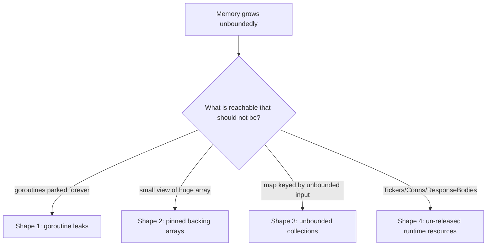

# Memory leaks in Go

## Why Does This Matter?

Garbage collection frees unreachable objects; leaks in Go are
therefore always *reachability* bugs: something reachable that
should not be. The taxonomy is short and learnable, and every
entry has a test-shaped detection ([20
Section 5](../20-observability/05-incident-debugging.md) covers the
incident flow; this chapter is the species guide, with this
section's `memwatch` example as the runnable specimen jar).

## Mental Model



The diagnosis question is always the same: **who is reachable, and
who owns cutting the edge?** Every fix in this chapter is an
ownership rule made explicit.

## How It Works

**Shape 1: goroutine leaks.** A goroutine parked on a channel that
will never fire: the producer gave up, the context was cancelled
but nobody reads the channel, the `for` loop has no exit. Each
leaked G holds a stack and whatever its closure captured. The
owner rule: every goroutine is started with a stop path, and the
starter owns it ([08 Section 7](../08-concurrency/07-pitfalls.md)'s
catalog; this section's `Tracker.Start` returning a `stop`
function is the pattern; `StartNoOwner` is the leak).

**Shape 2: pinned backing arrays.** A 16-byte slice of a 1MB
array keeps the megabyte alive: reachability follows the backing
array, not the view ([23
Section 5](../23-go-internals/05-interfaces-slices-strings.md)'s header
layout). The `memwatch` example's `Big` vs `BigFix` is the
specimen: copy at the ownership boundary.

**Shape 3: unbounded collections.** Maps keyed by session IDs,
request IDs, customer IDs: every unique key is a permanent
entry. The fix shape: TTLs or eviction (bounded LRU, [03
Section 9](../03-data-structures/README.md)'s cache chapter) plus
cardinality metrics ([20 Section 2](../20-observability/02-metrics.md)):
an unbounded map is a slow OOM with a j curve.

**Shape 4: runtime resources without cleanup.** `time.Ticker`
never stopped (`Stop` releases the timer heap entry; the channel
is not the cleanup), `http.Response.Body` never closed (keeps the
connection pinned: fd + buffers), `sql.Rows` not closed. The
owner rule again: whoever opens closes, typically `defer` at the
same scope ([12 Section 4](../12-http-networking/04-clients-and-timeouts.md)'s
client hygiene).

## Syntax / API

The three-step diagnosis, using tools that already exist:

```bash
# 1. Is memory actually leaking, or churning? (heap in-use vs alloc rate)
go tool pprof http://svc:6060/debug/pprof/heap   # in-use view

# 2. Who holds it? Sample the live objects' alloc stacks.
(pprof) top -sample_index=inuse_space
(pprof) list Big

# 3. Goroutine leaks: is the count trending up? Who is parked?
curl -s svc:6060/debug/pprof/goroutine?debug=1 | head -40
```

The heap profile's *in-use* view is the leak lens: allocation-rate
problems show in `alloc_space`; leaks show in `inuse_space`
growing without traffic ([19 Section 1](../19-performance/01-measure-first.md)
distinguishes them in peacetime).

## Basic Example

The pinned slice, observable structurally (this section's example):

```go
func Big() []int {
    base := make([]int, 1_000_000)
    return base[:16]     // len 16, cap 1,000,000: the pin
}
func BigFix() []int {
    out := make([]int, 16)
    copy(out, base[:16]) // len 16, cap 16: freed with the view
    return out
}
```

The test asserts `cap(view) > 16` (the pin) and `cap(fixed) == 16`
(the fix): structural facts that survive GC implementation
details.

## Real-World Example

The ticker leak, the most common production find: a reconnect
loop creates a `time.NewTicker` per attempt and returns early
without `Stop()`. Each abandoned ticker holds a runtime timer and
its channel: after a week of flapping, the process holds hundreds
of thousands of timers, the timer heap makes every
`time.AfterFunc` slower, and latency creeps while heap looks
"reasonable" (timers are small). The fix is one `defer t.Stop()`;
the lesson is that the *cost* of leaks is not always the bytes:
timers, fds, and goroutines each have their own exhaustion
signature ([20 Section 5](../20-observability/05-incident-debugging.md)'s
signal table).

## Production Example

**Leak detection as a service metric**, not an incident surprise:

- Export `runtime.NumGoroutine`, open fds, map cardinalities, and
  heap in-use ([20 Section 2](../20-observability/02-metrics.md)).
- Alert on *trend*, not level: goroutine count growing 1% per
  hour during steady traffic is shape 1; fds growing per deploy
  is shape 4 near the connection pool ([13
  Section 3](../13-databases/03-pooling-drivers-migrations.md)).
- In the incident: heap `inuse_space` top (shapes 2-3), goroutine
  dump grouped by parking site (shape 1), fd census (shape 4):
  each maps to its owner rule ([20
  Section 5](../20-observability/05-incident-debugging.md)'s evidence
  commands).

The `memwatch` example's `LiveWorkers` metric is the pattern for
making shape 1 self-reporting: components that own workers expose
their liveness, and the alert checks the sum.

## Common Mistakes

| Mistake | The leak it builds | Do instead |
|---|---|---|
| `go func` with no stop path | Shape 1 | Return a stop function; or tie to `ctx.Done()` ([08 Section 3](../08-concurrency/03-context.md)) |
| Returning `big[:small]` views | Shape 2 | `copy` at the boundary, or full-slice `[:n:n]` to cap |
| Cache/session maps keyed by IDs | Shape 3 | TTLs, bounded LRU, cardinality metrics |
| Ticker without `Stop` on early return | Shape 4 (timers) | `defer ticker.Stop()` at creation scope |
| `resp.Body` unclosed on error paths | Shape 4 (fds/connections) | `defer resp.Body.Close()` immediately after `Do` |
| Reading only `alloc_space` profiles | Churn hides as leak or vice versa | Check `inuse_space` for leaks, `alloc_space` for churn |
| `append` to a retained slice in a loop | Shape 2 variant (growth pinning) | Pre-size or copy snapshots |

## Idiomatic Go

- Ownership is explicit: start/close/open functions return the
  counterpart, or take a `ctx` whose cancellation is the cleanup.
- Prefer bounded structures: `chan` with capacity, LRU caches,
  TTLed maps; "unbounded but GC'd" is not a design.
- `context` is the leak killer for request-scoped work: park on
  `ctx.Done()` alongside every other wait ([08
  Section 3](../08-concurrency/03-context.md)).

## Performance Considerations

Leaks are performance bugs by definition (less memory for the
working set, more GC marking of the retained set), but the reverse
lesson matters too: over-aggressive cleanup churns allocations
([19 Section 2](../19-performance/02-memory-and-allocations.md)). The
balance: bounded and reused beats unbounded and "collected
eventually", and pooling (`sync.Pool`) is the tool for the churn
side. The timer-heap cost of ticker leaks is also a scheduler
cost ([09 Section 4](../09-memory-runtime/04-scheduler-internals.md)):
timers live in per-P heaps touched on every scheduling pass.

## Concurrency Considerations

Goroutine leaks are the concurrency leak; the memory model (chapter
6 in [23](../23-go-internals/)) explains why a leaked G is harmless
for correctness but its captured variables are *kept reachable*:
the closure is the GC root. Audit question for every goroutine
launch: what does this closure capture, and who frees it?

## Security Considerations

Leaks are availability vectors when input cardinality drives
retention: an attacker minting unique session IDs or cache keys
grow your shape-3 maps ([21 Section 4](../21-security/04-limits-and-hardening.md)'s
limits bound the *rate*; TTLs bound the *retention*; you need
both). Retained secrets are the confidentiality sibling: leak
shape 2 applied to a key buffer keeps it dumpable; minimize and
scope secret copies ([14 Section 2](../14-backend-development/02-configuration-and-secrets.md)).

## Testing Strategy

- Structural assertions for shape 2 (`cap` checks: this section's
  tests).
- Lifecycle assertions for shape 1: start N, stop N, `NumGoroutine`
  returns to baseline (with a deadline; never sleep-and-pray
  ([10 Section 1](../10-testing/01-fundamentals.md))).
- Cardinality assertions for shape 3: insert 1000, bounded map
  stays at 64 (the example's `TestMapGrowth_Bounded`).
- Long-run soak in staging with the leak metrics charted: the
  only test that catches the slow ones.

## Interview Questions

1. Go has a GC: how do leaks happen? Give the taxonomy with one
   production story each.
2. How do you distinguish a leak from churn with pprof?
3. A goroutine dump shows 50k goroutines parked on the same
   channel: walk the diagnosis and the fix.
4. Why is a `time.Ticker` leak more than a memory leak?
5. What metrics and alerts would you add to catch leaks before
   OOM?

## Practice Exercises

1. Add a shape-4 specimen to `memwatch`: an unclosed
   `http.Response.Body` path and its fix; write the fd-count test
   at the unit level (a counting `Transport`).
2. Build the "goroutine count returns to baseline" test helper
   (deadline + polling) and use it in one of your projects.
3. Take a heap profile of the Section 14 service under load;
   identify one pinned-slice candidate and one allocation-churn
   candidate; classify each with this chapter's lens.

## Further Reading

- [Profiling Go Programs (heap views)](https://go.dev/blog/pprof)
- [Go diagnostics: memory](https://go.dev/doc/diagnostics)
- [High Performance Go Workshop (leak sections)](https://dave.cheney.net/high-performance-go-workshop/dotgo-paris.html)
