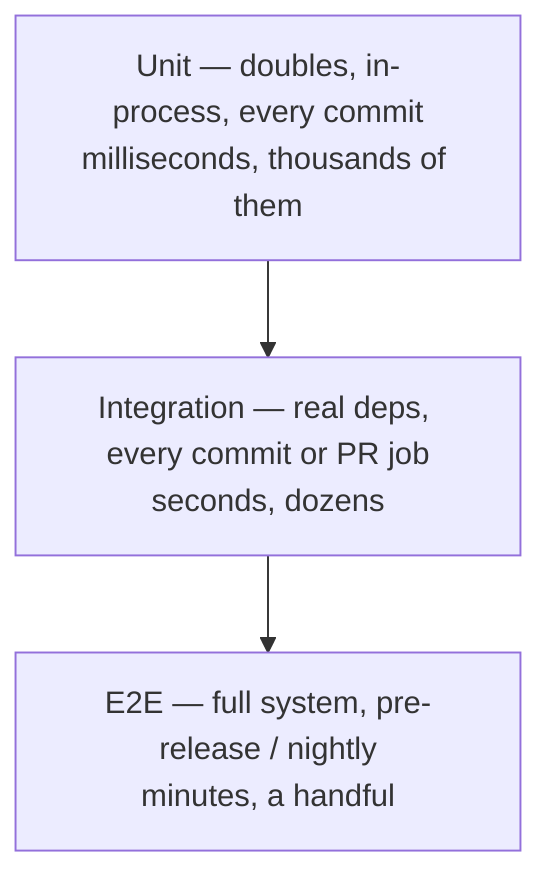

# Integration & e2e

## Why Does This Matter?

Unit tests prove your logic against doubles; integration tests prove
your logic against *reality* — real Postgres parsing your SQL, real TLS
negotiating, real serialization round-tripping. They cost more (setup,
time, flake risk), so the craft is in the tiering: which tests run on
every commit, which run in a separate job, and which run before release.

## Mental Model — the test pyramid, Go-shaped



Go pushes the pyramid's middle up: `httptest` makes HTTP integration
in-process, and testcontainers-style tools make real databases cheap to
spawn per suite. The tiers blur in Go more than in other ecosystems —
that's a feature; use it.

| Tier | Dependencies | When | Failure meaning |
|---|---|---|---|
| Unit | doubles | every save/commit | your logic is wrong |
| Integration | real (local) DB, brokers, TLS | every PR | your wiring/reality assumptions are wrong |
| E2E | full deployed stack | pre-release | user journeys break |

## Integration tests in Go — the mechanics

### Build tags and skip patterns

Two idiomatic gates; use both for different purposes:

```go
//go:build integration

// Package gating with build tags: the file doesn't even compile without
// -tags=integration. Choose for suites with their own dependencies.
package myservice_test
```

```go
// Runtime skip: compiles always, skips without the service.
// Choose for tests that share a package with unit tests.
func TestPostgresRepo(t *testing.T) {
	dsn := os.Getenv("TEST_POSTGRES_DSN")
	if dsn == "" {
		t.Skip("TEST_POSTGRES_DSN not set; skipping integration test")
	}
	// ... real database testing
}
```

CI wiring:

```yaml
- run: go test ./... -race          # unit tier, every PR
- run: go test ./... -tags=integration   # integration job, services in CI containers
```

### Per-test isolation — the pattern that prevents flaky suites

Integration tests share infrastructure; the fix is *fresh state per
test*, not careful sequencing:

```go
func newTestDB(t *testing.T) *sql.DB {
	t.Helper()
	dsn := os.Getenv("TEST_POSTGRES_DSN")
	if dsn == "" {
		t.Skip("TEST_POSTGRES_DSN not set")
	}
	db, err := sql.Open("pgx", dsn)
	if err != nil {
		t.Fatalf("open: %v", err)
	}
	t.Cleanup(func() { db.Close() })

	// Unique schema per test: parallel-safe, no cross-test pollution.
	schema := fmt.Sprintf("test_%d", time.Now().UnixNano())
	if _, err := db.Exec("CREATE SCHEMA " + schema); err != nil {
		t.Fatalf("create schema: %v", err)
	}
	t.Cleanup(func() { db.Exec("DROP SCHEMA " + schema + " CASCADE") })

	if _, err := db.Exec("SET search_path TO " + schema); err != nil {
		t.Fatalf("set search_path: %v", err)
	}
	if err := migrate(db); err != nil {
		t.Fatalf("migrate: %v", err)
	}
	return db
}
```

Rules embedded here:

- **Every test builds its own world** (schema, bucket, queue) — tests
  can then run in parallel and in any order (`-shuffle=on`).
- **`t.Cleanup` owns teardown**, including failure paths.
- **Skip vs fail:** missing *infrastructure* skips; a broken assumption
  fails. CI must set the env vars so skip never hides a broken suite.

### Migrations are part of the contract

Integration tests must apply the same migrations production uses. If
your suite creates tables with hand-written DDL, you have two schemas
and one of them is lying. Flyway/golang-migrate/dbmate style tools or
embedded SQL files — anything, as long as it's the same path to
production.

## Testing HTTP servers end-to-end — in-process

The Go superpower: full-stack tests without ports or deploy scripts:

```go
func TestAPIEndToEnd(t *testing.T) {
	db := newTestDB(t)                 // real postgres (skipped without DSN)
	repo := NewOrderRepo(db)
	svc := NewOrderService(repo)
	h := NewHandler(svc)               // the real wiring, no main()

	srv := httptest.NewServer(h)
	defer srv.Close()

	resp, err := srv.Client().Post(srv.URL+"/orders",
		"application/json", strings.NewReader(`{"total_minor":1000}`))
	if err != nil {
		t.Fatalf("post: %v", err)
	}
	defer resp.Body.Close()
	if resp.StatusCode != http.StatusCreated { ... }

	// Assert on the database — the real observable state.
	var total int64
	if err := db.QueryRow("SELECT total_minor FROM orders LIMIT 1").Scan(&total); err != nil {
		t.Fatalf("query: %v", err)
	}
	if total != 1000 { ... }
}
```

This exercises routing, middleware, serialization, the repository, and
SQL — the whole production path minus process boundaries. Most
"e2e-ish" coverage belongs here, not in expensive deployed-stack suites.

## Real infrastructure strategies

| Strategy | Tool example | Trade-off |
|---|---|---|
| Spun-up containers per suite | testcontainers-go | real versions, needs Docker in CI |
| Pooled service instances | shared Postgres + per-test schema | fast, isolation by discipline |
| In-process fakes | miniredis, in-memory Kafka substitutes | fastest; fidelity varies — label what's untested |
| Compose stack for CI | docker compose + healthchecks | e2e tier; slower, realistic |

Pick per dependency. Common production split: Postgres/Redis real
(testcontainers or pooled), Kafka real via testcontainers for the
contract tests, in-process substitutes for the fast unit tier — and the
[18-kafka-with-go](../18-kafka-with-go/) section shows the broker-skip
pattern for its examples.

## Common Mistakes

- **Shared mutable test data** ("row id=1 must exist") — sequential
  suites, order-dependent flakes. Unique state per test instead.
- **Skip without env var in CI** — the suite silently never runs; CI
  must fail if required service env vars are absent.
- **Integration tests that mock at the HTTP layer** while calling a real
  database — you've built the slowest unit test in existence; pick one
  reality per tier.
- **No timeout on infra waits** — a dead Postgres hangs the suite; use
  `context.WithTimeout` around health-wait loops.
- **Testing through the frontend for backend journeys** — e2e tier is
  for user journeys; API-level e2e for service contracts.

## Idiomatic Go

- `docker-compose.test.yml` + Makefile-free commands documented in the
  README beat bespoke CI scripting.
- Test helpers for infrastructure live in an internal test package
  (`internal/testinfra`) shared across suites — with the same `t.Helper()`
  discipline.
- `-race` and `-shuffle=on` apply to integration tiers too.

## Performance Considerations

- Container-per-suite is minutes; container-per-test is hours. Pool
  infra, isolate per test via schemas/buckets/prefixes.
- Parallel integration tests need infrastructure headroom — Postgres
  `max_connections` sized to your `-parallel` count.

## Concurrency Considerations

Parallel-safe integration tests require the per-test isolation pattern
above; `-race` still applies; and DB drivers each have their own
concurrency contract (pool sizes) — see
[13-databases](../13-databases/) when it ships.

## Security Considerations

- Integration credentials in CI are for throwaway databases only; never
  shared staging secrets.
- E2E suites that exercise auth flows must use synthetic accounts; real
  personal accounts in tests violate audit policies.

## Testing Strategy

The pyramid is the strategy: fail fast at unit, verify reality at
integration, protect journeys at e2e. This handbook's own repo
demonstrates the bottom two tiers in CI (unit always; the
Kafka/fintech examples show the skip-if-absent pattern).

## Interview Questions

1. *Which tests would you write for a money-transfer endpoint?* — Unit:
   validation, classification. Integration: real DB, transactions,
   idempotency across retries. E2E: journey with double-submission.
2. *How do you keep integration suites from flaking?* — Per-test state,
   deterministic infra waits, no sleeps, `-shuffle` to prove order
   independence.
3. *Your CI has no Docker — what can still be integration-tested?* —
   httptest full-stack (router→SQL needs a DB though), protocol-level
   fakes, and unit-tier everything else; be explicit about what's not
   covered.

## Practice Exercises

1. Convert a sequential integration suite to per-test schemas and run
   with `-shuffle=on -count=3`; fix what breaks.
2. Write the in-process e2e test above for one of your own endpoints;
   measure its runtime vs the equivalent curl-script suite.
3. Add a CI job that fails if `TEST_POSTGRES_DSN` is set but zero
   integration tests ran (count via `-json` output) — skip-hiding is a
   real production incident generator.

## Further Reading

- [build constraints](https://pkg.go.dev/go/build) — tag semantics
- [testing: Short/Skip](https://pkg.go.dev/testing#T.Skip) — tier gating
- [testcontainers-go](https://golang.testcontainers.org/) — container strategy
