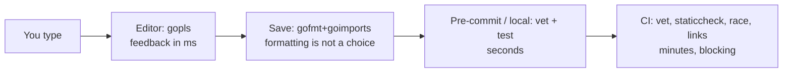

# The professional workflow

## Why Does This Matter?

Professional Go is recognizable at a glance: formatted the same
way, vetted, statically analyzed, navigable by gopls. None of that
is talent; it is tooling wired into editor and CI so it happens
without discipline. [01 Section 2](../01-go-fundamentals/02-toolchain-and-workflow.md)
covers the daily verbs (`run`, `build`, `test`, `vet`); this
chapter is the layer above: which tools a team standardizes on,
what each catches, and how this repository's own CI wires them as
the worked example.

## Mental Model



The tiers differ by latency and authority: the editor suggests,
the save formats, CI *blocks*. Every check that exists only in CI
wastes a feedback loop; every check that exists only locally does
not protect the main branch. Wire both ends.

## How It Works

The standard set and the division of labor:

| Tool | Catches | Speed | Where |
|---|---|---|---|
| `gofmt` | nothing: it *is* the format | ms | save + CI |
| `goimports` | formatting + import organization | ms | save |
| `go vet` | printf mistakes, lock copies, loop-var misuse, struct tags | seconds | editor, pre-push, CI |
| `staticcheck` | the deep static analysis: unused code, dubious constructs, API misuse | seconds-minutes | CI (optional locally) |
| `gopls` | everything, live: compile errors, vet hints, cross-references | continuous | editor |
| `go test -race` | data races on executed paths | test-time | CI (every run) |

`gofmt` is non-negotiable and settled; the one discretionary
choice is import grouping, which `goimports` standardizes. `go
vet` is stdlib and non-negotiable. `staticcheck` is the community
standard for everything vet does not cover: install with
`go install honnef.co/go/tools/cmd/staticcheck@latest` and pin the
version in CI (a floating pin breaks builds when checks tighten).

## Syntax / API

This repository's CI (`.github/workflows/ci.yml`) is the worked
example, in order:

```yaml
- gofmt -l .                      # fail on any unformatted file
- go build ./...                  # everything labeled runnable compiles
- go vet ./...                    # stdlib static analysis
- go test ./... -race             # race detection, shuffled order
- staticcheck ./...               # pinned version
- go run ./tools/linkcheck        # internal-link integrity
```

The editor wiring that makes the loop tight (VS Code settings
shape, any LSP editor equivalent):

```json
{
  "gopls": {"staticcheck": true},
  "editor.formatOnSave": true,
  "[go]": {"editor.defaultFormatter": "golang.go"}
}
```

`gopls` with `staticcheck: true` surfaces deep findings as you
type: most staticcheck issues never reach CI.

## Basic Example

The feedback tiers on one mistake: `fmt.Errorf` with a misspelled
verb (`%d` for a string):

```text
Editor (gopls, live):  yellow squiggle under Errorf
vet (pre-push):        ./svc.go:42:2: Errorf format %d has arg s of type string
CI (blocking):         the same, plus the build gate on the PR
```

The same error costs nothing at the first tier and a context
switch at the last. The workflow's entire purpose: move every
finding to the cheapest tier that catches it.

## Real-World Example

The Makefile that encodes the team contract (this repo's shape):

```makefile
check: gofmt-lint vet staticcheck test linkcheck
fmt:
	find . -name '*.go' | xargs goimports -w
```

Contributors run `make check` (or just push, and CI runs it);
reviewers stop discussing formatting entirely ([27
Section 3](../27-open-source/03-contributing-well.md) covers the review
loop this enables). The quiet payoff: diffs contain only meaning.
A PR with 3 meaningful lines shows 3 changed lines, not 300
reformatted ones.

## Production Example

**Versioning the toolchain**: CI pins Go (this repo pins stable
via `actions/setup-go`) and tool versions in `go.mod` tool
directives or install scripts. A new Go release that changes
`gofmt` output or staticcheck findings should be a deliberate PR,
not a surprise on Monday: the same reproducibility discipline as
[06 Section 5](../06-packages-modules/05-reproducible-builds.md)'s
builds.

**Monorepo hygiene**: `gofmt -l .` and `staticcheck ./...` scale
fine to thousands of files (seconds); `go vet ./...` is cached by
the build cache. The limit is tests: keep CI green with targeted
`-run` patterns on PRs and the full suite on main, and let the
build cache make repeat runs nearly free.

## Common Mistakes

| Mistake | Cost | Do instead |
|---|---|---|
| Debating formatting in review | Wasted review minutes, friction | gofmt ends the debate; enforce in CI |
| Disabling vet/staticcheck instead of fixing findings | Real bugs stay; signal decays | Fix or `//lint:ignore` with a reason |
| Floating tool versions in CI | Random breakage on upstream releases | Pin everything; upgrade deliberately |
| Checks only in CI | Findings arrive after context is gone | gopls live + save-format + CI block |
| Running `gofmt` by hand per file | Drift, missed files | Format on save; CI sweeps everything |
| Ignoring `-race` because "it's slow" | Races reach prod ([08 Section 7](../08-concurrency/07-pitfalls.md)) | It is the cheapest correctness check you own |

## Idiomatic Go

- No linter config files in Go: the stdlib set is the baseline;
  staticcheck's defaults are the community contract.
- `//nolint`-style suppressions do not exist in stdlib tools;
  staticcheck's `//lint:ignore` requires a stated reason: findings
  are fixed or justified, never silenced silently.
- `go vet` runs automatically during `go test` in recent Go: the
  baseline is already wired; CI makes it explicit.

## Performance Considerations

Tooling is developer-latency engineering: gopls indexing large
repos is the main cost; `.gitignore` vendored/generated dirs and
`gopls` memory limits keep it responsive. CI time budget: this
repo's full gate runs in about a minute ([06
Section 5](../06-packages-modules/05-reproducible-builds.md)'s build
cache applies to CI runners too); if your gate exceeds ~10
minutes, parallelize jobs rather than thinning checks.

## Concurrency Considerations

`-race` is the concurrency tooling: not optional, run on every CI
test pass ([10 Section 1](../10-testing/01-fundamentals.md)). The race
detector's dynamic checking means test quality gates race
coverage; shuffled test order and `-cpu=1,2,4` variants widen the
schedules exercised ([23 Section 6](../23-go-internals/06-memory-model.md)'s
model is what the detector enforces).

## Security Considerations

The workflow's security tier: `govulncheck` (chapter 4) plus the
weekly scheduled run this repo wires ([21 Section 5](../21-security/05-secrets-and-supply-chain.md)'s
supply-chain chapter). Pre-commit hooks that scan for secrets
(gitleaks) are the one addition beyond Go-specific tooling most
teams want before their first leaked credential teaches them.

## Testing Strategy

The workflow is itself testable: this repo's CI fails on
unformatted files, vet findings, staticcheck findings, link
breakage, and test failures, so every PR is verified by the same
gate the maintainers trust. The meta-lesson: encode your team's
definition of "done" as the CI gate; memory is not a standard.

## Interview Questions

1. Walk your Go toolchain from keystroke to merged PR: what runs
   at each tier and why there?
2. What does staticcheck catch that vet does not? Give one
   example you have actually seen.
3. Why pin staticcheck's version in CI?
4. A teammate wants `gofmt` with custom settings to match their
   editor: what is the response, and why is it the same for every
   Go team?

## Practice Exercises

1. Wire this repo's CI gate locally as a pre-push hook; measure
   how many findings it catches before CI would have.
2. Enable staticcheck in gopls; fix every finding in one of your
   packages; note which were real bugs versus style.
3. Add `-shuffle=on -cpu=1,2,4` to one test package's runs; run
   10 times; document any flakiness found (it is signal, [10
   Section 1](../10-testing/01-fundamentals.md)).

## Further Reading

- [go vet documentation](https://pkg.go.dev/cmd/vet)
- [staticcheck documentation](https://staticcheck.dev/)
- [gopls documentation](https://pkg.go.dev/golang.org/x/tools/gopls)
- [Go compiler: build cache](https://go.dev/cmd/go/#hdr-Build_cache)
