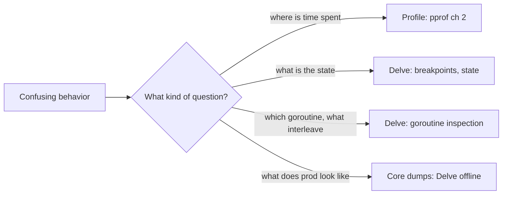

# Delve

## Why Does This Matter?

Print statements answer "what is the value"; a debugger answers
"what is the state": every local, every goroutine's stack, the
exact interleaving that produced the bug. Delve (`dlv`) is Go's
debugger, built on the same DWARF metadata the compiler emits, and
it understands goroutines as first-class objects: the concurrency
debugging that `println` cannot do. The profile answers "where is
time going"; Delve answers "why is this variable wrong right
here".

## Mental Model



The tool choice follows the question: profiles for aggregate
behavior, Delve for specific state. The discipline that makes
Delve effective: reproduce first (a failing test is the ideal
target), then inspect.

## How It Works

**Breakpoints** stop execution at a location; Delve shows the
goroutine's locals, arguments, and stack. **Conditional
breakpoints** stop only when an expression holds: the loop
iteration 999 problem becomes one command. **Goroutine
inspection**: `goroutines` lists every G with its state and
stack; `goroutine N` switches to it; `frame` moves up the stack.
This is the concurrency superpower: seeing what all 50,000
goroutines are waiting on, live ([20
§5](../20-observability/05-incident-debugging.md)'s goroutine
dump, but interactive).

**Core dumps**: Delve reads core files from crashed processes
(`GOTRACEBACK=crash` in prod produces them on panic, [22
§2](../22-production-go/02-server-lifecycle.md)): the crash state
becomes inspectable offline, with full variable values, weeks
later.

## Syntax / API

The command set that covers 95% of sessions:

```text
dlv debug ./cmd/svc            # build + run under Delve
dlv test ./pkg -run TestX      # debug a failing test (the ideal target)

break main.go:42               # breakpoint
break main.go:42 if err != nil # conditional
continue / next / step         # motion
print buf                      # locals and expressions
locals / args                  # the frame's state
goroutines                     # every goroutine: state + where
goroutine 123; bt              # inspect one, show its stack
breakpoints / clear 1          # manage
```

The test-first session (the workflow this handbook recommends):
`dlv test ./payments -run TestChargeRejectsNegative`, break inside
the validation branch, inspect why the negative amount survived:
the failing test already isolated the state; Delve explains it.

## Basic Example

The racy bug that only shows in production-shaped timing: two
goroutines updating a shared map through a helper that "clearly"
locks. The failing test is flaky. Under Delve:

```text
(dlv) goroutines
* Goroutine 1 (running) ... test.main
  Goroutine 7 (stopped) ... cache.Set  <- two goroutines inside Set
  Goroutine 9 (stopped) ... cache.Set
```

`goroutine 7; print m` shows the map mid-mutation; the mutex field
shows unlocked from the other goroutine's frame: the lock is in
the wrong helper. Print statements would show both goroutines
"holding" the lock; Delve shows the truth of the interleaving.

## Real-World Example

Debugging inside containers and Kubernetes: the binary is
distroless ([22 §5](../22-production-go/05-deploying-kubernetes.md)):
no shell, no debugger. Options, in order of preference:

1. **Reproduce locally** with the same inputs (the test-first
   path; most bugs die here).
2. **Debug sidecar**: a debug build (with Delve) deployed as a
   debug overlay, never the production image ([22
   §6](../22-production-go/06-releases-and-rollbacks.md)'s blast
   radius: the debug image is a different artifact).
3. **Core dump offline**: `GOTRACEBACK=crash` + a node-level core
   capture; analyze on your machine with the same binary and
   build info (`dlv core ./svc core.pid`).

The core-dump path is the production superpower: it is the only
way to inspect a crash that happens once a month at 4 a.m.

## Production Example

**The compiler flags that matter for debugging**: `-gcflags="all=
-N -l"` disables optimizations and inlining for a debug build:
variables stay in memory (not registers), lines stay mapped. This
is a *debug* artifact: never ship it ([19 §4](../19-performance/04-compiler-and-pgo.md)'s
optimizations are disabled; performance is fiction). Production
binaries keep optimization; their DWARF info (not stripped for
services you may need to debug) is what makes core dumps legible:
`-ldflags="-w"` strips DWARF: fine for distribution binaries,
wrong for services you operate.

**Remote debugging discipline**: `dlv connect`/`dlv attach` to a
live service stops goroutines: it is an outage in slow motion.
Debug live production only for a paused-the-world emergency;
prefer sidecars, staging replicas, and core dumps.

## Common Mistakes

| Mistake | Consequence | Do instead |
|---|---|---|
| Debugging optimized binaries | Variables optimized away; lines jump | Debug build with `-N -l` for local sessions |
| Attaching to live prod routinely | Whole-process stops: outage | Core dumps, sidecars, staging |
| Breakpoint-driven debugging as the default | Slow; doesn't scale to behavior questions | Failing test first; profiles for aggregates |
| Ignoring `goroutines` | Concurrency bugs solved by reading one goroutine | Make goroutine inspection the reflex |
| Shipping stripped binaries for services | Core dumps illegible later | Keep DWARF in service binaries; strip only distribution CLIs |

## Idiomatic Go

- `dlv test` with `-run` is the idiomatic entry point: the test
  is the reproducible world.
- Conditional breakpoints over print loops: the expression is the
  condition you would have printed for.
- `GOTRACEBACK=crash` in prod ([22 §2](../22-production-go/02-server-lifecycle.md))
  pairs with core capture: crashes become debuggable artifacts.

## Performance Considerations

Delve's own overhead matters only while stopped; breakpoints add
trap costs on hit paths: fine for debugging, not for load runs
(profiles are the load tool, chapter 2). Debug builds are for
understanding, never for benchmarking ([19
§1](../19-performance/01-measure-first.md)'s measure-the-real-
thing rule).

## Concurrency Considerations

Delve stops the whole process on breakpoints (all goroutines):
what you inspect is a consistent snapshot of that instant: race
bugs become visible as impossible states ([23 §6](../23-go-internals/06-memory-model.md)'s
model explains which states are legal). `goroutines` + per-G
frames is also the best teacher of the scheduler's model ([09
§4](../09-memory-runtime/04-scheduler-internals.md)): watch Gs
park, queue, and run.

## Security Considerations

A debugger is code execution on the target: Delve endpoints
(`dlv --headless --accept-multiclient`) are remote shells by
another name: never expose them; keep debug images out of prod
registries ([21 §1](../21-security/01-threat-model-and-validation.md)'s
boundary rules). Core dumps contain memory: secrets included:
capture them to restricted storage and delete after triage ([09
§3](../09-memory-runtime/03-garbage-collector.md)'s secrets-in-heap
note).

## Testing Strategy

- The failing test is the debugging harness: once Delve explains
  the state, *fix the test first* (reproduce the bug), then fix
  the code: the test proves the fix ([10 §1](../10-testing/01-fundamentals.md)).
- Keep a debug overlay (values file or build tag) that adds the
  Delve binary + `-N -l` flags without touching the production
  path ([22 §5](../22-production-go/05-deploying-kubernetes.md)'s
  manifest discipline).
- Practice core-dump triage once in peacetime: force a panic with
  `GOTRACEBACK=crash`, capture, open with `dlv core`, and walk the
  stack: the skill you rehearse is the skill 4 a.m. needs.

## Interview Questions

1. When do you reach for Delve versus pprof? Give a bug for each.
2. How would you debug a goroutine leak that only reproduces
   under production traffic, given distroless containers?
3. What do `-gcflags="all=-N -l"` change, and why must those
   binaries never ship to prod?
4. Walk a core-dump triage from a crashed pod to a root cause.

## Practice Exercises

1. Debug the Section 14 service's validation path with a
   deliberately planted bug: find it with a conditional
   breakpoint, not prints.
2. Use `goroutines` on the memwatch example ([09 §5](../09-memory-runtime/05-memory-leaks.md))
   mid-leak: find the leaked goroutines' parking spot interactively.
3. Force a panic with `GOTRACEBACK=crash` in a container; capture
   the core; open it with `dlv core` and read the stack. Write
   the runbook entry with your exact commands.

## Further Reading

- [Delve documentation](https://github.com/go-delve/delve/tree/master/Documentation)
- [Delve CLI commands reference](https://github.com/go-delve/delve/blob/master/Documentation/cli/README.md)
- [GOTRACEBACK environment variable](https://pkg.go.dev/runtime#hdr-Environment_variables)
