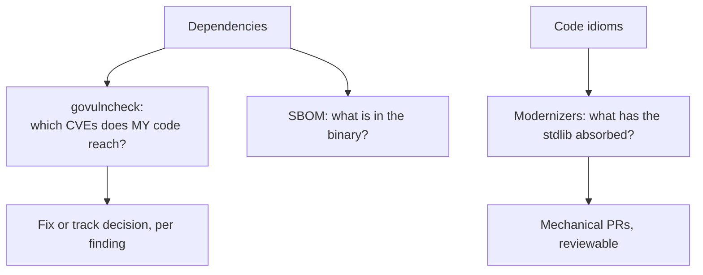

# Supply chain & modernizers

## Why Does This Matter?

Two forces age a Go codebase: its dependencies (known
vulnerabilities, abandoned libraries) and its idioms (code written
for Go 1.18 that predates the modern stdlib). Both age silently;
both have first-class tooling: `govulncheck` for the dependency
surface, `go fix` (and the modernizers it runs) for the code's
idioms. [21 Section 5](../21-security/05-secrets-and-supply-chain.md)
covers the security framing; this chapter is the operational
practice: the commands, the CI wiring (already live in this
repo), and the upgrade rhythm.

## Mental Model



The two tools answer different owners' questions: govulncheck is
the security team's question ("are we exposed?"); modernizers are
the maintainers' question ("is this code current?"). Both run in
CI so neither depends on memory.

## How It Works

**govulncheck** is call-graph aware: it reports only
vulnerabilities in functions your code actually calls, from the
Go vulnerability database ([21 Section 5](../21-security/05-secrets-and-supply-chain.md)'s
details). This changes the triage: a vulnerability in a package
you never import *paths* of is noise; a reachable one is a ticket
with a stack trace showing exactly where your code meets it.

**SBOM** (software bill of materials): the machine-readable
inventory of what is in a binary. `go version -m ./binary` prints
the module graph the binary was built from: the stdlib-native
SBOM core. Syft/Trivy produce the standard formats (SPDX,
CycloneDX) from the same source; attach one to release artifacts
so the question "were we exposed to CVE-X?" has a same-day
answer.

**Modernizers**: `go fix` applies analyzer-driven rewrites that
modernize idioms the stdlib has since absorbed. The Go 1.27
modernizers ([meta/versioning.md](../meta/versioning.md)) cover
conversions like `interface{}` → `any`, `sort.Slice` →
`slices.SortFunc` where appropriate, `m[i] = v; return m`-shaped
helpers → clearer stdlib calls, and min/max expressions → the
builtins. They are *suggested* by vet-style diagnostics and
*applied* by `go fix -fix=...`: reviewable, mechanical PRs.

## Syntax / API

The CI wiring this repository uses
([.github/workflows/security.yml](../.github/workflows/security.yml)):

```yaml
- go install golang.org/x/vuln/cmd/govulncheck@latest
- govulncheck ./...          # weekly schedule + workflow_dispatch
```

The local and release commands:

```bash
govulncheck ./...                    # source-mode scan (the default)
govulncheck -show traces ./...       # show the call path to each finding
go version -m ./bin/svc              # embedded module info (SBOM core)
go fix ./...                         # apply modernizers (review the diff!)
gopls codeaction --fix=... file.go   # editor-driven single fixes
```

Upgrade rhythm (the operational loop):

```bash
go list -u -m all | grep '\['        # available updates
go get -u ./... && go mod tidy       # or targeted: go get module@version
go build ./... && go test ./...      # the gate before any upgrade lands
```

## Basic Example

A govulncheck finding, read correctly:

```text
Vulnerability #1: GO-2026-0123
    data race in map iteration in gopkg.in/yaml.v3
  More info: https://pkg.go.dev/vuln/GO-2026-0123
  Module: gopkg.in/yaml.v3
    Found in: gopkg.in/yaml.v3@v3.0.0
    Fixed in: gopkg.in/yaml.v3@v3.0.1
  Call stacks in your code:
      #1: main.loadConfig → yaml.Unmarshal
```

The call stack is the actionable part: your config loader passes
untrusted YAML through the vulnerable function: severity high,
fix = bump to v3.0.1. Without the call-graph analysis, the same
finding is a fleet-wide panic; with it, it is a one-line upgrade
with a test ([21 Section 5](../21-security/05-secrets-and-supply-chain.md)'s
triage rule: the reachable finding is the severity input).

## Real-World Example

The modernizers' payoff compounds: a repo with five years of
accumulated `interface{}`, manual min/max, and `sort.Slice` calls
gets a hundred mechanical fixes in one `go fix` PR; after review,
the codebase reads like it was written against the current stdlib.
The deeper win is consistency: new contributors (and gopls) see
one idiom per concept, and the old idioms stop spreading in code
review by example. The discipline: run modernizers per Go release
([meta/versioning.md](../meta/versioning.md) tracks what landed),
review the diff like any PR (mechanical ≠ reviewed), and let CI's
existing gate (chapter 1) verify nothing broke.

## Production Example

**The dependency-review gate** ([21 Section 5](../21-security/05-secrets-and-supply-chain.md)'s
rules, operationalized):

1. CI blocks on govulncheck findings (PR gate), with the weekly
   scheduled run as backstop for new CVEs landing after merge.
2. `go.sum` and `go.mod` changes require review: a dependency PR
   is a supply-chain event ([21 Section 1](../21-security/01-threat-model-and-validation.md)).
3. Release artifacts carry an SBOM; the incident runbook names
   where ([22 Section 5](../22-production-go/05-deploying-kubernetes.md)'s
   image scanning joins it: dependencies *and* base image are two
   surfaces).
4. Unused dependencies: `go mod tidy` in CI (this repo does it
   implicitly via the build gate) keeps the graph minimal: the
   smallest graph has the smallest exposure.

**The abandoned dependency check** (the human layer of supply
chain): before adopting a module, the criteria [18 Section 2](../18-kafka-with-go/02-go-clients.md)
uses (maintenance activity, governance, responsiveness) apply;
the `go list -m -u all` habit catches the ones that stopped
moving.

## Common Mistakes

| Mistake | Consequence | Do instead |
|---|---|---|
| Treating every CVE finding as urgent | Alert fatigue; real exposure gets lost | Triage by the call graph: reachable = ticket, unreachable = track |
| `go get -u ./...` as routine maintenance | Unreviewed major-version churn | Targeted upgrades; majors are deliberate PRs |
| Applying `go fix` without review | Mechanical rewrites can change behavior at the edges | Review like any PR; CI verifies |
| SBOM generated only on demand | The CVE morning has no inventory | Generate at release; attach to artifacts |
| No upgrade rhythm for years | A cliff: every toolchain/dep jumps at once | Small upgrades per release cycle; modernizers per Go release |

## Idiomatic Go

- The Go ecosystem's opinion: fewer dependencies. Standard
  library first ([01 Section 1](../01-go-fundamentals/01-why-go-exists.md)'s
  philosophy); the smallest module graph is the supply-chain
  strategy.
- `go fix` is for stdlib-absorbed idioms only; style preferences
  are not modernizers' business.
- Keep `go.mod`'s tool directives (or pinned installs) as the
  toolchain record: the repo states which tools build and check
  it.

## Performance Considerations

Modernizers occasionally *are* performance fixes (the modernizers
for `sort` → `slices` and builtin `min`/`max` remove interface
boxing and generic overhead; [09 Section 2](../09-memory-runtime/02-escape-analysis.md)'s
boxing notes). Measure anything you suspect ([19
Section 1](../19-performance/01-measure-first.md)); the default reason
for modernizing is currency and readability, with speed as a
bonus. govulncheck is offline-cheap against the local module
graph; the vulnerability DB fetch is the only network cost.

## Concurrency Considerations

Upgrading a dependency can change its concurrency behavior
(pooling, goroutine-per-op): run the race detector on the
upgrade PR ([10 Section 1](../10-testing/01-fundamentals.md)), not just
the functional tests. Modernizers never change concurrency
semantics: their rewrites are semantics-preserving by design,
which is why they are safe to apply broadly.

## Security Considerations

This chapter *is* the operational half of [21 Section 5](../21-security/05-secrets-and-supply-chain.md)'s
supply-chain defense: the gate, the SBOM, the triage discipline.
The one addition: dependency *provenance* matters as much as
currency: `go get` verifies module checksums against
`go.sum` (GONOSUMDB/GONOSUMCHECK overrides exist; never use them
casually), and the module proxy's transparency log is the
ecosystem's integrity backbone: leave it enabled.

## Testing Strategy

- The upgrade gate: full `go test ./... -race` (this repo's CI)
  on every dependency PR; integration tests exercise the
  upgraded library's actual surface ([10 Section 3](../10-testing/03-integration-and-e2e.md)).
- `go fix` PRs: CI's existing gate is the verification; plus a
  targeted benchmark if a modernizer touched a hot path ([10
  Section 4](../10-testing/04-benchmarks-coverage-fuzzing.md)).
- The quarterly drill: take a real CVE from the database, trace
  whether your last release was exposed using the SBOM and
  govulncheck; time the answer: it should be minutes.

## Interview Questions

1. Your nightly govulncheck reports a critical CVE in a direct
   dependency. Walk the triage to the fix, including what makes
   it urgent versus trackable.
2. What is call-graph-aware vulnerability scanning and why does
   it matter for alert quality?
3. What goes into an SBOM for a Go service, and what question
   does it answer that govulncheck does not?
4. How do you keep a five-year-old Go codebase current without a
   big-bang rewrite?

## Practice Exercises

1. Introduce a vulnerable version of a module into a scratch
   module, call the vulnerable function, and watch govulncheck's
   call-stack output; then make it unreachable and compare.
2. Generate the SBOM for the Section 14 service binary with
   `go version -m`; attach it to a fake release; answer the
   CVE-morning drill against it.
3. Run `go fix` on a package of this repo; review every hunk;
   revert the ones you disagree with and say why in the PR
   description.

## Further Reading

- [govulncheck documentation](https://pkg.go.dev/golang.org/x/vuln/cmd/govulncheck)
- [Go vulnerability database](https://vuln.go.dev/)
- [Managing dependencies (go.dev)](https://go.dev/doc/modules/managing-dependencies)
- [Go 1.27 release notes: go fix and modernizers](https://go.dev/doc/go1.27)
