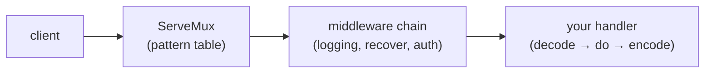

# Handlers & routing with net/http

## Why Does This Matter?

Every Go backend starts with `net/http`, and since **Go 1.22** the standard
library's `ServeMux` does method matching, wildcards, and path
normalization natively. That changes a long-standing default: most
services no longer need a routing framework. Knowing exactly what the
stdlib gives you, and what it deliberately does not, is the difference
between a lean service and a dependency you debug at 3 a.m.

## Mental Model

A handler is a function from request to response. The mux is a table:
pattern → handler. Everything else (auth, logging, timeouts) is
composition, not configuration:



Two rules keep this shape healthy:

1. **The mux routes; handlers do the work.** Business logic never
   appears inside a `switch` on URL paths.
2. **`*http.Request` is read-only; `http.ResponseWriter` is
   write-only.** Code that reaches across that line couples itself to
   the transport.

## Syntax: the Go 1.22 pattern language

| Pattern | Matches | Notes |
|---|---|---|
| `GET /users/{id}` | exactly this method+path | `{id}` captures one segment |
| `POST /users` | exact | methods before path, space-separated |
| `GET /files/{path...}` | all remaining segments | wildcard must be last |
| `GET /users` | any method | pattern without method matches all |
| `GET /` | any path not matched elsewhere | trailing subtree pattern |

Routing rules that matter in practice:

- **More specific patterns win**, regardless of registration order.
  `GET /users/me` beats `GET /users/{id}` even if registered later.
- **A path ending in `{id...}` is a subtree match**; without the
  wildcard it is exact.
- **Registering conflicting patterns panics at startup**, which is
  what you want: routing bugs surface in CI, not in production.

```go
mux := http.NewServeMux()
mux.HandleFunc("GET /users/{id}", getUser)
mux.HandleFunc("POST /users", createUser)
mux.HandleFunc("DELETE /users/{id}", deleteUser)
```

Reading path values:

```go
func getUser(w http.ResponseWriter, r *http.Request) {
	id := r.PathValue("id") // "" if no wildcard matched
	...
}
```

## Basic Example: a small but complete service

```go
// examples/api/main.go (excerpt; the full file compiles in examples/api)
mux := http.NewServeMux()
mux.HandleFunc("GET /healthz", handleHealth)

srv := &http.Server{
	Addr:              ":8080",
	Handler:           mux,
	ReadHeaderTimeout: 5 * time.Second,
}
log.Fatal(srv.ListenAndServe())
```

(Why `ReadHeaderTimeout` is not optional: see chapter 5,
[clients & timeouts](04-clients-and-timeouts.md).)

## Real-World Example: what stays, what goes

A production service typically needs from its router: method matching,
path parameters, one catch-all for the SPA or docs. The Go 1.22 mux
covers all three. You still need external packages only for:

- **host-based or versioned routing at scale** (`v1.api.example.com`,
  per-tenant routers): possible with mux-per-host wrappers, but awkward;
- **regex routes or route priorities you can express declaratively**:
  rare; if you reach for one, measure whether you need it at all;
- **generated clients from route definitions**: a real reason, but it
  buys a framework for the whole codebase, not just routing.

The honest test: write the mux table first. If every route fits in one
screen, you do not have a routing problem.

## Production Example: mapping errors from 05 to responses

Handlers end in one of three outcomes: encode a value, encode an
error, or the request context died. The boundary translation from
[05 §2](../05-errors/02-error-design.md) slots straight in:

```go
func (s *Server) handleGetPayment(w http.ResponseWriter, r *http.Request) {
	p, err := s.store.Payment(r.PathValue("id"))
	if err != nil {
		writeError(w, err) // the single translation point from 05 §2
		return
	}
	writeJSON(w, http.StatusOK, p)
}
```

One function owns status-code mapping. Handlers stay dumb; tests
assert on classification, not on strings.

## Common Mistakes

- **Using `http.DefaultServeMux` in real services.** It is a global:
  any imported package can register on it (`net/http/pprof` does, and
  exposes internals on your port unless you gate it). Always
  `http.NewServeMux()`.
- **Trusting `r.URL.Path` for routing decisions in handlers.** By the
  time your handler runs the mux has already normalized the path;
  re-deriving routes from it duplicates the router and drifts.
- **Silent method mismatches.** Registering `GET /x` and receiving
  `POST /x` gets a stdlib `405` with an `Allow` header: that is
  correct behavior, but only if you registered the method. Omitting
  the method silently accepts every verb.
- **Reading the body and never closing it** (or closing after the
  handler returns). `defer r.Body.Close()` at the top.
- **Writing the header after the body.** First write commits the
  status; setting `Content-Type` after `Fprintf` silently no-ops.
- **Assuming `PathValue` is non-empty.** If the handler was reached
  without the wildcard (possible via composition), it is `""`.

## Idiomatic Go

- `mux.HandleFunc("GET /x", h)` for everything; one style.
- Handlers as methods on a `Server` struct: dependencies (store,
  logger, config) are fields, not globals.
- Small handlers that delegate; the HTTP layer is translation, not
  business logic.

## Performance Considerations

- The Go 1.22 mux does per-request pattern matching against a small
  tree; at realistic route counts (tens) the cost is noise. Route
  count in the hundreds is a design smell before it is a performance
  problem.
- `ResponseWriter` buffering: responses under ~4 KB usually fit in one
  write; chatty handlers that write field-by-field produce more
  syscalls than larger single writes.

## Concurrency Considerations

- Handlers run one goroutine per request **by design**. Never share
  request-scoped values via struct fields; use `r.Context()` and
  locals.
- A handler that starts goroutines must own their lifetime (see
  [08 §3 context](../08-concurrency/03-context.md)): a returned
  handler's goroutines outlive the request and leak if unmanaged.

## Security Considerations

- The mux normalizes `..` and redirects, but do not build authorization
  on path shape alone; authz belongs in middleware with the full
  request visible (chapter 2).
- Path values are attacker-controlled strings: validate before they
  become SQL, file paths, or redirect targets (see
  [21-security](../21-security/)).

## Testing Strategy

- Handler tests with `httptest.NewRequest` + `httptest.NewRecorder`
  run in-process with no ports: the default (mechanics in
  [10 §2](../10-testing/02-doubles-and-httptest.md)).
- One table per route: status code, Content-Type, and body shape.
- A routing test that iterates the mux's table catches accidental
  method gaps (a route reachable under the wrong verb).

## Interview Questions

1. What changed in `ServeMux` with Go 1.22, and what does it remove
   the need for?
2. How does the mux resolve overlapping patterns (specificity,
   registration order, or something else)?
3. Why is `http.DefaultServeMux` discouraged in production?
4. Walk through what happens from `conn.Accept` to your handler
   running: who spawns the goroutine?
5. Where should status-code translation live, and why not in each
   handler?

## Practice Exercises

1. Register routes for `GET /users/me` and `GET /users/{id}`; verify
   the specific pattern wins for `GET /users/me` regardless of
   registration order, and that `DELETE /users/me` correctly 405s if
   only GET is registered.
2. Add a catch-all `GET /{path...}` route serving a 404 JSON body,
   then prove the specific routes still win.
3. Write the routing table test from the Testing Strategy section for
   a 4-route API.

## Further Reading

- [net/http.ServeMux pattern syntax](https://go.dev/blog/routing-enhancements)
- [net/http package documentation](https://pkg.go.dev/net/http)
- [httptest package](https://pkg.go.dev/net/http/httptest)
