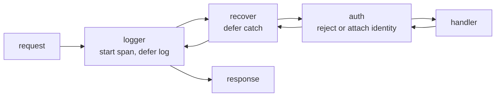

# Middleware

## Why Does This Matter?

Cross-cutting concerns (logging, recovery, timeouts, authn, tracing)
must apply to every route, and must not require every handler to
remember them. Middleware is Go's answer: functions that wrap handlers.
Because it is just composition, there is no framework to learn and no
lifecycle to debug: but there are real ordering and error-handling
rules that make the difference between a clean chain and a subtle
security hole.

## Mental Model

A middleware is a handler that calls the next one:



Two invariants define a correct chain:

1. **Work before `next` runs on the way in; work after runs on the way
   out.** `defer` inside a middleware brackets the whole downstream.
2. **The chain owns the response.** Once any layer writes, later
   layers (and the handler) can only add: headers set after the first
   write are lost.

## Syntax / API: the two shapes

```go
// Shape 1: function middleware (most common)
func Logging(next http.Handler) http.Handler {
	return http.HandlerFunc(func(w http.ResponseWriter, r *http.Request) {
		start := time.Now()
		next.ServeHTTP(w, r)
		slog.Info("http", "method", r.Method, "path", r.URL.Path,
			"dur", time.Since(start))
	})
}

// Shape 2: type with a ServeHTTP method (needed for stateful middleware)
type RequestID struct{ Next http.Handler }

func (m RequestID) ServeHTTP(w http.ResponseWriter, r *http.Request) {
	id := newID()
	ctx := context.WithValue(r.Context(), ctxKeyID, id)
	m.Next.ServeHTTP(w, r.WithContext(ctx))
}
```

Both compose identically; pick one style per codebase.

## Basic Example: the chain constructor

```go
func Chain(h http.Handler, mws ...func(http.Handler) http.Handler) http.Handler {
	// Apply in reverse so the first middleware listed is outermost:
	// Chain(h, a, b) == a(b(h)), which matches reading order.
	for i := len(mws) - 1; i >= 0; i-- {
		h = mws[i](h)
	}
	return h
}

handler := Chain(mux, Logging, Recover, Authenticate)
```

The reverse loop is the whole trick. Apply forward and your logs
describe the request in reverse order, which reads like an accident
report.

## Real-World Example: the five middleware every service needs

| Middleware | Job | Ordering constraint |
|---|---|---|
| Request ID | assign ID, put in context + response header | outermost, so everything can use it |
| Logging | one line per request with status + duration | outside Recover, to log its result |
| Recover | catch panics → 500 | outside the handler, inside logging |
| Timeout / deadline | bound handler time | wrap the mux, not each handler |
| Authenticate | reject unauthenticated, attach identity | innermost, before handlers |

```go
handler := Chain(mux,
	RequestIDMiddleware,
	LoggingMiddleware,
	RecoverMiddleware,
	TimeoutMiddleware(10*time.Second),
	AuthenticateMiddleware,
)
```

**Recover**, done correctly:

```go
func RecoverMiddleware(next http.Handler) http.Handler {
	return http.HandlerFunc(func(w http.ResponseWriter, r *http.Request) {
		defer func() {
			if rec := recover(); rec != nil {
				slog.Error("panic", "rec", rec, "stack", string(debug.Stack()))
				// Only safe if nothing was written yet; see mistakes below.
				http.Error(w, "internal error", http.StatusInternalServerError)
			}
		}()
		next.ServeHTTP(w, r)
	})
}
```

**Timeout** is `http.TimeoutHandler` from the stdlib: no need to write
one. It returns 503 and (from Go 1.23-era behavior, documented since
its introduction) closes the underlying connection after the handler
finishes late, instead of letting a hijacked response interleave with
another request's. Use it instead of hand-rolled select loops.

```go
mux = http.TimeoutHandler(mux, 10*time.Second, "timeout\n")
```

## Production Example: identity through context

```go
type ctxKey int

const keyIdentity ctxKey = 0

func Authenticate(next http.Handler) http.Handler {
	return http.HandlerFunc(func(w http.ResponseWriter, r *http.Request) {
		id, err := identify(r) // token verification lives in 21-security
		if err != nil {
			w.Header().Set("WWW-Authenticate", `Bearer realm="api"`)
			http.Error(w, "unauthorized", http.StatusUnauthorized)
			return
		}
		ctx := context.WithValue(r.Context(), keyIdentity, id)
		next.ServeHTTP(w, r.WithContext(ctx))
	})
}

// Handlers read identity through an accessor, never through raw keys.
func Identity(r *http.Request) Identity {
	id, _ := r.Context().Value(keyIdentity).(Identity)
	return id
}
```

Three rules make context values maintainable: unexported key type, one
accessor function per value, and never store anything in context that
a parameter could carry (see
[08 Section 3](../08-concurrency/03-context.md) for the full context rules).

## Common Mistakes

- **Responding from recovery after the handler already wrote.** If the
  handler wrote a 200 and then panicked, your 500 write is silently
  dropped and the client gets a truncated 200. Track whether the
  response started (wrap the writer with a `wroteHeader` flag) and log
  loudly instead of writing when it did.
- **Auth middleware inside timeout middleware.** Ordering by
  convention is how an unauthenticated request burns a full 10-second
  timeout slot; reject cheap things early.
- **Middleware that swallows errors.** A middleware that `return`s on
  its error path without writing a response leaves the client with a
  bare connection close.
- **Per-request state in middleware struct fields.** The same
  middleware instance serves all requests concurrently; mutable fields
  become data races. State belongs in the request context.
- **Forgetting `r.WithContext`.** `context.WithValue` returns a new
  context; passing the old one downstream silently loses the value.
- **Ordering that "works by accident."** Every chain refactor
  re-rolls these dice; document the intended order next to the chain.

## Idiomatic Go

- Function middleware `func(http.Handler) http.Handler` as the default;
  the struct shape only when you need constructor state.
- One concern per middleware; compose rather than configure.
- Stdlib first: `http.TimeoutHandler`, `net/http/pprof` (gated), and
  `http.MaxBytesHandler` cover common needs without a library.

## Performance Considerations

- Each layer adds a call per request: nanoseconds. The real costs are
  what middleware *does*: a logging middleware that formats ten fields
  per request at 50k RPS is a measurable allocator; sample or trim
  fields on hot paths ([19 Section 1](../19-performance/01-measure-first.md)).
- `http.TimeoutHandler` buffers nothing by itself; pairing it with a
  handler that streams large responses keeps memory bounded, while a
  handler that builds the whole body in memory does not.

## Concurrency Considerations

- Middleware runs in the request goroutine: anything it starts must be
  bounded and canceled with the request context, or it outlives the
  request (the goroutine-leak pattern from
  [08 Section 7](../08-concurrency/07-pitfalls.md)).
- Shared maps inside middleware (rate counters, caches) need the sync
  discipline from [08 Section 4](../08-concurrency/04-sync-primitives.md).

## Security Considerations

- **Security-relevant middleware (authn, authz, rate limiting) must be
  outermost enough that no route can be reached without it.** A
  catch-all route registered after the chain wraps only what it
  wraps: mount security outside the mux, not inside it.
- Security headers (CSP, HSTS, `X-Content-Type-Options`) are a
  middleware concern precisely because handlers forget them; but they
  belong in their own middleware, not piggybacked on logging.
- Do not log tokens, cookies, or authorization headers; redact in the
  logging middleware ([21-security](../21-security/)).

## Testing Strategy

- Test each middleware in isolation: wrap a handler that records
  (wrote body? status? context value?), then assert the bracket
  behavior.
- Test the chain once with a spy handler that records the call order;
  ordering regressions are the classic silent breakage.
- For recovery, a handler that panics must yield 500 and must not
  crash the test process; with `httptest.NewRecorder` it would, which
  is the point of running recovery in front.

## Interview Questions

1. Implement middleware that logs duration and status without reading
   the body twice.
2. Why does middleware ordering matter for security? Give a concrete
   failure.
3. How does `http.TimeoutHandler` interact with a handler that
   finishes after the deadline?
4. How do you pass per-request values through a chain without global
   state?
5. Your recover middleware logs "panic: nil map write" at 2 a.m. What
   response has the client already received, and how do you know?

## Practice Exercises

1. Write a `MaxBody(n)` middleware using `http.MaxBytesReader` and
   verify a too-large body gets 413 without reading the whole thing.
2. Build a response-writer wrapper that records the status code; use
   it to make logging assert exact statuses in tests.
3. Add a security-headers middleware and write a test proving every
   route (including 404s) receives the headers.

## Further Reading

- [http.TimeoutHandler](https://pkg.go.dev/net/http#TimeoutHandler)
- [http.MaxBytesHandler](https://pkg.go.dev/net/http#MaxBytesHandler)
- [context rules in this handbook](../08-concurrency/03-context.md)
