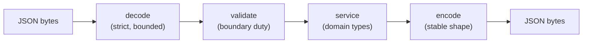

# JSON & REST APIs

## Why Does This Matter?

Most Go services are JSON in, JSON out, and the bugs are always the
same three: encoding that panics on unusual input, response shapes
that drift, and validation living in the wrong layer. The stdlib's
`encoding/json` plus a few fixed habits produce APIs that stay stable
for years with zero extra dependencies.

## Mental Model

The HTTP layer translates, it does not decide:



Two type systems meet at this boundary: your domain types and the
wire format. Keeping them separate (a request type per endpoint,
instead of passing `User` structs through) is what keeps wire changes
from breaking domain code and vice versa.

## How It Works: encoding essentials

- `json.Marshal` walks public fields; unexported fields are invisible.
  `json.NewEncoder(w)` streams and adds a trailing newline; for HTTP
  responses it is the better default because it never builds the whole
  string in memory.
- Tags are the wire contract: `json:"amount_minor"` names the field;
  `json:"amount_minor,omitempty"` drops it when zero, which is
  sometimes what you want and sometimes erases meaning (a zero amount
  and an absent amount are different facts).
- `json.Unmarshal` into a struct ignores unknown fields by default:
  tolerant, but it hides client typos. `Decoder.DisallowUnknownFields`
  flips that per-decoder.
- Numbers: untyped JSON numbers decode into `float64` inside
  `any`. Into typed fields they decode exactly. This is the root of
  most money-rounding bugs (see
  [25 §1](../25-fintech-with-go/01-money-and-payments.md)).

## Syntax / API: the two helper functions

Nearly every service needs exactly these two:

```go
func writeJSON(w http.ResponseWriter, status int, v any) {
	w.Header().Set("Content-Type", "application/json; charset=utf-8")
	w.WriteHeader(status)
	if err := json.NewEncoder(w).Encode(v); err != nil {
		// Headers are sent; the client gets a truncated body. Log;
		// there is nothing else left to do here.
		slog.Error("encode response", "err", err)
	}
}

func decodeJSON[T any](w http.ResponseWriter, r *http.Request) (T, error) {
	var v T
	dec := json.NewDecoder(http.MaxBytesReader(w, r.Body, 1<<20))
	dec.DisallowUnknownFields()
	if err := dec.Decode(&v); err != nil {
		return v, fmt.Errorf("decode body: %w", err)
	}
	return v, nil
}
```

`decodeJSON` is generic for one reason: callers get a typed value
without a second cast, and the compiler enforces that the target is a
real struct, not an `any` (generics earn their keep here; see
[07 §4](../07-generics/04-generic-apis.md)).

## Basic Example: create with validation

```go
type createUserRequest struct {
	Email string `json:"email"`
	Name  string `json:"name"`
}

func (s *Server) handleCreateUser(w http.ResponseWriter, r *http.Request) {
	req, err := decodeJSON[createUserRequest](w, r)
	if err != nil {
		http.Error(w, "invalid request body", http.StatusBadRequest)
		return
	}
	if err := validateUser(req); err != nil {
		// 422 for well-formed but invalid; see the table below.
		http.Error(w, err.Error(), http.StatusUnprocessableEntity)
		return
	}
	u, err := s.store.CreateUser(r.Context(), req.Email, req.Name)
	if err != nil {
		writeError(w, err) // the mapping point from 05 §2
		return
	}
	w.Header().Set("Location", "/users/"+u.ID)
	writeJSON(w, http.StatusCreated, u)
}
```

## Real-World Example: status codes as a decision table

| Situation | Code | Why |
|---|---|---|
| Created | 201 + `Location` | clients can find the resource |
| Body did not parse | 400 | malformed is always client's |
| Parsed but invalid | 422 | distinguishes syntax from semantics |
| Not found | 404 | mapped from domain error (05 §2) |
| Conflict (already exists, version clash) | 409 | retry with new state |
| Handler wrote nothing after deadline | 503 | `http.TimeoutHandler` |
| Unexpected error | 500, generic body | detail goes to logs, not clients |

The three that get misused most: 200-with-error-body (breaks every
client's error handling), 400 for validation (works, but 422 lets
clients distinguish "fix your JSON" from "fix your fields"), and 500
for dependency failures (which makes your dashboards claim you are
broken when the database is).

## Production Example: the full request lifecycle

The runnable example in `examples/api/` composes the pieces:

```go
// main.go excerpt: the chain from chapter 2, the helpers from this
// chapter, error mapping from 05, handlers on a Server struct.
handler := Chain(mux,
	RequestID,
	Logging,
	Recover,
) // + http.TimeoutHandler wrapping, + graceful shutdown (chapter 5)
```

Its tests exercise each layer through `httptest`: decode failure →
400, validation failure → 422, domain not-found → 404, success → 201
with `Location`. Nothing in the tests knows about ports, TLS, or
processes.

## Common Mistakes

- **`json:"Name"` capital tags.** The tag must match the wire name
  exactly; `json:"Name"` on field `Name` makes Go look for `"Name"`
  on the wire while every client sends `"name"`. Field silently always
  zero. (Tag typos are invisible to the compiler; see
  [02 §4 structs](../02-go-language/04-structs.md).)
- **Decoding straight into domain types.** The day `User` gains an
  internal field, your API docs change shape. Separate wire types.
- **Unbounded `io.ReadAll(r.Body)`.** A 10 GB body becomes a 10 GB
  allocation. `http.MaxBytesReader` (as in `decodeJSON`) bounds it and
  lets the server close the connection.
- **Marshaling maps for API responses.** Map order is randomized;
  clients diffing responses see phantom changes. Sort or use structs.
- **`omitempty` on fields where zero is meaningful** (`amount_minor: 0`
  vanishing from a payment response).
- **Ignoring `Encoder.Encode`'s error.** It usually means the client
  went away (fine) but can mean a marshal failure mid-stream (a real
  bug).

## Idiomatic Go

- `json.NewEncoder`/`NewDecoder` over `Marshal`/`Unmarshal` at
  boundaries: streaming, and the decoder is configurable.
- Wire structs live next to their handlers, unexported, with a
  `validate` method or a pure `validateX` function.
- `http.Error` for plain-text error bodies; JSON error envelopes only
  if clients actually consume them.

## Performance Considerations

- `json.Encoder` streams; `json.Marshal` allocates the full document.
  For large lists, encode directly to `w` instead of building a slice
  of response structs first.
- `encoding/json` reflection cost is real on hot paths: measure before
  swapping in codegen alternatives
  ([19 §1](../19-performance/01-measure-first.md)). Most services
  never hit the threshold where it matters.
- Reused decoders are not safe across requests; the allocation per
  request is small and correct beats cached and racy.

## Concurrency Considerations

- `json.Encoder`/`Decoder` are not safe for concurrent use; one per
  request, never shared.
- Marshaling a struct while another goroutine mutates it is a data
  race the race detector will catch in tests, never in review.

## Security Considerations

- `DisallowUnknownFields` is a mild hardening (surfaces client bugs),
  not a security control; the control is input validation at the
  boundary ([21-security](../21-security/)).
- Never echo raw error text from decoders or drivers to clients: it
  leaks types and structure. `decodeJSON`'s error is wrapped for logs;
  the response text is generic.
- HTML escaping is on by default in `encoding/json` (`<`, `>`, `&`
  become `\u003c`...): keep it unless you know why you are turning it
  off.

## Testing Strategy

- Table-driven: request body → expected status, with one row per
  decode-failure, validation-failure, and success case (the runnable
  example's tests do exactly this).
- Round-trip test for wire types: marshal a fixture, unmarshal, assert
  equality; catches tag typos the compiler cannot.
- Assert `Content-Type` and trailing shapes in handler tests; clients
  depend on them silently.

## Interview Questions

1. Where do you draw the line between wire types and domain types, and
   what breaks if you skip it?
2. How does `encoding/json` handle numbers into `any` vs typed fields,
   and where has that burned you?
3. Why is `MaxBytesReader` passed the `ResponseWriter`?
4. A client sends 10 GB: walk through what your service does with
   default settings vs with your decode helper.
5. When is `omitempty` a bug?

## Practice Exercises

1. Add a PATCH endpoint with a partial-update wire type
   (`*string`/`*int` pointer fields) and prove "absent" vs "set to
   zero" are distinguishable.
2. Write the round-trip test for a wire type with three tags, then
   intentionally break one tag and watch the test catch it.
3. Extend `decodeJSON` with a size limit parameter and a test that a
   2 MB body gets rejected at the 1 MB setting without reading fully
   into memory.

## Further Reading

- [encoding/json package](https://pkg.go.dev/encoding/json)
- [JSON and Go (Go Blog)](https://go.dev/blog/json)
- [RFC 9110 status code semantics](https://httpwg.org/specs/rfc9110.html)
