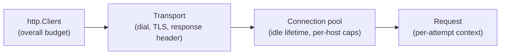

# HTTP clients & timeouts

## Why Does This Matter?

The server side of HTTP is where Go's reputation for correctness lives;
the client side is where production incidents are born. A default
`http.Client{}` has **no timeouts at all**: one stalled connection ties
up a goroutine, then a pool, then your service. Every level of the
client stack has its own timeout knob, and using the wrong one is a
classic review miss. This chapter is the map of those knobs, plus the
retry and pooling judgment that goes with them.

## Mental Model

A request passes through four layers, each with its own failure mode
and its own knob:



The knobs, and what each actually bounds:

| Knob | Bounds | Catches |
|---|---|---|
| `context` deadline | the whole call, all retries included | your budget spent |
| `Client.Timeout` | request → body fully read | a slow body you forgot about |
| `Transport.DialContext` timeout | TCP connect only | unreachable host |
| `Transport.TLSHandshakeTimeout` | handshake only | stalled TLS |
| `Transport.ResponseHeaderTimeout` | connect done → first header byte | server accepted but hung |
| `Transport.IdleConnTimeout` | idle pool lifetime | stale connections behind LBs |

There is no knob for "time to read the body" alone; the body is
bounded by `Client.Timeout` and your context. A server that streams
for an hour will hold your client for an hour unless one of those
fires.

## Syntax / API: a production client constructor

```go
func NewClient(base *url.URL, timeout time.Duration) *http.Client {
	t := http.DefaultTransport.(*http.Transport).Clone()
	t.DialContext = (&net.Dialer{
		Timeout:   5 * time.Second,
		KeepAlive: 30 * time.Second,
	}).DialContext
	t.TLSHandshakeTimeout = 5 * time.Second
	t.ResponseHeaderTimeout = 10 * time.Second
	t.IdleConnTimeout = 90 * time.Second
	t.MaxIdleConnsPerHost = 100 // default is 2: see pooling below

	return &http.Client{
		Transport: t,
		Timeout:   timeout,
	}
}
```

`.Clone()` matters: mutating `http.DefaultTransport` directly edits a
process-wide global every other library shares.

## Basic Example: a request with its own deadline

```go
func FetchPayment(ctx context.Context, c *http.Client, id string) (*Payment, error) {
	ctx, cancel := context.WithTimeout(ctx, 3*time.Second)
	defer cancel()

	req, err := http.NewRequestWithContext(ctx, http.MethodGet,
		baseURL+"/payments/"+url.PathEscape(id), nil)
	if err != nil {
		return nil, fmt.Errorf("build request: %w", err)
	}
	req.Header.Set("Accept", "application/json")

	resp, err := c.Do(req)
	if err != nil {
		return nil, fmt.Errorf("call payment service: %w", err)
	}
	defer resp.Body.Close()

	if resp.StatusCode != http.StatusOK {
		return nil, classifyStatus(resp.StatusCode) // map, don't panic
	}
	var p Payment
	if err := json.NewDecoder(io.LimitReader(resp.Body, 1<<20)).Decode(&p); err != nil {
		return nil, fmt.Errorf("decode payment: %w", err)
	}
	return &p, nil
}
```

Every line is load-bearing: `NewRequestWithContext` (deadlines travel),
`PathEscape` (IDs are attacker-controlled), `LimitReader` (bodies are
untrusted), `defer Close` (or the pool leaks the connection).

## Real-World Example: retries that respect idempotency

Retries are a caller decision, not a client feature (the decision
table is in [05 §2](../05-errors/02-error-design.md); the delivery
semantics are in [16-distributed-systems](../16-distributed-systems/)).
The mechanics:

```go
var retryable = map[int]bool{
	http.StatusTooManyRequests:      true,
	http.StatusServiceUnavailable:   true,
	http.StatusBadGateway:           true,
	http.StatusGatewayTimeout:       true,
}

for attempt := 0; ; attempt++ {
	resp, err := c.Do(req) // req must be replayable: see below
	if err != nil && errors.Is(err, context.DeadlineExceeded) {
		return fmt.Errorf("budget exhausted: %w", err) // never retry ctx
	}
	if err == nil && !retryable[resp.StatusCode] {
		return resp, nil // done
	}
	if attempt == maxRetries {
		return resp, err // out of patience
	}
	select {
	case <-time.After(backoff(attempt)): // exponential + jitter
	case <-ctx.Done():
		return ctx.Err()
	}
}
```

**The replayability trap**: a request with a body can only be retried
if the body can be re-read. `bytes.Reader` over a small buffer works;
an open file or stream does not. GETs are trivially replayable; for
POSTs the honest answer is idempotency keys
([25 §3](../25-fintech-with-go/03-integrity-and-exactly-once.md)),
not blind retries.

## Production Example: pooling judgment

The transport pool is where client performance actually lives:

- `MaxIdleConnsPerHost` defaults to **2**. A service calling one
  dependency with 50 concurrent requests closes ~48 connections per
  round: TLS handshakes everywhere, latency spikes, TIME_WAIT
  exhaustion. Raise it to expected per-host concurrency.
- `MaxIdleConns` (default 100) is the global pool cap; per-host caps
  are what bite in microservices.
- Identities differ per environment: behind a load balancer with keep-
  alive, longer `IdleConnTimeout` is fine; against a backend that
  drains aggressively, shorter beats stale-connection errors.

Measure, don't guess: the connection reuse rate is visible in
`httptrace` and in the target's logs
([19 §1](../19-performance/01-measure-first.md)).

## Common Mistakes

- **`http.Client{}` with no transport or timeout** in production code.
  It works in dev forever, then eats your connection pool in prod.
- **Setting `Client.Timeout` when the caller already has a context.**
  Two budgets race; the error text tells you the wrong one fired. Pick
  the context for per-call budgets; `Client.Timeout` is for the
  overall cap.
- **Mutating `http.DefaultTransport`.** It is a global shared with
  every library in the process. Clone it.
- **`defer resp.Body.Close()` before checking `err`**: when `Do`
  returns an error, `resp` is nil and the defer panics. Close only on
  the success path.
- **Not draining error-response bodies.** Until the body is read to
  EOF (or a little of it, then closed), the connection cannot be
  reused: `io.Copy(io.Discard, io.LimitReader(resp.Body, 512))` then
  close keeps the pool warm on error paths.
- **Retrying non-idempotent POSTs** on timeout: the first attempt may
  have *succeeded*; you just never saw the response. Now you have two
  charges.
- **Ignoring the `Retry-After` header** on 429/503: the server told
  you when; your backoff guessed.

## Idiomatic Go

- One client per dependency, built in a constructor with its transport
  knobs; never a process-wide default client for real calls.
- `NewRequestWithContext` always, even when the caller has no deadline
  yet: contexts can gain one upstream.
- Wrap errors with the dependency name: `"call payment service: ..."`
  turns a log line into an answer.

## Performance Considerations

- Connection reuse is the single biggest client win: pool settings and
  body-draining discipline matter more than any JSON library swap.
- Per-request allocations (`Request`, headers, decoder) are small but
  multiply at high RPS; benchmark before optimizing
  ([19 §1](../19-performance/01-measure-first.md)).
- HTTP/2 multiplexes over one connection per host and changes the
  pooling math: with `ForceAttemptHTTP2` (default when cloning the
  default transport), `MaxIdleConnsPerHost` matters less; connection
  count is no longer the bottleneck, stream limits are.

## Concurrency Considerations

- `http.Client` and `http.Transport` are safe for concurrent use by
  design; the pool is the shared state, and its caps are your
  concurrency limiter.
- Unbounded fan-out to a slow dependency + small `MaxIdleConnsPerHost`
  = connection churn; a semaphore in front (see
  [08 §5](../08-concurrency/05-patterns.md)) bounds in-flight calls
  properly.

## Security Considerations

- TLS verification is on by default; `InsecureSkipVerify: true` is a
  code smell that belongs only in tests, with a comment naming the
  test ([21-security](../21-security/)).
- SSRF: URLs built from user input must be validated against an
  allowlist of hosts and schemes before `Do`; a "URL preview" feature
  that fetches arbitrary URLs will be pointed at your metadata service.
- Authorization headers and tokens must not leak into error text or
  logs; wrap errors with the dependency name, never the full URL with
  its query string.

## Testing Strategy

- Point the client at `httptest.NewServer` for success and error
  mappings ([10 §2](../10-testing/02-doubles-and-httptest.md)).
- A `RoundTripper` fake injects failures without any server; use it
  for timeout and retry-path tests where real timing is flaky.
- Assert on the *request* the client sends (path, headers, body) using
  the test server's handler: client bugs are usually request bugs.

## Interview Questions

1. Name every timeout knob between `Client.Do` and the socket, and
   what each bounds.
2. Why does the default `MaxIdleConnsPerHost` hurt a
   microservices fan-out, and what do you set?
3. When is retrying a POST safe? What makes it safe?
4. `context deadline exceeded` vs `Client.Timeout exceeded`: which
   fired, and how do the errors differ?
5. How do you keep the connection pool warm on error paths?

## Practice Exercises

1. Write a test proving a client without `ResponseHeaderTimeout`
   hangs forever against a handler that sleeps past the context
   deadline, then fix it.
2. Build a retry helper with exponential backoff and jitter, and a
   `RoundTripper` fake that fails twice then succeeds; assert exactly
   three attempts.
3. Instrument a client with `httptrace` and print DNS/connect/TLS/
   first-byte timings; run it against `httptest.NewServer` and against
   a real URL and compare where the time goes.

## Further Reading

- [net/http.Client](https://pkg.go.dev/net/http#Client)
- [net/http.Transport](https://pkg.go.dev/net/http#Transport)
- [net/http/httptrace](https://pkg.go.dev/net/http/httptrace)
