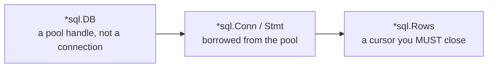

# database/sql in depth

## Why Does This Matter?

`database/sql` is the standard interface every Go database driver
implements, and it is the layer where the same five mistakes happen in
every codebase: leaks (unclosed rows), unbounded queries (no context),
the nil/zero scanning trap, the driver-dependency mystery, and pool
settings nobody chose. Master the interface once and Postgres, MySQL,
and SQLite all behave predictably.

## Mental Model

The package is three objects and one rule:



The rule: **`*sql.DB` is not a connection**. It is a concurrency-safe
pool handle; you never "open a connection per request" and never store
one. Connections are borrowed (by `Query`, `Exec`, `Conn`) and
returned automatically, except where you hold them explicitly (a
transaction, or `Rows` you have not closed).

## Syntax / API: the vocabulary

| Method | Use | Returns |
|---|---|---|
| `QueryContext` | SELECT, expect rows | `*sql.Rows` (close it) |
| `QueryRowContext` | expect exactly one row | `*sql.Row` (scan once) |
| `ExecContext` | INSERT/UPDATE/DELETE/DDL | `sql.Result` (rows affected) |
| `PrepareContext` | reuse one statement | `*sql.Stmt` |
| `BeginTx` | transaction | `*sql.Tx` (commit or rollback) |

Every method has a `Context` variant. In production code there is no
excuse for the non-context forms: the context is how a canceled HTTP
request cancels its own query instead of burning pool capacity.

## Basic Example: the queries you will write 90% of the time

```go
// One row: QueryRow + Scan. The single most common shape.
func (r *UserRepo) ByEmail(ctx context.Context, email string) (User, error) {
	var u User
	err := r.db.QueryRowContext(ctx,
		`SELECT id, email, name FROM users WHERE email = $1`, email,
	).Scan(&u.ID, &u.Email, &u.Name)
	if errors.Is(err, sql.ErrNoRows) {
		return User{}, fmt.Errorf("user %q: %w", email, ErrNotFound)
	}
	if err != nil {
		return User{}, fmt.Errorf("query user: %w", err)
	}
	return u, nil
}

// Many rows: Query, iterate, Close via defer.
func (r *UserRepo) Active(ctx context.Context) ([]User, error) {
	rows, err := r.db.QueryContext(ctx,
		`SELECT id, email, name FROM users WHERE active = $1`, true)
	if err != nil {
		return nil, fmt.Errorf("query active users: %w", err)
	}
	defer rows.Close()

	var out []User
	for rows.Next() {
		var u User
		if err := rows.Scan(&u.ID, &u.Email, &u.Name); err != nil {
			return nil, fmt.Errorf("scan user: %w", err)
		}
		out = append(out, u)
	}
	return out, rows.Err() // the iteration's own error, easy to forget
}
```

Two details carry most of the value:

- **`rows.Err()` after the loop.** A network failure mid-iteration
  ends the loop silently; without `rows.Err()` you return a partial
  result as if it were complete.
- **`sql.ErrNoRows` is not an error you log.** It is an empty result:
  translate it to your domain's not-found (as in
  [05 §2](../05-errors/02-error-design.md)) and move on.

## How It Works: drivers

`database/sql` defines the interface; a driver implements it.
Registering a driver is a side effect of importing it, which is why
the blank import is the convention:

```go
import (
	"database/sql"

	_ "github.com/jackc/pgx/v5/stdlib" // registers "pgx" for database/sql
)

db, err := sql.Open("pgx", dsn)
```

Driver selection is a real decision, deferred to the Postgres
discussion in chapter 3 (pgx's native API vs its `database/sql`
facade). What stays true regardless: **`sql.Open` does not connect.**
It validates arguments and returns a handle. The first real
connection happens on first use, which means a wrong DSN surfaces at
request time unless you force it:

```go
ctx, cancel := context.WithTimeout(context.Background(), 5*time.Second)
defer cancel()
if err := db.PingContext(ctx); err != nil {
	return fmt.Errorf("database unreachable: %w", err)
}
```

Ping at startup: a service that boots green against a dead database
fails its first requests instead of failing its deployment.

## Real-World Example: scanning patterns and their traps

NULL columns and pointer fields are where correctness slips:

| Schema | Scan target | Behavior |
|---|---|---|
| `NOT NULL` column | `string` | clean; prefer this schema |
| nullable column | `*string` | nil = NULL; check before use |
| nullable column | `sql.NullString` | `.Valid` flag; clunkier but explicit |
| NULL into plain `string` | crash | `Scan` error: "converting NULL to string" |

The pragmatic rule: make columns `NOT NULL` with sensible defaults
wherever the domain allows; use pointers only where absence is a real
state (a user's middle name, an optional transaction reference). A
schema full of nullable everything pushes every nil-check problem
database-side into every consumer forever.

Struct scanning is manual on purpose; `rows.Scan(&u.ID, ...)` with a
field-order mistake is caught by types, not by reflection. Teams that
want generated scanning use sqlc (chapter 4), not struct tags.

## Production Example: startup wiring

```go
func OpenDB(ctx context.Context, dsn string) (*sql.DB, error) {
	db, err := sql.Open("pgx", dsn)
	if err != nil {
		return nil, fmt.Errorf("open database: %w", err)
	}
	// Pool sizing is chapter 3's subject; these are sane defaults.
	db.SetMaxOpenConns(25)
	db.SetMaxIdleConns(25)
	db.SetConnMaxLifetime(30 * time.Minute)

	if err := db.PingContext(ctx); err != nil {
		db.Close()
		return nil, fmt.Errorf("ping database: %w", err)
	}
	return db, nil
}
```

The handle lives for the process lifetime; `defer db.Close()` in
`main` (after the HTTP server drains, per
[12 §5](../12-http-networking/05-graceful-shutdown.md): closing the
pool before in-flight requests finish converts them all into errors).

## Common Mistakes

- **`defer rows.Close()` missing or late.** An unclosed `Rows` holds
  its connection out of the pool until GC finalizes it: the pool
  starves and every request queues. Defer immediately after the
  non-nil error check.
- **No context, or `context.Background()` in request paths.** The
  query outlives its request and burns pool slots during incidents.
- **Ignoring `rows.Err()`.** Partial results presented as complete.
- **`sql.ErrNoRows` treated as a 500.** It is 404-shaped (05 §2's
  classification).
- **String-building SQL.** `fmt.Sprintf("... WHERE id = %s", id)` is
  the SQL injection chapter of
  [21-security](../21-security/). Parameters (`$1`) always, even for
  "just a sort column": validate those against an allowlist before
  they touch the query.
- **Importing a driver nowhere.** The blank import is load-bearing;
  a driver that is never imported is a runtime panic on `sql.Open`.
- **`db.Close()` per request.** The pool handle is process-lifetime;
  closing it per request recreates the pool every time.

## Idiomatic Go

- Repository types own their SQL; handlers and services never see
  `*sql.Rows` (chapter 4's boundary).
- Wrap driver errors with the operation: `"query user: %w"` turns a
  log line into a diagnosis.
- `ErrNotFound`-style domain sentinels at the repo boundary; driver
  errors stay inside the package.

## Performance Considerations

- `QueryRow` fetches one row and closes: no cursor bookkeeping. Prefer
  it over `Query` + single iteration.
- `rows.Scan` into pre-declared structs allocates per row; for
  million-row exports, stream with `Columns()`-aware scanners or
  batch by keyset pagination instead of one giant slice
  ([19 §1](../19-performance/01-measure-first.md) before optimizing).
- Named parameters and `sql.Named` are convenient but allocate more
  than positional parameters; hot paths prefer `$1` positions.

## Concurrency Considerations

- `*sql.DB` is safe for concurrent use; `*sql.Conn`, `*sql.Tx`,
  `*sql.Stmt`, and `*sql.Rows` are not. Sharing a `Tx` across
  goroutines is a data race waiting for the race detector, or worse,
  not waiting for it.
- Pool waits are a semaphore in disguise: under saturation, requests
  queue on `db` acquisition ([08 §5](../08-concurrency/05-patterns.md)
  framing), which is chapter 3's sizing problem.

## Security Considerations

- Parameterized queries are the SQL-injection control; ORMs and query
  builders do not exempt you from knowing this.
- Connection strings contain credentials: they come from config/secrets
  ([22-production-go](../22-production-go/)), never source, and never
  into logs (a DSN in an error message leaks a password).

## Testing Strategy

- The repository interface is the seam: pure-Go fakes for unit tests
  (chapter 4), a real database for integration tests
  ([10 §3](../10-testing/03-integration-and-e2e.md)).
- `sqlmock`-style libraries exist, but asserting on SQL strings makes
  tests brittle; the runnable example uses an in-memory implementation
  of the same interface instead, and a build-tagged Postgres tier for
  the real SQL.

## Interview Questions

1. What is `*sql.DB`, if not a connection? What is the pool's role?
2. Why is `rows.Close()` a leak risk, and where exactly does the
   connection go if you forget it?
3. How does a canceled request cancel its query? Name the mechanism.
4. `ErrNoRows` vs other errors: where does each map in an HTTP API?
5. Why does `sql.Open` not connect, and what do you do about it?

## Practice Exercises

1. Write `ByEmail` with the `ErrNoRows` translation and a test using a
   fake that returns it; assert your domain sentinel, not the driver's.
2. Add context with a 200 ms timeout to an existing query and prove a
   slow fake triggers `DeadlineExceeded` instead of blocking.
3. Break `rows.Close()` deliberately in a scratch program with a tiny
   pool (`SetMaxOpenConns(1)`) and watch the second query hang; fix it
   and write down the symptom.

## Further Reading

- [database/sql package](https://pkg.go.dev/database/sql)
- [Accessing databases (Go wiki)](https://go.dev/wiki/SQLInterface)
- [pgx driver](https://pkg.go.dev/github.com/jackc/pgx/v5)
