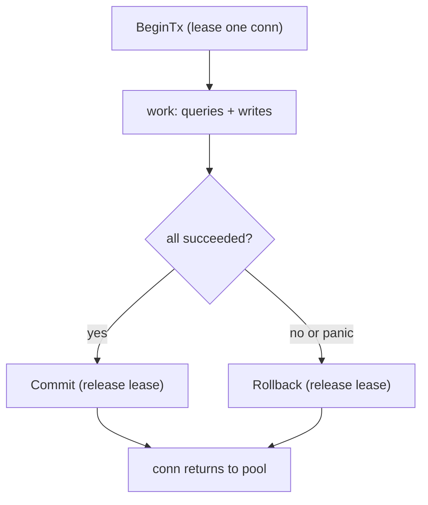

# Transactions & isolation

## Why Does This Matter?

Transactions are where database correctness and Go concurrency meet,
and both sides have traps: the database offers isolation levels whose
behaviors are subtle (and engine-specific), while `database/sql`
gives you manual `Begin`/`Commit`/`Rollback` bookkeeping that one
early `return` ruins. The two patterns in this chapter (the
transaction function, and isolation chosen per operation) prevent
both classes of failure. The fintech ledger in
[25 Section 2-3](../25-fintech-with-go/02-double-entry-ledger.md) depends on
every rule here; this chapter explains the mechanics it relies on.

## Mental Model

A transaction is a lease on one connection plus a promise about
visibility:



Isolation levels answer one question: *when do other transactions'
writes become visible to mine?* Weaker = fewer locks, more anomalies;
stronger = fewer anomalies, more blocking or retries.

## How It Works: the read phenomena

| Phenomenon | What you see | Default READ COMMITTED allows it? |
|---|---|---|
| Dirty read | another tx's *uncommitted* data | no (all modern engines) |
| Non-repeatable read | same row re-read, value changed | yes |
| Phantom read | same query re-run, new rows appeared | yes |
| Serialization anomaly | individually-valid txs, impossible as a group | yes |

What each level buys (Postgres semantics; MySQL/InnoDB differs in
the details, which is the point of knowing this is per-engine):

| Level | Anomalies still possible | Cost |
|---|---|---|
| READ COMMITTED (default) | non-repeatable, phantom, serialization | cheapest; row locks held to commit |
| REPEATABLE READ | phantoms (narrowly), serialization | snapshot per transaction |
| SERIALIZABLE | none by definition | conflicts abort txs: you retry |

The working rule: **default is fine for reads and single-row writes;
escalate only for multi-row invariants, and pay in retries.**

## Syntax / API: the transaction function

Never manage begin/commit/rollback by hand at call sites. Wrap it
once:

```go
// WithinTx runs fn atomically. Rollback on any failure path, commit
// only on success. The wrapper makes early returns safe: the rollback
// after commit is a harmless no-op, the one before it is load-bearing.
func (r *UserRepo) WithinTx(ctx context.Context, fn func(*sql.Tx) error) error {
	tx, err := r.db.BeginTx(ctx, nil)
	if err != nil {
		return fmt.Errorf("begin: %w", err)
	}
	defer func() {
		if p := recover(); p != nil {
			_ = tx.Rollback() // a panic must not strand the lease
			panic(p)
		}
	}()
	if err := fn(tx); err != nil {
		_ = tx.Rollback() // explicit failure: rollback and return
		return err
	}
	return tx.Commit()
}
```

Call sites become one-liners:

```go
err := r.WithinTx(ctx, func(tx *sql.Tx) error {
	if _, err := tx.ExecContext(ctx,
		`UPDATE accounts SET balance = balance - $1 WHERE id = $2`,
		amount, fromID); err != nil {
		return err
	}
	_, err := tx.ExecContext(ctx,
		`UPDATE accounts SET balance = balance + $1 WHERE id = $2`,
		amount, toID)
	return err
})
```

Notice what the caller does **not** see: `*sql.Tx` never escapes the
function. A `Tx` escaping into a struct field or another goroutine is
how transactions get leaked (held forever) or raced (used
concurrently).

## Basic Example: choosing isolation per operation

```go
// Debit transfer: two rows must move together; concurrent transfers to
// one account must serialize. Serializable, with retries.
func (r *Repo) Transfer(ctx context.Context, from, to string, amount int64) error {
	const maxAttempts = 3
	for attempt := 1; ; attempt++ {
		err := r.withinTxLevel(ctx, sql.LevelSerializable, func(tx *sql.Tx) error {
			return move(ctx, tx, from, to, amount)
		})
		if err == nil {
			return nil
		}
		var pqe *pgconn.PgError
		if !errors.As(err, &pqe) || pqe.Code != "40001" || attempt == maxAttempts {
			return fmt.Errorf("transfer after %d attempts: %w", attempt, err)
		}
		// serialization failure (SQLSTATE 40001): backoff and retry
		select {
		case <-time.After(time.Duration(attempt) * 10 * time.Millisecond):
		case <-ctx.Done():
			return ctx.Err()
		}
	}
}
```

The two properties a serializable write path needs: a **retry loop
that recognizes the abort error** (Postgres `40001`), and **all
serializable reads coming from inside the transaction** (a read taken
outside is invisible to the conflict detection and your retry is a
lie).

## Real-World Example: optimistic vs pessimistic, chosen correctly

Two tools for the same contention problem:

**Pessimistic** (lock rows, then act): correct under heavy contention,
deadlock-prone, holds pool connections while waiting.

```go
// SELECT ... FOR UPDATE: the row lock is the coordination.
SELECT balance FROM accounts WHERE id = $1 FOR UPDATE
```

**Optimistic** (version check at write time): correct under light
contention, no locks, conflicts surface as a 0-rows-affected update.

```go
res, err := tx.ExecContext(ctx,
	`UPDATE docs SET body = $1, version = version + 1
	 WHERE id = $2 AND version = $3`, newBody, id, seenVersion)
if err != nil {
	return err
}
if n, _ := res.RowsAffected(); n == 0 {
	return ErrConcurrentModification // someone got there first
}
```

Decision table:

| Contention on the rows | Pattern |
|---|---|
| Low (most business data) | optimistic version check |
| High, short critical section | `FOR UPDATE` |
| High, long-running thinking inside the tx | neither: redesign so the decision happens outside the transaction |

The third row is the one seniors earn: the best transaction is short
and thought-free. Anything slow (HTTP calls, heavy computation) moves
out; the tx becomes: read, decide, write, commit.

## Production Example: the ledger posting contract

The fintech ledger's posting transaction
([25 Section 2](../25-fintech-with-go/02-double-entry-ledger.md)) is the
worked example of these rules in anger: entries + lines inserted in
one tx, per-account ordering enforced by the entry sequence, and
`SERIALIZABLE` chosen because the zero-sum invariant spans every row
of the entry. Its pure-Go tests live in
[25-fintech-with-go](../25-fintech-with-go/); the database contract
it expects is exactly the `WithinTx` shape above.

## Common Mistakes

- **`Commit` forgotten on one return path** (or `Rollback` forgotten
  on another): the transaction function eliminates the entire class;
  write it once.
- **Holding a transaction across an HTTP call.** The pool drains, the
  locks hold, and one slow downstream freezes every writer. Business
  decisions outside; the tx is the commit surface.
- **Retrying a serializable transaction *without* re-reading inside
  the new transaction.** The retry must redo the reads or it commits
  decisions made from stale data.
- **Escalating the default level "for safety"** on a hot read path:
  snapshot isolation has real cost (version churn, vacuum pressure in
  Postgres) for zero benefit when there is nothing to isolate from.
- **Checking `RowsAffected` and assuming it is the count you meant.**
  In Postgres, an UPDATE that sets a row to its current values still
  counts as affected: idempotency checks need version columns, not
  affected counts.
- **Panic without rollback**: the deferred rollback in the wrapper is
  what turns a panic into a released lease instead of a poisoned
  connection.

## Idiomatic Go

- `WithinTx`-style helpers per repository, not per call site.
- Error wrapping that names the operation *and* the attempt count:
  `"transfer after 3 attempts: ..."`.
- SQLSTATE constants as named consts (`errSerialization = "40001"`)
  next to the retry loop that uses them.

## Performance Considerations

- Transactions are connection leases: throughput is bounded by pool
  size divided by tx duration. Halving tx time is a capacity doubling
  ([19 Section 3](../19-performance/03-concurrency-performance.md) framing).
- Serializable adds conflict tracking; READ COMMITTED on a
  ledger-style account table with `FOR UPDATE` on hot rows
  outperforms it when the critical section is genuinely two rows.
- Long transactions also bloat vacuum/MVCC state in Postgres: the
  operational cost of a slow tx shows up hours later.

## Concurrency Considerations

- One tx per goroutine, always. If two units of work need one
  transaction, they belong in one goroutine (or one carefully
  designed coordinator); they do not share the handle.
- Deadlocks between txs are diagnosed from the database's lock log,
  not from Go stacks: consistent lock ordering (e.g. always lock the
  lower account ID first) prevents the classic transfer deadlock.

## Security Considerations

- Authorization checks belong *before* the transaction: work done
  inside a tx that then rolls back is wasted, and checks that fail
  after writes need compensating logic.
- Audit rows (who changed what) commit in the same tx as the change:
  an audit trail that can diverge from its change is decoration
  ([25 Section 4](../25-fintech-with-go/04-risk-and-compliance.md)).

## Testing Strategy

- Isolation behavior is database behavior: test it against a real
  database (the runnable example's build-tagged Postgres tier proves
  a serializable abort retries and eventually succeeds).
- Pure-Go tier: the transaction function itself is testable with fakes
  that fail/panic on the Nth call, proving rollback happens on every
  path.
- A concurrency test (N goroutines transferring between the same two
  accounts, final balance conserved) catches both lost updates and
  over-serialization; run it with the race detector and against real
  Postgres.

## Interview Questions

1. Explain the difference between READ COMMITTED and REPEATABLE READ
   with a concrete bug each prevents.
2. Why must a serializable retry loop re-run its reads?
3. When does `FOR UPDATE` beat a version column, and vice versa?
4. Your tx throughput collapsed after a "small" feature. Walk through
   the diagnosis.
5. What does the transaction-function pattern prevent that manual
   begin/commit does not?

## Practice Exercises

1. Write `WithinTx` with the panic-safe rollback, then prove with a
   fake that panics mid-fn that the lease is released and the panic
   propagates.
2. Implement the transfer retry loop against real Postgres (runnable
   example's broker tier) and force a `40001` with two concurrent
   transfer goroutines.
3. Take a "long transaction" (tx held across a sleep) and measure pool
   exhaustion with `SetMaxOpenConns(2)`; then move the sleep outside
   and re-measure.

## Further Reading

- [sql.Tx](https://pkg.go.dev/database/sql#Tx)
- [PostgreSQL transaction isolation](https://www.postgresql.org/docs/current/transaction-iso.html)
- [Ledger invariants in this handbook](../25-fintech-with-go/02-double-entry-ledger.md)
