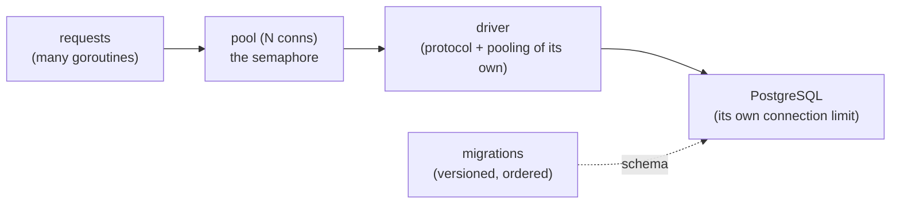

# Pooling, drivers & migrations

## Why Does This Matter?

Three operational topics decide whether a database-backed service
behaves under load: the pool (sizing is a throughput decision), the
driver (an API-shape decision with performance consequences), and
migrations (the process decision that determines whether deploys are
boring). None require a framework; all three punish defaults.

## Mental Model



The pool is a concurrency limiter you configured once and forgot:
requests beyond `MaxOpenConns` queue. Every saturation symptom (rising
p99 with a flat database CPU) is that queue, visible in pool stats.

## Pool sizing: the math and the symptoms

```
optimal ≈ (core count on the DB * 2) + effective spindles
```

The classic formula (from PostgreSQL wiki wisdom) has a modern
translation: with fast SSD/NVMe storage, the second term is near zero,
and the honest answer for most OLTP services is **small**: 10-20
connections per service instance, not 100. More connections than DB
cores mostly buys context-switching overhead inside the database.

The knobs:

| Setting | Meaning | Sensible default |
|---|---|---|
| `MaxOpenConns` | concurrency cap to the DB | 10-25 per instance; total across instances must fit the DB's `max_connections` |
| `MaxIdleConns` | pool kept warm | usually = `MaxOpenConns`; closing idle conns you will need again is churn |
| `ConnMaxLifetime` | recycle age | 30 min; shorter than any LB/firewall idle kill |
| `ConnMaxIdleTime` | reap unused | 5-15 min; trims the pool after traffic waves |

Symptom-to-cause table:

| Symptom | Likely cause |
|---|---|
| p99 latency up, DB CPU flat | pool exhausted: requests queue on acquisition |
| `connection reset by peer` bursts | `ConnMaxLifetime` outlived a firewall/LB idle timeout |
| DB `max_connections` exhausted after scaling out | per-instance caps too high: instance count × cap |
| throughput ceiling well below DB capability | cap too low, or a long-tx holder (ch. 2) |

PostgreSQL's `max_connections` is a global budget shared by every
instance of every service: pool sizing is a *fleet* conversation, not
a per-service one. PgBouncer exists for fleets; adding a pooler adds a
mode (transaction pooling breaks session state like prepared
statements: know which mode you deployed).

## Observing the pool

`database/sql` exposes live stats; export them to metrics
([20-observability](../20-observability/) when it ships):

```go
func LogPoolStats(db *sql.DB) {
	s := db.Stats()
	slog.Info("pool", "open", s.OpenConnections, "in_use", s.InUse,
		"idle", s.Idle, "wait_count", s.WaitCount,
		"wait_dur", s.WaitDuration.String())
}
```

`WaitCount`/`WaitDuration` are the saturation signal: a rising wait
count means requests are queuing for connections, which is the
"p99 up, CPU flat" symptom from inside your process.

## Drivers: pgx vs database/sql, honestly

For PostgreSQL the real choice is between two ways of using one
driver:

| | `database/sql` + pgx stdlib | pgx native API |
|---|---|---|
| Code shape | `*sql.DB`, portable to MySQL by swapping driver | `*pgxpool.Pool`, Postgres-specific types |
| Performance | extra interface layer, `any` scanning | faster paths, native arrays/JSONB/hstore |
| Features | lowest common denominator | `LISTEN/NOTIFY`, COPY, batches, typed scans |
| Testing | the standard interface most examples assume | same patterns, pgx types |

The pragmatic default for a handbook and most services: **`database/sql`
with the pgx stdlib driver**, upgrading specific hot paths to native
pgx when profiling justifies it ([19 §1](../19-performance/01-measure-first.md)).
Choosing the native API wholesale is justified when you use
Postgres-specific features deeply; the cost is portability and a
second idiomatic style to keep consistent.

One trap either way: `database/sql`'s statement cache. pgx's stdlib
facade caches prepared statements per connection by default; behind
PgBouncer in transaction mode that cache is invalid (statements live
on pooled server connections), so the DSN needs `default_query_exec_mode=simple_protocol`
(or descriptive errors appear under load, which is a memorable way to
learn this).

## Basic Example: migrations without a framework

Schema evolution needs exactly three properties: ordered, versioned,
recorded. A dependency-free implementation fits on one screen:

```go
//go:embed migrations/*.sql
var migrationFS embed.FS

func Migrate(ctx context.Context, db *sql.DB) error {
	if _, err := db.ExecContext(ctx, `CREATE TABLE IF NOT EXISTS
		schema_migrations (version int PRIMARY KEY, applied_at timestamptz NOT NULL)`); err != nil {
		return err
	}
	entries, err := migrationFS.ReadDir("migrations")
	if err != nil {
		return err
	}
	names := make([]string, 0, len(entries))
	for _, e := range entries {
		names = append(names, e.Name()) // NN_description.sql, sorted by N
	}
	sort.Strings(names)

	for _, name := range names {
		var version int
		fmt.Sscanf(name, "%d", &version)
		err := db.QueryRowContext(ctx,
			`SELECT version FROM schema_migrations WHERE version = $1`, version).Scan(&version)
		if err == nil {
			continue // already applied
		}
		if !errors.Is(err, sql.ErrNoRows) {
			return err
		}
		sqlBytes, _ := migrationFS.ReadFile("migrations/" + name)
		tx, err := db.BeginTx(ctx, nil)
		if err != nil {
			return err
		}
		if _, err := tx.ExecContext(ctx, string(sqlBytes)); err != nil {
			_ = tx.Rollback()
			return fmt.Errorf("migration %s: %w", name, err)
		}
		if _, err := tx.ExecContext(ctx,
			`INSERT INTO schema_migrations (version, applied_at) VALUES ($1, now())`, version); err != nil {
			_ = tx.Rollback()
			return err
		}
		if err := tx.Commit(); err != nil {
			return err
		}
	}
	return nil
}
```

This is deliberately simple; production teams often outgrow it into
[goose](https://pressly.github.io/goose/), [golang-migrate](https://github.com/golang-migrate/migrate),
or Atlas. What no tool exempts you from is the process rules below.

## Real-World Example: the deploy rules that keep migrations boring

| Rule | Why |
|---|---|
| Migrations run at deploy start, before new binaries serve | a new binary against an old schema is the classic boot failure |
| **Expand/contract**: additive first, destructive later | old and new binaries coexist during rolling deploys; dropping a column in the same release as the code that stops using it breaks the old pods |
| Never rename: add new, backfill, switch reads, drop old | renames are the one change that cannot be staged |
| Every migration reversible in *plan* | "rollback" usually means rolling back code, not schema; plan for the schema staying |
| Index builds `CONCURRENTLY` | a plain `CREATE INDEX` takes an exclusive lock: on a hot table, an outage |
| Long backfills run as batched background jobs | one giant UPDATE is a long transaction with ch. 2's costs |

## Production Example: wiring the example service

The runnable example's `Postgres` repository (chapter 4) receives its
`*sql.DB` from the `OpenDB` shape in chapter 1, runs `Migrate` at
startup, and exposes pool stats through its `Stats()` method for the
metrics exporter. Integration tests (build tag `db`) create a
throwaway schema per test, run the migrations, and drop it after: the
same expand/contract discipline at test scale.

## Common Mistakes

- **Sizing `MaxOpenConns` to thread-count instincts** (hundreds): the
  database, not Go, is the bottleneck, and the queue is healthier in
  your process than in its socket buffer.
- **Ignoring the fleet budget**: 20 instances × 50 conns = 1000 > any
  default `max_connections`.
- **`ConnMaxLifetime` left infinite** behind an LB that kills idle
  connections at 1 hour: bursts of resets every hour, on the hour.
- **Rolling back schema on deploy rollback**: the schema stays; code
  rolls back. Expand/contract is what makes this true.
- **A migration tool that runs at request time**: migrations are a
  startup/deploy step with locking, not lazy initialization.
- **Mixing migration tools** (goose and golang-migrate both tracking
  versions in differently-shaped tables): pick one, per repo, forever.

## Idiomatic Go

- DSNs from environment/config, never flags with credentials in the
  process list ([22-production-go](../22-production-go/)).
- Pool construction in one `OpenDB` constructor; knobs as config, not
  scattered `Set*` calls.
- `embed` for migration SQL: versioned in the same repo and binary as
  the code that needs that schema.

## Performance Considerations

- Prepared statements with `database/sql`: `db.Prepare` for hot
  queries buys parse planning; the pool caches per-connection, and
  pgx does this automatically. Measure before assuming either way.
- `COPY` (via pgx native) beats batched INSERTs by an order of
  magnitude for bulk loads: another reason the native API earns its
  keep on specific paths.
- Pool stats (`db.Stats()`) are cheap to log periodically and are the
  first place saturation shows ([19 §1](../19-performance/01-measure-first.md)).

## Concurrency Considerations

- The pool is a semaphore: `db.Conn(ctx)` blocks on capacity, and a
  service that opens ad-hoc connections around a saturated pool makes
  everything worse ([08 §5](../08-concurrency/05-patterns.md)).
- `ConnMaxLifetime` staggers reconnections naturally; a fleet that
  recycles all connections simultaneously (mass restart, config push)
  self-inflicts a connection storm.

## Security Considerations

- Least-privilege database users: the service account owns its schema,
  not the cluster. Migrations may need a separate, more powerful role
  used only at deploy time.
- TLS to the database (`sslmode=require` at minimum; verify-full with
  a CA in production) is configuration, not code: the DSN carries it.
- Migration SQL is code: it goes through the same review as the Go
  that will depend on it ([21-security](../21-security/)).

## Testing Strategy

- Unit tier (no database): pool stats faked, repo logic behind
  interfaces (chapter 4).
- Integration tier (build tag, real Postgres): the migration function
  itself is tested by running it twice and asserting idempotence;
  throwaway schema per test run.
- The two mistakes CI catches that review does not: a migration that
  only works against a fresh database (missing `IF NOT EXISTS`
  discipline) and code that breaks under transaction-pooling protocol
  constraints.

## Interview Questions

1. Walk through the pool-sizing decision for a new service, including
   the fleet constraint.
2. What does `WaitCount` rising tell you, and what are your first
   three moves?
3. pgx native vs `database/sql`: what does each trade, and when is
   each the right call?
4. Explain expand/contract with a concrete column-drop sequence.
5. Why is `CREATE INDEX CONCURRENTLY` a production rule, and what is
   its cost?

## Practice Exercises

1. Add a `/debug/pool` endpoint to the runnable example returning
   `db.Stats()` as JSON; generate load and watch WaitCount.
2. Write a migration adding a nullable column, deploy it, then write
   the follow-up that makes it `NOT NULL` with a default after
   backfill; articulate why the direct path would break rolling
   deploys.
3. Break the fleet budget on purpose: run four instances of the
   example against one Postgres with high caps and read the
   `max_connections` error; then size properly.

## Further Reading

- [DB.SetMaxOpenConns and friends](https://pkg.go.dev/database/sql#DB.SetMaxOpenConns)
- [PostgreSQL: connection limits](https://www.postgresql.org/docs/current/runtime-config-connection.html)
- [PgBouncer modes](https://www.pgbouncer.org/features.html)
- [pgx documentation](https://pkg.go.dev/github.com/jackc/pgx/v5)
